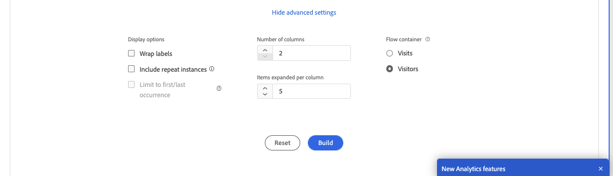

# Een stroomvisualisatie configureren

Stroomvisualisaties helpen u de reis te begrijpen die voortvloeit uit of leidt tot een specifieke conversiegebeurtenis op uw website of uw app. Het traceert een pad door uw dimensies (en dimensie-items) of metriek.

Met stroomvisualisaties kunt u het begin of einde van het pad configureren waarin u bent geïnteresseerd, of alle paden analyseren die door een dimensie- of dimensie-item lopen.

## Stroomvisualisatie maken {#configure}

1. Voeg een leeg paneel aan uw project toe en klik het visualisatiepictogram in het linkerspoor.

1. Sleep de [!UICONTROL **Stroom**] visualisatie in het deelvenster.

   of

   Sleep de [!UICONTROL **Stroom**] visualisatie in een bestaand project.

1. Veranker uw stroomvisualisatie met een van de volgende opties:

   * [!UICONTROL **Begint met**] (maateenheden, afmetingen of items), of
   * [!UICONTROL **Bevat**] (afmetingen, of items), of
   * [!UICONTROL **Eindigt met**] (maateenheden, afmetingen of items)

   Elk van deze categorieën wordt op het scherm getoond als &quot;dalingsstreek.&quot; U kunt de neerzetzone op drie manieren vullen:

   * Gebruik het keuzemenu om metriek of afmetingen te selecteren.
   * Sleep afmetingen of metriek van de linkerspoorstaaf.
   * Typ de naam van een dimensie of metrisch en selecteer deze wanneer deze in de vervolgkeuzelijst wordt weergegeven.

   >[!IMPORTANT]
   >
   >Berekende metriek kan niet worden gebruikt in de  **[!UICONTROL Starts with]** of **[!UICONTROL Ends with]** velden.

1. Als u metrisch kiest, moet u ook verstrekken [!UICONTROL Pathing Dimension] gebruiken om te gebruiken als het pad dat naar of van de geselecteerde component leidt, zoals hier wordt getoond. De standaardwaarde is [!UICONTROL **Pagina**].

   

1. (Optioneel) Selecteer **[!UICONTROL Show advanced settings]** om een van de volgende opties te configureren:

   

   | Instelling | Beschrijving |
   | --- | --- |
   | **[!UICONTROL Wrap labels]** | Normaal gesproken worden de labels op de Flow-elementen ingekort om de schermruimte op te slaan, maar u kunt het volledige label zichtbaar maken door dit selectievakje in te schakelen.  Standaard = uitgeschakeld. |
   | **[!UICONTROL Include repeat instances]** | Stroomvisualisaties zijn gebaseerd op instanties van een dimensie. Met deze instelling kunt u herhaalde exemplaren, zoals opnieuw laden van pagina&#39;s, opnemen of uitsluiten. Herhalingen kunnen echter niet worden verwijderd uit Flow-visualisaties met multigetaxeerde afmetingen, zoals listVars, listProps, s.product, merchandising Vars, enz. 
Deze optie is standaard uitgeschakeld.
 |
   | **[!UICONTROL Limit to first/last occurrence]** | Beperk paden tot paden die beginnen/eindigen met de eerste/laatste instantie van een dimensie/item/metrisch. Zie de onderstaande paragraaf. [Voorbeeldscenario voor &#39;beperking tot eerste/laatste voorkomen&#39;](#example-scenario-for-limit-to-firstlast-occurrence)voor een nadere toelichting. |
   | **[!UICONTROL Number of columns]** | Het aantal kolommen u in uw diagram van de Stroom wilt. |
   | **[!UICONTROL Items expanded per column]** | Het aantal items dat u in elke kolom wilt opnemen. |
   | **[!UICONTROL Flow container]** | <ul><li>Bezoek</li><li>Bezoeker</li></ul> Hiermee kunt u schakelen tussen Bezoek en Bezoeker om het plakken van bezoekers te analyseren. Met deze instellingen kunt u de betrokkenheid van bezoekers op bezoekersniveau (verschillende bezoeken) begrijpen of de analyse beperken tot één bezoek. |

1. Selecteren **[!UICONTROL Build]**.

>[!INFO]
>
>**Voorbeeld:** Stel dat u het pad wilt overtrekken dat gebruikers naar en van de populairste pagina&#39;s op uw site hebben gekozen.
>
>Om dit te doen, zou u
>1. Beginnen met het maken van een stroomvisualisatie zoals hierboven beschreven.
>1. Sleep de [!UICONTROL **Pagina**] in de **[!UICONTROL Contains]** veld, selecteer vervolgens [!UICONTROL **Opbouwen**].
>1. De stroomvisualisatie bouwt verder met de meest bekeken pagina zichtbaar in het focusknooppunt in het midden van de visualisatie. U ziet ook de bovenste pagina&#39;s die naar die pagina lopen (links van het focusknooppunt) en de bovenliggende pagina&#39;s die uit die focuspagina lopen (rechts van het focusknooppunt).
>1. Gegevens in de flow analyseren, zoals beschreven in [De stroomuitvoer weergeven en wijzigen](#view-and-change-the-flow-output).

## De stroomuitvoer weergeven en wijzigen {#output}

Een samenvatting van de configuratie van de Stroom verschijnt bij de bovenkant van het diagram. De dikte van een pad in het diagram is evenredig met de activiteit ervan, waarbij paden met meer activiteit dikker lijken dan paden met minder activiteit.

Als u verder naar de gegevens wilt gaan, hebt u verschillende opties:

* Het stroomdiagram is interactief. Plaats de muis boven het diagram om de weergegeven details te wijzigen.

* Wanneer u op een knoop in het diagram selecteert, verschijnen de details voor die knoop. Selecteer opnieuw op de knoop om het samen te vouwen.

  

* U kunt een kolom filteren om alleen bepaalde resultaten weer te geven, zoals opnemen en uitsluiten, criteria opgeven enzovoort.

* Selecteer het plusteken (+) op de linkerzijde om een kolom uit te breiden.

* Met de rechtermuisknop klikt u op de opties die hieronder worden uitgelegd, om de uitvoer verder aan te passen.

* Selecteer het potloodpictogram naast het configuratieoverzicht om de stroom verder te bewerken of opnieuw samen te stellen met verschillende opties.

* U kunt uw diagram van de Stroom als deel van het .CSV dossier van een project ook uitvoeren en verder analyseren door te gaan naar **[!UICONTROL Project]** > **[!UICONTROL Download CSV]**.

## Filteren

Boven elke kolom wordt een filter weergegeven wanneer u de muisaanwijzer op de kolom plaatst. Door het filter te selecteren, krijgt u de zelfde filterdialoog die in de lijst Freeform vandaag bestaat. Dit filter werkt hetzelfde als in de tabel Freeform.

* Gebruik geavanceerde instellingen om bepaalde criteria op te nemen in of uit te sluiten van onze lijst met operatoren.
* Zodra u een punt van de lijst hebt gefiltreerd, zal die specifieke kolom het filtreren weerspiegelen. (Het filter verlaagt het zodat alleen het item wordt weergegeven dat in het filter is toegestaan, of verwijdert alle items behalve het item dat u in het filter wilt gebruiken.
* Alle stroomafwaartse en stroomopwaartse kolommen zouden moeten blijven, zolang er gegevens zijn die in de resterende knopen stromen.
* Nadat het filterpictogram is toegepast, wordt het in blauw weergegeven boven de kolom waarop het filter wordt toegepast.
* Als u een filter wilt verwijderen, selecteert u het filterpictogram om het filtermenu te openen. Verwijder alle toegepaste filters en selecteer vervolgens **[!UICONTROL Save]**. De flow moet terugkeren naar de vorige ongefilterde toestand.

## Klikopties met de rechtermuisknop {#right-click}

| Optie | Beschrijving |
|--- |--- |
| [!UICONTROL Start over] | Hiermee gaat u terug naar de constructor van het Freeform-diagram, waar u een nieuw stroomdiagram kunt maken. |
| [!UICONTROL Create segment for this path] | Maak een segment. Dit neemt u in de Bouwer van het Segment, waar u het nieuwe segment kunt vormen. |
| [!UICONTROL Breakdown] | Verdeel de knoop neer door beschikbare Dimension, Metriek, of Tijd. |
| [!UICONTROL Trend] | Creeer een trended diagram voor de knoop. |
| Volgende kolom tonen/Vorige kolom tonen | Geeft de volgende (rechts) of vorige (links) kolom van de visualisatie aan. |
| Kolom verbergen | Hiermee verbergt u de geselecteerde kolom uit de visualisatie. |
| [!UICONTROL Expand entire column] | Vouw een kolom uit om alle knooppunten weer te geven. Standaard worden alleen de bovenste vijf knooppunten weergegeven. |

## Voorbeeldscenario voor &#39;beperking tot eerste/laatste voorkomen&#39;

Houd er bij het gebruik van deze optie rekening mee dat:

* **[!UICONTROL Limit to first/last occurrence]** alleen het eerste/laatste exemplaar in de reeks telt. Alle andere exemplaren van het **[!UICONTROL Starts with]** of **[!UICONTROL Ends with]** criteria worden genegeerd.
* Indien gebruikt met een **[!UICONTROL Starts with]** stroom, slechts wordt het eerste voorkomen dat de begincriteria aanpast inbegrepen.
* Indien gebruikt met een **[!UICONTROL Ends with]** flow, alleen de laatste instantie die aan de eindcriteria voldoet, wordt opgenomen.
* De gebruikte reeks verschilt op basis van de container. Als u de **[!UICONTROL Visit]** container, de reeks hits zal de sessie zijn. Als u de **[!UICONTROL Visitor]** container, zijn de reeksen klapjes alle klappen voor een bepaalde gebruiker in de verstrekte datumwaaier.
* De **[!UICONTROL Limit to first/last occurrence]** Deze optie kan in de geavanceerde instellingen worden geconfigureerd wanneer u een Metrisch of Dimension-item gebruikt in de velden &quot;Begint met&quot; of &quot;Eindigt met&quot;.

Voorbeeld van een serie hits:

Home > Producten > Toevoegen aan winkelwagentje > Producten > Toevoegen aan winkelwagentje > Facturering > Bevestiging bestellen

### Overweeg een stroomanalyse met de volgende instellingen:

* Beginnen met[!UICONTROL  Add to cart] (Dimension-item)
* [!UICONTROL Page] schilderdimensie
* [!UICONTROL Visit] container

Indien **[!UICONTROL Limit to first/last occurrence]** is *uitgeschakeld*En deze enkele reeks hits telt 2 keer &quot;Toevoegen aan winkelwagentje&quot;.
Verwachte stroomuitvoer: &quot;Toevoegen aan winkelwagentje&quot; (2) —> &quot;Producten&quot; (1) -> &quot;Facturering&quot; (1)

Als **[!UICONTROL Limit to first/last occurrence]** is *enabled*In de analyse wordt alleen het eerste exemplaar van &quot;Toevoegen aan winkelwagentje&quot; opgenomen.
Verwachte stroomuitvoer: &quot;Toevoegen aan winkelwagentje&quot; (1) —> &quot;Producten&quot; (1)

### Bekijk dezelfde reeks resultaten, maar gebruik daarbij de volgende instellingen:

* Eindigt met [!UICONTROL Add to cart] (Dimension-item)
* [!UICONTROL Page] schilderdimensie
* [!UICONTROL Visit] container

Indien **[!UICONTROL Limit to first/last occurrence]** is *uitgeschakeld*Deze enkele reeks hits telde 2 exemplaren van &#39;Toevoegen aan winkelwagentje&#39;.
Verwachte stroomuitvoer: &quot;Producten&quot; (2) &lt;— &quot;Toevoegen aan winkelwagentje&quot; (2)

Als **[!UICONTROL Limit to first/last occurrence]** is *enabled*, alleen de laatste keer dat [!UICONTROL Add to cart] in de analyse worden opgenomen.
Verwachte stroomuitvoer: &quot;Producten&quot; (1) &lt;— &quot;Toevoegen aan winkelwagentje&quot; (1)
