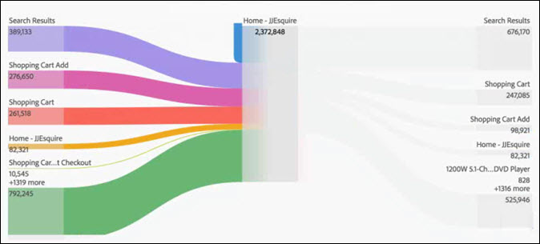

# Een stroomvisualisatie configureren

Met Flow kunt u een pad door uw pagina&#39;s of dimensies volgen, zoals eVars:

* Item (alleen afmetingen)
* Afmetingen of items
* Afsluiten (alleen afmetingen)

Elk van deze categorieën wordt op het scherm getoond als &quot;dalingsstreek.&quot; Sleep items uit de lijst en zet ze neer in de gewenste neerzetzone. Pagina&#39;s en andere items die geen afmetingen zijn, kunnen alleen in de middelste neerzetzone worden geplaatst. Als u een afmeting in de middelste streek laat vallen, wordt een rapport automatisch in werking gesteld dat de hoogste punten voor die afmeting opneemt.

Wanneer u een punt in een dalingsstreek laat vallen, opent het diagram van de Stroom. De inhoud van het stroomdiagram is afhankelijk van de neerzetzone waar u een dimensie of item neerzet. De uitgang en de Ingang tonen alle punten voor de afmeting (zoals pagina&#39;s) u in de Ingang of de dalingsstreek van de Uitgang laat vallen. Bijvoorbeeld, als u een afmeting in de centrale dalingsstreek laat vallen, opent het stroomdiagram voor die afmeting.

Houd de cursor boven het knooppunt Focus in het midden van het diagram om informatie over dat knooppunt weer te geven.

Het stroomdiagram is interactief. Plaats de muis boven het diagram om de weergegeven details te wijzigen.

De paden in het diagram zijn proportioneel. Paden met meer activiteit lijken dikker.

Wanneer u op een knoop in het diagram klikt, verschijnen de details voor die knoop. Bijvoorbeeld, als u **[!UICONTROL Search Results]** bij het hoogste recht in het hoogste diagram hierboven klikt, breidt het diagram zich uit om meer details over de knoop van onderzoeksresultaten te tonen. Klik nogmaals op een knooppunt om het samen te vouwen.

Standaard toont het diagram de bovenste vijf stromen. Als u op de **[!UICONTROL More]** knoop bij de bodem van het diagram klikt, breidt het diagram zich neer om vijf meer stromen te tonen. Blijf klikken **[!UICONTROL More]** om uit te breiden tot er geen extra stromen zijn om te tonen.

Er zijn geen grenzen aan hoeveel u binnen het diagram van de Stroom kunt onderzoeken.

U kunt uw diagram van de Stroom als deel van het .CSV dossier van een project ook uitvoeren en verder analyseren door naar **[!UICONTROL Project]** > **[!UICONTROL Download CSV]** te gaan.
