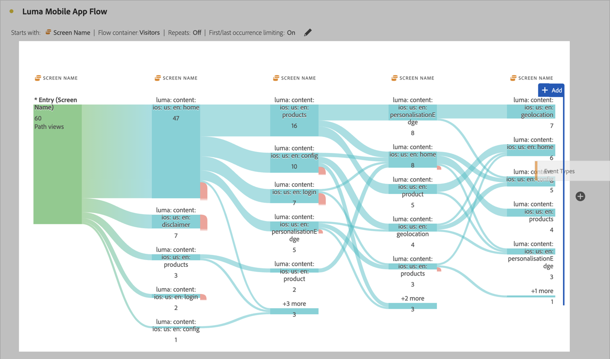

# Interdimensionale stromen

Met een interdimensionale stroom kunt u gebruikerspaden in verschillende dimensies bekijken.

>[!BEGINSHADEBOX]

Zie  [ inter-dimensionele stromen ](https://video.tv.adobe.com/v/24041?quality=12&learn=on){target="_blank"} voor een demo video.

>[!ENDSHADEBOX]

In dit artikel wordt getoond hoe u deze workflow kunt gebruiken voor twee gebruiksgevallen: interacties en gebeurtenissen voor mobiele apps en hoe campagnes webbezoeken aansturen.

## Interacties en gebeurtenissen voor mobiele apps

De [!UICONTROL Screen Name] -dimensie wordt gebruikt in deze voorbeeldstroom om te zien hoe gebruikers de verschillende schermen (scènes) in de app gebruiken. Het bovenste scherm dat wordt geretourneerd, is **[!UICONTROL luma: content: ios: en: home]** , de startpagina van de app:

Als u de interactie tussen schermen en gebeurtenistypen (zoals toevoegen aan winkelwagentje, aankopen en andere) in deze app wilt verkennen, sleept u de **[!UICONTROL Event Types]** -dimensie en zet u deze neer:

* Boven op elke beschikbare stap in de flow, om die dimensie te vervangen:

  

* Buiten de huidige stroomvisualisatie om de dimensie toe te voegen:

  

De stroomvisualisatie hieronder toont het resultaat van het toevoegen van de **[!UICONTROL Event Types]** dimensie. De visualisatie biedt inzicht in de manier waarop gebruikers van mobiele apps verschillende schermen in de app doorlopen voordat ze producten aan een winkelwagentje toevoegen, de toepassing sluiten, een aanbieding krijgen en nog veel meer.

## Hoe campagnes webbezoeken sturen

U wilt analyseren welke campagnes bezoeken aan de website aansturen. U maakt een stroomvisualisatie met de **[!UICONTROL Campaign Name]** als dimensie

U vervangt de laatste **[!UICONTROL Campaign Name]** -dimensie door de **[!UICONTROL Formatted Page Name]** -dimensie en voegt nog een **[!UICONTROL Formatted Page Name]** -dimensie toe aan het einde van de flowvisualisatie.

U kunt de muisaanwijzer boven een willekeurige stroom houden om meer details weer te geven. Welke campagnes bijvoorbeeld hebben geleid tot een afhandeling van winkelwagentjes.

