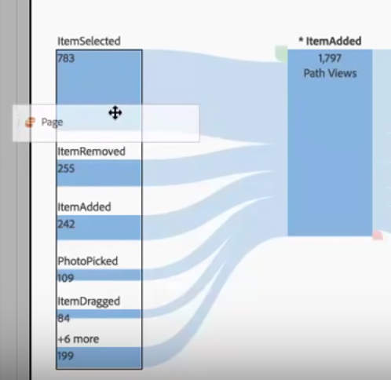

# Interdimensionale stromen

Met een interdimensionale stroom kunt u gebruikerspaden in verschillende dimensies bekijken. Hier volgt een video over tekstomloop en multidimensionale tekstdoorloop in Analysis Workspace:

>[!BEGINSHADEBOX]

Zie  [ inter-dimensionele stromen ](https://video.tv.adobe.com/v/24041?quality=12&learn=on){target="_blank"} voor een demo video.

>[!ENDSHADEBOX]

Een afmetingslabel boven aan elke stroomkolom maakt het gebruik van meerdere dimensies in een stroomvisualisatie intuïtiever:

We zullen naar twee gebruiksgevallen kijken: een gebruiksscenario voor apps en een gebruiksscenario voor het web.

## Eerste hoofdletter gebruiken: app {#app}

De [!UICONTROL Action Name] -dimensie is aan de flow toegevoegd, waarbij het bovenste item [!UICONTROL ItemAdded] is:

Als u de interactie tussen schermen/pagina&#39;s en acties in deze app wilt verkennen, kunt u de paginadimensie naar meerdere plaatsen slepen, afhankelijk van wat u wilt verkennen:

* Sleep het aan één van beide eind van de dalingsstreek (binnen de zwart-in orde gemaakte rechthoekige streek die verschijnt) om **te vervangen** de hoogste resultaten op de einden:

   

* Sleep het aan de witte ruimte op het eind (merk de zwarte steun) aan **toevoegen aan** visualisatie:

  

Hier is het resultaat als u besluit om het item ItemScaled in de juiste kolom met de dimensie van de Pagina te vervangen. Het bovenste resultaat wordt nu gewijzigd in het bovenste resultaat voor de pagina-afmeting:

Nu kunt u zien hoe klanten door acties en pagina&#39;s bewegen. U kunt de stroom verder verkennen door op verschillende knooppunten te klikken:

Dit is wat gebeurt als u een andere dimensie van de Naam van de Actie op het eind van visualisatie toevoegt:

Op deze manier kunt u diepgaande inzichten en mogelijke wijzigingen aanbrengen in de app die u analyseert.

## Hoofdlettergebruik twee: web {#web}

In dit geval kunt u zien hoe u kunt analyseren welke campagnes de meeste items naar een website sturen.

Sleep de dimensie van de Naam van de Campagne in een nieuwe stroom:

Nu wil ik zien aan welke pagina&#39;s die campagnes verkeer drijven, zodat sleep ik de dimensie van de Pagina rechts van de stroomresultaten om op visualisatie toe te voegen:

