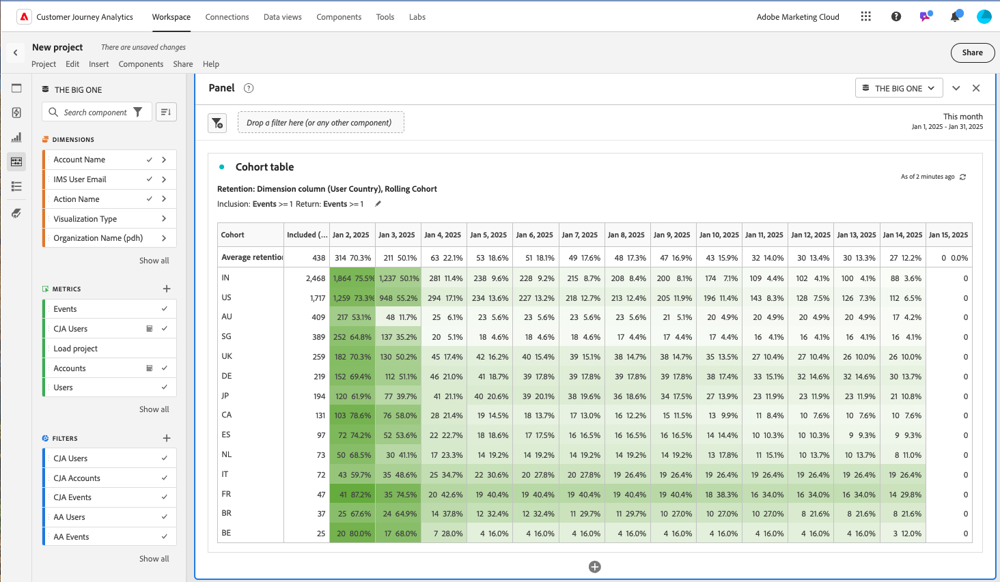

# Overzicht van de cohortingtabel {#cohort-table-overview}

<!-- markdownlint-disable MD034 -->

>[!CONTEXTUALHELP]
>id="workspace_cohorttable_button"
>title="Cohortingtabel"
>abstract="Maak een cohortvisualisatie om gebruikers te groeperen op basis van de voltooiing van een gebeurtenis en de doorlopende betrokkenheid te analyseren en in de loop van de tijd te verdraaien."

<!-- markdownlint-enable MD034 -->

<!-- markdownlint-disable MD034 -->

>[!CONTEXTUALHELP]
>id="workspace_cohorttable_panel"
>title="Cohortingtabel"
>abstract="Groepeer gebruikers op basis van voltooiing van een gebeurtenis en analyseer vervolgens hun doorlopende betrokkenheid en loop de tijd door.  **Parameters ** **criteria van de Opname**: De componenten die worden gebruikt om uw aanvankelijke bezoekerscohorts te bepalen. **criteria van de Terugkeer**: De componenten die worden gebruikt om te bepalen als een bezoeker is teruggekeerd."

<!-- markdownlint-enable MD034 -->

>[!BEGINSHADEBOX]

_dit artikel documenteert de lijst van de Cohort in_  _**Adobe Analytics**._ _zie [ de lijst van het Cohort ](https://experienceleague.adobe.com/en/docs/analytics-platform/using/cja-workspace/visualizations/cohort-table/cohort-analysis) voor_  _**Customer Journey Analytics** versie van dit artikel._

>[!ENDSHADEBOX]

A *cohort* is een groep mensen die gemeenschappelijke kenmerken over een gespecificeerde periode delen. A  **[!UICONTROL Cohort table]** visualisatie is nuttig, bijvoorbeeld, wanneer u wilt leren hoe een cohort met een merk in dienst neemt. U kunt gemakkelijk veranderingen in tendensen waarnemen, dan dienovereenkomstig antwoorden. (De Verklaringen van [!UICONTROL Cohort Analysis] zijn beschikbaar op het Web, zoals bij [ Analyse 101 van de Cohort ](https://en.wikipedia.org/wiki/Cohort_analysis).)

Na het creëren van een cohortrapport, kunt u zijn componenten (specifieke afmetingen, metriek, en filters) tot stand brengen, dan het cohortrapport met iedereen delen. Zie [ Kromme en Aandeel ](/help/analyze/analysis-workspace/curate-share/curate.md).

Voorbeelden van wat u kunt doen met een [!UICONTROL Cohort table] :

* Start campagnes die zijn ontworpen om een gewenste actie te stimuleren.
* Het marketingbudget verschuiven op precies het juiste moment in de levenscyclus van de klant.
* Bespreek wanneer een proefversie of een aanbieding moet worden beëindigd om de waarde te maximaliseren.
* Verbeter ideeën voor het testen A/B op gebieden zoals tarifering, verbeteringspad, etc.

[!UICONTROL Cohort table] is beschikbaar voor alle Customer Journey Analytics-klanten met toegangsrechten tot [!UICONTROL Analysis Workspace] .

>[!BEGINSHADEBOX]

Zie  [ analyse van de Cohort in Analysis Workspace ](https://video.tv.adobe.com/v/23990/?quality=12&learn=on){target="_blank"} voor een demo video.

>[!ENDSHADEBOX]

>[!IMPORTANT]
>
>[!UICONTROL Cohort Analysis] biedt geen ondersteuning voor niet-filterbare metriek (inclusief berekende meetwaarden), niet-gehele getallen (zoals Opbrengst) of Voorvallen. Alleen metriek die in filters kan worden gebruikt, kan in [!UICONTROL Cohort Analysis] worden gebruikt en kan slechts één voor één worden verhoogd.

Cohort-tabellen in Customer Journey Analytics ondersteunen op twee gebaseerd metrisch (of numeriek). Purchase.Value (een dubbele waarde) kan bijvoorbeeld worden gebruikt als een insluitings-/retourmetrisch object. Bovendien zijn alle meetgegevens die via de Analytics Source Connector naar Adobe Experience Platform worden doorgegeven, verdubbelbaar.

## Mogelijkheden voor kleurentabellen

De volgende secties beschrijven de eigenschappen van de Analyse van de Cohort die voor nauwkeurige controle over de cohorts toestaan u bouwt.

Voor meer gedetailleerde informatie over het creëren van een cohort en het runnen van a [!UICONTROL Cohort Analysis] rapport, zie [ een lijst van de Cohort ](/help/analyze/analysis-workspace/visualizations/cohort-table/t-cohort.md) vormen.

### [!UICONTROL Retention] table

Een [!UICONTROL Retention] -cohortentabel retourneert personen: elke gegevenscel geeft het onbewerkte aantal en percentage weer van de personen in de cohort die de actie tijdens die periode hebben uitgevoerd. U kunt maximaal 3 metriek en maximaal 10 filters opnemen.

### [!UICONTROL Churn] table

Een [!UICONTROL Churn] -cohortabel is het omgekeerde van een retentietabel en toont de personen die in de loop der tijd niet of niet aan de retourcriteria voor uw cohort hebben voldaan. U kunt maximaal 3 metriek en maximaal 10 filters opnemen.

### [!UICONTROL Rolling Calculation]

U kunt de retentie of het churn berekenen op basis van de vorige kolom, niet de opgenomen kolom, die wordt aangeduid als rolberekening.

### [!UICONTROL Latency] table

Een latentietabel meet de tijd die is verstreken voor en na de opnemingsgebeurtenis. De latentie meten is een uitstekend hulpmiddel voor pre- en postanalyse. De kolom **[!UICONTROL Included]** bevindt zich in het midden van de tabel en de tijdsperioden vóór en na de gebeurtenis include worden aan beide zijden weergegeven.

### [!UICONTROL Custom dimension] cohort

U kunt cohorten maken op basis van een geselecteerde afmeting en niet op basis van een tijd (de standaardinstelling). Gebruik afmetingen zoals [!UICONTROL City geo] , [!UICONTROL Marketing channel] , [!UICONTROL campaign] , [!UICONTROL product] , [!UICONTROL page] , [!UICONTROL region] of een andere dimensie om aan te geven hoe de retentie verandert. Gebaseerd op de verschillende waarden van deze afmetingen.

>[!MORELIKETHIS]
>
>[ vorm een lijst van de Cohort ](/help/analyze/analysis-workspace/visualizations/cohort-table/t-cohort.md).
>

<!--
A *`cohort`* is a group of people sharing common characteristics over a specified period. [!UICONTROL Cohort Analysis] is useful, for example, when you want to learn how a cohort engages with a brand. You can easily spot changes in trends, then respond accordingly. (Explanations of [!UICONTROL Cohort Analysis] are available on the web, such as at [Cohort Analysis 101](https://en.wikipedia.org/wiki/Cohort_analysis).)

After creating a cohort report, you can curate its components (specific dimensions, metrics, and segments), then share the cohort report with anyone. See [Curate and Share](/help/analyze/analysis-workspace/curate-share/curate.md).

Examples of what you can do with [!UICONTROL Cohort Analysis]:

* Launch campaigns designed to spur a desired action.
* Shift marketing budget at exactly the right time in the customer lifecycle.
* Recognize when to end a trial or an offer, in order to maximize value.
* Gain ideas for A/B testing in areas such as pricing, upgrade path, and so on.

[!UICONTROL Cohort Analysis] is available for all Adobe Analytics customers with access rights to [!UICONTROL Analysis Workspace].

>[!BEGINSHADEBOX]

See  [Cohort analysis in Analysis Workspace](https://video.tv.adobe.com/v/25965?quality=12&learn=on){target="_blank"} for a demo video.

>[!ENDSHADEBOX]

>[!IMPORTANT]
>
>[!UICONTROL Cohort Analysis] does not support non-segmentable metrics (including calculated metrics), non-integer metrics (such as Revenue), or Occurrences. 
>
>Only metrics that can be used in segments can be used in [!UICONTROL Cohort Analysis], and they can only be incremented by >1 at a time. 

## Cohort Analysis capabilities

The following sections describe Cohort Analysis features that allow for fine-tuned control over the cohorts you are building.

For more detailed information about creating a cohort and running a [!UICONTROL Cohort Analysis] report, see [Configure a Cohort Analysis report](/help/analyze/analysis-workspace/visualizations/cohort-table/t-cohort.md).

### [!UICONTROL Retention] Table

A [!UICONTROL Retention] cohort report returns visitors: each data cell shows the raw number and percentage of visitors in the cohort who did the action during that time period. You can include up to 3 metrics and up to 10 segments.

>[!BEGINSHADEBOX]

See  [Calculate rolling retention](https://video.tv.adobe.com/v/25962?quality=12&learn=on){target="_blank"} for a demo video.

>[!ENDSHADEBOX]

### [!UICONTROL Churn] Table

A [!UICONTROL Churn] cohort is the inverse of a retention table and shows the visitors who fell out or never met the return criteria for your cohort over time. You can include up to 3 metrics and up to 10 segments.

>[!BEGINSHADEBOX]

See  [Churn analysis](https://video.tv.adobe.com/v/25966?quality=12&learn=on){target="_blank"} for a demo video.

>[!ENDSHADEBOX]

### [!UICONTROL Rolling Calculation]

Lets you calculate retention or churn based on the previous column, not the included column.

### [!UICONTROL Latency] Table

Measures the time that has elapsed before and after the inclusion event occurred. This is an excellent tool for pre/post analysis. The **[!UICONTROL Included]** column is in the center of the table and time periods before and after the inclusion event are shown on both sides.

### [!UICONTROL Custom Dimension] Cohort

Create cohorts based on a selected dimension, and not time-based cohorts, which are the default. Use dimensions such as [!UICONTROL marketing channel], [!UICONTROL campaign], [!UICONTROL product], [!UICONTROL page], [!UICONTROL region], or any other dimension in Adobe Analytics to show how retention changes based on the different values of these dimensions.

-->
