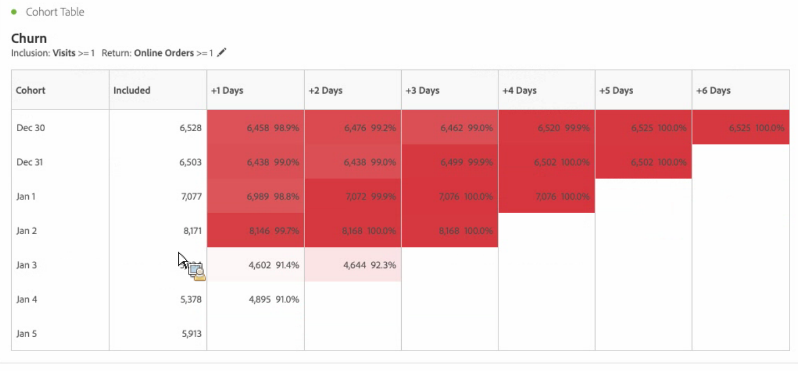
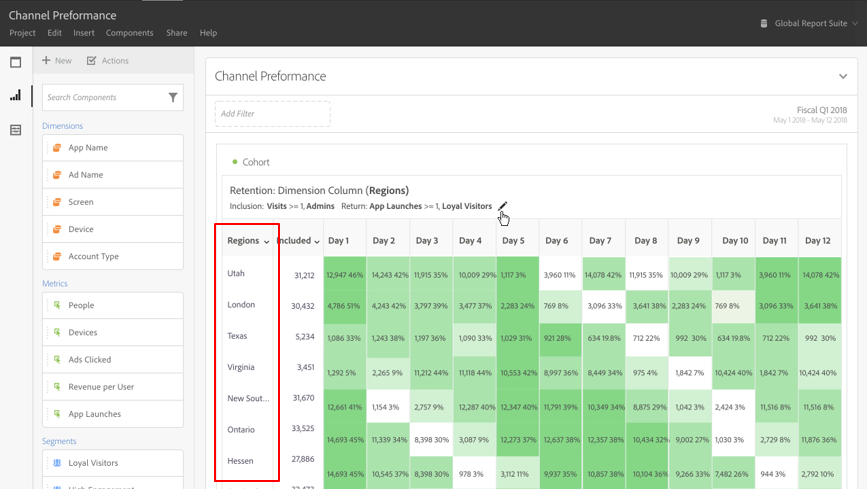

# Wat is [!UICONTROL Cohort Analysis]dat?

A *`cohort`* is een groep mensen die gemeenschappelijke kenmerken over een bepaalde periode delen. [!UICONTROL Cohort Analysis] is bijvoorbeeld handig als u wilt weten hoe een cohort werkt met een merk. U kunt gemakkelijk veranderingen in tendensen waarnemen, dan dienovereenkomstig antwoorden. (Verklaringen van [!UICONTROL Cohort Analysis] zijn beschikbaar op het web, zoals bij [Cohort Analysis 101](https://en.wikipedia.org/wiki/Cohort_analysis).)

Na het creëren van een cohortrapport, kunt u zijn componenten (specifieke dimensies, metriek, en segmenten) tot stand brengen, dan het cohortrapport met iedereen delen. Zie [Curate en Delen](/help/analyze/analysis-workspace/curate-share/curate.md).

Voorbeelden van wat u kunt doen met [!UICONTROL Cohort Analysis]:

* Start campagnes die zijn ontworpen om een gewenste actie te stimuleren.
* Het marketingbudget verschuiven op precies het juiste moment in de levenscyclus van de klant.
* Herken wanneer een proefversie of een aanbieding moet worden beëindigd om de waarde te maximaliseren.
* Verbeter ideeën voor het testen A/B op gebieden zoals tarifering, verbeteringspad, etc.
* Een [!UICONTROL Cohort Analysis] rapport weergeven in een rapport met instructies.

[!UICONTROL Cohort Analysis] is beschikbaar voor alle klanten van Adobe Analytics met toegangsrechten tot [!UICONTROL Analysis Workspace].

[Cohortanalyse op YouTube](https://www.youtube.com/watch?v=kqOIYrvV-co&amp;index=45&amp;list=PL2tCx83mn7GuNnQdYGOtlyCu0V5mEZ8sS) (4:36)

>[!IMPORTANT]
>
>[!UICONTROL Cohort Analysis] ondersteunt geen niet-segmenteerbare metriek (inclusief berekende metriek), niet-gehele metriek (zoals Opbrengst) of Voorvallen. Alleen metriek die in segmenten kan worden gebruikt, kan worden gebruikt in
>[!UICONTROL Cohort Analysis]en kunnen slechts met één worden verhoogd.

## Cohortanalyse-mogelijkheden

Met de volgende mogelijkheden kunt u de cohorten die u maakt, nauwkeurig instellen:

### [!UICONTROL Retention] Tabel

Een [!UICONTROL Retention] cohortrapport retourneert bezoekers: in elke gegevenscel worden het onbewerkte aantal en het onbewerkte percentage bezoekers in de cohort weergegeven die de actie in die periode hebben uitgevoerd . U kunt maximaal 3 cijfers en maximaal 10 segmenten opnemen.

### [!UICONTROL Churn] Tabel

Een [!UICONTROL Churn] cohort is het omgekeerde van een retentietabel en toont de bezoekers die in de loop der tijd niet of niet aan de terugkeercriteria voor uw cohort voldeden. U kunt maximaal 3 cijfers en maximaal 10 segmenten opnemen.

### [!UICONTROL Rolling Calculation]

Hiermee kunt u de retentie of het verloop berekenen op basis van de vorige kolom, niet de opgenomen kolom.

### [!UICONTROL Latency] Tabel

Hiermee wordt de tijd gemeten die is verstreken vóór en na de opnemingsgebeurtenis. Dit is een uitstekend instrument voor pre- en postanalyse. De **[!UICONTROL Included]** kolom bevindt zich in het midden van de tabel en de tijdsperioden vóór en na de gebeurtenis include worden aan beide zijden weergegeven.

### [!UICONTROL Custom Dimension] Cohort

Maak cohorten op basis van een geselecteerde afmeting en niet op basis van een tijd, de standaardinstelling. Gebruik dimensies zoals [!UICONTROL marketing channel], [!UICONTROL campaign], [!UICONTROL product], [!UICONTROL page], [!UICONTROL region]of een andere dimensie in Adobe Analytics om te tonen hoe het behoud verandert op basis van de verschillende waarden van deze dimensies.

Voor instructies op hoe te opstelling en een cohortrapport in werking te stellen, ga een rapport [van de Analyse van de Cohort](/help/analyze/analysis-workspace/visualizations/cohort-table/t-cohort.md)vormen.

