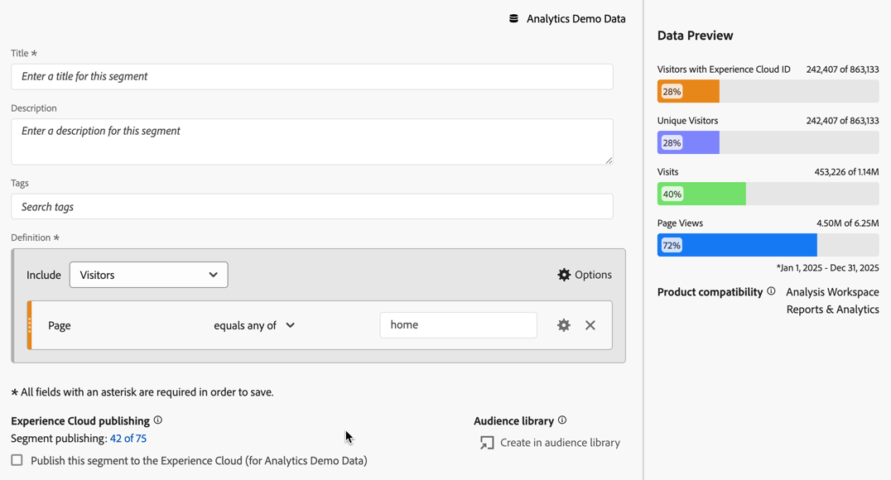

# Segmenten toepassen in een falloutanalyse

U kunt vanuit een aanraakpunt segmenten maken, segmenten als aanraakpunt toevoegen en de belangrijkste workflows in verschillende segmenten in Analysis Workspace vergelijken.

>[!IMPORTANT]
>
>De segmenten die als controlepunten in Vallout worden gebruikt moeten een container gebruiken die op een lager niveau dan de algemene context van de Vallout visualisatie is. Met een bezoeker-contextVallout, moeten de segmenten die als controlepunten worden gebruikt bezoek of op slag-gebaseerde segmenten zijn. Met een bezoek-contextVallout, moeten de segmenten die als controlepunt worden gebruikt op hit-Gebaseerde segmenten zijn. Als u een ongeldige combinatie gebruikt, is de fallout 100%. U ziet een waarschuwing in de Fallout visualisatie wanneer u een incompatibel segment als aanraakpunt toevoegt. Bepaalde ongeldige combinaties van segmentcontainers leiden tot ongeldige evaluatieschema&#39;s, zoals:
>
>* Een op bezoekers gebaseerd segment gebruiken als aanraakpunt binnen een bezoekerscontext-uitvalvisualisatie.
>* Het gebruiken van een op bezoeker-gebaseerd segment als touchpoint binnen een bezoek-contextVallout visualisatie.
>* Het gebruiken van een op bezoek-gebaseerd segment als touchpoint binnen een bezoek-contextVallout visualisatie.
>

## Een segment maken van een aanraakpunt

1. Maak een segment van een bepaald aanraakpunt waarin u bijzonder geïnteresseerd bent en dat u op andere rapporten kunt toepassen. U doet dit door met de rechtermuisknop op het aanraakpunt te klikken en **[!UICONTROL Create segment from touchpoint]** te selecteren.

   

   De Bouwer van het Segment opent, vooraf bevolkt met het pre-gebouwde opeenvolgende segment dat aanraakpunt aanpast u selecteerde:

   

1. Geef het segment een titel en een beschrijving en sla het op.

   U kunt dit segment nu gebruiken in elk gewenst project.

## Een segment toevoegen als aanraakpunt

Als u bijvoorbeeld wilt zien hoe de mobiele toepassing de trend weergeeft en de fallout beïnvloedt, sleept u gewoon het segment App Hits voor mobiele apparaten naar de fallout:

U kunt ook een AND-aanraakpunt maken door het segment App Hits voor mobiele apparaten naar een ander controlepunt te slepen.

## Segmenten vergelijken bij uitvallen

U kunt een onbeperkt aantal segmenten vergelijken in de Fallout-visualisatie. (In de onderstaande video staat dat u maximaal drie segmenten kunt vergelijken. Dit is onjuist.)

>[!BEGINSHADEBOX]

Zie  [&#x200B; segmenten in een fallout visualisatie &#x200B;](https://video.tv.adobe.com/v/24046?quality=12&learn=on){target="_blank"} voor een demo video vergelijken.

>[!ENDSHADEBOX]

1. Selecteer in het deelvenster [!UICONTROL Segment] aan de linkerkant de segmenten die u wilt vergelijken. In het voorbeeld In het voorbeeld worden twee segmenten geselecteerd: **[!UICONTROL iOS]** en **[!UICONTROL Android]** .
1. U sleept de drie segmenten naar de neerzetzone Segment boven aan de visualisatie.

   

1. Facultatief: U kunt *Alle Personen* als standaardcontainer houden of de container schrappen.

1. U kunt nu de uitval over de drie segmenten vergelijken, zoals waar een segment een ander segment overtreft, of andere inzichten.
