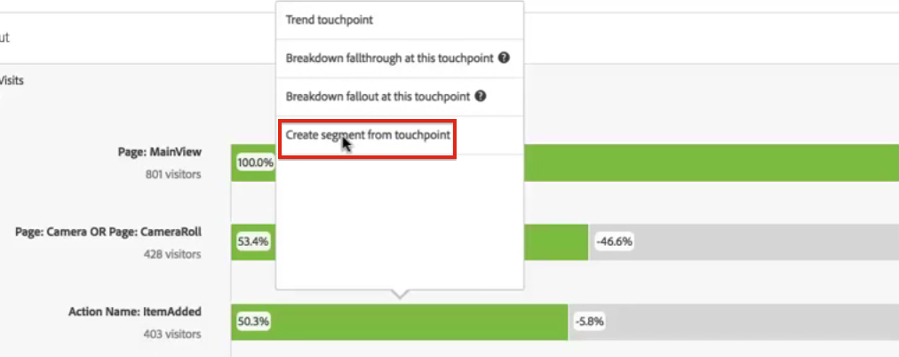

# Segmenten toepassen in een falloutanalyse

U kunt segmenten van een aanraakpunt tot stand brengen, segmenten als aanraakpunt toevoegen, en zeer belangrijke werkschema&#39;s over diverse segmenten in de Werkruimte van de Analyse vergelijken.

>[!IMPORTANT] De segmenten die als controlepunten in Vallout worden gebruikt moeten een container gebruiken die op een lager niveau dan de algemene context van de Vallout visualisatie is. Met een bezoeker-contextVallout, moeten de segmenten die als controlepunten worden gebruikt bezoek of op slag-gebaseerde segmenten zijn. Met een bezoek-contextVallout, moeten de segmenten die als controlepunt worden gebruikt op hit-Gebaseerde segmenten zijn. Als u een ongeldige combinatie gebruikt, is de fallout 100%. We hebben een waarschuwing toegevoegd aan de Fallout-visualisatie die wordt weergegeven wanneer u een incompatibel segment toevoegt als aanraakpunt. Bepaalde ongeldige combinaties van segmentcontainers leiden tot ongeldige evaluatieschema&#39;s, zoals:

* Een op bezoekers gebaseerd segment gebruiken als aanraakpunt binnen een bezoekerscontext-Fallout-visualisatie
* Een op bezoekers gebaseerd segment gebruiken als aanraakpunt binnen een visualisatie voor &#39;visit-context&#39;
* Het gebruiken van een op bezoek-gebaseerd segment als touchpoint binnen een bezoek-contextVallout visualisatie

## Een segment maken van een aanraakpunt {#section_915E8FBF35CD4F34828F860C1CCC2272}

1. Maak een segment van een bepaald aanraakpunt waarin u bijzonder geïnteresseerd bent en dat u op andere rapporten kunt toepassen. U doet dit door met de rechtermuisknop op het aanraakpunt te klikken en **[!UICONTROL Create segment from touchpoint]** te selecteren.

   

   De Bouwer van het Segment opent, vooraf bevolkt met het pre-gebouwde opeenvolgende segment dat aanraakpunt aanpast u selecteerde:

   

1. Geef het segment een titel en een beschrijving en sla het op.

   U kunt dit segment nu gebruiken in elk gewenst rapport.

## Een segment toevoegen als aanraakpunt {#section_17611C1A07444BE891DC21EE8FC03EFC}

Als u bijvoorbeeld wilt zien hoe uw gebruikers in de VS zich ontwikkelen en de neerslag beïnvloeden, sleept u gewoon het Amerikaanse gebruikerssegment naar de uitval:

U kunt ook een AND-aanraakpunt maken door het Amerikaanse gebruikerssegment naar een ander controlepunt te slepen.

## Segmenten vergelijken bij uitvallen {#section_E0B761A69B1545908B52E05379277B56}

U kunt een onbeperkt aantal segmenten vergelijken in de Fallout-visualisatie.

1. Selecteer de segmenten die u wilt vergelijken in de [!UICONTROL Segments] rail aan de linkerkant. In ons voorbeeld hebben we twee segmenten geselecteerd: Amerikaanse gebruikers en gebruikers buiten de VS.
1. Sleep ze naar de neerzetzone Segment bovenaan.

   

1. Optioneel: U kunt &quot;Alle Bezoekopdrachten&quot; als de standaardcontainer behouden of verwijderen.

   

1. U kunt nu de uitval over de twee segmenten vergelijken, zoals waar één segment een andere overtreft, of andere inzichten.
