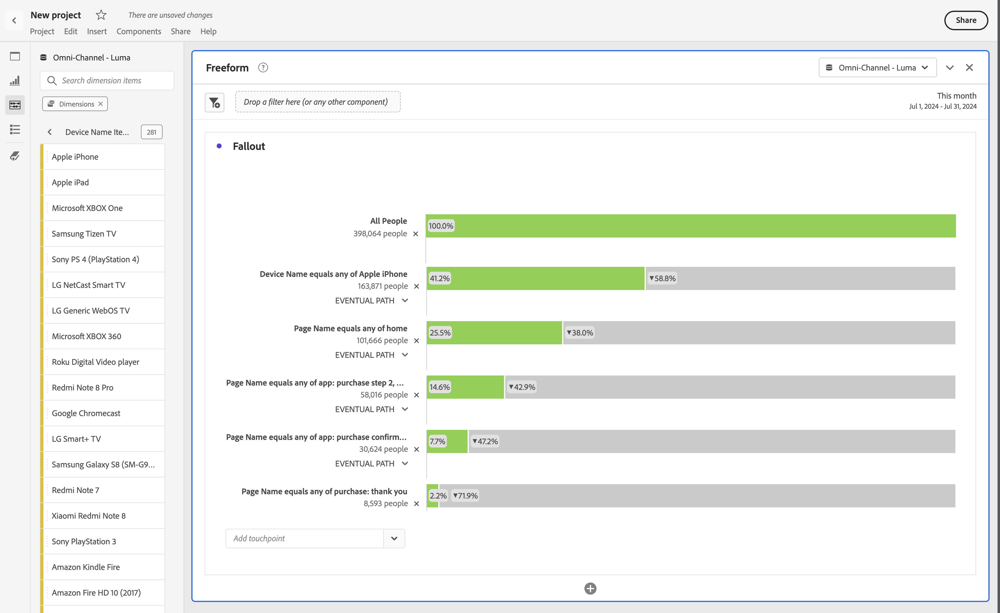

# Interdimensionale uitval

Met de functie voor uitvallen in Analysis Workspace kunt u dimensies en metriek combineren en combineren als aanraakpunten in trechters en workflows. Met valouts hebt u meer flexibiliteit bij het definiëren van de gebruikersstappen die u wilt onderzoeken.

>[!BEGINSHADEBOX]

Zie  [ multidimensionale uitval ](https://video.tv.adobe.com/v/24043?quality=12&learn=on){target="_blank"} voor een demo video.

>[!ENDSHADEBOX]

Naast een pagina-dimensie kunt u bijvoorbeeld andere dimensie-items toevoegen (zoals een specifieke apparaatnaam van de dimensie Apparaatnaam) aan een uitvalweergave. Door dimensies te combineren kunt u visualiseren hoe pagina&#39;s en bepaalde handelingen elkaar beïnvloeden in de paden van klanten.

De fallout wordt dynamisch bijgewerkt en zorgt ervoor dat u fallout in meerdere dimensies ziet.

U kunt ook metriek toevoegen. Bijvoorbeeld, kunt u de metrische Vraag toevoegen om slechts wegen voor gebruikers te tonen waarvoor de vraag bestaat en het vraagcentrum gecontacteerd heeft:

U kunt afmetingen en metriek combineren. Sleep een andere afmeting of metrisch over een bestaande afmeting. Bijvoorbeeld, om de reserve van mensen te begrijpen die een iPhone hebben en het callcenter hebben gecontacteerd.

