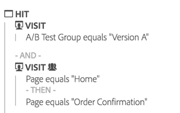
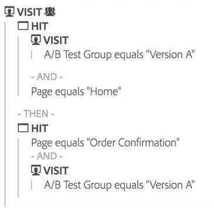

# Overzicht van uitval

Vallout-visualisaties bieden meer opties voor het samenstellen van uw uitvalrapporten. Uit de uitvalrapporten blijkt waar bezoekers een vooraf gedefinieerde reeks pagina&#39;s hebben verlaten (uitgevallen) en doorlopen (doorgevallen).

Hier is een video over de Fallout-visualisatie:

>[!VIDEO](https://video.tv.adobe.com/v/24042/?quality=12)

Met uitvalvisualisaties kunt u

* Voer zij aan zij vergelijkingen van twee verschillende segmenten in het zelfde rapport uit.
* Trechterstappen (aanraakpunten) slepen, neerzetten en opnieuw rangschikken
* Waarden van verschillende afmetingen en maateenheden mixen en afstemmen
* Een multidimensionaal uitvalrapport maken
* Identificeer waar de klanten onmiddellijk na het vallen gaan

Bij Uitvallen worden de conversie- en uitvalsnelheden tussen elke stap of elk aanraakpunt in een reeks weergegeven.

U kunt bijvoorbeeld de uitvalpunten van een bezoeker bijhouden tijdens een aankoopproces. Selecteer gewoon een begin- en een eindaanraakpunt en voeg tussenliggende aanraakpunten toe om een websitenavigatiepad te maken. Maar je kunt ook multidimensionale fallouts doen.

Een uitvalvisualisatie is handig voor het analyseren van:

* Conversiepercentages via specifieke processen op uw site (zoals een aankoop- of registratieproces).
* Algemene verkeersstromen met een groter bereik: Van de mensen die de homepage zagen, toont deze stroom hoeveel er doorgingen om een onderzoek uit te voeren, en toen hoeveel van hen uiteindelijk naar een specifiek punt gingen kijken.
* Correlaties tussen gebeurtenissen op uw site. Correlaties laten zien welk percentage van de mensen die naar je privacybeleid keken, een product heeft gekocht.

## Segmentatie als basis voor flow en fallout {#section_654F37A398C24DDDB1552A543EE29AA9}

De segmenten die op de panelen van de Werkruimte worden toegepast werken lichtjes verschillend dan segmenten die op reserve en stroomrapporten in Rapporten &amp; Analytics worden toegepast. Meestal leveren ze precies dezelfde resultaten op. Het belangrijkste verschil is dat Rapporten &amp; Analytics het segment bij elke stap van de opeenvolging toepast. Dit kan tot iets verschillende resultaten leiden.

Laten we een voorbeeld nemen van fallout met twee stappen:

Als u dan een segment op het het paneelniveau van de Werkruimte toepast, combineert het segment met de reserve als dit:

Als het segment daarentegen wordt berekend met behulp van Rapporten en Analytics, wordt het segment op deze manier gecombineerd:

Rapporten &amp; Analytics combineert het segment met elke stap. Wanneer de containers zich op hetzelfde niveau bevinden als de uitval (bv. bezoek of bezoekersniveau), zal dit ertoe leiden dat het aantal bezoeken of bezoekers gelijk wordt gesteld.

Als het segment dat op het paneel wordt toegepast kleiner is dan het valniveau (bijvoorbeeld raakniveau), geeft het segment echter verschillende resultaten vanwege de manier waarop het wordt gecombineerd met het rapport. Om te herhalen, komen in de meeste gevallen de aantallen in Analysis Workspace overeen met die in Rapporten &amp; Analytics. Zij zullen **niet** alleen overeenkomen als alle onderstaande gevallen waar zijn:

* Het segment bevindt zich niet op hetzelfde niveau als de uitval.
* Het segment heeft een variabele waarbij de bezoeker/bezoeker meerdere waarden kan hebben tijdens een bezoek/bezoeker.

In het zeldzame geval waarin u Analysis Workspace de Rapporten &amp; van de Analyse manier moet hebben om segmenten toe te passen aan fallout/stroom, eenvoudig laat vallen het segment in elke falloutstap in Werkruimte en het zal in de zelfde aantallen resulteren.
