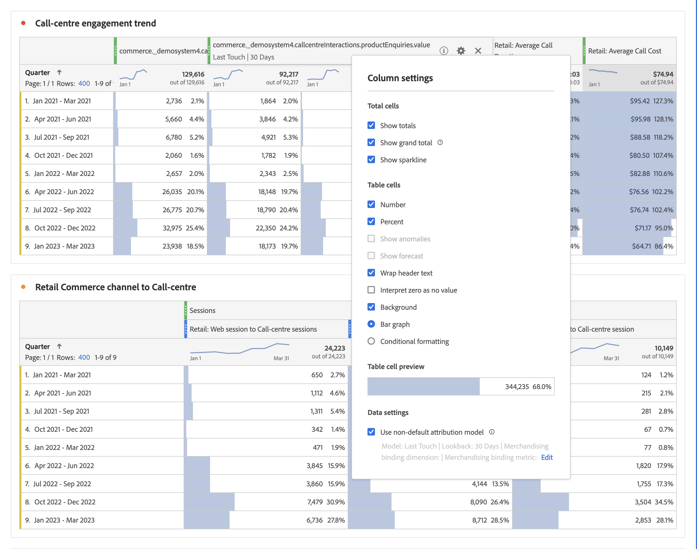

# [!UICONTROL Column Settings]

Met [!UICONTROL Column Settings] kunt u kolomopmaak configureren, waarvan sommige voorwaardelijk kunnen zijn.

## Bewerken [!UICONTROL Column Settings] {#edit-column-settings}

U kunt de kolominstellingen voor een afzonderlijke kolom of voor meerdere kolommen tegelijk bewerken.

1. Sleep in Analysis Workspace een tabel voor vrije vorm naar uw project.

1. (Voorwaardelijk) Als u meerdere kolommen tegelijk wilt bewerken, selecteert u elke kolom die u wilt bewerken terwijl u de Shift-toets ingedrukt houdt.

1. Houd de muisaanwijzer boven de kolom die u wilt bewerken en selecteer vervolgens het tandwielpictogram.

   Als u meerdere kolommen hebt geselecteerd, klikt u op het tandwielpictogram voor een van de geselecteerde kolommen. Alle wijzigingen die u aanbrengt, worden toegepast op alle geselecteerde kolommen.

   

1. Ga met [ montages van de Kolom ](#column-settings) verder.

## Kolominstellingen

U kunt de volgende kolommontages voor individuele lijsten in Analysis Workspace bijwerken, zoals die in [ wordt beschreven geef de Montages van de Kolom ](#edit-uicontrol-column-settings) uit.

Sommige van deze zelfde montages kunnen ook voor alle nieuwe projecten worden geleid die u in Analysis Workspace creeert, zoals die in [ de voorkeur van de Gebruiker ](/help/analyze/analysis-workspace/user-preferences.md) wordt beschreven

| Element | Beschrijving |
| --- | --- |
| **Totale cellen** |  |
| Totalen tonen | Dit totaal is doorgaans gelijk aan of een subset van de [!UICONTROL Grand Total] . Dit weerspiegelt alle tabelfilters die binnen de vrije-vormtabel worden toegepast, inclusief de optie [!UICONTROL Include None] . |
| Totaal-generaal tonen | Dit totaal vertegenwoordigt alle treffers die zijn verzameld, soms genoemd &quot;rapportsuite total&quot;. Wanneer een segment wordt toegepast op deelvensterniveau of binnen de vrije-vormtabel, wordt dit totaal aangepast aan alle resultaten die overeenkomen met de segmentcriteria. Het grote totaal wordt niet gesteund voor lijsten of onderverdelingen met [ statische rijen ](/help/analyze/analysis-workspace/visualizations/freeform-table/workspace-totals.md). |
| **de cellen van de Lijst** |   |
| Getal | Hiermee wordt bepaald of in een cel de numerieke waarde voor de metrische waarde wordt weergegeven of verborgen. Als de metrische waarde bijvoorbeeld Paginaweergaven is, is de numerieke waarde het aantal paginaweergaven voor het rij-item. |
| Percentage | Bepaalt of een cel de percentagewaarde voor metrisch toont/verbergt. Als de metrische waarde bijvoorbeeld Paginaweergaven is, is de percentagewaarde het aantal paginaweergaven voor het rijitem gedeeld door de totale paginaweergaven voor de kolom.  Opmerking: we kunnen percentages van meer dan 100% weergeven, om nauwkeuriger te zijn. We verplaatsen het bovenste gebonden plafond ook naar 1000% om ervoor te zorgen dat kolommen te groot kunnen worden. |
| Anomalies | Hiermee wordt bepaald of de waarden in deze kolom een anomaliedetectie uitvoeren. Voor meer informatie, zie [ anomalieën van de Mening in Analysis Workspace ](/help/analyze/analysis-workspace/c-anomaly-detection/view-anomalies.md). |
| Tekst koptekst tekstomloop | Hiermee kunt u de koptekst laten omlopen in Freeform-tabellen om kopteksten leesbaarder te maken en tabellen beter deelbaar te maken. Dit is handig voor .pdf-rendering en voor metriek met lange namen. Standaard ingeschakeld. |
| nul interpreteren als geen waarde | Voor cellen met een waarde 0 bepaalt u of een cel van 0 of een lege cel moet worden weergegeven. Dit is handig wanneer u gegevens bekijkt voor elke dag van een maand, en sommige dagen zijn nog niet gebeurd.  In plaats van &#39;0&#39; voor toekomstige datums weer te geven, kunnen lege cellen worden weergegeven. Grafieken voldoen ook aan deze instelling (ze geven dus geen lijn of balk weer met 0 waarden als deze instelling is ingeschakeld). |
| Achtergrond | Hiermee bepaalt u of alle celopmaak, inclusief de staafgrafiek en voorwaardelijke opmaak, in een cel wordt weergegeven of verborgen. |
| Staafgrafiek | Hiermee wordt een horizontale staafgrafiek weergegeven die de waarde van de cel ten opzichte van het totaal voor de kolom vertegenwoordigt. |
| Voorwaardelijke opmaak | Zie de onderstaande paragraaf. |
| Tabelcelvoorvertoning | Toont een voorproef van hoe elke cel met de momenteel geselecteerde opmaakopties wordt getoond. |

## Voorwaardelijke opmaak {#conditional-formatting}

Met voorwaardelijke opmaak wordt opmaak toegepast op de bovenste, middelste en onderste limieten die u kunt definiëren. Het toepassen van voorwaardelijke opmaak (bijvoorbeeld kleuren) in Freeform-tabellen wordt ook automatisch ingeschakeld voor onderverdelingen, tenzij &quot;Aangepaste&quot; limieten zijn geselecteerd.

| Element | Beschrijving |
| --- | --- |
| Voorwaardelijke opmaak | Hiermee past u een vooraf geconfigureerde kleurenset van uw keuze toe op cellen. Afhankelijk van welke van de vier beschikbare kleurenschema&#39;s u selecteert, worden de verschillende kleuren toegewezen aan hoge waarden, middelpuntwaarden, en lage waarden.   Als u een dimensie in de tabel vervangt, worden de limieten voor voorwaardelijke opmaak opnieuw ingesteld. Wanneer u een metric vervangt, worden de limieten voor die kolom opnieuw berekend (waarbij de metric op de X-as staat en de dimensie op de Y-as). |
| Percentagelimieten gebruiken | Wijzig het limietbereik zodat dit op percentages wordt gebaseerd in plaats van op absolute waarden. Dit werkt voor metriek die uitsluitend op percentage-gebaseerd (zoals het Tarief van de Stuiting) evenals voor metriek zijn die een telling en een percentage (zoals de Weergaven van de Pagina. hebben) |
| Automatisch genereren | Berekent automatisch de bovenste/middelste/onderste limieten op basis van de gegevens. De bovengrens is de hoogste waarde in deze kolom. De ondergrens is de laagste en het middelpunt is het gemiddelde van de boven- en ondergrens. |
| Aangepast | Handmatig bovenste/middelste/onderste limieten toewijzen. Dit biedt u de flexibiliteit om te bepalen wanneer een kolomwaarde goed, gemiddeld, of slecht wordt. |
| Voorwaardelijk opmaakpalet | Kies welke van de vier beschikbare kleurenschema&#39;s u voor uw voorwaardelijke formatteren wilt gebruiken. |

## Niet-standaard toewijzingsmodel gebruiken {#attribution}

Analysis Workspace steunt [ attributie ](/help/analyze/analysis-workspace/attribution/overview.md) voor bijna om het even welke metrisch.

1. Klik op het pictogram Instellingen (versnelling) in een kolom Tabel vrije vorm.

   

1. Onder **[!UICONTROL Data Settings]** schakelt u **[!UICONTROL Use non-default attribution model]** in. Voor meer informatie over verschillende attributiemodellen, zie [ modellen van de Attributie ](/help/analyze/analysis-workspace/attribution/models.md).

   

>[!MORELIKETHIS]
>
>* [Databronnen beheren](/help/analyze/analysis-workspace/visualizations/t-sync-visualization.md)

## Dynamische kolommen

>[!BEGINSHADEBOX]

Zie  [ Dynamische kolommen ](https://video.tv.adobe.com/v/23138?quality=12&learn=on){target="_blank"} voor een demo video.

>[!ENDSHADEBOX]

