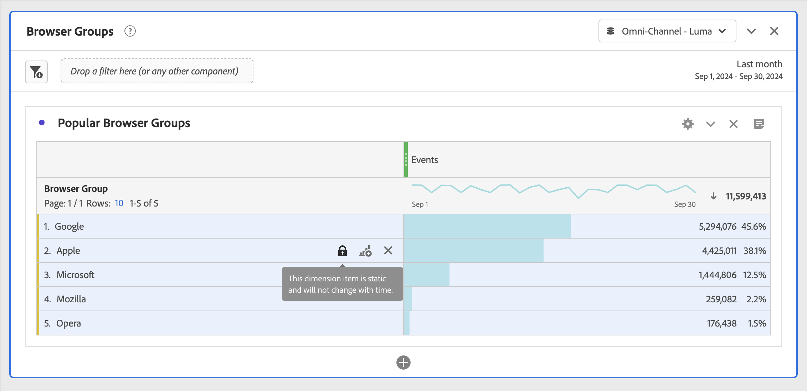

# Dynamische versus statische dimensie-items in vrije-vormtabellen

In Freeform-tabellen kunnen de rijen en kolommen verschillende componentwaarden bevatten. Deze waarden kunnen dynamisch (verandering met tijd) of statisch (veranderen niet met tijd) zijn, afhankelijk van de analyse die u wilt bouwen.

## Dynamische dimensie-items

De dynamische afmetingspunten veranderen met tijd en zijn afhankelijk van metrisch die door in de vrije vormlijst wordt gesorteerd. Items met een dynamische dimensie hebben de voorkeur wanneer u de bovenste items gedurende een bepaalde tijdsperiode wilt analyseren.

Wanneer u een dimensie in een vrije vormlijst laat vallen, zijn de dynamische rijen teruggekeerd. Zij vertegenwoordigen de hoogste punten die aan de afmeting voor een bepaalde metrisch en tijdspanne beantwoorden. U kunt ook een dimensie neerzetten in vrije tabelkolommen en de dimensie wordt automatisch uitgebreid naar de bovenste 5 dimensieitems.

Wanneer u bijvoorbeeld de afmetingen Browsertype naar de tabel sleept, worden de bovenste elementen voor Browsertype (bijvoorbeeld Microsoft, Apple, Google, enz.) dynamisch teruggezet naar de tabelrijen. Indien neergezet in een kolom, de top 5 Browser de afmetingspunten van het Type dynamisch terugkeren.

De dynamische afmetingspunten hebben de optie van de rijfilter en de pictogrammen van X, en hebben **** geen slotpictogram aanwezig. <!--do they have the lock icon? --> Wanneer u op de x klikt naast een item met een dynamische dimensie, wordt automatisch een filter toegepast. Voor meer informatie over het toepassen van filters op lijsten, zie [ Filter en sorteerlijsten ](/help/analyze/analysis-workspace/visualizations/freeform-table/filter-and-sort.md).

## Statische dimensie-items

De statische afmetingspunten veranderen niet met tijd; zij zijn vaste componenten die altijd in een vrije vormlijst zijn teruggekeerd. De statische afmetingspunten worden geprefereerd wanneer u altijd het zelfde punt wilt analyseren, of het specifieke campagnes of specifieke dagen in de week zijn.

Wanneer u handmatig bepaalde componentwaarden (afmetingen, metrisch, segment, datumbereik) in een tabel selecteert en neerzet, is het resultaat een statische lijst met rijen of kolommen. De statische afmetingspunten kunnen ook worden gecreeerd als u verkiest:

* Vanuit rijen klikt u met de rechtermuisknop > [!UICONTROL Display only selected rows]
* Klik met de rechtermuisknop > [!UICONTROL Make item static] uit kolommen

Wanneer u bijvoorbeeld over specifieke BrowserType-items sleept, zoals Microsoft en Apple, worden die twee specifieke items altijd in de tabel geplaatst.

De statische afmetingspunten hebben **** niet de optie van de rijfilter. In plaats daarvan worden op elk item de pictogrammen Vergrendelen en X weergegeven. Klik op het X-pictogram om dat dimensie-item uit de tabel te verwijderen.

## Items met gemengde dimensies

Items van verschillende Dimensionen kunnen aan dezelfde tabel worden toegevoegd. In deze gevallen staat in de rijkop &quot;Gemengd Dimension&quot;. Deze dimensie-items zijn statisch. Bijvoorbeeld, toevoegend specifieke afmetingspunten van de Browser dimensie van het Type en andere afmetingspunten van de Browser afmeting.

## Totaal aantal rijen vrije vorm

Dynamische en statische rijen gedragen zich anders in de vrije-vormtotale rij. Standaard:

* Dynamische rijen worden samengevat op de server en worden niet-gedupliceerde afmetingen zoals bezoeken of bezoekers
* De statische rijen worden samengevat cliënt-kant en **niet** de-dubbele metriek. Om de totale rij server-kant te berekenen, verander de Rij die aan **plaatsen toont groot totaal**. [Meer informatie](https://experienceleague.adobe.com/docs/analytics/analyze/analysis-workspace/visualizations/freeform-table/workspace-totals.html)

## Statische rijen opnieuw ordenen

>[!BEGINSHADEBOX]

Zie  [ statische rijen ](https://video.tv.adobe.com/v/31319?quality=12&learn=on){target="_blank"} voor een demo video opnieuw ordenen.

>[!ENDSHADEBOX]

