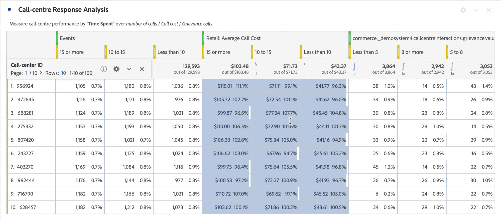

# Rijinstellingen

>[!BEGINSHADEBOX]

Zie  [ Rij en kolommontages 0&rbrace; VideoCheckedOut in een Vrije vormlijst ](https://video.tv.adobe.com/v/40382/?quality=12&learn=on){target="_blank"} voor een demo video.

>[!ENDSHADEBOX]

De rijinstellingen variëren afhankelijk van de component die u naar de tabel hebt gesleept. Om tot de montages van de lijstrij toegang te hebben, selecteer  Plaatsend **[!UICONTROL Settings]** naast een afmeting, filter, metrisch, tijdspanne, of een onderbreking binnen elk van deze voorwerpen.

 benadrukken

| Instelling | Beschrijving |
| --- | --- |
| **[!UICONTROL Breakdown by position]** | Deze instelling is standaard uitgeschakeld en de onderverdelingen zijn gekoppeld aan statische rijitems. Stel dat u de bovenste pagina&#39;s met dimensies (Homepage, Zoekresultaten, Afhandeling) opsplitst op Marketingkanaal. Dan verlaat u het project en keert twee weken later terug. Nadat u het project opnieuw hebt geopend, zijn de bovenste drie pagina&#39;s gewijzigd. In plaats daarvan zijn Homepage, Zoekresultaten en Afhandeling de bovenste 4-6 pagina&#39;s. Standaard worden uw uitsplitsingen naar marketingkanaal nog steeds weergegeven onder Homepage, Zoekresultaten en Afhandeling, ook al bevinden ze zich nu in de rijen 4-6.   In tegenstelling, **Uitsplitsing door positie** breekt altijd boven 3 punten, ongeacht wat zij zijn. Verwijzend naar het voorbeeld, wanneer u uw project opnieuw opent, zijn de onderbrekingen van het Kanaal van de Marketing gebonden aan de hoogste 3 pagina&#39;s in de lijst. En niet naar Homepage, zoekresultaten en afhandeling, die nu in de rijen 4 tot en met 6 staan. |
| **[!UICONTROL Percentages]** | **berekent percentages door kolom** (gebrek): de percentages zichtbaar in een cellen worden berekend gebaseerd op het kolomtotaal.  **berekent percentages door rij**: de percentages in cellen worden berekend over de rij, in tegenstelling tot onderaan de kolom, met Groot totaal als noemer. Deze berekening is nuttig voor het trenderen van percentages. |
| **[!UICONTROL Column totals]** | Deze montages zijn beschikbaar slechts voor [ statische rijen ](/help/analyze/analysis-workspace/visualizations/freeform-table/column-row-settings/manual-vs-dynamic-rows.md).   **toon als som huidige rijen** toont een cliënt-zijsom van de rijen in de lijst, zo betekent het totaal *niet* de-dubbele metriek zoals bezoeken of personen.   **toon groot totaal** toont een server-zijsom, wat het totaal van de-gedupliceerde metriek betekent. |

## Aantal rijen wijzigen

U wijzigt als volgt het aantal rijen dat wordt weergegeven:

1. Klik op het nummer naast **[!UICONTROL Rows]** boven aan de eerste kolom van de tabel.

   

1. Selecteer in de vervolgkeuzelijst het aantal rijen dat u wilt weergeven in de tabel.

## Contextmenu

De volgende opties in contextmenu&#39;s zijn beschikbaar wanneer u de dimensiekoptekst selecteert.

| Optie | Beschrijving |
| --- | --- |
| **[!UICONTROL Copy selection to clipboard]** | Kopieer de selectie van de visualisatie naar het klembord. |
| **[!UICONTROL Download items as CSV (*afmetingsnaam *)]** | Download de dimensie-items (tot een maximum van 50.000) van de visualisatie direct naar uw lokale apparaat. Maximaal 50.000 dimensieitems voor de geselecteerde dimensie. |
| **[!UICONTROL Download selection as CSV]** | Download de dimensie-items van de visualisatie direct naar uw lokale apparaat. |
| **[!UICONTROL Create hyperlink for all dimension items]** | Maak hyperlinks voor alle dimensie-items. Zie [ Hyperlinks voor afmetingen in een vrije vormlijst ](../freeform-table-hyperlinks.md) |
| **[!UICONTROL Edit hyperlink for all dimension items]** | Bewerk hyperlinks voor alle dimensie-items. Zie [ Hyperlinks voor afmetingen in een vrije vormlijst ](../freeform-table-hyperlinks.md) |
| **[!UICONTROL Remove hyperlink for all dimension items]** | Verwijder hyperlinks voor alle afmetingsitems. Zie [ Hyperlinks voor afmetingen in een vrije vormlijst ](../freeform-table-hyperlinks.md) |
| **[!UICONTROL Delete]** | Hiermee verwijdert u de dimensie uit de tabel. |
| **[!UICONTROL Visualize]** | Visualiseer de dimensie met een van de beschikbare visualisaties. |
| **[!UICONTROL Display only selected rows]** | Alleen de geselecteerde items in de visualisatie weergeven. |
| **[!UICONTROL Create annotation from selection]** | Open **[!UICONTROL Annotation details]** om een annotatie toe te voegen. |

De volgende aanvullende opties in contextmenu&#39;s zijn beschikbaar wanneer u een of meer afmetingsitems (eerste kolom) of een of meer afzonderlijke cellen in de vrije-vormtabel selecteert.

| Optie | Beschrijving |
| --- | --- |
| **[!UICONTROL Create hyperlink]** | Maak een hyperlink voor het item. Zie [ Hyperlinks voor afmetingen in een vrije vormlijst ](../freeform-table-hyperlinks.md) |
| **[!UICONTROL Edit hyperlink]** | Bewerk een hyperlink voor het item. Zie [ Hyperlinks voor afmetingen in een vrije vormlijst ](../freeform-table-hyperlinks.md) |
| **[!UICONTROL Remove hyperlink]** | Een hyperlink voor het item verwijderen. Zie [ Hyperlinks voor afmetingen in een vrije vormlijst ](../freeform-table-hyperlinks.md) |
| **[!UICONTROL Breakdown]** | Hiermee wordt het item voor de dimensie opgesplitst. Selecteer een optie in de lijst met **[!UICONTROL Dimensions]** , **[!UICONTROL Metrics]** , **[!UICONTROL Filters]** of **[!UICONTROL Date ranges]** . Alternatief onderzoek naar een component, gebruikend *Onderzoek*. |
| **[!UICONTROL Delete selected]** | Verwijder de geselecteerde rijen (items). |
| **[!UICONTROL Trend selection]** | Maak een trendlijngrafiekvisualisatie voor de selectie. |
| **[!UICONTROL Display only selected rows]** | Alleen de geselecteerde rijen in de visualisatie weergeven. |
| **[!UICONTROL Display all rows]** | Alle rijen in de visualisatie weergeven. |
| **[!UICONTROL Create filter from selection]** | Open **[!UICONTROL Filter builder]** om een filter van de selectie te bouwen. |
| **[!UICONTROL Create audience from selection]** | Open het dialoogvenster **[!UICONTROL Create audience]** om een publiek te maken op basis van de selectie. |

De volgende aanvullende opties in contextmenu&#39;s zijn beschikbaar wanneer u een kolomkop met een metrische waarde selecteert.

| Optie | Beschrijving |
|---|---|
| **[!UICONTROL Create metric from selection]** | Creeer nieuwe metrisch van geselecteerde metrisch. De metrische waarden kunnen Gemiddeld zijn, Media, Kolommaximum, Kolom min, Kolomsom. U kunt Open in berekende metrische bouwer ook selecteren om berekende metrisch tot stand te brengen. |
| **[!UICONTROL Add time period column]** | Voeg een kolom voor de tijdperiode toe. U wordt aangeboden verscheidene opties, waar de kalenderwaaier van het paneel de *datumwaaier* bepaalt: <li>**[!UICONTROL Prior *datumwaaier *aan deze datumwaaier]**</li><li>**[!UICONTROL These *datumwaaier *aan deze datumwaaier]**.</li><li>**[!UICONTROL Custom date range to this date range]**. Hiermee opent u het dialoogvenster **[!UICONTROL Date range builder]** waarin u het datumbereik kunt opgeven.</li>Zie [ vergelijking van de Datum ](/help/analyze/analysis-workspace/components/calendar-date-ranges/time-comparison.md) voor meer informatie. |
| **[!UICONTROL Compare time periods]** | Hiermee voegt u de kolommen voor de tijdsperiode toe. Alleen beschikbaar als de dimensie niet op tijd is gebaseerd. U wordt aangeboden verscheidene opties bepaalt de *datumwaaier*: <li>**[!UICONTROL Prior *datumwaaier *aan deze datumwaaier]**</li><li>**[!UICONTROL Custom date range to this date range]**. Hiermee opent u het dialoogvenster **[!UICONTROL Date range builder]** waarin u het datumbereik kunt opgeven.</li>Zie [ vergelijking van de Datum ](/help/analyze/analysis-workspace/components/calendar-date-ranges/time-comparison.md) voor meer informatie. |
| **[!UICONTROL Modify attribution models]** | Wijzig het attributiemodel voor de kolom. |
| **[!UICONTROL Compare attribution model]** | Geef een nieuw toewijzingsmodel op en vergelijk dit met het toewijzingsmodel voor de geselecteerde kolom. Een nieuwe kolom wordt toegevoegd met de nieuwe metriek van het attributiemodel. Bovendien wordt een kolom Percentage wijziging toegevoegd ter vergelijking. |
| **[!UICONTROL Reset column widths]** | Herstel de kolombreedten naar de standaardbreedte. |
| **[!UICONTROL Create annotation from selection]** | Open **[!UICONTROL Annotation details]** om een annotatie toe te voegen. |
| **[!UICONTROL Create filter from selection]** | Open **[!UICONTROL Filter builder]** om een filter van de selectie te bouwen. |
| **[!UICONTROL Create audience from selection]** | Open het dialoogvenster **[!UICONTROL Create audience]** om een publiek te maken op basis van de selectie. |

## Rijhoogte wijzigen

U kunt de weergavedichtheid van een project instellen op **[!UICONTROL Compact]** , **[!UICONTROL Comfortable]** en **[!UICONTROL Expanded]** . [ leer meer ](/help/analyze/analysis-workspace/build-workspace-project/view-density.md).
