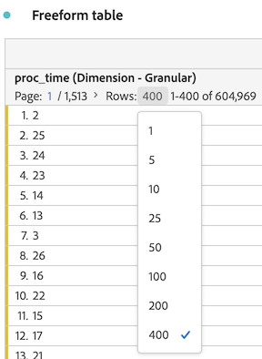

# Rij-instellingen

De rijinstellingen variëren afhankelijk van de component die u naar de tabel hebt gesleept. Als u de tabelrijinstellingen wilt openen, klikt u op het pictogram Instellingen naast een dimensie, segment, metrisch, tijdsperiode of een verdeling binnen elk van deze instellingen:

| Instelling | Beschrijving |
|--- |--- |
| Datums uitlijnen | Dit is een instelling op tabelniveau waarmee de datums van elke kolom worden uitgelijnd op alle datums die op dezelfde rij beginnen. Uitlijnen op datum wordt standaard ingeschakeld wanneer een tijddimensie wordt gebruikt in de rijen van de tabel en verschillende datumbereiken worden toegepast in de kolommen. In een dagelijkse tabel waarin oktober en september op de kolommen worden toegepast, begint de linkerkolom bijvoorbeeld met 1 oktober en begint de rechterkolom met 1 september. |
| Uitsplitsing naar positie | Deze instelling is standaard uitgeschakeld en de onderverdelingen zijn gekoppeld aan statische rijitems. Bijvoorbeeld, laten wij zeggen u de hoogste 3 pagina afmetingspunten (Homepage, Resultaten van het Onderzoek, Afhandeling) door het Kanaal van de Marketing. Dan verlaat u het project en keert twee weken later terug. Nadat u het project opnieuw hebt geopend, zijn de bovenste drie pagina&#39;s gewijzigd. In plaats daarvan zijn Homepage, Zoekresultaten en Afhandeling de bovenste 4-6 pagina&#39;s. Standaard worden uw uitsplitsingen naar marketingkanaal nog steeds weergegeven onder Homepage, Zoekresultaten en Afhandeling, ook al staan deze nu in de rijen 4-6.   Daarentegen **Uitsplitsing naar positie** De bovenste drie posten worden altijd uitgesplitst, ongeacht wat ze zijn. Als u terugverwijst naar ons voorbeeld, worden de uitsplitsingen van het marketingkanaal gekoppeld aan de bovenste drie pagina&#39;s van de tabel, niet aan Homepage, Zoekresultaten en Afhandeling, die nu in de rijen 4-6 staan. |
| Percentage | **Percentage berekenen op kolom** de standaardinstelling is; de in een kolom zichtbare percentages worden berekend op basis van het totale aantal kolommen.  **Percentage berekenen op rij** Hiermee wordt de tabel Freeform gedwongen om de celpercentages over de rij te berekenen in plaats van de celpercentages omlaag in de kolom, met Eindtotaal als noemer. Dit is vooral handig voor het trenderen van percentages. Deze instelling is standaard ingeschakeld wanneer u het pictogram Visualiseren gebruikt. |
| Kolomtotalen | Deze instellingen zijn alleen beschikbaar voor [statische rijen](manual-vs-dynamic-rows.md).   **Weergeven als som van huidige rijen** toont een client-side som van de rijen in de tabel, wat betekent dat het totaal *niet* deduplicatie van metingen zoals bezoeken of bezoekers.   **Totaal-generaal tonen** toont een som aan serverzijde, wat betekent dat het totaal metriek zal dedupliceren. |

## Aantal rijen wijzigen

U wijzigt als volgt het aantal rijen dat wordt weergegeven:

1. Klik op het nummer naast [!UICONTROL Rows] boven aan de tabel.

   

1. Selecteer in de vervolgkeuzelijst het aantal rijen dat u wilt weergeven in de tabel.

## Video&#39;s

Hier volgt een korte video over &quot;Percentage op rij&quot;:

>[!VIDEO](https://video.tv.adobe.com/v/23134/?quality=12)
