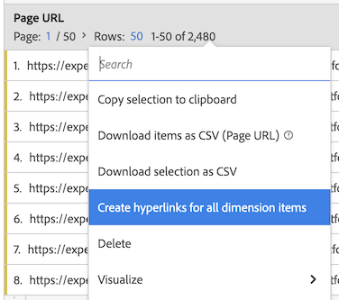
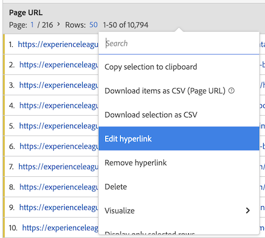

# Hyperlinks maken

U kunt hyperlinks maken voor dimensie-items, zodat hierop kan worden geklikt in een vrije-vormtabel in Analysis Workspace.

Deze functionaliteit is vooral handig bij het maken van hyperlinks voor de volgende typen dimensies:

* Dimension-items met URL-waarden (bijvoorbeeld een pagina-URL-dimensie).

* Dimension-items die onderverdelingen bevatten met URL-waarden (bijvoorbeeld een paginanummer met een indeling van een pagina-URL-dimensie).

* Dimension-items of uitsplitsingen die waarden hebben die onderdeel zijn van een URL (bijvoorbeeld een paginanaam die deel uitmaakt van een URL).

>[!BEGINSHADEBOX]

Zie  [&#x200B; Hyperlinks voor afmeting &#x200B;](https://video.tv.adobe.com/v/3445790?captions=dut&quality=12&learn=on){target="_blank"} voor een demo video.

>[!ENDSHADEBOX]

## Hyperlinks maken

Overweeg het volgende wanneer u hyperlinks voor één of meerdere afmetingspunten creeert:

* De hyperlinks die u maakt, worden opgeslagen in de vrije-vormtabel in het Analysis Workspace-project. Hyperlinks blijven niet bestaan wanneer u dezelfde dimensie- of dimensie-items in een andere tabel of in een ander project gebruikt.

* Als u de gegevensweergave van de vrije-vormtabel wijzigt, zijn alle hyperlinks die voor dimensies of dimensies-items in de tabel zijn gemaakt, nog steeds beschikbaar. Deze functionaliteit veronderstelt dat de dimensie nog in de gegevensmening bestaat.

* URL&#39;s worden niet gecontroleerd op geldigheid wanneer u de hyperlink maakt. Als u

   * een hyperlink met een ongeldige URL maken, of
   * een hyperlink maken die verwijst naar een dimensie-item dat geen URL-waarde heeft (door rechtstreeks naar het dimensie-item te verwijzen of door de variabelen `$value` of `$breakdown` te gebruiken);

  gebruikers die op de hyperlink klikken, zien een foutbericht met de melding dat de URL ongeldig is.

* Hyperlinks die voor één enkel afmetingspunt worden gecreeerd treden hyperlinks met voeten die op de afmeting worden gecreeerd.

* De hyperlinks zijn niet functioneel in [&#x200B; gedownloade dossiers van PDF &#x200B;](/help/analyze/analysis-workspace/curate-share/download-send.md).

U kunt als volgt hyperlinks maken voor een of meer dimensies:

1. Voer een van de volgende handelingen uit in een vrije-vormtabel in Analysis Workspace:

   * **creeer een hyperlink voor één enkel afmetingspunt:** klik het afmetingspunt binnen de lijst met de rechtermuisknop aan waarvoor u hyperlink wilt creëren, dan selecteren [!UICONTROL **hyperlink**] creëren.

      1. Open het contextmenu voor het dimensie-item.
      1. Selecteer [!UICONTROL **hyperlink**] van het contextmenu creëren.

         [!UICONTROL **creeer hyperlink**] dialoog wordt getoond. De naam van het dimensie-item waarvoor u een hyperlink maakt, wordt weergegeven in het dialoogvenster.

         

   * **creeer hyperlinks voor alle afmetingspunten in een afmetingskolom:** klik de afmetingsnaam in de kopbal van de afmetingskolom met de rechtermuisknop aan, dan uitgezocht [!UICONTROL **creeer hyperlinks voor alle afmetingspunten**].

      1. Open het contextmenu in de kolomkop Dimensie.
      1. Selecteer [!UICONTROL **hyperlink voor alle afmetingspunten**] van het contextmenu creëren.

         <!-- Do we really need a screenshot  -->

         [!UICONTROL **creeer hyperlinks voor alle afmetingspunten**] dialoog wordt getoond. De naam van de dimensie waarvoor u hyperlinks maakt, wordt weergegeven in het dialoogvenster.

         

1. Kies een van de volgende opties:

   * [!UICONTROL **gebruik de waarde van het afmetingspunt als URL**]: Kies deze optie voor afmetingspunten die waarden URL, zoals een afmeting van Pagina URL hebben.

     Als u bijvoorbeeld een pagina-URL-dimensie gebruikt waarvan de waarde van elk dimensie-item een URL is, maakt u met deze optie een hyperlink naar de URL.

   * [!UICONTROL **creeer een douane URL**]: Specificeer of een statische of dynamische douane URL. Kies deze optie om hyperlinks te maken voor dimensie-items die geen URL-waarden hebben.

     Bijvoorbeeld: u gebruikt een dimensie van de Naam van de Pagina waar de waarde van elk afmetingspunt de naam van een pagina (en niet een volledige URL) is. Selecteer deze optie om een hyperlink op te geven die u wilt gebruiken als de koppeling voor het dimensie-item.

     Als u dynamische URL&#39;s wilt maken voor meerdere dimensie-items, kunt u de variabelen `$value` en `$breakdown` gebruiken in de aangepaste URL. Zie de onderstaande tabel voor meer informatie.

     Als u een aangepaste URL wilt maken, geeft u de volgende informatie op:

     | Veld | Beschrijving |
     |---------|----------|
     | [!UICONTROL **Aangepaste URL**] | Geef een aangepaste URL op die u voor de hyperlink wilt gebruiken. URL&#39;s moeten als volledig gekwalificeerde URL&#39;s worden ingevoerd. Bijvoorbeeld: <https://www.example.com>
De aangepaste URL die u maakt, kan statisch of dynamisch zijn:
 <ul><li>**Statische URLs:** u kunt statische URL voor één enkel afmetingspunt of voor alle afmetingspunten specificeren wanneer u de punten allen aan zelfde URL wilt verbinden. Bijvoorbeeld: `https://wiki.internal.example.com/page_name#item_definition`
</li><li>**Dynamische URLs:** u kunt tot een dynamische URL leiden als u unieke hyperlinks voor veelvoudige afmetingspunten, of voor alle afmetingspunten in een afmetingskolom wilt tot stand brengen.
Als u aangepaste URL&#39;s dynamisch wilt maken, neemt u een variabele op in de URL om de URL te wijzigen op basis van de waarde van de dimensie of de waarde van de afbraakdimensie.

Wanneer u variabelen gebruikt, worden dimensieitems die tekens bevatten die niet geldig zijn in URL&#39;s (zoals spaties), URL-gecodeerd.

De volgende variabelen zijn beschikbaar: (**Nota**: Terwijl u deze variabelen in zelfde URL kunt gebruiken, is het gemeenschappelijker om hen afzonderlijk te gebruiken.)
 <ul><li>**`$value`:** staat u toe om de waarde van het afmetingspunt in te voegen in URL die u specificeert. 
Stel dat u hyperlinks wilt maken voor alle pagina-naamatems in een vrije-vormtabel, waarbij de waarde van elk dimensie-item deel uitmaakt van de URL van een webpagina. In dit geval kunt u één aangepaste URL maken die dynamisch voor elk dimensie-item wordt aangepast.   Bijvoorbeeld: `https://example.com/browse/product#\$value`

Wanneer deze aangepaste URL wordt toegepast op de pagina-naamatems waarvan de waarden &quot;ProductY&quot; en &quot;ProductZ&quot; zijn, zien de gegenereerde hyperlinks er ongeveer als volgt uit:  `https://example.com/browse/product#ProductY` en  `https://example.com/browse/product#ProductZ` 

**Uiteinde**: Toevoegend slechts de `$value` variabele in het gebied van Douane URL, is het zelfde als selecterend het [!UICONTROL **Gebruik de waarde van het afmetingspunt**] optie wanneer het creëren van URL.
</li><li>**`$breakdown`:** staat u toe om de waarde van het punt van de verdelingsdimensie in URL op te nemen die u specificeert. Met `$breakdown`, kunt u een afmeting met een gebruikersvriendelijke naam in uw rapport (zoals een afmeting van de Naam van het Product) gebruiken. En genereer een hyperlink op basis van een afbraakdimensie die mogelijk minder gebruikersvriendelijk is (zoals een product-id of pagina-URL-dimensie).
Bij het verwijzen naar een uitsplitsingsdimensie is het het meest gebruikelijk dat er slechts één uitsplitsingspost voor een gegeven dimensie-item is. Indien er meerdere uitsplitsingsposten zijn voor een gegeven dimensie-item, wordt de waarde van de eerste uitsplitsingspost gebruikt in de URL. Als er geen uitsplitsingsitems worden weergegeven, is de URL ongeldig. Op de uitsplitsingsposten wordt dezelfde sorteervolgorde toegepast als op de tabel.

U specificeert de verdelingsafmeting op het [!UICONTROL **hieronder gebied van de Afmeting van de Onderverdeling**].
 
Overweeg het voorbeeldscenario dat voor het [!UICONTROL **hieronder gebied van de Afmeting van de Onderverdeling**] wordt beschreven.
</li></ul> |
     | [!UICONTROL **dimensie van de Onderbreking (facultatief)**] | Typ de naam van de afbraakdimensie die u wilt gebruiken en selecteer deze in de vervolgkeuzelijst. 
Als u een afbraakdimensie op dit gebied selecteert, moet u het van verwijzingen voorzien door de `$breakdown` variabele in URL te gebruiken die u op het [!UICONTROL **Douane URL**] gebied specificeert.

Veronderstel dat u hyperlinks voor alle de afmetingspunten van de Naam van het Product in een vrije lijst wilt tot stand brengen. Elk item van de productnaam bevat een uitsplitsing van een product-id-dimensie.

In dit geval, kunt u hyperlinks voor elke dimensie van de Naam van het Product tot stand brengen die gebruikers aan de productpagina door de waarde van de de verdelingsdimensie van identiteitskaart van het Product te gebruiken leidt. 

Voeg de `$breakdown` variabele aan het eind van douane URL toe die u op het [!UICONTROL **gebied van de Douane URL**] specificeert. Bijvoorbeeld:

`https://example.com/browse/product/$breakdown`
Wanneer deze aangepaste URL wordt toegepast op uw items van de productnaam (die items van de afbraakdimensie hebben waarvan de waarden &quot;ProductY&quot; en &quot;ProductZ&quot; zijn), zien de gegenereerde hyperlinks er als volgt uit: `https://example.com/browse/product/ProductY` en  `https://example.com/browse/product/ProductZ`

U zou dan de dimensie van identiteitskaart van het Product in het [!UICONTROL **Afmeting van de Onderbreking**] gebied selecteren 

 |

1. Selecteer [!UICONTROL **creeer**].

   Gebruikers die de vrije-vormlijst bekijken zien de hyperlinked dimensiepunten. Wanneer gebruikers op een dimensie-item klikken, worden ze naar de pagina&#39;s met hyperlinks op een apart browsertabblad geleid.

   <!-- add screenshot of a table with hyperlinks.-->

1. [&#x200B; sparen het project &#x200B;](/help/analyze/analysis-workspace/build-workspace-project/save-projects.md) om uw veranderingen te bewaren.

## Hyperlinks bewerken

U kunt hyperlinks bewerken die zijn gemaakt voor dimensies of dimensies-items in een vrije-vormtabel.

1. Voer een van de volgende handelingen uit in een vrije-vormtabel in Analysis Workspace:

   * **geef een hyperlink voor één enkel afmetingspunt uit:**

      1. Open het contextmenu voor het dimensie-item.
      1. Selecteer [!UICONTROL **hyperlink**] van het contextmenu uitgeven.

     <!-- Do we really need a screenshot? -->

   * **geef hyperlinks voor alle afmetingspunten in een afmetingskolom uit:**

      1. Open het contextmenu in de kolomkop Dimensie.
      1. Selecteer **[!UICONTROL Edit hyperlink for all dimension items]** in het contextmenu.

     <!-- Do we really need a screenshot? -->

1. Selecteer [!UICONTROL **hyperlinks voor alle afmetingspunten**] van het met de rechtermuisknop aanklikken menu uitgeven.

   [!UICONTROL **geeft hyperlinks voor afmetingspunten**] dialoog uit wordt getoond.

1. Voor informatie over de configuratieopties om hyperlink uit te geven, zie Stap 3 in [&#x200B; hyperlinks voor één of meerdere afmetingspunten &#x200B;](#create-hyperlinks-for-one-or-more-dimension-items) sectie hierboven creëren, dan uitgezocht [!UICONTROL **&#x200B;**] toepassen wanneer u met uw updates wordt gebeëindigd.

1. [&#x200B; sparen het project &#x200B;](/help/analyze/analysis-workspace/build-workspace-project/save-projects.md) om uw veranderingen te bewaren.

## Hyperlinks verwijderen

U kunt hyperlinks verwijderen die zijn gemaakt voor dimensie-items in een vrije-vormtabel.

>[!NOTE]
>
>Als u in een vrije-vormlijst een dimensie verwijdert die hyperlinks bevat, blijven de hyperlinks niet behouden als u dezelfde dimensie weer aan de vrije-vormtabel toevoegt.

Hyperlinks verwijderen uit dimensieitems:

1. Voer een van de volgende handelingen uit in een vrije-vormtabel in Analysis Workspace:

   * **verwijder een hyperlink uit één enkel afmetingspunt:**

      1. Open het contextmenu voor het dimensie-item.
      1. Selecteer [!UICONTROL **verwijder hyperlink**] uit het contextmenu.
         <!-- Do we really need a screenshot? -->

   * **verwijder hyperlinks van alle afmetingspunten in een afmetingskolom:**

      1. Open het contextmenu in de kolomkop Dimensie.
      1. Selecteer **[!UICONTROL Remove hyperlink for all dimension items]** in het contextmenu.

     <!-- Do we really need a screenshot? [Remove hyperlink from a dimension](assets/hyperlink-dimension-remove.png)-->

   De hyperlink wordt verwijderd uit het item met één dimensie als u één dimensie-item hebt geselecteerd. Of van alle afmetingspunten als u de afmetingsnaam in de kopbal van de afmetingskolom selecteerde.

1. [&#x200B; sparen het project &#x200B;](/help/analyze/analysis-workspace/build-workspace-project/save-projects.md) om uw veranderingen te bewaren.
