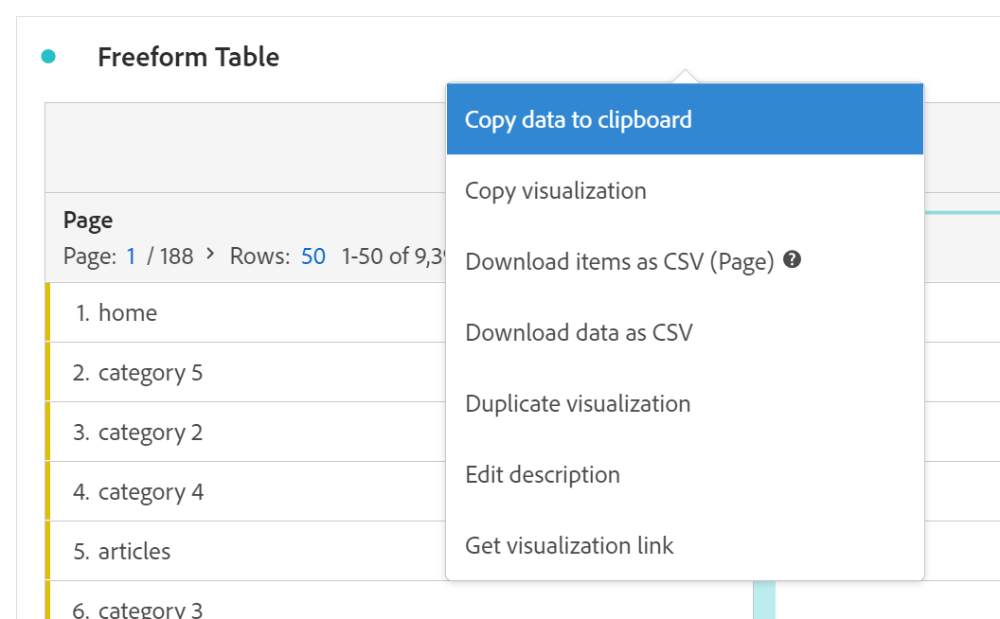

# Vrije-vormentabel

In Analysis Workspace is een Freeform-tabel de basis voor interactieve gegevensanalyse. U kunt een combinatie van [componenten](https://experienceleague.adobe.com/docs/analytics/analyze/analysis-workspace/components/analysis-workspace-components.html) in rijen en kolommen om een aangepaste tabel voor uw analyse te maken. Aangezien elke component wordt gelaten vallen, werkt de lijst onmiddellijk bij, zodat kunt u snel analyseren en dieper graven.

U begint met een lege Vrije-vormtabel als illustratie.

Als u de **[!UICONTROL ** Bezoeken **]** metrisch op de **[!UICONTROL ** Een metrische waarde hier neerzetten (of een andere component)**]** De tabel Vrije vorm wordt automatisch gevuld met bezoeken per dag voor de periode die u hebt geselecteerd.

Als u vervolgens de **[!UICONTROL ** Pagina **]** dimensie ter vervanging van de **[!UICONTROL ** Dag **]** De afmetingskolom, de lijst Freeform wijst automatisch op bezoeken voor elke pagina.

En dan kun je bijvoorbeeld de **[!UICONTROL ** categorie:5 **]** pagina door de **[!UICONTROL ** Marketingkanaal **]** dimensie van de **[!UICONTROL ** categorie:5 **]** rij.

## Geautomatiseerde tabellen

Zoals hierboven geïllustreerd, is de snelste manier om een lijst te bouwen direct componenten in een leeg project, een paneel, of een vrije vormlijst te laten vallen. Een vrije-vormlijst zal automatisch voor u in een geadviseerde formaat worden gebouwd. [De zelfstudie bekijken](https://experienceleague.adobe.com/docs/analytics-learn/tutorials/analysis-workspace/building-freeform-tables/auto-build-freeform-tables-in-analysis-workspace.html).

## Samenstellen van tabellen voor vrije vorm

Als u verkiest om verscheidene componenten aan uw lijst eerst toe te voegen, dan geef de gegevens terug, kunt u de Bouwer van de Lijst van de Vrije vorm toelaten. Als de builder is ingeschakeld, kunt u in vele dimensies, onderverdelingen, metriek en segmenten slepen en neerzetten om tabellen te maken die complexere vragen beantwoorden. Gegevens worden niet direct bijgewerkt, maar worden bijgewerkt wanneer u op **[!UICONTROL Build]**.

## Tabelinteracties

U kunt op verschillende manieren werken met een vrije-vormtabel en deze aanpassen:

* **Rijen**
   * U kunt meer rijen in één enkel scherm passen door het project aan te passen [weergavedichtheid](https://experienceleague.adobe.com/docs/analytics/analyze/analysis-workspace/build-workspace-project/view-density.html).
   * Elke afmetingsrij kan tot 400 rijen tonen, alvorens paginering voorkomt. Klik op het nummer naast &quot;Rijen&quot; om meer rijen op een pagina weer te geven. Navigeer naar een andere pagina met de paginapijl in de koptekst.
   * Rijen kunnen worden opgesplitst in extra componenten. Als u veel rijen tegelijk wilt splitsen, selecteert u gewoon meerdere rijen en sleept u de volgende component boven op de geselecteerde rijen. Meer informatie over [uitsplitsingen](https://experienceleague.adobe.com/docs/analytics/analyze/analysis-workspace/components/dimensions/t-breakdown-fa.html).
   * Rijen kunnen [gefilterd](https://experienceleague.adobe.com/docs/analytics/analyze/analysis-workspace/visualizations/freeform-table/filter-and-sort.html) om een beperkt aantal objecten weer te geven. Aanvullende instellingen zijn beschikbaar onder [Rijinstellingen](https://experienceleague.adobe.com/docs/analytics/analyze/analysis-workspace/visualizations/freeform-table/column-row-settings/table-settings.html).

* **Kolommen**
   * Componenten kunnen in kolommen worden gestapeld om gesegmenteerde metriek, analyse op meerdere tabbladen en nog veel meer te maken.
   * De weergave van elke kolom kan worden aangepast onder de [kolominstellingen](https://experienceleague.adobe.com/docs/analytics/analyze/analysis-workspace/build-workspace-project/column-row-settings/column-settings.html).
   * Er zijn verschillende acties beschikbaar via de [rechtsklikken, menu](https://experienceleague.adobe.com/docs/analytics-learn/tutorials/analysis-workspace/building-freeform-tables/using-the-right-click-menu.html). Het menu bevat verschillende handelingen, afhankelijk van de vraag of u op de tabelkop, de rijen of de kolommen klikt.

## Gegevens vrije-vormentabel exporteren

Meer informatie over alle gegevens [exportopties](https://experienceleague.adobe.com/docs/analytics/analyze/analysis-workspace/curate-share/download-send.html) voor Analysis Workspace.

* Klikken met rechtermuisknop > **[!UICONTROL Copy data to clipboard]** exporteert de weergegeven tabelgegevens. Als een tabel is geselecteerd, wordt de volgende optie weergegeven **[!UICONTROL Copy selection to clipboard]**. De **Ctrl+C** hotkey kopieert ook geselecteerde gegevens.
* Klikken met rechtermuisknop > **[!UICONTROL Download data as CSV]** Hiermee downloadt u de weergegeven tabelgegevens als een CSV-bestand. Als een tabel is geselecteerd, wordt de volgende optie weergegeven **[!UICONTROL Download selection as CSV]**.
* Klikken met rechtermuisknop > **[!UICONTROL Project > Download items as CSV]** Hiermee exporteert u maximaal 50.000 dimensieitems voor de geselecteerde dimensie.

Meer informatie over alle gegevens [exportopties](https://experienceleague.adobe.com/docs/analytics/analyze/analysis-workspace/curate-share/download-send.html) voor Analysis Workspace.

## Video&#39;s

Overzicht van de builder van de tabel voor vrije vorm:

>[!VIDEO](https://video.tv.adobe.com/v/31318/?quality=12)

Filters voor vrije-vormentabel:

>[!VIDEO](https://video.tv.adobe.com/v/23232/?quality=12)

Totaal vrije-vormtabellen:

>[!VIDEO](https://video.tv.adobe.com/v/29273/?quality=12)
