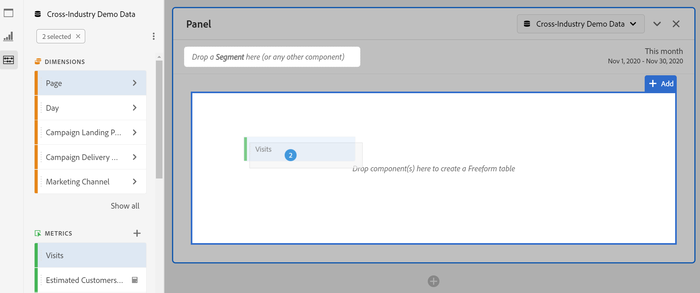

# Vrije-vormtabel {#freeform-table-overview}

<!-- markdownlint-disable MD034 -->

>[!CONTEXTUALHELP]
>id="workspace_freeformtable_button"
>title="Vrije-vormtabel"
>abstract="Maak een lege visualisatie voor vrije tabellen die u kunt opbouwen met dimensies, segmenten, metriek en datumbereiken. U kunt de vrije-vormlijst als basis voor andere visualisaties gebruiken."

<!-- markdownlint-enable MD034 -->

>[!BEGINSHADEBOX]

_dit artikel documenteert de Freeform lijstvisualisatie in_  _&#x200B;**Adobe Analytics**._ _zie [ Vrije lijst ](https://experienceleague.adobe.com/en/docs/analytics-platform/using/cja-workspace/visualizations/freeform-table/freeform-table) voor_  _&#x200B;**Customer Journey Analytics** versie van dit artikel._

>[!ENDSHADEBOX]

In Analysis Workspace, is de visualisatie van de a  **[!UICONTROL Freeform table]** de stichting voor interactieve gegevensanalyse. U kunt een combinatie [ componenten ](/help/analyze/analysis-workspace/components/analysis-workspace-components.md) in rijen en kolommen slepen en laten vallen om een douanetabel voor uw analyse tot stand te brengen. Aangezien elke component wordt gelaten vallen, werkt de lijst onmiddellijk bij zodat kunt u snel analyseren en dieper graven.

Een [!UICONTROL Freeform table] maken en configureren:

* Voeg a  **[!UICONTROL Freeform table]** visualisatie toe. Zie [ een visualisatie aan een paneel ](../freeform-analysis-visualizations.md#add-visualizations-to-a-panel) toevoegen.

## Geautomatiseerde tabellen

De snelste manier om een lijst te bouwen is componenten in een leeg project, een paneel of een vrije vormlijst direct te laten vallen. Een vrije-vormlijst wordt voor u gebouwd in een geadviseerde formaat. [ bekijk het leerprogramma ](https://experienceleague.adobe.com/en/docs/analytics-learn/tutorials/analysis-workspace/building-freeform-tables/auto-build-freeform-tables-in-analysis-workspace).

## Opbouwfunctie voor tabellen met vrije vorm

Als u liever eerst meerdere componenten aan de tabel toevoegt en de gegevens vervolgens rendert, kunt u **[!UICONTROL Enable table builder]** selecteren. Als de builder is ingeschakeld, kunt u dimensies, onderverdelingen, metriek en filters slepen en neerzetten om tabellen te maken die complexere vragen beantwoorden. Gegevens worden bijgewerkt nadat u **[!UICONTROL Build]** hebt geselecteerd.

## Interacties

U kunt op verschillende manieren werken met een vrije-vormtabel en deze aanpassen:

### Filteren en sorteren

* U kunt [ filter en soort ](filter-and-sort.md) de gegevens in een lijst.

### Rijen

* U kunt snel [ een nieuwe visualisatie ](../freeform-analysis-visualizations.md#visualize) van één of meerdere rijen tot stand brengen gebruikend .
* U kunt meer rijen in één enkel scherm passen door de de meningsdichtheid van het project [&#128279;](/help/analyze/analysis-workspace/build-workspace-project/view-density.md) aan te passen.
* Elke afmetingsrij kan tot 400 rijen tonen, alvorens paginering voorkomt. Selecteer het nummer naast **[!UICONTROL Rows]** in de eerste kolomkop om meer rijen op een pagina weer te geven. Navigeer aan een verschillende pagina gebruikend  in de eerste kolomkopbal.
* U kunt rijen onderbreken door extra componenten. Als u een groot aantal rijen tegelijk wilt onderbreken, selecteert u meerdere rijen en sleept u de volgende component boven op de geselecteerde rijen. Leer meer over [ onderbrekingen ](/help/analyze/analysis-workspace/components/dimensions/t-breakdown-fa.md).
* De rijen kunnen [ worden gefiltreerd ](/help/analyze/analysis-workspace/visualizations/freeform-table/filter-and-sort.md) om een verminderde reeks punten te tonen. De extra montages zijn beschikbaar onder [ montages van de Rij ](/help/analyze/analysis-workspace/visualizations/freeform-table/column-row-settings/table-settings.md).

### Kolommen

* Componenten kunnen in kolommen worden gestapeld om gefilterde metriek, cross-tab analyse en meer te maken.
* De mening van elke kolom kan onder de [ kolommontages ](/help/analyze/analysis-workspace/visualizations/freeform-table/column-row-settings/column-settings.md) worden aangepast.
* Verscheidene acties zijn beschikbaar door het [ contextmenu ](/help/analyze/analysis-workspace/visualizations/freeform-analysis-visualizations.md#context-menu). Het menu bevat verschillende handelingen, afhankelijk van de keuze van de tabelkoptekst, -rijen of -kolommen.

## Instellingen

Selecteer  aan vertoning **[!UICONTROL Table settings]**. De volgende specifieke visualisatie [ montages ](../freeform-analysis-visualizations.md#settings) zijn beschikbaar:

### Gegevensbron

| Optie | Beschrijving |
|---|---|
| **[!UICONTROL Linked visualizations]**. | Hiermee geeft u alle gekoppelde visualisaties weer. |
| **[!UICONTROL Show data source]** | Als deze optie is uitgeschakeld, wordt de vrije-vormtabel die als gegevensbron voor de visualisatie fungeert, in Workspace verborgen. |

### Instellingen

| Optie | Beschrijving |
|---|---|
| **[!UICONTROL Align dates from each columns to all start on the same row]** | Als u datums uit elke kolom wilt uitlijnen of niet uitlijnen, begint alle datums in dezelfde rij. |

## Contextmenu

De volgende [ opties van het contextmenu ](../freeform-analysis-visualizations.md#context-menu) zijn beschikbaar bij de kopbal van visualisatie:

| Optie | Beschrijving |
| --- | --- |
| **[!UICONTROL Insert copied visualization]**&#x200B;n | Plak (voeg) een gekopieerde visualisatie naar een andere plaats binnen het project of naar een geheel ander project. |
| **[!UICONTROL Copy data to clipboard]** | Kopieer gegevens van de visualisatie naar het klembord. |
| **[!UICONTROL Copy selection to clipboard]** | Kopieer de selectie van de visualisatie naar het klembord. |
| **[!UICONTROL Download items as CSV (*afmetingsnaam *)]** | Download de dimensie-items (tot een maximum van 50.000) van de visualisatie direct naar uw lokale apparaat. Maximaal 50.000 dimensieitems voor de geselecteerde dimensie. |
| **[!UICONTROL Copy visualization]** | Kopieer de visualisatie, zodat u de visualisatie aan een andere plaats binnen het project, of in een volledig verschillend project kunt opnemen. |
| **[!UICONTROL Download data CSV]** | Download de weergegeven gegevens van de visualisatie direct naar uw lokale apparaat. |
| **[!UICONTROL Duplicate visualization]** | Maak een exacte kopie van de visualisatie. |
| **[!UICONTROL Edit description]** | Voeg (of bewerk) een tekstbeschrijving voor visualisatie toe. Zie [ Tekst ](../text.md). |
| **[!UICONTROL Get visualization link]** | Kopieer en deel een koppeling rechtstreeks naar de visualisatie. De koppeling wordt weergegeven in een dialoogvenster voor het delen van een koppeling. Selecteer Kopiëren om de koppeling naar het klembord te kopiëren. |
| **[!UICONTROL Start over]** | Verwijder de configuratie voor de huidige visualisatie zodat u deze volledig opnieuw kunt configureren. |

## Video&#39;s

>[!BEGINSHADEBOX]

Zie  [ het overzicht van de de lijstbouwer van de Vrije vorm ](https://video.tv.adobe.com/v/31318?quality=12&learn=on){target="_blank"} voor een demo video.

>[!ENDSHADEBOX]

>[!BEGINSHADEBOX]

Zie  [ vrije de lijstfilters van de Vrije vorm ](https://video.tv.adobe.com/v/23232?quality=12&learn=on){target="_blank"} voor een demo video.

>[!ENDSHADEBOX]

>[!BEGINSHADEBOX]

Zie  [ de lijsttotalen van de Vrije vorm ](https://video.tv.adobe.com/v/29273?quality=12&learn=on){target="_blank"} voor een demo video.

>[!ENDSHADEBOX]

>[!MORELIKETHIS]
>
>[ voeg een visualisatie aan een paneel toe ](/help/analyze/analysis-workspace/visualizations/freeform-analysis-visualizations.md#add-visualizations-to-a-panel)
>[Visualisatie-instellingen ](/help/analyze/analysis-workspace/visualizations/freeform-analysis-visualizations.md#settings)
>[Contextmenu Visualisatie ](/help/analyze/analysis-workspace/visualizations/freeform-analysis-visualizations.md#context-menu)
>

