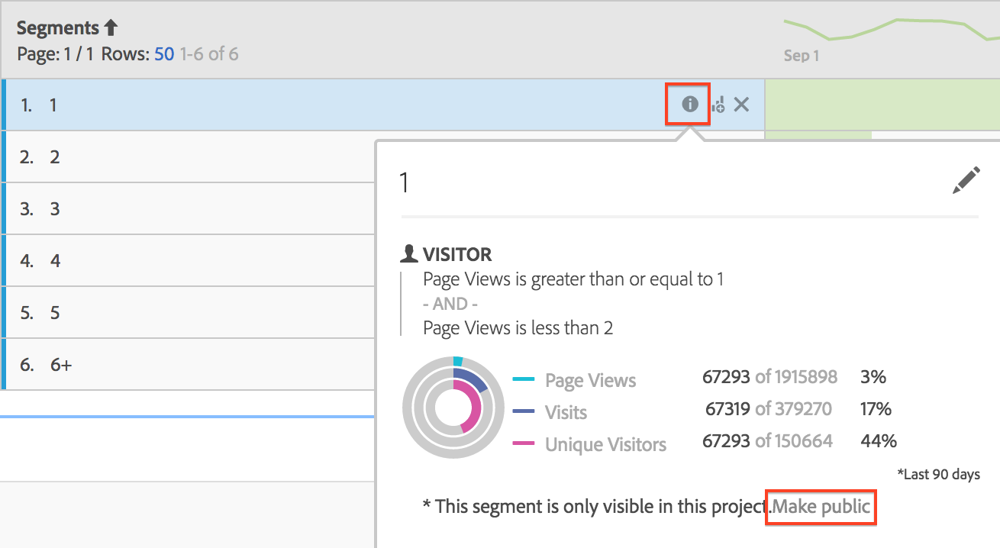

# Histogram {#histogram}

arkdownlint-disable MD034 —>

>[!CONTEXTUALHELP]
>id="workspace_histogram_button"
>title="Histogram"
>abstract="Maak een histogramvisualisatie om de distributie van numerieke gegevens in groepen bereiken weer te geven."

<!-- markdownlint-enable MD034 -->

>[!BEGINSHADEBOX]

_dit artikel documenteert de visualisatie van de Histogram in_  _**Adobe Analytics**._ _zie [ Histogram ](https://experienceleague.adobe.com/en/docs/analytics-platform/using/cja-workspace/visualizations/histogram) voor_  _**Customer Journey Analytics** versie van dit artikel._

>[!ENDSHADEBOX]

Een histogram lijkt op een staafdiagram, maar het groepeert getallen in bereiken (emmers). De analyse automatiseert het &quot;knippen&quot;van aantallen in waaiers, maar u kunt de montages in [ Geavanceerde Montages ](#section_09D774C584864D4CA6B5672DC2927477) veranderen.

Hier volgt een video over het gebruik van histogrammen:

>[!VIDEO](https://video.tv.adobe.com/v/23725/?quality=12)

## Een histogram maken {#section_74647707CC984A1CB6D3097F43A30B45}

Een histogram maken:

1. Klik op **[!UICONTROL Visualizations]** in de linkertrack.
1. Sleep **[!UICONTROL Histogram]** naar het deelvenster.
1. Kies een metrisch teken dat u naar de histogram wilt slepen en klik op **[!UICONTROL Build]** .

>[!NOTE]
>
>Histogrammen ondersteunen alleen standaardmeetwaarden, geen berekende meetwaarden.

Hier hebben we de metagegevens voor paginaweergaven gebruikt voor unieke bezoekers. Het eerste (linker) emmertje komt overeen met een paginaweergave per unieke bezoeker, het tweede emmertje met twee paginaweergaven, enzovoort.

## Geavanceerde instellingen {#section_09D774C584864D4CA6B5672DC2927477}

Als u uw histogram-instellingen wilt aanpassen, klikt u op het pictogram Instellingen (&quot;versnelling&quot;) in de rechterbovenhoek. Hier volgen de instellingen die u kunt wijzigen:

| Histograminstellingen | Wat het doet |
|---|---|
| Emmertje starten | Hiermee bepaalt u met welk emmertje het histogram begint. &quot;1&quot; is de standaardwaarde. U kunt begingetallen instellen van 0 tot oneindig (geen negatieve getallen). |
| Metrische emmertjes | Hiermee kunt u het aantal gegevensbereiken (emmers) vergroten/verkleinen. Het maximumaantal emmers is 50. |
| Grootte van metrisch emmertje | Hiermee kunt u de grootte van elk emmertje instellen. U kunt bijvoorbeeld de emmergrootte wijzigen van de paginaweergave 1 in de weergave van 2 pagina&#39;s. |
| Telmethode | Laat u onder [ Bezoeker ](/help/components/metrics/unique-visitors.md) kiezen, [ Bezoek ](/help/components/metrics/visits.md), of [ Type van Actief ](/help/components/dimensions/hit-type.md). Paginaweergaven per bezoek of pagina per bezoeker of pagina worden bijvoorbeeld weergegeven per hit. Bij Actief wordt &quot;Voorvallen&quot; gebruikt als de metrische y-as in een vrije-vormtabel. |

<!--Russ or Meike - Check Hit Type link above. -->

**Voorbeelden**:

* Startemmertje: 1; Metrische emmers: 5; Metrische Emmergrootte: 2 resulteert in dit histogram: 1-2, 3-4, 5-6, 7-8, 9-10.
* Startemmertje: 0; Metrische emmers: 3; Metrische Emmergrootte: 5 resulteert in dit histogram: 0-4, 5-9, 10-14

## Histogramgegevens weergeven en bewerken {#section_B2CD7CDF0F6B432F928103AE7AAA3617}

Als u de gegevensbron voor het histogramdiagram wilt weergeven of wijzigen, klikt u op de punt naast de kop van het histogram om naar **[!UICONTROL Data Source Settings]** > **[!UICONTROL Show Data Source]** te gaan.

Vooraf gebouwde segmenten die in de lijst verschijnen zijn interne segmenten en zullen niet omhoog in de selecteur van het Segment verschijnen. Klik op het pictogram &quot;i&quot; naast de segmentnaam en klik vervolgens op **[!UICONTROL Make public]** om het segment openbaar te maken.

Om meer manieren te onderzoeken om Vrije gegevenstabellen en andere visualisaties te beheren, zoals het doen van gegevensonderverdelingen, ga [ hier ](https://experienceleague.adobe.com/docs/analytics/analyze/analysis-workspace/visualizations/freeform-analysis-visualizations.html).
