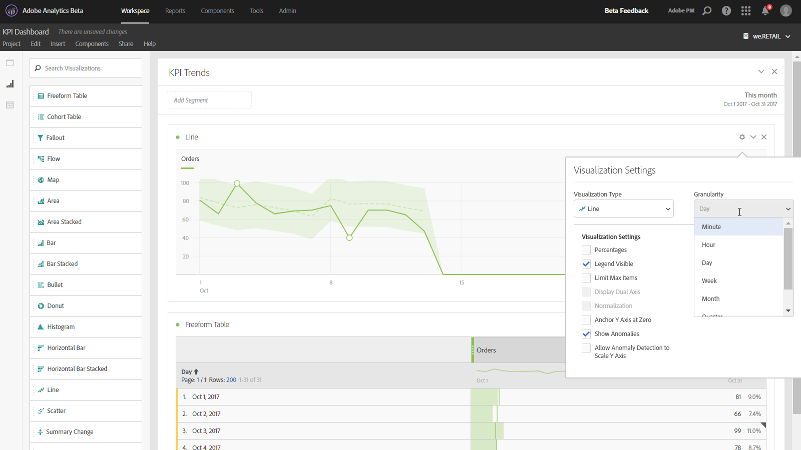

# Lijn

Deze visualisatie vertegenwoordigt metriek gebruikend een lijn om te tonen hoe de waarden over een periode veranderen. Een lijngrafiek kan slechts worden gebruikt wanneer de tijd als afmeting wordt gebruikt.

Met een keuzelijst met granulariteit in de [visualisatie-instellingen](/help/analyze/analysis-workspace/visualizations/freeform-analysis-visualizations.md#section_D3BB5042A92245D8BF6BCF072C66624B) kunt u een trendvisualisatie (bijvoorbeeld lijn, balk) wijzigen van dagelijks naar wekelijks, enz.

