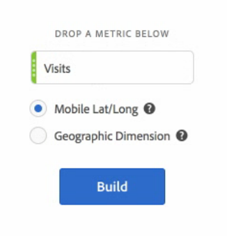
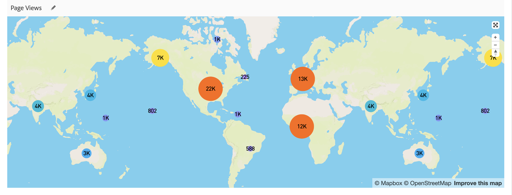

# Kaart

## Overzicht {#section_19F740FAF08D47B1AF1EF239A74FC75C}

De Visualisatie van de Kaart in de Werkruimte van de Analyse

* Hiermee kunt u een visuele kaart van elke metrische waarde (inclusief berekende metriek) maken.
* Is nuttig om metrische gegevens over verschillende geografische gebieden te identificeren en te vergelijken.
* Biedt ondersteuning voor twee gegevensbronnen: breedtegraad/lengtegraad van mobiel gebruik of geografische afmeting voor webgebruik.
* Ondersteuning voor PDF-export.
* Gebruikt WebGL voor beeldvertoning. Als uw grafische stuurprogramma&#39;s geen ondersteuning bieden voor WebGL-rendering, moet u de stuurprogramma&#39;s mogelijk bijwerken.

## Een kaart visualiseren {#section_61BBFA3A7BFD48DA8D305A69D9416299}

1. Sleep vanuit de lijst met visualisaties **[!UICONTROL Map]** naar een deelvenster Vrije vorm:

   

1. Sleep in metrische vorm vanuit de lijst met metriek (inclusief berekende metriek).
1. Geef de gegevensbron op waaruit u wilt tekenen. (Dit dialoogvenster wordt alleen weergegeven als u locatie-tracking hebt ingeschakeld voor gegevens van mobiele apps.)

<table id="table_CD54B433464B4282A7524FB187016C47"> 
 <tbody> 
  <tr> 
   <td colname="col1"> 
<b>Mobiel lang</b> 
 </td> 
   <td colname="col2"> 
Deze optie vertegenwoordigt gegevens van mobiele apps. 
 
Deze optie wordt alleen weergegeven als u deze voor uw rapportsuite hebt ingeschakeld in  Analytics  &gt;  Admin  &gt;  Report Suites  &gt;  &lt;select report suite&gt;  &gt;        Edit Settings &gt; Mobiel beheer &gt; Locatie Tracking activeren. 
 
Dit is de standaardinstelling (als locatie bijhouden is ingeschakeld). 
 </td> 
  </tr> 
  <tr> 
   <td colname="col1"> 
<b>Geografische dimensie </b> 
 </td> 
   <td colname="col2"> 
Deze optie vertegenwoordigt geo segmentatiegegevens over bezoekersplaats die op het IP van de bezoeker adres wordt gebaseerd. Deze gegevens worden omgezet in Land, Regio, en Stad. Merk op dat het niet naar het niveau van de Code DMA of van het Postcode gaat. 
 
Bijna alle rapportsuites hebben deze toegelaten dimensie. Als u dat niet doet, neemt u contact op met de klantenservice van Adobe om geografische rapporten ingeschakeld te laten. 
 </td> 
  </tr> 
 </tbody> 
</table>

1. Klik op **[!UICONTROL Build]**.

   De eerste weergave die je zult zien is een World View met een bubble map, vergelijkbaar met deze.

   

1. U kunt nu

   * **Zoom** in deze kaart om bepaalde gebieden te vergroten door te dubbelklikken op de kaart of door het schuifwiel te gebruiken. De kaart zoomt naar waar u de cursor hebt geplaatst. Via zoominteractie wordt de vereiste afmeting (land > land > plaats) automatisch bijgewerkt op basis van het zoomniveau.
   * **Vergelijk** twee of meer kaartvisualisaties in het zelfde project door hen naast elkaar te plaatsen.
   * **Vergelijking** van de periode-overperiode (zoals jaar-overjaar) weergeven:

      * Negatieve getallen tonen: Als u bijvoorbeeld een metrische waarde uitzet die elk jaar wordt overschreden, kan de kaart -33% weergeven ten opzichte van New York.
      * Met metriek die van type &quot;percenten&quot;zijn, groepert zich het gemiddelde van de percentages samen.
      * Een groen/rood kleurenschema: Positief/negatief
   * **Draai** de kaart in 2D of 3D door de [!UICONTROL Ctrl] sleutel te houden en de kaart te bewegen.

   * **Schakel over** naar een andere weergave, zoals de warmtekaart, met de [instellingen](/help/analyze/analysis-workspace/visualizations/map-visualization.md#section_5F89C620A6AA42BC8E0955478B3A427E) die hieronder worden beschreven. De bellenweergave is de standaardinstelling.

1. **Sla** het project op om alle kaartinstellingen op te slaan (coördinaten, zoomen, roteren).
1. De vrije-vormlijst, onder visualisatie, kan worden bevolkt door in plaatsdimensies en metriek van de linkerspoorstaaf te slepen:

   

## Visualisatie-instellingen toewijzen {#section_5F89C620A6AA42BC8E0955478B3A427E}

Er zijn twee sets instellingen voor Kaart:

Met het **moersleutelpictogram** rechtsboven wordt het eerste dialoogvenster weergegeven waarin u de metrische waarde en de gegevensbron kunt wijzigen:

Als u op het **tandwielpictogram** klikt, worden de volgende visualisatie-instellingen weergegeven:

| Instelling | Beschrijving |
|--- |--- |
| Luchtbellen | Hiermee worden gebeurtenissen geplakt met behulp van bellen. Een bubbelgrafiek is een multi-variabelegrafiek die een kruis tussen een spreidplot en een proportioneel gebiedsgrafiek is. Dit is de standaardweergave. |
| Heatmap | Hiermee worden gebeurtenissen geplakt met een heatmap. Een heatmap is een grafische voorstelling van gegevens waarbij de afzonderlijke waarden in een matrix als kleuren worden weergegeven. |
| Stijlen: Kleurthema | Hiermee geeft u het kleurenschema voor de warmtekaart en luchtbellen weer. U kunt kiezen uit Koraal, Rode tinten, Groene tinten of Vervagen. Standaard is Coral. |
| Stijlen: Type kaart | U kunt kiezen uit Standaard, Streets, Helder, Licht, Donker en Satelliet. |
| Clusterstraal | Hiermee groepeert u gegevenspunten die binnen het opgegeven aantal pixels liggen. De standaardwaarde is 50. |
| Aangepaste maximale waarde | Hiermee kunt u de drempelwaarde voor de maximale waarde voor de kaart wijzigen. Als u deze waarde aanpast, wordt de schaal voor de waarden voor luchtbellen/heatmap (kleur en grootte) aangepast ten opzichte van de aangepaste maximale waarde die is ingesteld. |
