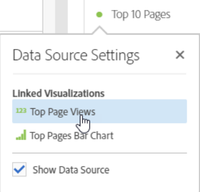

# Databronnen beheren

Door visualisatie te synchroniseren kunt u bepalen welke datatabel of gegevensbron overeenkomt met een visualisatie.

**Tip:** U kunt zien welke visualisaties gerelateerd zijn aan de kleur van de stip naast de titel. Gelijktijdige kleuren betekenen dat visualisaties zijn gebaseerd op dezelfde gegevensbron.

Door een gegevensbron te beheren, kunt u de gegevensbron weergeven of de selectie vergrendelen. Deze instellingen bepalen hoe de visualisatie verandert (of niet verandert) wanneer er nieuwe gegevens binnenkomen.

1. [Een project maken](/help/analyze/analysis-workspace/home.md) met een datatabel en een [visualisatie](/help/analyze/analysis-workspace/visualizations/freeform-analysis-visualizations.md).
1. Selecteer in de gegevenstabel de cellen (gegevensbron) die u aan de visualisatie wilt koppelen.
1. Klik in de visualisatie op de stip naast de titel om de **[!UICONTROL Data Source]** . Selecteren **[!UICONTROL Show Data Source]** of **[!UICONTROL Lock Selection]**.

   

   Als u een visualisatie synchroniseert met een tabelcel, wordt een nieuwe (verborgen) tabel gemaakt en wordt de gesynchroniseerde visualisatie met die tabel gekleurd.

## Gegevensbroninstellingen

Hier volgt een video over deze instellingen:

>[!VIDEO](https://video.tv.adobe.com/v/23729/?quality=12)

| Element | Beschrijving |
| --- | --- |
| Gekoppelde visualisaties | Als er visualisaties zijn die met een vrije vorm of cohortlijst worden verbonden, opent de hoogste linkerpunt om van de aangesloten visualisaties een lijst te maken en een &quot;show&quot;checkbox optie te hebben om de lijst te tonen/te verbergen. Als u de muisaanwijzer boven de gekoppelde visualisatie houdt, gaat u naar de gekoppelde visualisatie. |
| Gegevensbron tonen | Hiermee kunt u (door het selectievakje in te schakelen) of de datatabel die overeenkomt met de visualisatie verbergen (door deze uit te schakelen). |
| Selectie vergrendelen | Schakel deze instelling in om de visualisatie te vergrendelen op de gegevens die momenteel zijn geselecteerd in de corresponderende gegevenstabel. Als deze optie is ingeschakeld, kiest u tussen:<ul><li>**Geselecteerde posities**: Kies deze optie als de visualisatie vergrendeld moet blijven op de posities die zijn geselecteerd in de bijbehorende gegevenstabel. Deze posities zullen zichtbaar blijven, zelfs als de specifieke posten in deze posities veranderen. Kies deze optie bijvoorbeeld als u de vijf belangrijkste campagnemenamen in deze visualisatie altijd wilt weergeven, ongeacht de naam van welke campagne in de bovenste vijf voorkomt.</li><li>**Geselecteerde items**: Kies deze optie als de visualisatie vergrendeld moet blijven op de specifieke items die momenteel zijn geselecteerd in de bijbehorende tabel. Deze items blijven zichtbaar, zelfs als ze een andere positie innemen onder de items in de tabel. Kies deze optie bijvoorbeeld als u in deze visualisatie altijd dezelfde vijf specifieke campagnemenamen wilt weergeven, ongeacht de plaats waar die campagnemenamen staan.</li></ul> |

Deze architectuur verschilt van de vorige omdat Analysis Workspace niet langer een dubbele, verborgen tabel maakt waarin de vergrendelde selectie voor u wordt opgeslagen. De gegevensbron verwijst nu naar de tabel waaruit u de visualisatie hebt gemaakt.

## Voorbeelden van gebruiksgevallen

* U kunt een overzichtsvisualisatie tot stand brengen en het sluiten aan een cel in de lijst u het van creeerde. Wanneer u &quot;Gegevensbron tonen&quot;toelaat, toont het u precies waar deze informatie uit in de lijst komt. De brongegevens worden grijs weergegeven:

   >
* U kunt veel visualisaties toevoegen en deze uit verschillende cellen in dezelfde tabel betrekken, zoals u hier ziet. De tabel is hetzelfde als in het bovenstaande voorbeeld, maar de broncel (en metrisch) zijn anders:

   >
* U kunt zien of er visualisaties zijn die met een vrije vorm of een cohortlijst worden verbonden door de hoogste linkerpunt (de Montages van de Gegevensbron) te klikken. Als u de muis hierboven houdt, wordt de gekoppelde visualisatie weergegeven. En als u erop klikt, gaat u direct naar de gekoppelde visualisatie.

   >
