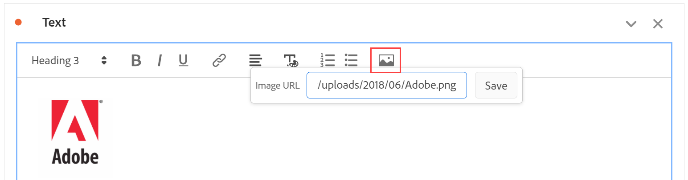

# Tekst {#text-visualization}

>[!CONTEXTUALHELP]
>id="workspace_text_button"
>title="Tekst"
>abstract="Voeg een user-defined rijke tekstvisualisatie aan uw project toe."

<!-- markdownlint-enable MD034 -->

>[!BEGINSHADEBOX]

*Dit artikel documenteert de visualisatie van de Tekst in **Adobe Analytics**.  zie [ Tekst ](https://experienceleague.adobe.com/en/docs/analytics-platform/using/cja-workspace/visualizations/text) voor de **Customer Journey Analytics**versie van dit artikel.*

>[!ENDSHADEBOX]

U kunt door de gebruiker gedefinieerde tekst toevoegen aan uw Workspace-project met behulp van een tekstvisualisatie of een beschrijvingen voor deelvenster/visualisatie (klik met de rechtermuisknop op de kop > **[!UICONTROL Edit description]** ). U kunt ook de opmaak van de tekst wijzigen, hyperlinks toevoegen en afbeeldingen toevoegen.

## Opmaak aanpassen {#format}

Wanneer u het tekstvak of de beschrijving bewerkt, kunt u de tekengrootte (kopniveaus), de kleur, de opmaak (vet, cursief, onderstrepen) en de uitlijning van geselecteerde tekst aanpassen. U kunt ook lijsten met opsommingstekens en nummers toevoegen.

## Hyperlinks toevoegen {#hyperlinks}

Als u een hyperlink wilt toevoegen, markeert u de tekst en klikt u op het hyperlinkpictogram in het menu. De hyperlinks kunnen met externe websites, documentatiepagina&#39;s, [ Workspace projecten/panelen/visualisaties ](https://experienceleague.adobe.com/docs/analytics/analyze/analysis-workspace/curate-share/shareable-links.html) verbinden, en meer om uw projectontvangers verder bij te staan.

## Afbeeldingen toevoegen {#images}

Als u een afbeelding aan uw project wilt toevoegen, klikt u op het afbeeldingspictogram in het menu en voegt u een openbare URL voor de afbeelding in. De afbeeldings-URL moet openbaar toegankelijk zijn, beginnen met `https` en de notatie `.png` , `.jpeg` , `.jpg` of `.gif` hebben. Statische en geanimeerde afbeeldingen worden ondersteund.

