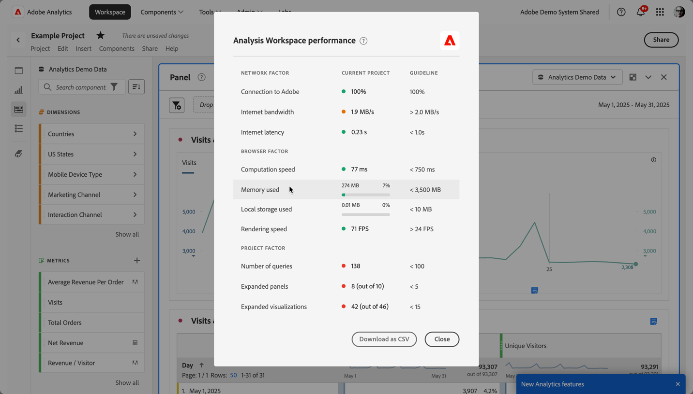

# Analysis Workspace-prestaties optimaliseren

Verschillende factoren beïnvloeden de prestaties van een project in Analysis Workspace.  Om deze factoren te begrijpen, help u om projecten op de meest optimale manier te plannen en te bouwen.

Om insight te winnen voor de prestaties van Analysis Workspace:

1. Selecteer **[!UICONTROL Help]>[!UICONTROL Performance]** .
U kunt een modale dialoog zien die factoren toont die de prestaties van uw project, met inbegrip van netwerk, browser, en projectfactoren beïnvloeden. Voor de nauwkeurigste resultaten, sta het project toe om te laden alvorens u

   * In de kolom **[!UICONTROL Current Project]** worden de resultaten voor uw huidige project en gebruikersomgeving weergegeven.
   * In de kolom **[!UICONTROL Guideline]** wordt de door Adobe aanbevolen drempelwaarde voor elke factor weergegeven.

1. Selecteer **[!UICONTROL Download as CSV]** om het prestatierapport te downloaden, zodat u het rapport kunt delen binnen uw interne organisatie of met Adobe-ondersteuning.

>[!NOTE]
>
>De informatie op de pagina Prestaties varieert telkens wanneer het modaal wordt geopend, aangezien de factoren aan verandering onderworpen zijn. Bovendien blijft Adobe de verstrekte richtlijnen verfijnen wanneer meer gegevens beschikbaar komen.

## Netwerkfactoren

Tot de netwerkfactoren behoren:

| Factor | Definitie | Beïnvloed door | Optimalisatie |
| --- | --- | --- | --- |
| Verbinding met Adobe | Adobe verzendt 10 testaanroepen wanneer de prestatiepagina wordt geopend. Deze vraag vertegenwoordigt het percentage van die vraag aan Adobe die slaagt. | De lokale netwerkkwesties of de kwesties van Adobe beïnvloeden deze factor. | Controleer status.adobe.com om te controleren of er bekende problemen zijn met de service. Vervolgens valideert u uw lokale netwerkverbinding. |
| Internetbandbreedte | Alleen beschikbaar voor Google Chrome. De schatting door uw browser van de bandbreedte op uw locatie. De richtlijn is 2.0 MB/s. | Deze factor is van invloed op uw lokale netwerkverbinding. | Valideer uw lokale netwerkverbinding. |
| Internetlatentie | Adobe verzendt 10 testaanroepen wanneer de prestatiepagina wordt geopend. Deze vraag vertegenwoordigt de hoeveelheid tijd voor elk verzoek om Adobe te bereiken en terug te keren. En zijn een maat voor hoe snel het internet is tussen je locatie en Adobe. De richtlijn is minder dan 1 seconde. | De lokale netwerkkwesties, vele open browser lusjes, of de kwesties van Adobe beïnvloeden deze factor. | Controleer status.adobe.com om te controleren of er bekende problemen zijn met de service. Vervolgens valideert u uw lokale netwerkverbinding en sluit u ongebruikte browsertabbladen. |

## Browserfactoren

Browserfactoren zijn onder andere:

| Factor | Definitie | Beïnvloed door | Optimalisatie |
| --- | --- | --- | --- |
| Rekensnelheid | Hoe snel uw computer een verwerkingstest uitvoert. De hulplijn is minder dan 750 milliseconden. | Deze factor is van invloed op uw hardware en gelijktijdige programma&#39;s. | Open Taakbeheer (PC) of Activiteitencontrole (Mac) van uw computer om te bepalen of programma&#39;s kunnen worden gesloten. Sluit vervolgens ongebruikte browsertabbladen of andere programma&#39;s.    als die acties niet helpen, bespreek hardwaredetails met uw team van IT. |
| Gebruikt geheugen | Alleen beschikbaar voor Google Chrome. Op elk Workspace-tabblad in een Google Chrome-browser wordt in totaal 4 GB geheugen gedeeld. Deze waarde vertegenwoordigt het percentage van die geheugentoelage die door het huidige project wordt verbruikt. De richtlijn is 3500 MB, dat is het punt waarop Workspace begint met het opvangen van geheugenfouten. | Door op meerdere tabbladen te werken of 50000 rijen met gegevens te downloaden, neemt het geheugengebruik toe. | Als er een geheugenfout optreedt, sluit u andere Workspace-tabbladen en/of voert u 50000 rijen uit om deze één voor één te downloaden. |
| Lokale opslag gebruikt | Gegevens worden lokaal op de computer opgeslagen voor gebruik in de browser. Elke oorsprong (bijvoorbeeld experience.adobe.com) heeft een recht van 10MB. | Analysis Workspace gebruikt lokale opslag voor verschillende functies, waaronder voor het opslaan van automatisch opgeslagen (bestaande) projecten, gebruikersinstellingen en functiemarkeringen. | Om ervoor te zorgen dat de functies van Analysis Workspace niet worden verstoord, ontruim lokale opslag voor het experience.adobe.com domein. |
| Rendersnelheid | FPS staat voor frames per seconde. Dit is het aantal keren per seconde dat de browser de pagina op het scherm tekent. 24 FPS is meestal wat het menselijke oog kan waarnemen. Als FPS lager is dan dat, worden er renderingproblemen waargenomen in Workspace. | FPS wordt beïnvloed door multitasking in vele Workspace-projecten tegelijk en door de grootte van het project dat wordt bekeken. Andere programma&#39;s die op uw computer worden uitgevoerd, kunnen van invloed zijn, zoals streaming, achtergrondscanners, enzovoort. Bovendien is deze factor van invloed op uw hardware. | Open Taakbeheer (PC) of Activiteitencontrole (Mac) van uw computer om te bepalen of programma&#39;s kunnen worden gesloten. Sluit vervolgens ongebruikte browsertabbladen of andere programma&#39;s.    als die acties niet helpen, bespreek hardwaredetails met uw team van IT. |

## Projectfactoren

Projectfactoren omvatten:

| Factor | Definitie | Optimalisatie |
| --- | --- | --- |
| Aantal verzoeken | Het totale aantal verzoeken die aan Adobe worden gedaan om gegevens terug te winnen die in het project worden getoond. De vragen omvatten gerangschikte verzoeken om lijsten, anomalieopsporing, sparklines, componenten die in de linkerspoorstaaf worden getoond, en meer. Met deze waarde worden samengevouwen deelvensters en visualisaties uitgesloten. Het richtsnoer is 100. | Vereenvoudig waar mogelijk uw project door gegevens op te splitsen in verschillende projecten die een specifiek doel of een groep belanghebbenden dienen. De markeringen van het gebruik om projecten in thema&#39;s te organiseren, en gebruiken [&#x200B; direct verbindend &#x200B;](/help/analyze/analysis-workspace/curate-share/shareable-links.md) om een interne inhoudstafel tot stand te brengen zodat de belanghebbenden kunnen gemakkelijker vinden wat zij nodig hebben. |
| Uitgebreide deelvensters (van totaal aantal deelvensters) | Het aantal uitgevouwen deelvensters in het totale aantal deelvensters in het project. Het richtsnoer is 5. | Nadat u stappen hebt ondernomen om uw project te vereenvoudigen, vouwt u deelvensters in uw project samen die u niet tijdens het laden hoeft weer te geven. Wanneer het project wordt geopend, slechts worden de uitgebreide panelen verwerkt. Samengevouwen deelvensters worden pas verwerkt wanneer de gebruiker deze uitbreidt. |
| Uitgebreide visualisaties (van totale visualisaties) | Het aantal uitgevouwen tabellen en visualisaties van het totaal in het project, inclusief verborgen gegevensbronnen. Het richtsnoer is 15. | Nadat u stappen hebt ondernomen om uw project te vereenvoudigen, vouwt u visualisaties in uw project samen die niet tijdens het laden hoeven te worden bekeken. Prioriteit geven aan de visuals die het belangrijkst zijn voor de consument van het rapport en ondersteunende beelden zo nodig opsplitsen in een apart, gedetailleerder panel of project. |
| Aantal cellen voor vrije vorm | Het totale aantal cellen van de Freeform- lijst in het project, dat door rijen * kolommen over alle lijsten wordt berekend. Bij deze waarde zijn verborgen gegevensbronnen uitgesloten. Het richtsnoer is 4000. | Verlaag het aantal kolommen in de tabel tot alleen de meest relevante gegevenspunten. Verminder het aantal rijen in uw lijst door het aantal getoonde rijen aan te passen, een lijstfilter toe te passen, of een segment toe te passen. |
| Beschikbare componenten | Het totale aantal componenten dat in de linkerspoorstaaf van het project wordt opgehaald, over alle rapportagesets in het project. Deze waarde beïnvloedt de snelheid waarin de linkerspoorlading en hoe snel onderzoeksresultaten binnen het worden teruggegeven. Het richtsnoer is 2000. | Bespreek met uw productbeheerder of er een virtuele rapportsuite met een meer op maat gemaakte set componenten moet worden gemaakt. |
| Gebruikte componenten | Het totale aantal componenten dat in het project wordt gebruikt. Het richtsnoer is 100. | Het aantal gebruikte componenten is geen directe invloed op de prestaties. De complexiteit van deze componenten draagt echter bij aan de prestaties van het project. Zie optimalisaties in de A [&#x200B; extra factoren &#x200B;](#additional-factors) hieronder sectie. |
| Langste datumbereik | Deze factor toont de langste datumwaaier die in het project wordt gebruikt. Het richtsnoer is één jaar. | Trek waar mogelijk niet meer gegevens in dan u nodig hebt. Versmal de paneelkalender aan de relevante data voor uw analyse. Of gebruik de componenten van het datumbereik in uw vrije-vormlijsten. Datumbereiken die in een tabel worden gebruikt, overschrijven het datumbereik van het deelvenster. U kunt bijvoorbeeld vorige maand, vorige week en gisteren toevoegen aan de tabelkolommen om die specifieke gegevensbereiken aan te vragen. Voor meer informatie bij het werken met datumwaaiers in Analysis Workspace, bekijk [&#x200B; deze video &#x200B;](https://experienceleague.adobe.com/en/docs/analytics-learn/tutorials/analysis-workspace/calendar-and-date-ranges/using-date-ranges-and-comparisons-in-analysis-workspace).    bovendien, minimaliseer het aantal jaar-over-jaar vergelijkingen die in het project worden gebruikt. Wanneer een jaar-over-jaar vergelijking wordt berekend, kijken de berekeningen over de volledige 13 maanden van gegevens tussen de maanden van rente. Deze vergelijking heeft hetzelfde effect als het wijzigen van het datumbereik van het deelvenster in een datumbereik van 13 maanden. |

## Aanvraagfactoren

Aanvraagfactoren

Gebruik het volgende diagram en de termijnen om te leren hoe de verzoeken en de diverse factoren worden verwerkt die verwerkingstijden beïnvloeden:

>[!NOTE]
>
>De geadviseerde richtlijnen voor deze factoren zijn gebaseerd op een ingewikkeldheidsscore van middel voor het melden van verzoeken.

### Verzoek om verwerkingsdiagram

### Verwerkingsvoorwaarden aanvragen

| Factor | Definitie | Optimalisatie |
| --- | --- | --- |
| [!UICONTROL **Gemiddelde verzoektijd**] | De tijd die vereist is vanaf het moment dat het verzoek wordt geïnitieerd tot het moment dat het is voltooid. De richtlijn is 15 seconden. 
In het [&#x200B; verwerken van het Verzoek &#x200B;](#request-processing-diagram) hierboven diagram, vertegenwoordigt de verzoektijd het volledige proces, van **Analysis Workspace verzoek dat** aan **Analysis Workspace verzoek** in werking wordt gesteld.
 |  |
| [!UICONTROL **Langste verzoektijd**] | De tijd die vereist is vanaf het moment dat het verzoek wordt geïnitieerd tot het moment dat het is voltooid. 
In het [&#x200B; verwerken van het Verzoek &#x200B;](#request-processing-diagram) hierboven diagram, vertegenwoordigt de verzoektijd het volledige proces, van **Analysis Workspace verzoek dat** aan **Analysis Workspace verzoek** in werking wordt gesteld.
 |  |
| [!UICONTROL **Gemiddelde raadplegingstijd**] | Omdat Analysis Workspace slechts de knoeiboel voor om het even welke koorden opslaat die in om het even welke segmenten worden gebruikt, telkens als u een project verwerkt, **Lookups** worden uitgevoerd om de knoeiboel met de aangewezen waarden aan te passen. De richtlijn is minder dan 2 seconden.
Deze raadplegingen kunnen een middel-intensief proces, afhankelijk van het aantal waarden zijn die potentieel de knoeiboel zouden kunnen aanpassen. 

In het [&#x200B; verwerken van het Verzoek &#x200B;](#request-processing-diagram) hierboven diagram, wordt de raadplegingstijd vertegenwoordigd in de **Lookups** fase (op het tijdstip van **de verwerkingsfase van de Motor van het Verzoek** fase).
 | Als de verzoeken hier vertragen, is het waarschijnlijk toe te schrijven aan het hebben van teveel koordsegmenten in uw project, of het hebben van koorden met overdreven generische waarden die teveel potentiële gelijken hebben. |
| [!UICONTROL **Gemiddelde rijtijd**] | De totale tijd die in de rij wacht alvorens de verzoeken worden verwerkt. De richtlijn is 5 seconden.
In het [&#x200B; verwerken van het Verzoek &#x200B;](#request-processing-diagram) diagram hierboven, wordt de rijtijd vertegenwoordigd in de **de rij van de Motor van het Verzoek** fase en **de rij van de Server** fase.
 | Als de verzoeken hier vertragen, kan het toe te schrijven zijn aan teveel verzoeken die gelijktijdig in uw organisatie lopen. Probeer het verzoek uit te voeren buiten piektijd. |
| [!UICONTROL **Gemiddelde tijd van de serververwerking**] | De gemiddelde hoeveelheid tijd die nodig is om het verzoek te verwerken.
In het [&#x200B; verwerken van het Verzoek &#x200B;](#request-processing-diagram) hierboven diagram, wordt de gemiddelde tijd van de serververwerking vertegenwoordigd in de **de rij van de Server** fase en **de verwerkingsfase van de Server**. De richtlijn is 10 seconden | Als de verzoeken hier vertragen, is het waarschijnlijk dat het project te lange datumwaaiers of complexe visualisaties heeft. Verkort het datumbereik van uw project om de verwerkingstijd te verkorten. |
| [!UICONTROL **Complexiteit**] | Niet alle verzoeken vereisen de zelfde hoeveelheid tijd om te verwerken. De complexiteit van aanvragen kan u helpen een algemeen idee te geven van de tijd die nodig is om de aanvraag te verwerken. De richtlijn is Medium of lager. 
Mogelijke waarden zijn:
 <ul><li>[!UICONTROL **Laag**]</li><li>[!UICONTROL **Medium**]</li><li>[!UICONTROL **Hoog**]</li></ul>Deze waarde wordt beïnvloed door de waarden in de volgende kolommen:<ul><li>[!UICONTROL **grenzen van de Maand**]</li><li>[!UICONTROL **Kolommen**]</li><li>[!UICONTROL **Segmenten**]</li></ul> |  |
| [!UICONTROL **grenzen van de Maand**] | Het aantal maanden dat in een verzoek is opgenomen. Meer maandgrenzen vergen de complexiteit van het verzoek. De richtlijn is 6 of minder. | Als de verzoeken hier vertragen, kan het zijn omdat de maandgrenzen in uw project te groot zijn. Verlaag het aantal maanden. |
| [!UICONTROL **Kolommen**] | Het aantal metriek en onderverdelingen in het verzoek. Meer kolommen voegen de complexiteit van het verzoek toe. De richtlijn is tien of minder. | Als de verzoeken hier vertragen, kan het zijn omdat er teveel kolommen in uw project zijn. Verminder het aantal kolommen. |
| [!UICONTROL **Segmenten**] | Het aantal segmenten dat op de aanvraag wordt toegepast. Meer segmenten voegen de complexiteit van de aanvraag toe. De richtlijn is 5 of minder. | Als de verzoeken hier vertragen, kan het zijn omdat er teveel segmenten in uw project zijn. Verminder het aantal segmenten. |

## Aanvullende factoren

Aanvullende factoren die niet zijn opgenomen in Help > Prestaties zijn onder andere:

| Factor | Definitie | Beïnvloed door | Optimalisatie |
| --- | --- | --- | --- |
| Complexiteit segment | De ingewikkelde segmenten kunnen een significante invloed op projectprestaties hebben. | De factoren die ingewikkeldheid aan een segment (in dalende orde van effect) toevoegen omvatten: <ul><li>Operatoren van **[!UICONTROL contains]** , **[!UICONTROL contains any of]** , **[!UICONTROL matches]** , **[!UICONTROL starts with]** of **[!UICONTROL ends with]**/ </li><li>Opeenvolgende segmentatie, vooral wanneer dimensiebeperkingen (Within/After) worden gebruikt </li><li>Het aantal unieke dimensie-items binnen de dimensies die in het segment worden gebruikt (bijvoorbeeld Pagina = &#39;A&#39; als Pagina 10 unieke items heeft, is sneller dan Pagina = &#39;A&#39; als Pagina 100000 unieke items heeft).</li><li>Het aantal verschillende gebruikte afmetingen (bijvoorbeeld Pagina = &#39;Home&#39; en Pagina = &#39;Zoekresultaten&#39; zijn sneller dan eVar 1 = &#39;red&#39; en eVar 2 = &#39;blue&#39;)</li><li>Veel OR-operatoren (in plaats van AND)</li><li>Geneste containers die binnen het bereik variëren (bijvoorbeeld Aansluiten binnen bezoekersgroep)</li></ul> | Hoewel sommige van de complexiteitsfactoren niet kunnen worden verhinderd, zoek mogelijkheden om de ingewikkeldheid van uw segmenten te verminderen. Over het algemeen geldt dat hoe specifieker u kunt zijn bij de criteria van uw segment, des te beter. Bijvoorbeeld:<ul><li>Bij containers is het gebruik van één container boven aan het segment sneller dan een reeks geneste containers.</li><li>Met operatoren is **[!UICONTROL equals]** sneller dan **[!UICONTROL contains]** en is **[!UICONTROL equals any of]** sneller dan **[!UICONTROL contains any of]** .</li><li>Met vele criteria, EN zijn de exploitanten sneller dan een reeks van OF exploitanten.</li></ul> Zoek naar mogelijkheden om veel OR-instructies te reduceren tot één **[!UICONTROL equals any of]** -instructie.  [&#x200B; de Classificaties &#x200B;](/help/components/classifications/classifications-overview.md) kunnen ook helpen om vele waarden in beknopte groepen te consolideren waarvan u segmenten kunt dan tot stand brengen. Segmentering op classificatiegroepen biedt prestatievoordelen ten opzichte van segmenten die veel OR-instructies of **[!UICONTROL contains]** -criteria bevatten. |
| Complexiteit van visualisatie (segmenten, meetgegevens, filters) | Het type visualisatie (bijvoorbeeld uitvaltabel versus een vrije-vormtabel) dat op zichzelf aan een project wordt toegevoegd, heeft niet veel invloed op de projectprestaties. De complexiteit van de visualisatie vergroot de verwerkingstijd. | Factoren die complexiteit toevoegen aan een visualisatie zijn:<ul><li>Bereik van gevraagde gegevens</li><li>Aantal toegepaste segmenten; bijvoorbeeld segmenten die worden gebruikt als rijen van een vrije-vormtabel</li><li>Gebruik van complexe segmenten</li><li>[&#x200B; Statische punt &#x200B;](/help/analyze/analysis-workspace/visualizations/freeform-table/column-row-settings/manual-vs-dynamic-rows.md) rijen of kolommen in vrije vormlijsten</li><li>Filters die worden toegepast op rijen in vrije-vormtabellen</li><li>Aantal inbegrepen metriek, vooral berekende metriek die segmenten gebruiken</li></ul> | Als u opmerkt dat uw projecten niet zo snel zoals u zou willen laden, probeer vervangend sommige segmenten met steunen en filters, waar mogelijk.   als u zich voortdurend gebruikend segmenten en berekende metriek voor gegevenspunten vindt die voor uw zaken belangrijk zijn, denk na verbeterend uw implementatie om deze gegevenspunten directer te vangen. Door het gebruik van codes in Adobe Experience Platform en Adobe-verwerkingsregels kunnen wijzigingen in de implementatie snel en eenvoudig worden geïmplementeerd. |
| Grootte van rapportsuite | De hoeveelheid gegevens die in uw rapportsuite wordt verzameld. | - | Raadpleeg uw implementatieteam of een Adobe-expert om te bepalen of er implementatieverbeteringen kunnen worden aangebracht om de algehele ervaring in Adobe Analytics te verbeteren. |
| Gelijktijdige query&#39;s | Het aantal vragen dat tegelijkertijd door uw organisatie wordt aangevraagd. Elke organisatie heeft recht op minimaal vijf gelijktijdige query&#39;s. | Als een rapport lange tijd neemt, zou het rapport in een rij met andere rapporten kunnen zijn. Uw organisatie probeert om vele gezamenlijke verzoeken tegen een specifieke rapportreeks in werking te stellen. De vragen kunnen van API verzoeken, rapporterend UIs (Analysis Workspace, Report Builder), geplande projecten, geplande rapporten, gepland alarm, en gezamenlijke gebruikers komen die het melden verzoeken. | Verspreid uw verzoeken en programma&#39;s voor de rapportreeks gelijkmatiger door de dag. Verplaats uw verzoeken waar mogelijk naar tijden buiten de piek. Maandochtenden, dinsdagochtend en de eerste van elke maand zijn de hoogste rapportagetijden. |

## Tips om de productiviteit in Analysis Workspace te verhogen

>[!BEGINSHADEBOX]

Zie  [&#x200B; Uiteinden om productiviteit &#x200B;](https://experienceleague.adobe.com/en/docs/analytics-learn/tutorials/analysis-workspace/tips-and-tricks/tips-to-increase-productivity-in-analysis-workspace){target="_blank"} voor een demo video te verhogen.

>[!ENDSHADEBOX]

