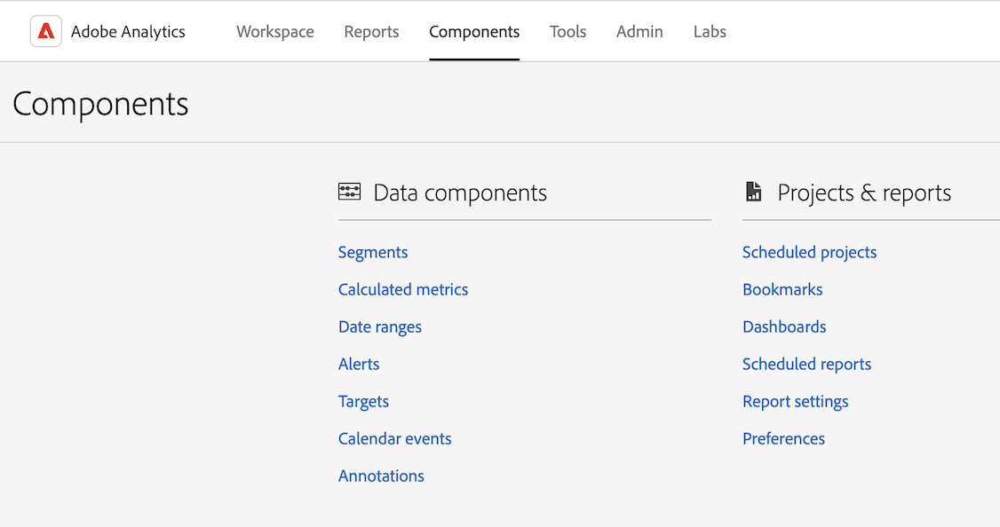
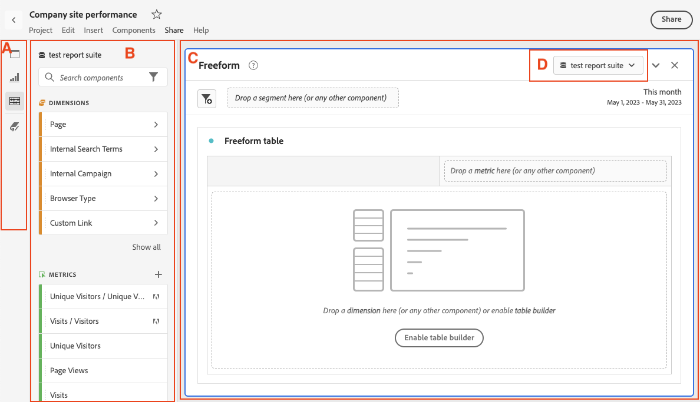

# De interface Analytics begrijpen

De interface van Adobe Analytics bestaat uit de volgende zeer belangrijke gebieden, met inbegrip van lusjes voor het beheren van projecten in Analysis Workspace, het beheren van componenten, hulpmiddelen, en beheerderfuncties.

In de volgende secties wordt elk gebied van Analysis Workspace beschreven:

## Het tabblad Workspace

Op het tabblad [!UICONTROL Workspace] wordt standaard het [!UICONTROL Projects] -gebied weergegeven, waarin de map Company, alle persoonlijke mappen die u hebt gemaakt, uw projecten en mobiele scorecards worden weergegeven.

1. In Adobe Analytics, selecteer [!UICONTROL **Workspace**] tabel.

   

Voor meer informatie over de eigenschappen en de functies beschikbaar op het [!UICONTROL Workspace] lusje, zie [ Adobe Analytics Landing pagina ](/help/analyze/landing.md).

## Tabblad Rapporten

Gebruik het [!UICONTROL **gebied van Rapporten**] in het linkerspoor op [!UICONTROL **Workspace**] tabel. Voor meer informatie, zie *het lusje van Rapporten* in [ Adobe Analytics die pagina ](/help/analyze/landing.md) landt.

## Tabblad Componenten

Het tabblad [!UICONTROL Components] bevat functies die u helpen uw gegevensanalyse af te stemmen en in te schakelen.

1. In Adobe Analytics, selecteer het [!UICONTROL **lusje van Componenten**], dan selecteren [!UICONTROL **Alle componenten**].

   

2. Selecteer om het even welke volgende producteigenschappen om het te vormen:

   | Productfunctie | Functie | Meer informatie |
   |---------|----------|----------|
   | Segmenten | Met Adobe Analytics kunt u krachtige, doelgerichte publiekssegmenten maken, beheren, delen en toepassen op uw rapporten met behulp van de analysemogelijkheden, de Adobe Experience Cloud, Adobe Target en andere producten voor geïntegreerde Adobe. | [Analytics-segmentatie](https://experienceleague.adobe.com/docs/analytics/components/segmentation/seg-home.html) |
   | Berekende cijfers | Berekende en Geavanceerde berekende (of Afgeleide) metriek zijn douanemetriek die u van bestaande metriek kunt tot stand brengen.  Zij staan marketers, productmanagers, en analisten toe om vragen van de gegevens te stellen zonder het moeten de implementatie van Analytics veranderen. | [ Berekende en Geavanceerde Berekende metriek ](https://experienceleague.adobe.com/docs/analytics/components/calculated-metrics/cm-overview.html) |
   | Datumbereiken | Analysis Workspace bevat een lijst met standaarddatumbereiken die gebruikers kunnen gebruiken bij het samenstellen van analyses. Bovendien kunt u aangepaste datumbereiken maken en deze beschikbaar maken voor gebruikers in Analysis Workspace. | [ creeer de waaiers van de douanedatum ](https://experienceleague.adobe.com/docs/analytics/analyze/analysis-workspace/components/calendar-date-ranges/custom-date-ranges.html) <!-- should create an article in the Components Guide for managing/creating date ranges. This article in the Tools Guide needs updating. --> |
   | Virtuele rapportsuites | De virtuele rapportreeksen segmenteren uw gegevens van Adobe Analytics zodat kunt u toegang tot elk segment controleren. | [Overzicht van virtuele rapportsuites](https://experienceleague.adobe.com/docs/analytics/components/virtual-report-suites/vrs-about.html) |
   | Waarschuwingen | Intelligente waarschuwingen maken een gedetailleerdere controle mogelijk op waarschuwingen en integreren de detectie van anomalieën met het waarschuwingssysteem. | [Intelligente waarschuwingen](https://experienceleague.adobe.com/docs/analytics/components/alerts/intellligent-alerts.html) |
   | Annotaties | Met annotaties in Workspace kunt u op effectieve wijze contextuele gegevensnuances en inzichten aan uw organisatie doorgeven. Met deze sjablonen kunt u kalendergebeurtenissen koppelen aan specifieke dimensies en metriek. | [ beheert annotaties ](https://experienceleague.adobe.com/docs/analytics/analyze/analysis-workspace/components/annotations/manage-annotations.html) |
   | Classificatiesets | Classificatiesets bieden één interface voor het beheer van classificaties en regels. 
Een classificatie is een manier om de veranderlijke gegevens van Analytics te categoriseren, dan tonend de gegevens op verschillende manieren wanneer u rapporten produceert. U brengt een relatie tot stand tussen een variabele waarde en metagegevens die betrekking hebben op die waarde. Classificaties kunnen worden gebruikt voor de meeste aangepaste afmetingen, zoals trackingcode, proefdrukken en eVars.
 | [ overzicht van de reeksen van de Classificatie ](https://experienceleague.adobe.com/docs/analytics/components/classifications/sets/overview.html) |
   | Locaties | Als u Adobe Analytics-classificatiegegevens wilt importeren van een cloudbestemming, moet u eerst de locatie toevoegen en configureren waar u de classificatiegegevens wilt verzamelen. U kunt locaties maken, bewerken of verwijderen. | [ de manager van Plaatsen ](https://experienceleague.adobe.com/docs/analytics/components/locations/locations-manager.html) |
   | Geplande projecten | Wanneer het leiden van geplande projecten, kunt u terugkomende projectprogramma&#39;s uitgeven en schrappen; onderzoek naar een programma in de onderzoeksbar of door de filteropties in de linkerspoorstaaf te gebruiken; en filter door markering, goedgekeurde programma&#39;s, eigenaars en meer. | [ Geplande projecten ](/help/components/scheduled-projects-manager.md) |
   | Dashboards | De dashboards worden gecreeerd om metriek te visualiseren en interactieve analytische capaciteit van gegevens te verstrekken. Door op punten binnen een dashboard te klikken, kunt u de gegevens snel en gemakkelijk segmenteren om informatie uit uw analyse af te leiden. 
Dashboards maken deel uit van Data Workbench. Lees meer over de Data Workbench [ verklaring van het Eind van leven ](https://experienceleague.adobe.com/docs/data-workbench/using/eol.html). | [ manager van het Dashboard ](https://experienceleague.adobe.com/docs/analytics/analyze/reports-analytics/dashboard-manage.html) |
   | Geplande rapporten | Gebruikers op beheerniveau kunnen geplande rapporten in de hele organisatie bekijken en beheren. | [Wachtrij voor geplande rapporten](https://experienceleague.adobe.com/docs/analytics/components/scheduled-reports-admin.html) |
   | Rapportinstellingen | Deze instellingen verwijzen naar verouderde Adobe Analytics-producten, waarbij Analysis Workspace en de bijbehorende componenten zijn uitgesloten. Als u de Analysis Workspace-instellingen wilt aanpassen, gaat u naar Componenten > Voorkeuren. |  |
   | Voorkeuren | Beheer instellingen voor Analysis Workspace en de bijbehorende componenten voor alle nieuwe projecten of deelvensters die u maakt. Bestaande projecten en deelvensters worden niet beïnvloed. | [ Voorkeur ](/help/analyze/analysis-workspace/user-preferences.md) |

   {style="table-layout:auto"}

## Gereedschappen, tabblad

<!-- The Tools tab ... -->

1. In Adobe Analytics, selecteer het [!UICONTROL **Hulpmiddelen**] lusje, dan selecteren [!UICONTROL **Alle hulpmiddelen**].

   

2. Selecteer om het even welke volgende producteigenschappen om het te vormen:

   | Productfunctie | Functie | Meer informatie |
   |---------|----------|----------|
   | Data Warehouse | Data Warehouse verwijst naar de kopie van analysegegevens voor opslag en aangepaste rapporten, die u kunt uitvoeren door de gegevens te filteren. 
Met Aanvraagbeheer kunt u aanvragen weergeven, dupliceren en opnieuw de prioriteit geven.
 | [Verzoeken in Data Warehouse beheren](https://experienceleague.adobe.com/docs/analytics/export/data-warehouse/data-warehouse-requests-manage.html) |
   | Activity Map | Activity Map is ontworpen om linkactiviteiten te rangschikken met behulp van visuele overlays en biedt een dashboard met realtime analyses om de betrokkenheid van het publiek van uw webpagina&#39;s te controleren. Het laat u opstelling verschillende meningen om de versnelling van klantenactiviteit visueel te identificeren, marketing initiatieven te kwantificeren, en op publieksbehoeften en gedrag te handelen. | [Overzicht van Activity Map](https://experienceleague.adobe.com/docs/analytics/analyze/activity-map/activity-map.html) |
   | Recommendations Classic | Recommendations is een Adobe Target-functie waarmee automatisch producten, services of inhoud worden weergegeven die voor uw bezoekers interessant kunnen zijn op basis van gebruikersactiviteiten, voorkeuren of andere criteria. | [ Recommendations ](https://experienceleague.adobe.com/docs/target/using/recommendations/recommendations.html) |
   | Zoeken en promoten | Deze functie wordt niet meer ondersteund. |  |
   | Mobiele services | Deze functie wordt niet meer ondersteund. |  |
   | Analysedashboards (mobiele app) | De Adobe Analytics-app voor dashboards biedt altijd en overal inzicht vanuit Adobe Analytics. Via de app kunnen gebruikers intuïtieve scoreborden weergeven die u maakt met de gebruikersinterface van Adobe Analytics-desktops. | De Adobe Analytics-dashboards-app in de iOS App Store- of Google Play-winkel |
   | Report Builder | Adobe Report Builder is een invoegtoepassing voor Microsoft Excel. Hiermee kunt u aangepaste aanvragen maken van Adobe Analytics-gegevens, die u kunt invoegen in uw Excel-werkbladen. De aanvragen kunnen dynamisch verwijzen maar cellen binnen uw werkblad, en u kunt bijwerken en aanpassen hoe Report Builder de data weergeeft. | [ wat is Report Builder?](https://experienceleague.adobe.com/docs/analytics/analyze/report-builder/home.html) |

   {style="table-layout:auto"}

## Tabblad Beheer

Het tabblad Beheer bevat functies en configuratieopties voor het beheer van Adobe Analytics.

1. In Adobe Analytics, selecteer het [!UICONTROL **Admin**] lusje, dan selecteren [!UICONTROL **Alle admin**].

   

2. Selecteer om het even welke volgende producteigenschappen om het te vormen:

   | Productfunctie | Functie | Meer informatie |
   |---------|----------|----------|
   | Analysegebruikers en middelen | Terwijl de meeste gebruiker en de functies van het productbeheer nu beschikbaar slechts in [ Adobe Admin Console ](https://helpx.adobe.com/nl/enterprise/using/admin-console.html) zijn, zijn de administratieve functies om activa van één gebruiker aan een andere over te brengen, evenals het plaatsen van een vervaldatum voor een gebruikersrekening, beschikbaar slechts bij het gebied van Admin van Adobe Analytics. | [ de gebruikersactiva van de Overdracht of de termijnen van de vastgestelde rekening ](https://experienceleague.adobe.com/docs/analytics/admin/admin-tools/user-product-management/users-assets.html) |
   | Migratie van gebruikersnaam | Met de migratie van gebruikers-id&#39;s voor Analytics kunnen beheerders gebruikersaccounts in Analytics User Management eenvoudig migreren naar de Adobe Admin Console. | [ de Migratie van de Gebruiker van Analytics aan Adobe Admin Console ](https://experienceleague.adobe.com/docs/analytics/admin/admin-tools/user-product-management/migrate-users/c-migration-tool.html) |
   | Thuis voor gebruikersbeheer (verouderd) | Gebruiker- en productbeheer is verplaatst naar de Adobe Admin Console. Gebruik de Adobe Admin Console om gebruikersrechten voor Adobe Analytics-gebruikers te gaan beheren. | [ Analytics in Adobe Admin Console ](https://experienceleague.adobe.com/docs/analytics/admin/admin-console/home.html) |
   | Groepen (verouderd) | Groepsbeheer is verplaatst naar de Adobe Admin Console. Gebruik de Adobe Admin Console om groepen voor Adobe Analytics te gaan beheren. | [ Analytics in Adobe Admin Console ](https://experienceleague.adobe.com/docs/analytics/admin/admin-console/home.html) |
   | Toegang tot rapportsuite | De methode voor het verlenen van toegang tot rapportsuite-gereedschappen is verplaatst naar de Adobe Admin Console. Gebruik de Adobe Admin Console om Adobe Analytics-gebruikers toegang tot een rapportsuite te verlenen. | [ de profieltoestemmingen van het Product voor de Hulpmiddelen van de Reeks van het Rapport ](https://experienceleague.adobe.com/docs/analytics/admin/admin-console/permissions/report-suite-tools.html) |
   | Admin Tools home | Het gebied met hulpprogramma&#39;s voor analysebeheer is het belangrijkste gebied voor het beheer van uw Adobe Analytics-instantie. U kunt hiervoor de meeste beheertaken uitvoeren. | [ Overzicht van de hulpmiddelen Admin ](https://experienceleague.adobe.com/docs/analytics/admin/admin-tools/c-admin-tools.html) |
   | Reeksen rapporteren | Hier kunt u de regels definiëren die bepalen hoe gegevens in een rapportsuite worden verwerkt. | [ Manager van de Reeks van het Rapport ](https://experienceleague.adobe.com/docs/analytics/admin/admin-tools/manage-report-suites/report-suites-admin.html) |
   | Analysegebruikers en middelen | Gebruiker- en middelenbeheer is verplaatst naar de Adobe Admin Console. Gebruik de Adobe Admin Console om gebruikersrechten voor Adobe Analytics-gebruikers te gaan beheren. | [ Analytics in Adobe Admin Console ](https://experienceleague.adobe.com/docs/analytics/admin/admin-console/home.html) |
   | Indelingsimporteur | Gebruik de importer om classificaties te uploaden naar Adobe Analytics. U kunt de gegevens ook exporteren voor bijwerken voorafgaand aan het importeren. | [ het overzicht van de importeur van Classificaties ](https://experienceleague.adobe.com/docs/analytics/components/classifications/classifications-importer/c-working-with-saint.html) |
   | Bouwer van classificatieregel | In plaats van elke keer dat uw volgcodes veranderen classificaties te onderhouden en te uploaden, kunt u automatische, op regels gebaseerde classificaties maken en deze op meerdere rapportsuites toepassen. | [Workflow van de Builder voor classificatieregels](https://experienceleague.adobe.com/docs/analytics/components/classifications/classifications-rulebuilder/classification-rule-builder.html) |
   | Gegevensbronnen | Met de gegevensbronmanager kunt u gegevensbronnen maken, bewerken of deactiveren. U kunt deze interface ook gebruiken om de status bij te houden van bestanden die naar FTP-locaties met gegevensbronnen zijn geüpload. | [Databronnen beheren](https://experienceleague.adobe.com/docs/analytics/import/data-sources/manage.html) |
   | Codebeheer | Met Codebeheer kunt u gegevensverzamelingscode downloaden voor web en mobiele platforms | [Code Manager](https://experienceleague.adobe.com/docs/analytics/admin/admin-tools/code-manager-admin.html) |
   | Verkeersbeheer | De pagina van het Beheer van het Verkeer laat u verwachte veranderingen van het verkeersvolume specificeren. Deze montages laten Adobe de aangewezen middelen toewijzen om ervoor te zorgen dat uw verkeer kan worden gevolgd en op tijd worden verwerkt. | [ Overzicht van het verkeersbeheer ](https://experienceleague.adobe.com/docs/analytics/admin/admin-tools/manage-report-suites/edit-report-suite/traffic-management/traffic-management.html) |
   | Gebruik van serveroproepen | Een serveraanroep, ook wel een &quot;hit&quot; of een &quot;verzoek om een afbeelding&quot; genoemd, is een instantie waarin gegevens naar Adobe servers worden verzonden om te worden verwerkt. Een dashboard van het Gebruik van de Vraag van de Server is beschikbaar dat uw gegevens van het de vraagverbruik van de server bijhoudt en het met uw contractuele grens vergelijkt. U kunt waarschuwingen instellen om overgangen te voorkomen. | [ overzicht van het Gebruik van de Vraag van de Server ](https://experienceleague.adobe.com/docs/analytics/admin/admin-tools/server-call-usage/overage-overview.html) |
   | Logboeken | Logbestanden waarmee u kunt zien wanneer gebruikers zich aanmelden, hoe ze deze gebruiken, gebruiken, gebruiken, gebruiken, rapporten met suites en Admin wijzigen. | [Logboeken](https://experienceleague.adobe.com/docs/analytics/admin/admin-tools/logs.html) |
   | Advertising Analytics | Configureer Adobe Analytics om al uw gegevens voor Google en Bing Paid Search naast elkaar weer te geven. | [ vorm Advertising Analytics ](https://experienceleague.adobe.com/docs/analytics/admin/admin-tools/manage-report-suites/edit-report-suite/advertising-analytics-config.html) |
   | Gegevensfeeds | Gegevensfeeds zijn een krachtige manier om onbewerkte gegevens uit Adobe Analytics te halen. Deze onbewerkte gegevens kunnen worden gebruikt op andere platformen buiten de Adobe om naar eigen goeddunken van uw organisatie te worden gebruikt. | [ het Overzicht van het voer van de Gegevens van Analytics ](https://experienceleague.adobe.com/docs/analytics/export/analytics-data-feed/data-feed-overview.html) |
   | Uitsluiten door IP | U kunt gegevens van specifieke IP adressen, zoals interne website activiteiten, plaats het testen en werknemersgebruik, van uw rapporten uitsluiten. Het uitsluiten van gegevens verbetert rapportnauwkeurigheid door IP adresgegevens uit te sluiten. Bovendien, kunt u gegevens uit ontkenning van de dienst of andere kwaadwillige gebeurtenissen verwijderen die rapportgegevens kunnen scheeftrekken. U kunt uitsluiting configureren of uw firewall gebruiken. | [Uitsluiten op IP-adres](https://experienceleague.adobe.com/docs/analytics/admin/admin-tools/exclude-ip.html) |
   | Activity Manager rapporteren | De manager van de Activiteit van de Rapportering laat u de rapporteringscapaciteit voor elke rapportreeks in uw organisatie zien. Het biedt gedetailleerde zichtbaarheid in het rapporteren van verbruik en helpt u om capaciteitsproblemen tijdens piekrapportagetijden eenvoudig te diagnosticeren en te verhelpen. | [ Meldend Manager van de Activiteit ](https://experienceleague.adobe.com/docs/analytics/admin/admin-tools/reporting-activity.html) |
   | Privacy-etikettering voor gegevensbeheer | De gegevens van de het rapportreeks van het etiketteren betekent dat u identiteit, gevoeligheid, en de etiketten van het gegevensbeheer aan elke variabele in een bepaalde rapportreeks toewijst. | [Rapportsuitedata labelen](https://experienceleague.adobe.com/docs/analytics/admin/admin-tools/data-governance/data-labels/gdpr-setup-reportsuite.html) |
   | Bedrijfsinstellingen thuis | De pagina van de Montages van het Bedrijf laat u montages vormen die op alle rapportreeksen van toepassing zijn die door uw organisatie worden beheerd. | [ overzicht van de montages van het Bedrijf ](https://experienceleague.adobe.com/docs/analytics/admin/admin-tools/company-settings/c-company-settings.html) |
   | Beveiligingsmanager | Met Beveiligingsbeheer kunt u de toegang tot rapportgegevens beheren. De opties omvatten sterke wachtwoorden, wachtwoordafloop, IP login beperkingen, en e-maildomeinbeperkingen. | [Security Manager](https://experienceleague.adobe.com/docs/analytics/admin/admin-tools/company-settings/security-manager.html) |
   | Webservices | De API&#39;s van de webservices bieden programmatische toegang tot marketingrapporten en andere suiteservices waarmee u beschikbare functionaliteit in de Analytics-interface kunt dupliceren en uitbreiden. | ](https://experienceleague.adobe.com/docs/analytics/admin/admin-tools/company-settings/web-services-admin.html) de diensten van 0} Web[ |
   | Report Builder | Licentie beheren die is toegewezen aan Report Builder gebruikers. | [Report Builder-rapporten](https://experienceleague.adobe.com/docs/analytics/admin/admin-tools/company-settings/report-builder-reports-admin.html) |
   | Single Sign-On service | Single Sign-On in de Adobe Experience Cloud wordt geïmplementeerd via de Admin Console. | [ Analytics in Adobe Admin Console ](https://experienceleague.adobe.com/docs/analytics/admin/admin-console/home.html) |
   | Rapportagesuites verbergen | Hiermee kunt u rapportsuites verbergen in de Adobe Analytics-gebruikersinterface als u niet langer een rapportsuite voor u en uw gebruikers beschikbaar wilt maken. | [Rapportsuites verbergen](https://experienceleague.adobe.com/docs/analytics/admin/admin-tools/company-settings/c-hide-report-suites.html) |

   {style="table-layout:auto"}

## Analysis Workspace

Met Analysis Workspace kunt u snel analyses maken om inzichten te verzamelen en deze inzichten vervolgens met anderen te delen. Gebruikend belemmering-en-dalings browser interface, kunt u uw analyse amberen, visualisaties toevoegen om gegevens aan het leven te brengen, een dataset in werking te stellen, en projecten met iedereen te delen en te plannen u kiest.

In de volgende afbeelding en de bijbehorende tabel worden enkele van de belangrijkste gebieden in Analysis Workspace toegelicht.

Voor een meer gedetailleerd overzicht van Analysis Workspace, zie [ overzicht van Analysis Workspace ](/help/analyze/analysis-workspace/home.md).

| Locatie in afbeelding | Naam en functie |
|---------|----------|
| A | **Ver linkerspoor:** bevat lusjes voor het toevoegen van panelen, visualisaties, en componenten aan Analysis Workspace. Bevat ook het pictogram Gegevenswoordenboek dat wordt gebruikt om het gegevenswoordenboek te openen. |
| B | **Linkerspoor:** Afhankelijk van welk lusje in de verre linkerspoorlijn wordt geselecteerd, bevat dit gebied individuele panelen, visualisaties, of componenten. |
| C | **Canvas:** dit is het belangrijkste gebied waar u inhoud van de linkerspoorstaven sleept om uw project te bouwen. Het project wordt dynamisch bijgewerkt terwijl u deelvensters, visualisaties en componenten aan het canvas toevoegt. |
| D | **reeks drop-down menu van het Rapport:** voor elk paneel in Analysis Workspace, staat het drop-down menu van de rapportreeks u toe om de rapportreeks te kiezen die u als uw gegevensbron wilt gebruiken. |
