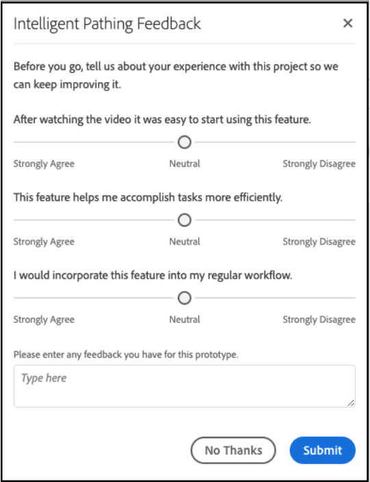

# [!UICONTROL Labs] Gebruikershandleiding

[!UICONTROL Labs] maakt het mogelijk sneller prototypen te maken van ideeën in een vroeg stadium. Het is een combinatie hulpmiddelen en processen die ontwikkeling doorzichtig, met een klantennadruk versnelt. Het staat gebruikers toe om met opkomende technologieën in wisselwerking te staan, waardevolle inzichten te ontdekken, en toekomstige eigenschapontwikkeling en prioriteiten te beïnvloeden. U kunt Labs gebruiken om vroege toegang tot de innovaties van Adobe Analytics te krijgen en om komende eigenschappen binnen de context van uw eigen zaken en gegevens te evalueren.

## Vereisten

[!UICONTROL Labs] wordt automatisch ingeschakeld voor alle beheerders. Andere teamleden moeten contact opnemen met hun productbeheerders en toegang aanvragen.

Als u dit nog niet hebt gedaan, leest u de toepasselijke formulieren voor de geheimhoudingsovereenkomst en de Algemene voorwaarden en bepalingen.

## Toegang krijgen tot [!UICONTROL Labs] Portal

Toegang tot [!UICONTROL Labs]:

1. Als u nog geen toegang hebt tot [!UICONTROL Workspace] en [!UICONTROL Labs], vraag uw beheerder om toestemmingen.

1. Klik op de knop **[!UICONTROL Labs]** tab.

## Een prototype evalueren

Een prototype starten en evalueren:

1. Op de [!UICONTROL Labs] scherm, klikken **[!UICONTROL Launch]** voor het prototype dat u wilt zien. Wanneer het prototype wordt gestart, ziet u de naam linksboven in de prototypeomgeving.

   

1. Bekijk een video die het prototype markeert door op **[!UICONTROL Watch Video]** in de rechterbovenhoek van het scherm. Klikken **[!UICONTROL Close]** wanneer de video is voltooid.

   

1. Werken met het prototype. Wanneer u in de prototypeomgeving werkt:

* Projecten die in de prototypeomgeving zijn gemaakt, kunnen niet worden opgeslagen of gedeeld.

* In een prototype, kunt u de gegevens met om het even welke dimensies, metriek, segmenten en visualisaties evalueren die u anders toegang tot binnen Werkruimte hebt.

* Wijzigingen die u aanbrengt in een prototype, zijn niet van invloed op de gegevensverzameling of -verwerking.

* Wijzigingen die zijn aangebracht door het maken of wijzigen van segmenten, berekende meetwaarden en waarschuwingen blijven aanwezig buiten de prototypeomgeving.

## Feedback geven

1. Klikken **[!UICONTROL Give Feedback]** om feedback te geven in het berichtvenster wanneer u met het prototype werkt.

   

1. Klikken **[!UICONTROL Submit]** om feedback te verzenden.

1. Als u een ander prototype wilt proberen of de prototypeomgeving wilt afsluiten, klikt u op **[!UICONTROL Leave Prototype]** in de rechterbovenhoek van het scherm en voltooi de korte enquête naar het prototype. Eventuele wijzigingen die in een prototypeproject worden aangebracht, gaan verloren wanneer de prototypeomgeving wordt verlaten.

   

1. Klikken **[!UICONTROL Submit]** om terug te keren naar de hoofdportal Voorvertoningen.

## Aanvullende informatie

* Sommige prototypen binnen [!UICONTROL Labs] worden Adobe Analytics-functies, andere wellicht niet. Je feedback geeft de beslissing, dus bekijk de prototypen en laat Adobe weten hoe waardevol je ze vindt.
* Labs is beschikbaar voor alle SKU-rechten.
