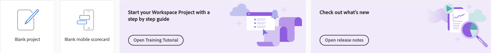

# Adobe Analytics-landingspagina

De landingspagina van Adobe Analytics bevat beide [!DNL Analysis Workspace] en [!DNL Reports & Analytics] (einde van levensduur) in één interface en toegangspunt onder het [!DNL Workspace] paraplu. Het kenmerkt een de homepage van de projectmanager, een bijgewerkt rapportenmenu, gemoderniseerde rapporten, en een het leren sectie om u te helpen met effectiever worden begonnen. Hier volgt een video-overzicht:

>[!VIDEO](https://video.tv.adobe.com/v/334278/?quality=12)

De Adobe Analytics-landingspagina bestaat uit de volgende subtabbladen: Projecten, Rapporten en Leren.

**[!UICONTROL Projects]** zijn aangepaste ontwerpen die gegevenscomponenten, lijsten, en visualisaties combineren die u bouwde of die iemand anders bouwde en met u deelde. [!UICONTROL Projects] verwijst ook naar lege projecten en lege mobiele scorecards.

**[!UICONTROL Reports]** verwijst naar alles wat vooraf is opgebouwd door Adobe, zoals sjablonen in Workspace.

De **[!UICONTROL Learning]** bevat praktische videoverleidingen, zelfstudies en koppelingen naar documentatie.

## Navigeren door de [!UICONTROL Projects] tab {#navigate-projects}

De [!UICONTROL Projects] tab fungeert als de [!UICONTROL Workspace] homepage. Het toont de omslag van het Bedrijf, om het even welke persoonlijke omslagen u creeerde, uw projecten, en Mobiele scorecards. Met deze pagina kunt u mappen, projecten en mobiele scorecards weergeven, maken en wijzigen. Zie voor meer informatie [Over mappen in Analytics](/help/analyze/analysis-workspace/build-workspace-project/workspace-folders/about-folders.md).

>[!NOTE]
>
>Verschillende van de volgende instellingen blijven aanwezig tijdens de sessie en tijdens verschillende sessies. Het geselecteerde tabblad, de geselecteerde filters, de geselecteerde kolommen en de sorteerrichting van de kolom. De zoekresultaten zijn niet blijvend.

### Tabelkolommen aanpassen

Als u kolombreedten wilt aanpassen, sleept u de verticale balk die elke kolom scheidt.

Als u kolommen wilt toevoegen aan of verwijderen uit de lijst met projecten, klikt u op het kolompictogram ( ) in de rechterbovenhoek selecteert of deselecteert u kolomtitels.

De beschikbare kolommen zijn:

| Kolomnaam | Beschrijving |
|---------|----------|
| [!UICONTROL **Naam**] | Identificeert de naam van het project. |
| [!UICONTROL **Type**] | Wijst erop of dit type een project van de Werkruimte, een Mobiele scorecard, of een omslag is. |
| [!UICONTROL **Tags**] | Hiermee worden projecten gecodeerd om ze in groepen te ordenen. |
| [!UICONTROL **Gepland**] | Instellen op [!UICONTROL On] wanneer een project gepland is of [!UICONTROL Off] wanneer dat niet het geval is. Klik op de knop [!UICONTROL On] de verbinding laat u informatie over het geplande project zien. U kunt [de projectplanning bewerken](/help/analyze/analysis-workspace/curate-share/t-schedule-report.md) als u de eigenaar van het project bent. |
| [!UICONTROL **Projectrol**] | Identificeert de projectrollen: of u de projecteigenaar bent en of u toestemmingen hebt om het project uit te geven of te dupliceren. |
| [!UICONTROL **Rapportsuite**] | Identificeert de Reeksen van het Rapport die met het project worden geassocieerd. Tabellen en visualisaties in een deelvenster leiden gegevens af van de rapportsuite die rechtsboven in het deelvenster is geselecteerd. Het rapportpakket bepaalt ook welke componenten in de linkerspoorstaaf beschikbaar zijn. Binnen een project, kunt u één of vele rapportreeksen gebruiken afhankelijk van uw analysegereedschappen. De lijst van rapportsuites wordt gesorteerd op relevantie. Adobe definieert relevantie op basis van hoe recent en vaak de suite door de huidige gebruiker is gebruikt en hoe vaak de suite binnen de organisatie wordt gebruikt. |
| [!UICONTROL **Eigenaar**] | Identificeert de persoon die het project creeerde. |
| [!UICONTROL **Gedeeld met**] | Toont met wie het project momenteel wordt gedeeld. |
| [!UICONTROL **Laatst gewijzigd**] | De datum en het tijdstip waarop het project voor het laatst is gewijzigd. |
| [!UICONTROL **Laatst geopend**] | Identificeert de datum dat een project het laatst werd geopend door de gebruiker die momenteel de pagina van Projecten bekijkt. |
| [!UICONTROL **Laatst gebruikt**] | Helpt te bepalen of een project voor gebruikers in uw organisatie waardevol is door de datum en de tijd te tonen waarop het project het laatst door om het even welke gebruiker binnen de organisatie werd geopend.
Houd rekening met het volgende wanneer u deze kolom weergeeft:
<ul><li>Gebruiksgegevens zijn beschikbaar vanaf september 2023.</li><li>Deze kolom is alleen beschikbaar voor systeembeheerders.</li></ul> |
| [!UICONTROL **Project-id**] | Kan voor het zuiveren projecten worden gebruikt. |
| [!UICONTROL **Langste datumbereik**] | De langere datumwaaiers verhogen projectingewikkeldheid en kunnen verwerking en ladingstijden verhogen. |
| [!UICONTROL **Aantal vragen**] | Het totale aantal verzoeken dat aan Analytics wordt gedaan wanneer het project laadt. Een hoger aantal projectvragen verhoogt projectingewikkeldheid en kan verwerking en ladingstijden verhogen. Deze gegevens zijn alleen beschikbaar nadat een project is geladen of een gepland project is verzonden. |
| [!UICONTROL **Locatie**] | Toont de omslag waar het project wordt gevestigd. |

### Andere elementen UI op de pagina van Projecten

| UI-element | Definitie |
| --- | --- |
| Voorkeuren bewerken | Laat u [!UICONTROL View Tutorials], en [Gebruikersvoorkeuren bewerken](/help/analyze/analysis-workspace/user-preferences.md). |
| [!UICONTROL Create new] | Opent het project modaal waar u een project van de Werkruimte of een Mobiele scorecard kunt tot stand brengen of een bedrijfmalplaatje openen. |
| [!UICONTROL Show less  Meer weergeven] | Hiermee schakelt u tussen het niet weergeven en weergeven van de banner:  |
| [!UICONTROL Workspace project] | Hiermee maakt u een lege [Werkruimteproject](https://experienceleague.adobe.com/docs/analytics/analyze/analysis-workspace/home.html) voor u om te ontwerpen en te bouwen. |
| [!UICONTROL Mobile scorecard] | Hiermee maakt u een lege [mobiele scorecard](https://experienceleague.adobe.com/docs/analytics/analyze/mobapp/curator.html) voor u om te ontwerpen en te bouwen. |
| [!UICONTROL Open Training Tutorial] | Hiermee opent u de zelfstudie Workspace Training die u door het proces begeleidt voor het bouwen van een nieuw startproject in een stapsgewijze zelfstudie. |
| [!UICONTROL Open release notes] | Hiermee opent u het Adobe Analytics-gedeelte van de meest recente Adobe Experience Cloud-releaseopmerkingen. |
| Filterpictogram | Filters op tags, rapportsuites, eigenaars, typen en andere filters (Mijne, Gedeeld met mij, Favorieten en Goedgekeurd) |
| Zoekbalk | Hiermee doorzoekt u alle kolommen in de tabel. |
| Selectievak | Selecteert één of meerdere projecten om de acties van het projectbeheer te tonen u kunt uitvoeren: **Verwijderen**, **Delen**, **Naam wijzigen**, **Kopiëren**, **Ongedaan maken**, **Omhoog**, **Omlaag**, **Tag**, **Goedkeuren**, **CSV exporteren**, en **Verplaatsen naar**. U hebt mogelijk geen machtigingen om alle vermelde handelingen uit te voeren. |
| [!UICONTROL Favorites] | Hiermee voegt u een ster toe naast een favoriet project dat of een favoriete map die als filter kan worden gebruikt. |
| [!UICONTROL Name] | Identificeert de naam van het project. |
| Pictogram Vastzetten | Hiermee worden items vastgezet, zodat ze altijd boven aan de lijst worden weergegeven, maar u kunt de volgorde wijzigen door ze omhoog of omlaag in de volgorde te verplaatsen. Het optiemenu voor ovaal gebruiken en **Omhoog** of **Omlaag verplaatsen** in de lijst. |
| Info (i), pictogram | Toont de volgende informatie over een project: Type, de Rol van het Project, Eigenaar, Beschrijving, en wie het met wordt gedeeld. Het geeft ook aan wie kan [bewerken of dupliceren](https://experienceleague.adobe.com/docs/analytics/analyze/analysis-workspace/curate-share/share-projects.html) dit project. |
| Ovaal (...) | Toont de acties van het projectbeheer u kunt uitvoeren: **Verwijderen**, **Delen**, **Naam wijzigen**, **Kopiëren**, **Ongedaan maken**, **Omhoog**, **Omlaag**, **Tag**, **Goedkeuren**, **CSV exporteren**, en **Verplaatsen naar**. U hebt mogelijk geen machtigingen om alle vermelde handelingen uit te voeren. |
| TONEN: Mappen en projecten voor alle projecten | Hiermee wijzigt u de weergave-instelling in de tabel om mappen en projecten weer te geven volgens uw maporganisatie **of** toon al uw projecten in een ongeorganiseerde lijst. |
| &lt; (Terug) | Keert u aan uw meest recente het landen paginaconfiguratie in een project van de Werkruimte of een rapport terug. De paginasonfiguratie die u had toen u de openingspagina verliet, blijft bestaan wanneer u terugkeert. |

## Navigeren door de [!UICONTROL Reports] tab {#navigate-reports}

De [!UICONTROL Reports] tab consolideert de volgende sets rapporten:

* Vooraf gebouwd [!UICONTROL Workspace] sjablonen die zich eerder onder [!UICONTROL Workspace] > [!UICONTROL Project] > [!UICONTROL New]. Adobe gebruikt in dit verband niet langer het woord &quot;sjabloon&quot;.
* De meeste van de voorgebouwde rapporten in het kader van de vorige Adobe Analytics [!UICONTROL Reports] bovenste menu. Deze rapporten worden nu weergegeven in [Analysis Workspace](https://experienceleague.adobe.com/docs/analytics/analyze/analysis-workspace/home.html).

>[!NOTE]
>
>Houd rekening met het volgende wanneer u rapporten gebruikt:
>* Onder Rapporten, verschijnt een omslag van Favorieten slechts als u een nieuw rapport als favoriet merkt. Er worden geen reeds bestaande rapporten en analytische favorieten overgedragen.
>* Alleen de meest gebruikte rapporten die voorheen waren gegroepeerd in Rapporten en Analyse zijn beschikbaar. Een handvol zelden gebruikte of niet langer relevante rapporten is niet meer beschikbaar. Zie de [Veelgestelde vragen over bestemmingspagina](#landing-page-faq) hieronder voor meer informatie .

Voor meer informatie over het tabblad Rapporten in Analysis Workspace, waaronder het weergeven en opslaan van rapporten, raadpleegt u [Vooraf samengestelde rapporten gebruiken](/help/analyze/analysis-workspace/reports/use-reports.md).

Voor informatie over het creëren van en het beheren van de rapporten van het douanebedrijf, zie [Bedrijfsrapporten maken en beheren](/help/analyze/analysis-workspace/reports/create-company-reports.md).

## Het tabblad Leren gebruiken {#navigate-learning}

De pagina Learning bevat praktische videolessen, zelfstudies en koppelingen naar documentatie.

Gebruik de pagina Leren in Adobe Analytics om beginner, tussenliggende of geavanceerde functies en gebruiksgevallen in Adobe Analytics te leren.

### De pagina Leren openen

1. Selecteer in Adobe Analytics [!UICONTROL **Werkruimte**] > [!UICONTROL **Leren**].

### Pagina-functies leren gebruiken

* **Inhoud filteren:** Met het pictogram Filter in de linkertrack kunt u leerinhoud filteren op ervaringsniveau (Begin, Midden of Geavanceerd) en op inhoudstype (Document, Video, of Tours &amp; tutorials).
* **Voortgang track:** Nadat u inhoud hebt geselecteerd, kunt u een **[!UICONTROL Viewed]** wordt weergegeven. Met deze tag kunt u de voortgang van de leerinhoud volgen. U kunt de **[!UICONTROL Viewed]** -code om deze uit een stuk inhoud te verwijderen.
* **Aanvullende inhoud weergeven:** Selecteer tijdens het weergeven van een video de optie **[!UICONTROL Learn more]** om gerelateerde documentatieinhoud op het Experience League weer te geven. Of selecteer op de pagina Leren een van de volgende opties om aanvullende inhoud weer te geven:
   * **[!UICONTROL Visit YouTube]:** Bekijk de volledige Analysis Workspace YouTube-afspeellijst.
   * [!UICONTROL **Experience League bezoeken**]: Bekijk de volledige suite met Adobe Analytics-documentatie op Experience League.
* **Grondbeginselen voor nieuwe gebruikers:** De [!UICONTROL Workspace Fundamentals] tour wordt aanbevolen voor nieuwe gebruikers. Deze rondleiding neemt u rechtstreeks aan Workspace en begeleidt u door de gemeenschappelijkste acties. Deze rondleiding kan ook op elk gewenst moment opnieuw worden gestart in Workspace via de pop-up voor knopinfo in de koptekst van het deelvenster.

## De openingspagina instellen {#set-landing}

Gebruikers kunnen hun voorkeurspagina voor landen instellen.

1. Ga naar Analytics > [!UICONTROL Components] > [!UICONTROL Preferences] > [!UICONTROL General].
1. Controleren welke landingspagina u het liefst hebt:

   

## Tabblad Rapport verbergen {#hide-reports}

Beheerders kunnen het tabblad Rapporten verbergen voor alle gebruikers binnen hun organisatie.

1. Ga naar [!UICONTROL Analytics] > [!UICONTROL Components] > [!UICONTROL Preferences] > [!UICONTROL Company].
1. Controleren **[!UICONTROL Hide Reports Tab]**.

## Veelgestelde vragen over bestemmingspagina {#landing-faq}

| Vraag | Antwoord |
| --- | --- |
| Waar zijn de malplaatjes die ik aan binnen gewend ben te zien [!UICONTROL Workspace]? | Deze sjablonen worden gegroepeerd onder de [!UICONTROL Reports] tab. |
| Wordt het werk dat ik doe in de interface van het bètaprogramma overgedragen naar de productie? [!UICONTROL Workspace] ervaring? | Ja, al het werk dat in de bètaversie wordt verricht, gaat over naar het oude/huidige [!UICONTROL Workspace] ervaring. |
| Zijn mijn eerdere verslagen en analytische favorieten nog steeds overgebleven? | Nee, ze worden NIET overgedragen. Alle [!UICONTROL Workspace] de projectvoordelen worden overgedragen . |
| Is er een maximum aantal projecten dat ik kan vastzetten? | Nee, er is geen limiet voor het aantal projecten dat u kunt vastzetten. |
| Kunnen beheerders deze bestemmingspagina voor hun gebruikers aanwijzen? | Nee, beheerders kunnen de landingspagina niet aanwijzen namens gebruikers. Individuele gebruikers moeten de schakeloptie zelf inschakelen. |
| Zijn alle rapporten waarin [!DNL Reports & Analytics] nog steeds beschikbaar? | Nee, de volgende rapporten werden geleidelijk afgeschaft, op basis van algemene gebruiksgegevens: <ul><li>Alle aangepaste eVars/props/events/classificaties<li>Mijn aanbevolen rapporten</li><li>Uur/Dagelijks/Wekelijks/Maandelijks/Driemaandelijks/Jaarlijks unieke bezoekers</li><li>DagelijksWekelijks/Maandelijks/Driemaandelijks/Jaarlijks unieke klanten</li><li>Naamdiepte van handeling</li><li>Overzicht van handelsnaam</li><li>Dashboard toevoegen</li><li>Leeftijd</li><li>Audioondersteuning</li><li>Factureringsgegevens</li><li>Klikt op pagina</li><li>Kleurdiepte</li><li>Cookie-ondersteuning</li><li>Cookies</li><li>Verbindingstypen</li><li>Creatieve elementen</li><li>Type creditcard</li><li>Crosssell</li><li>Aangepaste gebeurtenissengordens</li><li>Aangepaste koppelingen</li><li>Klant-id</li><li>Dag van de week</li><li>Naam van handeling item</li><li>Handelingsnaam afsluiten</li><li>Koppelingen afsluiten</li><li>Fallout</li><li>Bestanden downloaden</li><li>Zoeken in winkel</li><li>Volledige paden</li><li>Geslacht</li><li>Hit type VISTA-regel</li><li>Ondersteuning van afbeeldingen</li><li>Java</li><li>JavaScript</li><li>JavaScript-versie</li><li>Bladwijzers beheren</li><li>Dashboards beheren</li><li>Kleurdiepte van monitor</li><li>Monitorresoluties</li><li>Nieuwsbrieven</li><li>Naam van volgende handeling</li><li>Volgende actienaam doorloop</li><li>Null-zoekopdrachten</li><li>Besturingssysteem</li><li>Ordercontrole</li><li>Pagina van dag</li><li>Pagina&#39;s niet gevonden</li><li>Pathfinder</li><li>Padlengte</li><li>Vorige handelsnaam</li><li>Vorige handelsnaam</li><li>Productactiviteit</li><li>Productkosten</li><li>Productafdeling</li><li>Productcategorie</li><li>Productnaam</li><li>Productbeoordelingen</li><li>Productseizoen</li><li>Productaandelen</li><li>Productzoomen</li><li>Opnieuw laden</li><li>Zoekopdrachten</li><li>Servers</li><li>Eén pagina bezoeken</li><li>Verzendgegevens</li><li>Sitehiërarchie</li><li>Sociale opmerkingen</li><li>Tijd van dag</li><li>Tijd besteed aan actienaam</li><li>Video-ondersteuning</li><li>Bezoekerstatus</li></ul> |
