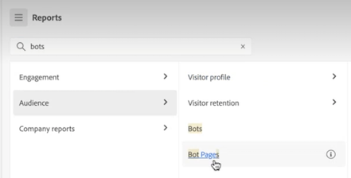

# Adobe Analytics-landingspagina

De landingspagina voor Adobe Analytics brengt zowel Analysis Workspace als Reports &amp; Analytics samen in één interface en toegangspunt onder de Workspace-paraplu. Het kenmerkt een de homepage van de projectmanager, een bijgewerkt rapportenmenu, gemoderniseerde rapporten, en een het leren sectie om u te helpen met effectiever worden begonnen.

>[!IMPORTANT]
>
>Deze landingspagina wordt vanaf 21 juli 2021 in Open Beta weergegeven. Het is een optioneel startpunt. U kunt desgewenst de bestaande openingspagina gebruiken, of dat nu Workspace of Reports is. Als u toch besluit zich aan te melden bij het bètaprogramma, opent u de pagina en klikt u op **[!UICONTROL Provide feedback]** boven aan het scherm om uw feedback en eventuele fouten vast te leggen. U kunt op elk gewenst moment de optie Weigeren of weer deelnemen aan het bètaprogramma. Alle werk dat in de bètagebruikersinterface wordt gedaan, wordt verwerkt in de bestaande/huidige werkruimte.

>[!VIDEO](https://video.tv.adobe.com/v/334278/?quality=12)

## Nieuwe functies voor openingspagina

>[!NOTE]
>
>Deze toevoegingen en wijzigingen zijn momenteel [in beperkte mate testen](/help/release-notes/releases.md).

| Functie | Beschrijving | Schermafbeelding |
| --- | --- | --- |
| Uitbreiden [!UICONTROL Projects] tabel naar volledig scherm | Als u de ruimte voor de tabel wilt vergroten, klikt u op het hamburger-menupictogram. Deze actie zal de linker-spoorlusjes doen ineenstorten. |  |
| Kolombreedte aanpassen | Eerder was de kolombreedte vast. Nu kunt u het aanpassen door het kolomscheidingsteken te slepen. |  |
| Vastgezette items opnieuw ordenen | Als u vastgezette items omhoog en omlaag wilt verplaatsen, klikt u op de ellips naast het vastgezette item en selecteert u[!UICONTROL  Move up] of [!UICONTROL Move down]. |  |
| Nieuwe tabelkolommen | Klik op de knop [!UICONTROL Customize table] aan de rechterbovenhoek van de tabel. De nieuwe tabelkolommen omvatten: <ul><li>**[!UICONTROL Scheduled]**: Instellen op [!UICONTROL On] wanneer een project gepland is of [!UICONTROL Off] wanneer dat niet het geval is. Klik op de knop [!UICONTROL On] de verbinding laat u informatie over het geplande project zien. U kunt ook [de projectplanning bewerken](/help/analyze/analysis-workspace/curate-share/t-schedule-report.md) als u de eigenaar van het project bent.</li><li>**[!UICONTROL Project ID]**: Projectidentiteitskaart kan voor het zuiveren projecten worden gebruikt.</li><li>**[!UICONTROL Longest Date Range]**: De langere datumwaaiers verhogen projectingewikkeldheid en kunnen verwerking en ladingstijden verhogen. </li><li>**[!UICONTROL Number of Queries]**: Een hoger aantal projectvragen verhoogt projectingewikkeldheid en kan verwerking en ladingstijden verhogen.</li></ul> |  |
| Eén klik om een rapport te openen | Eerder moest u dubbelklikken. |  |
| Nieuwe koppelingen naar rapporten en analyserapporten | <ul><li>Rapporten > Publiek > Bots</li><li>Rapporten > Publiek > Bodempagina&#39;s<li>Rapporten > Betrokkenheid > Echt - tijd</li></ul> |  |
| Nieuwe out-of-the-box rapporten | <ul><li>Rapporten > Meest populair > Volgende pagina</li><li>Rapporten > Meest populair > Vorige pagina</li><li>Rapporten > Betrokkenheid > Paginaanalyse > Paginaoverzicht</li></ul>Merk op dat deze rapporten in het formaat van de Werkruimte zijn en configuratie en bouw vereisen. De uitvoer bestaat uit een deelvenster met meetgegevens op hoog niveau, trendgegevens, [!UICONTROL Flow] visualisatie en nog veel meer. U kunt deze rapporten en veranderingsdimensies, afmetingspunten, enz. ook wijzigen. Deze rapporten zijn ook beschikbaar als deelvensters onder Workspace-deelvensters. |  |
| [!UICONTROL Create new] modal is back | Wanneer u op [!UICONTROL Create new] in Workspace, krijgt u opnieuw de keus tussen een Leeg project en een Lege mobiele scorecard. U kunt ook kiezen uit sjablonen die uw bedrijf heeft gemaakt. |  |
| Ook beschikbaar in CJA | Deze openingspagina, in een gewijzigde vorm, zal ook beschikbaar zijn in CJA. |  |

{style=&quot;table-layout:auto&quot;}

## De openingspagina openen {#access-landing}

Nadat u zich bij Adobe Experience Cloud en Analytics hebt aangemeld, schakelt u het [!UICONTROL New landing page - Beta] schakelknop in de linkerbenedenhoek. De toegang tot de knevelknoop is gebruikersspecifiek per organisatie, niet bedrijfspecifiek.

## Menustructuur

* Menu Analyse boven: De meeste rapporten staan nu in de [!UICONTROL Reports] in de linkerspoorstaaf.
* De linkerspoorstaaf heeft drie tabbladen: [!UICONTROL Projects], [!UICONTROL Reports], en [!UICONTROL Learning].

### Terminologie

* **[!UICONTROL Projects]** Dit zijn dingen die u hebt gebouwd of die iemand anders met u heeft gebouwd en gedeeld. [!UICONTROL Projects] verwijst ook naar lege projecten en lege mobiele scorecards.
* **[!UICONTROL Reports]** verwijst naar alles wat vooraf is samengesteld door Adobe, zoals rapporten in Rapporten &amp; Analytics en sjablonen in Workspace.
* **[!UICONTROL Templates]** wordt niet meer gebruikt als een term voor vooraf gebouwde Workspace-projecten met Adobe Ze zijn nu onder [!UICONTROL Reports]. De term [!UICONTROL Templates] wordt nog steeds gebruikt voor sjablonen die uw bedrijf heeft gemaakt.

## Navigeren door de [!UICONTROL Projects] tab {#navigate-projects}

[!UICONTROL Projects] dient als [!UICONTROL Workspace] homepage. Alle Workspace-projecten worden hier weergegeven, inclusief Mobiele scorecards.

>[!NOTE]
>
>Verschillende van de volgende instellingen blijven bestaan (worden onthouden) tijdens de gehele sessie en tijdens verschillende sessies. Voorbeelden: Op welk tabblad u klikt, welke filters zijn geselecteerd, welke kolommen zijn geselecteerd en in welke richting de kolommen worden gesorteerd. De zoekresultaten worden echter niet voortgezet.

| UI-element | Definitie |
| --- | --- |
| ... Meer | Laat u [!UICONTROL View Tutorials], en [Gebruikersvoorkeuren bewerken](/help/analyze/analysis-workspace/user-preferences.md). |
| Project maken | Met het keuzemenu kunt u een [!UICONTROL Workspace project] of [!UICONTROL Mobile project]. |
| Minder/meer tonen | Hiermee schakelt u tussen het niet weergeven en weergeven van de banner:  |
| Leeg project | Hiermee maakt u een lege waarde [Werkruimteproject](https://experienceleague.adobe.com/docs/analytics/analyze/analysis-workspace/home.html?lang=en) zodat u kunt vullen. |
| Lege mobiele scorecard | Hiermee maakt u een lege waarde [mobiele scorecard](https://experienceleague.adobe.com/docs/analytics/analyze/mobapp/curator.html?lang=en) zodat u kunt vullen. |
| Training openen | Hiermee opent u de zelfstudie Workspace-training die nieuwe gebruikers stapsgewijs begeleidt bij het ontwikkelen van een project. |
| Opmerkingen bij de release openen | Hiermee opent u het Adobe Analytics-gedeelte van de meest recente Adobe Experience Cloud-releaseopmerkingen. |
| Filterpictogram | U kunt filteren op tags, rapportsuites, eigenaars, typen en andere filters (Mijne, Gedeeld met mij, Favorieten en Goedgekeurd) |
| Zoekbalk | De zoekopdracht bevat nu alle kolommen in de tabel. |
| Selectievak | Wanneer u op dit vak naast een of meer projecten klikt, worden de projectbeheeracties weergegeven die u kunt uitvoeren: Verwijderen, labelen, Vastzetten, Goedkeuren, Delen, Naam wijzigen, Kopiëren en Exporteren naar CSV. U hebt mogelijk geen machtigingen om al deze handelingen uit te voeren. |
| Favorieten | Als u een project bevoordeelt, wordt er een ster achter geplaatst en wordt het als een favoriet gemarkeerd waarop u kunt filteren. |
| Naam | De naam van het project. |
| Pictogram Vastzetten | Je kunt objecten vastzetten en ze *altijd* boven aan de lijst. |
| Info (i), pictogram | Als u op het pictogram Info klikt, wordt de volgende informatie over dit project weergegeven: Type, de Rol van het Project, Eigenaar, Beschrijving, en wie het met wordt gedeeld. Het geeft ook aan wie kan [bewerken of dupliceren](https://experienceleague.adobe.com/docs/analytics/analyze/analysis-workspace/curate-share/share-projects.html) dit project. |
| Ovaal (...) | Wanneer u op de ellips naast een project klikt, worden de projectbeheeracties weergegeven die u kunt uitvoeren: Verwijderen, labelen, Vastzetten, Goedkeuren, Delen, Naam wijzigen, Kopiëren en Exporteren naar CSV. Mogelijk hebt u geen machtigingen om al deze handelingen uit te voeren. |
| Type | Wijst erop of dit type een project van de Werkruimte of een Mobiele scorecard is. |
| Tags | U kunt rapporten labelen om deze in groepen te ordenen. |
| Projectrol | De rollen van het project verwijzen naar of u de projecteigenaar bent, en of u toestemmingen hebt om het project uit te geven of te dupliceren. |
| Rapportsuite | Tabellen en visualisaties in een deelvenster leiden gegevens af van de rapportsuite die rechtsboven in het deelvenster is geselecteerd. Het rapportpakket bepaalt ook welke componenten in de linkerspoorstaaf beschikbaar zijn. Binnen een project, kunt u één of vele rapportreeksen gebruiken afhankelijk van uw analysegereedschappen. De lijst van rapportsuites wordt gesorteerd op relevantie. Adobe definieert relevantie op basis van hoe recent en vaak de suite door de huidige gebruiker is gebruikt en hoe vaak de suite binnen de organisatie wordt gebruikt. |
| Eigenaar | De persoon die het project heeft gemaakt. |
| Laatst geopend | Toen dit project voor het laatst door u werd geopend. |
| Tabelpictogram aanpassen | (Rechtsboven) Als u kolommen wilt toevoegen aan of verwijderen uit de lijst met projecten, kunt u dit doen door ze te selecteren of te deselecteren. |
| &lt; (Terug) | Deze knoop in een project van de Werkruimte of een rapport neemt u terug naar uw meest recente het landen paginaconfiguratie. De paginasonfiguratie die u had toen u de openingspagina verliet, zal aanhouden wanneer u terugkeert. |

## Navigeren door de [!UICONTROL Reports] tab {#navigate-reports}

De [!UICONTROL Reports] tab consolideert drie sets rapporten:

* Vooraf gebouwd [!UICONTROL Workspace] sjablonen die zich eerder onder [!UICONTROL Workspace] > [!UICONTROL Project] > [!UICONTROL New]. Adobe gebruikt in deze context niet langer het woord &quot;sjabloon&quot;.
* De meeste van de voorgebouwde rapporten in het kader van de vorige Adobe Analytics [!UICONTROL Reports] bovenste menu. Deze rapporten worden nu weergegeven in [Analysis Workspace](https://experienceleague.adobe.com/docs/analytics/analyze/analysis-workspace/home.html?lang=en).
* Alles wat uw bedrijf voor u heeft opgebouwd.

>[!IMPORTANT]
>
>Onder Rapporten, verschijnt een omslag van Favorieten slechts als u een nieuw rapport als favoriet merkt. Er worden geen reeds bestaande rapporten en analytische favorieten overgedragen.

Zoals eerder vermeld, zijn hier alleen de meest gebruikte rapporten die voorheen waren gegroepeerd in Rapporten &amp; Analytics beschikbaar. Een handvol zelden gebruikte of niet langer relevante rapporten werd niet overgezet. Zie de veelgestelde vragen hieronder voor meer informatie.

### Menu&#39;s en submenu&#39;s

Hier zijn de menu&#39;s en hun submenu&#39;s. Als u geen specifiek rapport kunt vinden, doe &quot;Onderzoek op pagina&quot;om het te vinden.

| Menu-item | Rapporten onder dit menu-item |
| --- | --- |
| **[!UICONTROL Most Popular]** | <ul><li>Lesbestand voor training (reeds bestaande werkruimtemalplaatje)</li><li>Pagina&#39;s (Wat zijn mijn bovenste pagina&#39;s?)</li><li>Paginaweergaven (Hoeveel paginaweergaven genereer ik?)</li><li>Bezoeken (Hoeveel bezoeken krijg ik?)</li><li>Bezoekers (Hoeveel bezoekers krijg ik?)</li><li>Belangrijkste metriek (Hoe worden mijn belangrijkste metriek uitgevoerd?)</li><li>Secties van de plaats (Welke secties van mijn plaats produceerden de meeste paginameningen?</li><li>Volgende pagina (Wat zijn de volgende pagina&#39;s waarnaar mijn bezoekers gaan?)</li><li>Vorige pagina (Wat zijn de vorige pagina&#39;s waar mijn bezoekers naartoe zijn gegaan)</li><li>Campagnes (Welke campagnes drijven mijn belangrijkste metriek?)</li><li>Producten (Welke producten drijven mijn belangrijkste metriek?)</li><li>Laatste aanraakkanaal (welk laatste aanraakkanaal presteert het best?</li><li>Laatste aanraakkanaaldetail (Welk specifiek laatste aanraakkanaal presteert meer dan andere?)</li><li>Ontvangsten (Hoe kan ik inkomsten genereren?)</li><li>Bestellingen (Hoe voer ik mijn bestellingen uit?)</li><li>Eenheden (Hoeveel eenheden verkoop ik?)</li></ul> |
| **[!UICONTROL Engagement]** | <ul><li>Belangrijkste metriek (Hoe worden mijn belangrijkste metriek uitgevoerd?)</li><li>Paginaweergaven (Hoeveel paginaweergaven genereer ik?)</li><li>Pagina&#39;s (Wat zijn mijn bovenste pagina&#39;s?)</li><li>Bezoeken (Hoeveel bezoeken krijg ik?)</li><li>Bezoekers (Hoeveel bezoekers krijg ik?)</li><li>Tijd doorgebracht per bezoek (hoeveel tijd besteden mijn gebruikers per bezoek?)</li><li>Tijd voorafgaand aan de gebeurtenis (hoeveel tijd besteden mijn gebruikers voorafgaand aan een succesgebeurtenis)</li><li>Secties van de plaats (Welke secties van mijn plaats produceerden de meeste paginameningen?</li><li>Het verbruik van de inhoud van het Web (Welke inhoud wordt verbruikt het meest en betrekt gebruikers?)</li><li>Het verbruik van media-inhoud (Welke inhoud wordt het meest verbruikt en zijn aantrekkelijke gebruikers?)</li><li>Volgende en vorige paginastroom (Wat zijn/waren de volgende/vorige paden die mijn bezoekers hebben ingenomen/genomen)</li><li>Fallout (Waar zie ik fallout door mijn digitale eigenschappen?)</li><li>Apparaatanalyse (met behulp van apparaatanalyse in Analysis Workspace)</li><li>Het behoud van het Web (Wie zijn mijn loyale gebruikers en wat doen zij?)</li><li>Het audioverbruik van media (Wat zijn trends en hoogste meetwaarden van audioconsumptie?)</li><li>Recente media, frequentie, loyaliteit (Wie zijn mijn loyale lezers?)</li><li>Paginaanalyse > Opnieuw laden (welke pagina&#39;s genereren de meeste herladingen?)</li><li>Paginaanalyse > Tijd besteed aan pagina (Hoeveel tijd besteden mijn gebruikers aan mijn pagina&#39;s?)</li><li>Items en uitgangen > Itempagina&#39;s (Wat zijn mijn bovenste pagina&#39;s?)</li><li>Items en uitgangen > Oorspronkelijke invoerpagina&#39;s (vanaf welke pagina heeft mijn bezoeker oorspronkelijk ingevoerd?)</li><li>Items en uitgangen > Bezoeken op één pagina (welke pagina&#39;s hebben de meeste bezoekers op één pagina gegenereerd?)</li><li>Items en uitgangen > Pagina&#39;s afsluiten (Wat zijn mijn eerste afsluitpagina&#39;s?)</li></ul> |
| **[!UICONTROL Conversion]** | <ul><li>Producten > Producten (Welke producten drijven mijn belangrijkste metriek?)</li><li>Producten > Prestaties van het Product (Welke producten presteren het best?)</li><li>Producten > Categorieën (Wat zijn mijn best presterende productcategorieën?</li><li>Winkelwagentje > Kaarten (Hoeveel gebruikers hebben een product aan winkelwagentje toegevoegd)</li><li>Winkelwagentje > Kart-weergaven (Hoe vaak bekeken mijn bezoekers hun winkelwagentjes?)</li><li>Winkelwagentje > Winkelwagentjes toevoegen (Hoe vaak voegen gebruikers een product toe aan hun winkelwagentje?)</li><li>Winkelwagentje > Winkelwagentjes (Hoe vaak verwijderen gebruikers een product uit hun winkelwagentje?)</li><li>Aankopen > Opbrengsten (Hoe kan ik inkomsten genereren)</li><li>Aankopen > Bestellingen (Hoe voer ik mijn bestellingen uit?)</li><li>Aankopen > Eenheden (hoeveel eenheden verkoop ik?)</li><li>[Magento: handel](https://experienceleague.adobe.com/docs/analytics/analyze/analysis-workspace/build-workspace-project/starter-projects.html?lang=en#commerce)</li></ul> |
| **[!UICONTROL Audience]** | <ul><li>Mensen metrisch (Hoeveel mensen communiceren met mijn merk?)</li><li>Bezoekersprofiel > Overzicht van locatie (Welke locaties drijven het meeste gebruik onder gebruikers)</li><li>Bezoekersprofiel > Geosegmentatie > Geo County&#39;s, Geo US States, Geo Regions, Geo Cities, Geo US DMA (Welke geografische gebieden bezoekt mijn gebruiker?)</li><li>Bezoekersprofiel > Talen (Welke taal hebben mijn gebruikers liever?)</li><li>Bezoekersprofiel > Tijdzones (Welke tijdzones bezoekt mijn gebruiker?)</li><li>Bezoekersprofiel > Domeinen (Welke ISP&#39;s gebruiken mijn bezoekers om mijn site te openen?)</li><li>Bezoekersprofiel > Hoofdniveaudomeinen (Welke domeinen drijven verkeer naar mijn plaats?)</li><li>Bezoekersprofiel > Technologie > Overzicht van technologie (Welke technologieën gebruiken mensen om mijn site te openen?)</li><li>Bezoekersprofiel > Technologie > Browsers, Browsertype, Browserbreedte, Browserhoogte (Welke bedrijfs browser, browserversie en de breedte en hoogte gebruiken mensen om mijn site te openen?)</li><li>Bezoekersprofiel > Technologie > Besturingssysteem, Type besturingssysteem (Welk besturingssysteem en welke versie daarvan worden door mijn bezoekers gebruikt?)</li><li>Bezoekersprofiel > Technologie > Mobiele provider (Welke mobiele dragers gebruiken mijn bezoekers om mijn site te openen?)</li><li>Bezoekersretentie > Terugkeerfrequentie (hoeveel tijd verstrijkt tussen het huidige bezoek van mijn gebruiker en eerdere bezoeken?)</li><li>Bezoekersretentie > Retourbezoeken (Hoeveel van mijn bezoeken retourneren mijn gebruikers?)</li><li>Bezoekersregistratie > Bezoek nummer (tijdens het bezoek aan het getalsegment worden de meeste van mijn belangrijkste meetgegevens geactiveerd)</li><li>Bezoekersbewaring > Verkoop > Klantenloyaliteit (tot welk loyaliteitssegment behoren mijn gebruikers?)</li><li>Bezoekersregistratie > Verkoopcyclus > Dagen voor eerste aankoop (hoeveel dagen zijn verstreken tussen het eerste bezoek van mijn gebruikers en de eerste aankoop?)</li><li>Bezoekersregistratie > Verkoopcyclus > Dagen sinds laatste aankoop (hoeveel dagen zijn verstreken tussen het huidige bezoek van mijn gebruikers en de laatste aankoop? )</li><li>Bezoekersbewaring > Mobiel > Apparaten en apparaattypen (Welke apparaten en apparaattypen gebruiken mijn bezoekers?)</li><li>Bezoekersregistratie > Mobiel > Fabrikant (welke fabrikant van mobiele apparaten gebruikt mijn bezoekers?)</li><li>Bezoekersbehoud > Mobiel > Schermgrootte, Schermhoogte, Schermbreedte (Welke grootte/hoogte/breedte van mobiel scherm hebben mijn bezoekers?)</li><li>Bezoekersfunctie > Mobiel > [Gebruik van mobiele apps](https://experienceleague.adobe.com/docs/analytics/analyze/analysis-workspace/build-workspace-project/starter-projects.html?lang=en#mobile)</li><li>Bezoekersfunctie > Mobiel > [Mobiele app-reizen](https://experienceleague.adobe.com/docs/analytics/analyze/analysis-workspace/build-workspace-project/starter-projects.html?lang=en#mobile)</li><li>Bezoekersfunctie > Mobiel > [Metrische mobiele apps](https://experienceleague.adobe.com/docs/analytics/analyze/analysis-workspace/build-workspace-project/starter-projects.html?lang=en#mobile)</li><li>Bezoekersfunctie > Mobiel > [Mobiele app-berichten](https://experienceleague.adobe.com/docs/analytics/analyze/analysis-workspace/build-workspace-project/starter-projects.html?lang=en#mobile)</li><li>Bezoekersfunctie > Mobiel > [Prestaties van mobiele apps](https://experienceleague.adobe.com/docs/analytics/analyze/analysis-workspace/build-workspace-project/starter-projects.html?lang=en#mobile)</li><li>Bezoekersfunctie > Mobiel > [Behoud van mobiele apps](https://experienceleague.adobe.com/docs/analytics/analyze/analysis-workspace/build-workspace-project/starter-projects.html?lang=en#mobile)</li></ul> |
| **[!UICONTROL Acquisition]** | <ul><li>Marketingkanalen > Eerste aanraakkanaal, Eerste aanraakkanaal detail (Welk eerste aanraakkanaal en welk specifiek eerste aanraakkanaal presteert het beste?)</li><li>Marketingkanalen > Eerste laatste kanaal, Eerste laatste kanaal detail (Welk laatste aanraakkanaal en welk specifiek laatste aanraakkanaal presteert het beste?)</li><li>Campagnes > Campagnes (Welke campagnes drijven mijn belangrijkste metriek?)</li><li>Campagnes > De prestaties van de Campagne (Welke campagnes drijven de meeste opbrengst?)</li><li>Campagnes > Code bijhouden (Welke codes voor het bijhouden van campagnes werken het beste?)</li><li>[Webverwerving](https://experienceleague.adobe.com/docs/analytics/analyze/analysis-workspace/build-workspace-project/starter-projects.html?lang=en#web)</li><li>[Mobiele aanschaf](https://experienceleague.adobe.com/docs/analytics/analyze/analysis-workspace/build-workspace-project/starter-projects.html?lang=en#mobile)</li><li>[Advertising Analytics: betaalde zoekopdracht](https://experienceleague.adobe.com/docs/analytics/analyze/analysis-workspace/build-workspace-project/starter-projects.html?lang=en#advertising)</li><li>Trefwoorden zoeken - alles, betaald, natuurlijk (Welke zoektrefwoorden en trefwoorden voor betaald/natuurlijk zoeken zorgen ervoor dat mijn belangrijkste meetgegevens het beste zijn?)</li><li>Zoekprogramma&#39;s - allemaal, betaald, natuurlijk (Welke zoekprogramma&#39;s en betaalde/natuurlijke zoekprogramma&#39;s drijven mijn belangrijkste maatstaven het beste?)</li><li>Alle zoekpaginanummering (Welke zoekpagina bezoekt mijn gebruiker?)</li><li>Verwijzend domeinen (Welke domeinen drijven verkeer aan mijn plaats?)</li><li>Oorspronkelijke verwijzende domeinen (wat waren de eerste domeingebruikers alvorens mijn plaats te bezoeken?)</li><li>Referors (Aan welke URL&#39;s hebben mijn gebruikers deelgenomen voordat ze naar mijn site hebben geklikt?)</li><li>Typen referenties (tot welke categorie behoren mijn verwijzende URL&#39;s?)</li></ul> |
| **[!UICONTROL Company reports]** | Meldt dat uw bedrijf voor uw gebruik heeft gemaakt. Zie &quot;Een bedrijfsrapport maken&quot; hieronder. |

### Locatie van sjablonen (nu rapporten genoemd)

| Naam van rapport (sjabloon) | Rapportlocatie |
| --- | --- |
| Lesbestand voor training | Populairste > Zelfstudie Training |
| Verbruik van webinhoud | Engagement > Web Content Consumption |
| Verbruik media-inhoud | Engagement > Media Content Consumption |
| Apparaatanalyse | Betrokkenheid > Apparaatanalyse |
| Webinhoud | Betrokkenheid > Behouden web |
| Audioverbruik van media | Betrokkenheid > Audioverbruik van media |
| Recente media, Frequentie, Loyalty | Engagement > Media Recency, Frequency, Loyalty |
| ITP-effect | Betrokkenheid > ITP Impact |
| Productprestaties | Conversie > Producten > Productprestaties |
| Magento: Marketing en handel | Conversie > Magento: Marketing en handel |
| Metrisch met personen | Publiek > Metrische personen |
| Locatieoverzicht | Publiek > Bezoekersprofiel > Locatieoverzicht |
| Overzicht van technologie | Publiek > Bezoekersprofiel > Technologie > Overzicht van technologie |
| Gebruik van mobiele toepassingen | Publiek > Mobiel > Gebruik van mobiele app |
| Mobiele App-reizen | Publiek > Mobiel > Mobiele App-reizen |
| Metrisch voor mobiele apps | Publiek > Mobiel > Mobiele App Messaging |
| Prestaties van mobiele apps | Publiek > Mobiel > Mobiele App Performance |
| Behoud mobiele toepassing | Publiek > Mobiel > Mobiele app Retentie |
| Campagneprestaties | Acquisitie > Campagnes > Campagneprestaties |
| Mobiele overname | Acquisitie > Mobiele overname |
| Web Acquisition | Acquisitie > Web Acquisition |
| Advertising Analytics: Betaalde zoekopdracht | Acquisitie > Advertising Analytics: Betaalde zoekopdracht |

### Het tabblad Rapporten gebruiken

Voor huidige gebruikers van Rapporten &amp; Analytics, hier is een korte inleiding op hoe te om de rapporten te gebruiken u aan en die nu binnen Werkruimte wordt getoond wordt gebruikt. Rapporten fungeren als bestaande sjablonen: als u veranderingen in hen aanbrengt, wordt u ertoe aangezet om uw veranderingen te bewaren/te verwerpen wanneer het navigeren weg of aan een verschillend rapport. En als u veranderingen wilt bewaren, slaat het het rapport als nieuw project op.

1. Ga naar de [!UICONTROL Reports] tab.
1. Selecteer het rapport dat u bijvoorbeeld wilt weergeven onder [!UICONTROL Most popular], selecteert u de [!UICONTROL Pages] verslag.
1. Klik rechts op **[!UICONTROL Open report]**.

   

1. In het rapport Pagina&#39;s, zoals weergegeven in Analysis Workspace, worden twee [visualisatie](/help/analyze/analysis-workspace/visualizations/freeform-analysis-visualizations.md) ([Staafdiagram](/help/analyze/analysis-workspace/visualizations/bar.md) en [Samenvattingsnummer](/help/analyze/analysis-workspace/visualizations/summary-number-change.md)) en [Vrije-vormentabel](/help/analyze/analysis-workspace/visualizations/freeform-table/freeform-table.md). De gebruikte metrische waarde is Voorvallen.
1. Hier hebt u meerdere opties. Hier volgen enkele opties:

   * U kunt het rapport ongewijzigd gebruiken.
   * U kunt een of meer segmenten naar de neerzetzone Segment bovenaan slepen. Sleep bijvoorbeeld het segment [!UICONTROL Mobile Customers] en bekijk de resultaten.
   * U kunt het datumbereik wijzigen door naar de kalender in de rechterbovenhoek te gaan.
   * U kunt afmetingsonderverdelingen toevoegen, in andere metriek slepen, en over het algemeen het rapport aanpassen op om het even welke manier u wenst.

### Een (aangepast) bedrijfsrapport maken

De rapporten van de douane worden genoemd de Rapporten van het Bedrijf en worden gevonden in het menu van de Rapporten van het Bedrijf (zie hieronder). Eerder gemaakte en nieuwe bestanden worden hier weergegeven.

Om een nieuw rapport van het Bedrijf tot stand te brengen,

1. Stel de werkruimte in op de gewenste staat.
1. Open de [!UICONTROL Project] menu en klik op **[!UICONTROL Save as company report…]**.

   

1. Voeg alle gewenste velden toe aan het modaal en sla het op.

   Het rapport wordt toegevoegd aan de lijst van de Rapporten van het Bedrijf en is beschikbaar aan die in uw login bedrijf.

Meer leeropties:

* U hebt linksboven in elk rapport dat u opent, toegang tot een 20-minuten durend video-overzicht van Analysis Workspace.
* Voor nieuwe gebruikers adviseren wij [Lesbestand voor training](https://www.youtube.com/watch?v=lCH1Kl1q9Wk) video die u door het bouwen van een nieuw project loopt.
* Hier is een koppeling naar de [volledige Analysis Workspace-documentatie](/help/analyze/analysis-workspace/home.md).
* Hier is het volledige [YouTube-afspeellijst voor Analysis Workspace](https://www.youtube.com/playlist?list=PL2tCx83mn7GuNnQdYGOtlyCu0V5mEZ8sS).

## Navigeren op het tabblad Leren {#navigate-learning}

De pagina Leren bevat praktische videolessen en zelfstudies, plus koppelingen naar documentatie.

* De [!UICONTROL Workspace Fundamentals] Rondleiding neemt u rechtstreeks naar de werkruimte en doorloopt u de schermindeling Werkruimte en waar u de meest voorkomende acties kunt vinden of uitvoeren. Deze rondleiding kan ook op elk gewenst moment rechtstreeks in Workspace worden gestart via de pop-up voor de knopinfo in de koptekst van het deelvenster.
* Als u op een video/tour klikt, wordt een **[!UICONTROL Viewed]** tag. Met deze tag kunt u de voortgang van de leerinhoud volgen. U kunt op het label klikken en het verdwijnt, voor het geval u de inhoud nog niet hebt voltooid.
* De **[!UICONTROL Learn more]** op de modaal video gaat u naar een Adobe Experience League-documentatiepagina met meer Help-inhoud die betrekking heeft op de video die u net hebt bekeken.  **[!UICONTROL View more videos]** Hiermee gaat u naar de volledige Analysis Workspace YouTube-afspeellijst.

## Veelgestelde vragen over bestemmingspagina {#landing-faq}

| Vraag | Antwoord |
| --- | --- |
| Waar zijn de malplaatjes die ik aan het zien in Werkruimte gewend ben? | Deze sjablonen worden gegroepeerd onder de [!UICONTROL Reports] tab. |
| Kan ik me afmelden voor de bètaversie? | U kunt de bètaversie op elk gewenst moment uitschakelen. |
| Wordt het werk dat ik doe in de interface van het bètaprogramma overgedragen naar de werkruimte voor productie? | Ja, al het werk dat in de bètaversie wordt gedaan, gaat over naar de oude/huidige werkruimte. |
| Zijn mijn huidige rapporten en analytische favorieten overgebleven? | Nee, ze worden NIET overgedragen. Eventuele voordelen van Workspace-projecten worden echter overgedragen. |
| Is er een maximum aantal projecten dat ik kan vastzetten? | Nee, er is geen limiet voor het aantal projecten dat u kunt vastzetten. |
| Kunnen beheerders deze bestemmingspagina voor hun gebruikers aanwijzen? | Nee, beheerders kunnen de bestemmingspagina niet aanwijzen namens gebruikers. Individuele gebruikers moeten de schakeloptie zelf inschakelen. |
| Zijn alle rapporten die momenteel in Rapporten &amp; Analytics bestaan nog beschikbaar? | Nee, de volgende rapporten werden geleidelijk afgeschaft, op basis van algemene gebruiksgegevens: <ul><li>Alle aangepaste eVars/props/events/classificaties<li>Mijn aanbevolen rapporten</li><li>Uur/Dagelijks/Wekelijks/Maandelijks/Driemaandelijks/Jaarlijks unieke bezoekers</li><li>DagelijksWekelijks/Maandelijks/Driemaandelijks/Jaarlijks unieke klanten</li><li>Naamdiepte van handeling</li><li>Overzicht van handelsnaam</li><li>Dashboard toevoegen</li><li>Leeftijd</li><li>Audioondersteuning</li><li>Factureringsgegevens</li><li>Klikt op pagina</li><li>Kleurdiepte</li><li>Cookie-ondersteuning</li><li>Cookies</li><li>Verbindingstypen</li><li>Creatieve elementen</li><li>Type creditcard</li><li>Crosssell</li><li>Aangepaste gebeurtenissengordens</li><li>Aangepaste koppelingen</li><li>Klant-id</li><li>Dag van de week</li><li>Naam van handeling item</li><li>Handelingsnaam afsluiten</li><li>Koppelingen afsluiten</li><li>Uitval</li><li>Bestanden downloaden</li><li>Zoeken in winkel</li><li>Volledige paden</li><li>Geslacht</li><li>Hit Type VISTA-regel</li><li>Ondersteuning van afbeeldingen</li><li>Java</li><li>JavaScript</li><li>JavaScript-versie</li><li>Bladwijzers beheren</li><li>Dashboards beheren</li><li>Kleurdiepte van monitor</li><li>Monitorresoluties</li><li>Nieuwsbrieven</li><li>Naam van volgende handeling</li><li>Volgende actienaam doorloop</li><li>Null-zoekopdrachten</li><li>Besturingssysteem</li><li>Ordercontrole</li><li>Pagina van dag</li><li>Pagina&#39;s niet gevonden</li><li>Pathfinder</li><li>Padlengte</li><li>Vorige handelsnaam</li><li>Vorige handelsnaam</li><li>Productactiviteit</li><li>Productkosten</li><li>Productafdeling</li><li>Productcategorie</li><li>Productnaam</li><li>Productbeoordelingen</li><li>Productseizoen</li><li>Productaandelen</li><li>Productzoomen</li><li>Opnieuw laden</li><li>Zoekopdrachten</li><li>Servers</li><li>Eén pagina bezoeken</li><li>Verzendgegevens</li><li>Sitehiërarchie</li><li>Sociale opmerkingen</li><li>Tijdstip van de dag</li><li>Tijd besteed aan actienaam</li><li>Video-ondersteuning</li><li>Bezoekerstatus</li></ul> |
