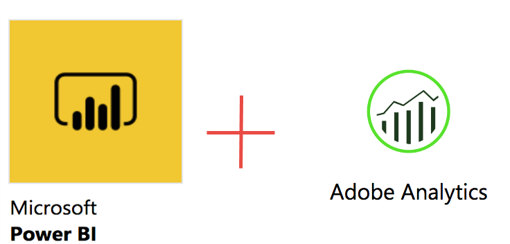
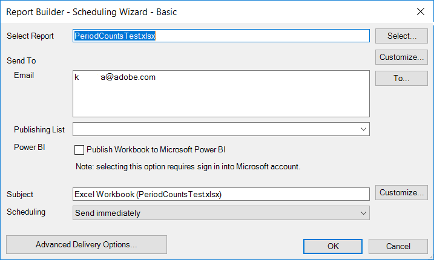
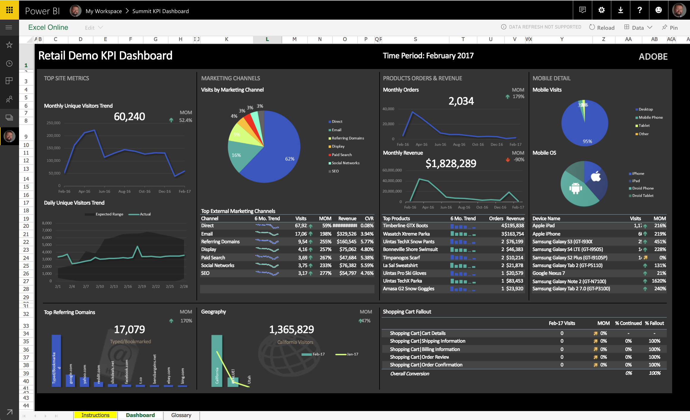
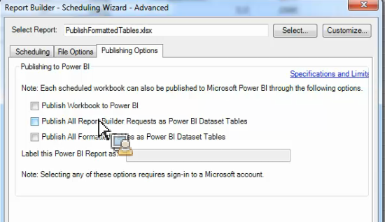
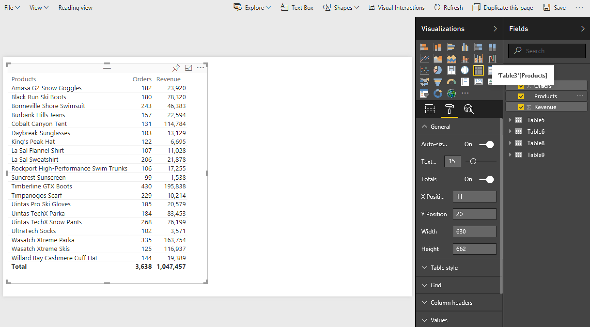
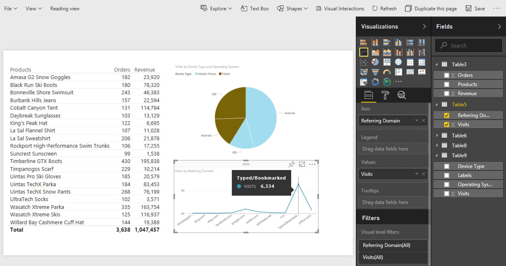

# Publish naar Power BI - Overzicht

{{legacy-arb}}

Microsoft Power BI is een suite van bedrijfsanalytische dashboards om data te analyseren en inzichten te delen. Dankzij de integratie van Adobe Analytics met Power BI kunt u de analytische data van Report Builder visualiseren in Microsoft Power BI en deze eenvoudig delen in uw organisatie.

Als analist, eerder zou u de distributie van het werkboek van de Report Builder gebruikend e-mail of FTP plannen. Nu kunt u uw bedrijfs belanghebbenden toegang geven van binnen hun rekeningen, tot nauwkeurige en bijgewerkte gegevens in een Web-based milieu dat over platforms en apparaten toegankelijk is.

De combinatie van het rapportgenererende vermogen van Report Builder met de visualisatiefuncties van Power BI maakt informatie toegankelijker voor iedereen in uw organisatie. Met Power BI, kunt u Adobe Analytics met andere gegevensbronnen, bijvoorbeeld, verkooppunt, of bronnen van CRM ook integreren, om unieke klanteninzichten, verenigingen, en kansen te ontdekken.

## Systeemvereisten {#section_0B71092D853446F38FA36447DAC0D32B}

* Adobe Report Builder 5.5 [ geïnstalleerd ](/help/analyze/legacy-report-builder/setup/t-install-arb.md)
* Active Microsoft-account waarmee u zich kunt aanmelden bij Power BI

## Publish-werkmap naar Power BI {#section_21CA66229EC240D49594A9A7D3FBA687}

De geplande werkboeken zijn geformatteerde spreadsheets van Excel die met gegevens van Adobe Analytics worden bevolkt die op een regelmatig geplande basis worden verdeeld.

**het werkboek van Publish in Report Builder**

1. In Report Builder, produceer en bewaar een werkboek.
1. Klik op de werkbalk Report Builder op **[!UICONTROL Schedule]** > **[!UICONTROL New]** .

1. Schakel in de wizard Basic Scheduling het vakje naast **[!UICONTROL Publish Workbook to Microsoft Power BI]** in.

   

1. Geef uw e-mail op en verzend deze direct of geef de planningsfrequentie op (per uur, per dag, enz.).
1. Klik op **[!UICONTROL OK]** om te publiceren.
1. U wordt nu gevraagd u aan te melden bij uw Microsoft-account. Geef uw gegevens op.
1. Het werkboek van de Report Builder wordt gepland en gepubliceerd aan Power BI.

   Met elke geplande instantie, en na de Report Builder die proces plant heeft het werkboek met bijgewerkte gegevens van Analytics vernieuwd, zal het werkboek aan de Power BI van Microsoft worden gepubliceerd.

**het werkboekgegevens van de Report Builder van de Mening in Power BI**

1. Dubbelklik in Power BI op het werkboek onder het menu [!UICONTROL Workbooks] .

   

1. U kunt de werkboekdashboardgegevens nu bekijken.  

1. U kunt dan een gebied van dit werkboek vastzetten om het in om het even welk van uw dashboards van Power BI te omvatten.

## Publish alle geformatteerde lijsten in het werkboek als Power BI datasetlijsten {#section_7C54A54E75184DD6BAEF4ACCE241239A}

>[!NOTE]
>
>Als het werkboek een macro bevat, zal &quot;Publish Alle Formatted Lijsten in het Werkboek als Lijsten van de Dataset van de Power BI&quot;worden onbruikbaar gemaakt.

In plaats van het invoeren van het volledige werkboek, kunt u slechts de inhoud van alle geformatteerde lijsten binnen het werkboek invoeren.

**geval van het Gebruik**: U hebt een werkboek van Excel dat gegevens van veelvoudige verzoeken van de Report Builder trekt en tot een summiere lijst met veel formules leidt. U kunt alleen de overzichtstabel importeren in Power BI en er een visualisatie voor maken.

**Publish een geformatteerde lijst in Report Builder**

1. In Report Builder, produceer een lijst van gegevens die een kopbalrij omvat, die door een rij van gegevens wordt gevolgd.
1. Selecteer de tabel en selecteer **[!UICONTROL Format as Table]** in het menu [!UICONTROL Home] . De lijst krijgt genoemd door gebrek (Lijst 1, Lijst 2, enz.), maar u kunt de naam op het [!UICONTROL Design] menu veranderen.

1. Klik op de werkbalk Report Builder op **[!UICONTROL Schedule]** > **[!UICONTROL New]** .

1. Klik in de wizard Basic Scheduling op **[!UICONTROL Advanced Scheduling Options]** .
1. Schakel in [!UICONTROL Scheduling Wizard - Advanced] op de tab **[!UICONTROL Publishing Options]** het vakje naast **[!UICONTROL Publish all Formatted Tables as Power BI dataset tables]** in.

   

1. (Optioneel) U kunt de naam van het gepubliceerde element in Power BI aanpassen. Dit kan nuttig zijn als u versioning als deel van de werkboeknaam (b.v., mijnwerkboek_v1.1.xlsx) gebruikt en u niet het versieaantal in de naam van de gepubliceerde activa van de Power BI wilt tonen. Het heeft het toegevoegde voordeel dat het gepubliceerde element niet verandert als het versienummer verandert. (Bekijk [ specificaties ](/help/analyze/legacy-report-builder/c-publish-power-bi/specifications-limits.md) hier.)

**Mening de lijstgegevens in Power BI**

1. Ga in Power BI naar het menu **[!UICONTROL Workspaces]** > **[!UICONTROL Datasets]** .

   

1. Selecteer de dataset die u publiceerde en klik het [!UICONTROL Create report] pictogram naast het. De tabellen worden weergegeven als velden.

   

1. Selecteer een tabel en de bijbehorende kolommen.

   

1. In het menu [!UICONTROL Visualizations] kunt u opgeven hoe u een tabel in Power BI wilt visualiseren. U kunt er bijvoorbeeld voor kiezen uw gegevens als een lijngrafiek weer te geven:

   

1. Van hier, kunt u visualisaties van deze datasetlijst tot stand brengen.

## Publish all Report Builder request as Power BI Dataset tables {#section_0C26057C7DBB4068A643FDD688F6E463}

U kunt al uw verzoeken in datasetlijsten veranderen en visualisaties bovenop hen bouwen.

>[!IMPORTANT]
>
>Als het werkboek meer dan 100 verzoeken bevat, slechts zullen de eerste 100 verzoeken aan Power BI worden gepubliceerd. Plus, voor elke verzoeken die aan Power BI worden gepubliceerd, slechts zullen de eerste 10.000 rijen van gegevens worden gepubliceerd. Hoewel deze verzoeken via planning met succes worden geleverd, is het bereik van publicatie naar Power BI beperkt.

1. In Report Builder, open of creeer een werkboek met Report Builder verzoeken.
1. Klik op de werkbalk Report Builder op **[!UICONTROL Schedule]** > **[!UICONTROL New]** .

1. Klik in de wizard Basic Scheduling op **[!UICONTROL Advanced Scheduling Options]** .
1. In [!UICONTROL Scheduling Wizard - Advanced], op het **[!UICONTROL Publishing Options]** lusje, controleer het vakje naast **[!UICONTROL Publish all Report Builder Requests as Power BI Dataset Tables]** 

1. Klik op **[!UICONTROL OK]**.

**Mening de verzoekgegevens in Power BI**

Elk gepland verzoek van de Report Builder zal als lijst in de dataset worden gepubliceerd. Elke aanvraagtabel krijgt een naam na de primaire dimensie in de aanvraag en heeft een kolom [!UICONTROL Report Suite] en een kolom [!UICONTROL Segments] .

1. Ga in Power BI naar het menu **[!UICONTROL Workspaces]** > **[!UICONTROL Datasets]** .

1. Selecteer de aanvraag die u hebt gepubliceerd en klik op het pictogram [!UICONTROL Create report] ernaast.

   De aanvragen worden als tabellen weergegeven in het menu [!UICONTROL Fields] .

   

   >[!NOTE]
   >
   >Ongeacht hoe u uw verzoek van de Report Builder om op het aantekenvel (spillay-out, douanelay-out, sommige onzichtbare kolommen) vormde te plaatsen, zal de Report Builder altijd uw verzoek in het zelfde tweedimensionale, enige formaat van de kopbalrij publiceren: Datum, Dimensionen, Metriek, de Reeksen van het Rapport, Segmenten.

1. U ziet ook een extra tabel met de naam **[!UICONTROL Legend]** . Als u een verzoek uit de context van de Report Builder neemt, kan het moeilijk zijn te herinneren waar elk verzoek voor staat. Het doel van de Legende lijst is, bijvoorbeeld, om u de naam van elk verzoek onder Lijst ID te tonen. U kunt ook de andere Legend-kolommen toevoegen voor een volledige weergave van het verzoek.

   
