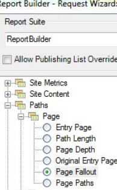

# Filter een Fallout-rapport met de wizard Verzoek

{{legacy-arb}}

Beschrijft de stappen betrokken bij het toepassen van filters op een reserverapport.

In dit voorbeeld wordt het rapport Pagina-uitval weergegeven.

1. Klik in Adobe Report Builder op **[!UICONTROL Create]** om de wizard Verzoek te openen.
1. Selecteer de juiste rapportsuite.
1. Selecteer **[!UICONTROL Paths]** > **[!UICONTROL Page]** > **[!UICONTROL Page Fallout]** in de structuurweergave aan de linkerkant.

   

1. Vorm de aangewezen [ datumwaaiers ](/help/analyze/legacy-report-builder/data-requests/configuring-report-dates/custom-calendar.md).
1. Klik op **[!UICONTROL Next]**.
1. Klik in Stap 2 van de wizard onder **[!UICONTROL Row Labels]** op de koppeling **[!UICONTROL Define Checkpoints]** . (In een uitvalrapport moet u altijd padelementen definiëren, in tegenstelling tot in een padrapport, waarin een patroon vooraf wordt toegepast.)

   

1. Selecteer de optie **[!UICONTROL Filter]** .

1. Definieer in het dialoogvenster **[!UICONTROL Define Site Section Fallout Checkpoints]** controlepunten vanuit een bereik cellen of uit een lijst. Klik vervolgens op **[!UICONTROL OK]** .
1. Bepaal of u een keuze wilt maken uit een reeks cellen of uit een lijst.
1. Als u een keuze maakt in een lijst, klikt u op **[!UICONTROL Add]** om de controlepunten te selecteren die u wilt toevoegen aan het uitvalpad. U kunt tussen 3 en 8 controlepunten definiëren. (Klik op **[!UICONTROL More]** om beschikbare elementen te zoeken.)

   Voor meer informatie bij het raffineren van de filter, zie {de Dimensionen van 0} Filter ](/help/analyze/legacy-report-builder/layout/c-filter-dimensions/filter-dimensions.md).[

1. Ga **[!UICONTROL Available Elements]** van de linkerkolom naar het recht door hen te selecteren en de oranje pijl te klikken.
1. Klik **[!UICONTROL OK]** drie keer en klik vervolgens op **[!UICONTROL Finish]** .

   Het rapport moet nu worden vernieuwd.
