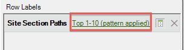
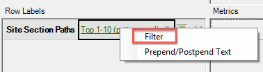

# Een padrapport filteren met de wizard Verzoek

{{legacy-arb}}

Beschrijft de stappen betrokken bij het toepassen van filters op een het knippen rapport.

In dit voorbeeld worden paden naar sitesectie gebruikt.

1. Klik in Adobe Report Builder op **[!UICONTROL Create]** om de wizard Verzoek te openen.
1. Selecteer de juiste rapportsuite.
1. Selecteer **[!UICONTROL Paths]** > **[!UICONTROL Site Sections]** > **[!UICONTROL Site Section Paths]** in de structuurweergave aan de linkerkant.

   

1. Geef de juiste datum of data op.

1. Klik op **[!UICONTROL Next]**.

1. Klik in Stap 2 van de wizard onder **[!UICONTROL Row Labels]** op de koppeling **[!UICONTROL Top 1-10 (pattern applied)]** . In een padrapport wordt standaard een patroon toegepast.

   

1. Selecteer de optie **[!UICONTROL Filter]** .

   

1. In het dialoogvenster **[!UICONTROL Define 'Site Section Paths' Path Pattern]** kunt u
   * De startpositie van het eerste verslag.
   * Het aantal ingangen u in dit rapport wilt tonen.
1. Klik op **[!UICONTROL Edit]** om een padpatroon te definiëren.

1. Als u een aangepast patroon wilt, sleept u **[!UICONTROL Pattern Objects]** uit de lijst links naar de **[!UICONTROL Pattern Build Canvas]** rechts.

   

1. U kunt ook een vooraf gedefinieerd patroon selecteren in de vervolgkeuzelijst **[!UICONTROL Select a Pattern]** en dit wijzigen. Hier volgen de beschikbare patronen:

   

   Sommige van deze patronen gelden specifiek voor Report Builder: Het volgende-itempatroon van het toegangspad, het vorige-itempatroon van het pad afsluiten, het volgende-itempatroon van het pad.

## Een vooraf gedefinieerd patroon bewerken

Nadat u een patroon hebt geselecteerd, kunt u een vooraf gedefinieerd patroon bewerken.

1. Selecteer het patroon in de bovenstaande stappen. Selecteer bijvoorbeeld **[!UICONTROL Exited Site Pattern]** :

   

1. Definieer het pad naar de sitesectie dat de gebruiker volgt voordat deze afsluit. Klik op **[!UICONTROL Specific Item(s): 0 selected]**. U kunt dit pad definiëren door een reeks cellen te selecteren als u een bestaande aanvraag bewerkt of door een selectie te maken in een lijst met secties.

1. Als u wilt selecteren uit een reeks cellen uit een vorige aanvraag, selecteert u **[!UICONTROL From range of cells]** en klikt u op het pictogram van de celkiezer. Kies vervolgens de cellen uit het rapport.

   

1. Selecteer **[!UICONTROL From list]** en klik op **[!UICONTROL Add]** om een gedeelte in de lijst met sitesecties te selecteren.

1. Verplaats elementen van de kolom **[!UICONTROL Available Elements]** naar de kolom **[!UICONTROL Selected Elements]** door deze te selecteren en op de oranje pijl te klikken. De klik **[!UICONTROL OK]**.

   

1. Klik op **[!UICONTROL Save]** om het patroon op te slaan dat u zojuist hebt ingesteld.

1. Klik **[!UICONTROL OK]** drie keer en klik vervolgens **[!UICONTROL Finish]** om het gefilterde pad te genereren.
