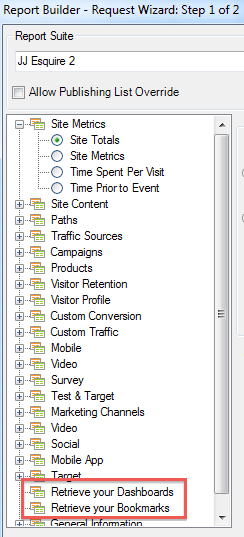

# Gekoppelde rapporten en dashboardrapporten importeren

{{legacy-arb}}

Alle bookmarked rapporten en dashboardrapporten zijn nu vermeld als dimensies in Stap 1 van de Tovenaar van het Verzoek en kunnen als verzoeken van de Report Builder worden ingevoerd.

Wanneer u een bookmarked rapport selecteert, bevolkt de Tovenaar van het Verzoek alle afmetingen en metriek die dit bookmarked rapport bepalen. Het datumbereik, de granulariteit en het geselecteerde segment worden ook bijgewerkt op basis van de geselecteerde bladwijzer.

Dit is hoe Stap 1 van de Tovenaar van het Verzoek een dashboard en zijn rapporten toont:

Wanneer u op **[!UICONTROL Retrieve your Dashboards]** of **[!UICONTROL Retrieve your Bookmarks]** klikt, worden uw bestaande dashboard- en/of bladwijzergegevens opgehaald en in het werkblad geplakt.

>[!NOTE]
>
>Alleen gegevens worden geïmporteerd, dus als de bladwijzer een grafiek bevat of als het dashboardrapport alleen uit een grafiek bestaat, worden alleen de gegevens geïmporteerd die worden gebruikt om de grafiek te vullen.

Zodra u een verzoek door een dashboardrapport (of een referentie) in te voeren hebt gecreeerd, zal het verzoek dan aan de primaire dimensie van het rapport (of van de referentie) worden geassocieerd. Als u de aanvraag bewerkt, wordt in de structuurweergave het knooppunt voor de boomstructuurweergave in het dashboard-rapport (of bladwijzerknooppunt) niet meer geselecteerd: in plaats daarvan wordt de primaire dimensie geselecteerd.

