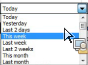

# Interactieve besturingselementen

De interactieve Controles staan u toe om segmenten en datumwaaiers voor één of meerdere verzoeken direct van het aantekenvel uit te geven. Dit geeft u meer flexibiliteit wanneer het bijwerken van verzoeken van de Report Builder.

Interactieve besturingselementen zijn gemaakt als reactie op een algemene workflow waarin analisten werkboeken maken en deze werkboeken delen met de marketingorganisatie. De interactieve controles geven marketers de capaciteit om verzoeken te wijzigen en te verfrissen zonder het moeten diepgaande kennis van hebben hoe de Report Builder werkt. (Merk op dat om een verzoek te verfrissen, de werkboekontvanger een gebruiker van de Report Builder moet zijn.) Deze besturingselementen werken in de geplande werkboeken. Er zijn momenteel twee typen interactieve besturingselementen beschikbaar:

* Roldatumbereik
* Segmenten

>[!IMPORTANT]
>
>De interactieve besturingselementen werken alleen als Report Builder v5.0 is geïnstalleerd. >
>* Als u Microsoft Excel op Vensters in werking stelt maar een lagere versie van Report Builder in werking stelt, of als u geen geïnstalleerde Report Builder hebt: U kunt de waarde in de interactieve controle veranderen, maar het zal niet het bijbehorende verzoek verfrissen, noch de bijbehorende parameters van het verzoek bijwerken.
>* Als u Excel op Mac in werking stelt, zal het veranderen van de waarde in de controle het volgende bericht veroorzaken om worden getoond: &quot;De macro &quot;Adobe.ReportBuilder.Bridge.FormControlClick.Event&quot;kan niet worden gevonden.&quot;
>

>[!WARNING]
>
>Wijzig de naam van het besturingselement niet. (Om de naam te zien, plaats de nadruk op de controle en de controlenaam verschijnt net boven het net van Excel, in de hogere linkerhoek.)

## Interactief besturingselement voor datumbereik implementeren {#section_39B228F2D2C44985863D31424C953280}

1. In Stap 1 van de Tovenaar van het Verzoek selecteer, bijvoorbeeld, het **[!UICONTROL Page]** rapport.
1. Klik naast de vervolgkeuzelijst **[!UICONTROL Commonly Used Dates]** op het pictogram **[!UICONTROL Control Settings]** :

   

1. Selecteer in het dialoogvenster Instellingen voor besturing alle datumbereikitems die u wilt weergeven in het interactieve besturingselement. Bovendien specificeer de hogere linkercelplaats van de controle.

   

1. Let op de optie &quot;Gekoppelde aanvragen automatisch vernieuwen bij selectie van item&quot;.

   * Als deze optie is ingeschakeld, worden alle aanvragen die gebruikmaken van dit besturingselement vernieuwd.
   * Als niet gecontroleerd, worden de bijbehorende verzoekparameters bijgewerkt, maar het verzoek wordt niet verfrist.

1. Klik op **[!UICONTROL OK]**. Het besturingselement wordt weergegeven op de cellocatie die u hebt opgegeven:

1. U kunt nu het datumbereik wijzigen en de aanvraag wordt vernieuwd met dat datumbereik.

   

1. U kunt de aanvraag ook kopiëren en met de rechtermuisknop klikken om een van de twee opties voor Aanvraag plakken te gebruiken:

   * **[!UICONTROL Paste Request]** > **[!UICONTROL Use Absolute Input Cell]** . Dit betekent dat het gekopieerde verzoek naar dezelfde interactieve besturingselement voor datumbereik verwijst als het oorspronkelijke verzoek.

   * **[!UICONTROL Paste Request]**> **[!UICONTROL Use Relative input Cell]** . Dit betekent dat het gekopieerde verzoek naar zijn eigen controle zal verwijzen.

     >[!NOTE]
     >
     >U kunt de native Microsoft Excel-besturingsfuncties Knippen/Kopiëren/Plakken gebruiken. De bouwer van het rapport herkent automatisch de onlangs toegevoegde controles.

## Interactief segmentbesturingselement implementeren {#section_5003D3F724644280BF1BCD6E1B0CB784}

Het uitvoeren van de interactieve segmentcontrole is gelijkaardig aan het uitvoeren van de controle van de datumwaaier.

1. In Stap 1 van de Tovenaar van het Verzoek, naast de **[!UICONTROL Segment]** drop-down lijst, selecteer het pictogram van de Montages van de Controle van het Segment:

   

1. Selecteer in het dialoogvenster Instellingen segmentbeheer de segmenten die u wilt opnemen in de vervolgkeuzelijst. Bovendien specificeer de hogere linkercelplaats van de controle.

   

1. De nieuwe interactieve controle zal nu in het werkboek verschijnen:

   
