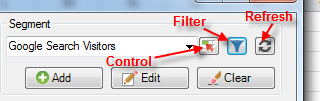
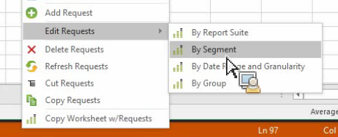

# Segmenten beheren

{{legacy-arb}}

Adobe Analytics-segmenten toevoegen, bewerken, toepassen en filteren in Report Builder.

Report Builder heeft een segmentatiepaneel in Stap 1 van de wizard Verzoek waarmee u segmenten kunt maken en beheren.

## Segmenten toevoegen of bewerken {#section_B2BC136F9A53498D90C7C2ECC5DB892B}

>[!NOTE]
>
>Om segmenten toe te voegen of uit te geven, lanceert de het segmentbouwer van Report Builder in een venster van Microsoft Internet Explorer. Je Report Builder-sessie blijft actief. Andere browsers dan Internet Explorer worden niet ondersteund voor deze bewerking.

1. Klik in het segmentpaneel van Stap 1 van de wizard Verzoek op **[!UICONTROL Add]** .
1. Een venster van Internet Explorer lanceert dat de interface van de Bouwer van het Segment van de Analyse opent. Voor informatie over hoe te om segmenten te bouwen, verwijs naar [ segmentatie van Analytics ](/help/components/segmentation/seg-home.md).
1. Nadat u het segment hebt bepaald en bewaard, ga terug naar de Tovenaar van het Verzoek.
1. Klik het Refresh pictogram om de segmentlijst te verfrissen.

>[!IMPORTANT]
>
>Deze lijst wordt in het cachegeheugen opgeslagen en het nieuwe segment wordt alleen weergegeven als u een vernieuwingsbewerking uitvoert.

## In-context-segmenten maken {#section_6DD2C663B2854469AA1075438F907678}

U kunt specifieke combinaties rapportdimensies hebben die u in een segment zou willen veranderen. U kunt deze segmenten maken via de Report Builder-interface. Selecteer bijvoorbeeld een paar pagina&#39;s in een paginaaanvraaguitvoer en maak een segment op basis van deze waarden.

1. Selecteer de punten van de rapportoutput u in een segment wilt veranderen.
1. Klik met de rechtermuisknop om **[!UICONTROL Create In-Context Segment in]** te selecteren en geef de rechtercontainer op (Container bezoekt container, Container bezoeker).

   

   Voor meer informatie over containers, zie de [ Gids van de Segmentatie ](/help/components/segmentation/seg-home.md).

1. De gebruikersinterface van Segment Builder wordt nu in Internet Explorer gestart. De UI van de Bouwer van het Segment zal met de container en de filter worden geïnitialiseerd u specificeerde.
1. Nadat u een naam en een beschrijving aan het segment hebt toegevoegd, sparen het.
1. Ga terug naar Report Builder en klik op het pictogram Vernieuwen om de lijst met segmenten te vernieuwen.
1. U bent nu klaar om dit segment toe te passen.

## Segmenten zoeken en toepassen

Alle segmenten die zijn gemaakt in Rapporten en Analytics (nu einde-van-lifed), Report Builder of Data Warehouse, worden weergegeven in deze segmentlijst. Klik op het pictogram Vernieuwen  om de lijst te vernieuwen.

U kunt één of veelvoudige segmenten op om het even welk bepaald verzoek toepassen. Dit omvat opeenvolgende segmenten.

1. Ga naar de vervolgkeuzelijst **[!UICONTROL Segment]** en klik op de kleine pijl-omlaag in het vak **[!UICONTROL Choose Segment]** om alle segmenten weer te geven.

1. Controleer welk segment of welke segmenten u wilt toepassen.

   

>[!NOTE]
>
>Of u nu Admin of niet-Admin bent, in Report Builder kunt u alleen die segmenten zien die u bezit en die welke met u zijn gedeeld.

## Filtersegmenten {#filter}

**de segmenten van de Filter** door op het pictogram van de Filter te klikken: 

Beschikbare filters zijn:

| Filternaam | Beschrijving |
|---|---|
| Tags | Hiermee kunt u filteren op segmenten met specifieke tags. Merk op dat de filters van de Markering de exploitant EN gebruiken. Als u twee markeringen controleert, toont de juiste ruit segmenten die met **allebei** markeringen zijn geëtiketteerd. |
| Eigenaars | Hiermee kunt u segmenten filteren op eigenaar. Merk op dat eigenaarfilters de operator OR gebruiken. Als u twee eigenaars controleert, toont de juiste ruit segmenten die door **of** eigenaar worden bezeten. |
| Andere Filters > slechts *naam van de rapportreeks* | Als u de &quot;slechts *&quot;filter van de 0} rapportsuite in de Bouwer van het Segment in Adobe Analytics toepast, en dan de Geavanceerde Filter in* toont, zal de Geavanceerde filter het segment voor de geselecteerde rapportreeks slechts tonen.[!DNL Report Builder] |
| Overige filters > Mine | Toont alle segmenten die u bezit. |
| Overige filters > Met mij gedeeld | Toont alle segmenten die anderen met u deelden. |
| Overige filters > Favorieten | Hiermee worden alle segmenten weergegeven die u als Favorieten hebt gemarkeerd. |
| Overige filters > Goedgekeurd | Toont alle officieel goedgekeurde segmenten. |

## Voeg een segmentcontrole aan een werkboek toe {#segment-control}

Het toevoegen van een segmentcontrole laat u segmenten van binnen een werkboek in plaats van het moeten in de Tovenaar van het Verzoek gaan.

1. Klik het pictogram van de Controle  naast de segment drop-down.

1. Controleer alle segmenten die u in de segmentcontrole wilt verschijnen, of controleer **[!UICONTROL Select All]**.

   

1. Let op de optie **[!UICONTROL Automatically refresh linked requests upon item selection]** .

   * Als deze optie is ingeschakeld, worden alle aanvragen die gebruikmaken van dit besturingselement vernieuwd.
   * Als niet gecontroleerd, worden de bijbehorende verzoekparameters bijgewerkt, maar de verzoeken worden niet verfrist.

1. Specificeer de hogere linkercelplaats van de segmentcontrole.

1. Klik **[!UICONTROL OK]** en de segmentcontrole verschijnt in de gespecificeerde plaats.

   

## Lijst met segmenten vernieuwen {#refresh}

Telkens wanneer u een nieuw segment toevoegt of bestaande één uitgeeft, zou u het Refresh pictogram  moeten klikken om de caching lijst van segmenten te verfrissen.

## Segmenten in verschillende verzoeken beheren {#manage}

Voorafgaand aan versie 5.4, laat Report Builder gebruikers segmenten op veelvoudige verzoeken veranderen. Dit proces heeft echter altijd de bestaande segmenten vervangen. De gebruikers die één nieuw segment aan elk verzoek wilden toevoegen konden dit niet doen, aangezien het toevoegen van het segment de vorige reeks segmenten zou verwijderen die reeds aan elk verzoek wordt toegewezen.

Met Report Builder 5.4 kunt u alle segmenten binnen meerdere aanvragen toevoegen, verwijderen, vervangen en vervangen:

1. Selecteer veelvoudige verzoeken in een werkboek.
1. Klik met de rechtermuisknop en selecteer **[!UICONTROL Edit Requests]** > **[!UICONTROL By Segment]** .

   

1. Selecteer in het dialoogvenster Groep bewerken een van de vier opties:

   | Optie | Beschrijving |
   |---|---|
   | Segment toevoegen | Hiermee kunt u een of meer segmenten kiezen die u wilt toevoegen aan de lijst met huidige segmenten. |
   | Segment(en) vervangen | Hiermee kunt u kiezen welk segment of welke segmenten door een of meer segmenten worden vervangen. |
   | Alle segmenten vervangen door | Hiermee kunt u een of meer segmenten kiezen om het huidige segment of de huidige segmenten te vervangen. |
   | Segment(en) verwijderen | Hiermee kunt u segmenten uit de aanvragen verwijderen. |
