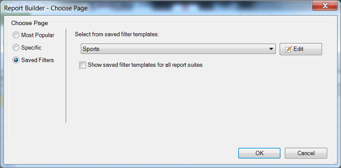

# Opgeslagen filters

{{legacy-arb}}

U kunt filters of andere parameters in Report Builder bewaren en hen in andere aantekenvellen of werkboeken gebruiken. Deze parameters worden opgeslagen op Analytics om ervoor te zorgen dat ze beschikbaar zijn voor andere Report Builder-gebruikers op andere computers.

U slaat filters op het [!UICONTROL Choose Page] -formulier op terwijl u een filter maakt. Voor een voorbeeld van deze procedure, zie [ Specifieke Filters ](/help/analyze/legacy-report-builder/layout/c-filter-dimensions/t-specific-filters.md).

