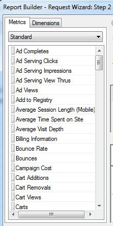

# Combineer verkeer en handelsmetriek in het zelfde verzoek

{{legacy-arb}}

U kunt verkeer en handel metrische types in één verzoek combineren in plaats van het creëren van afzonderlijke verzoeken.

De metriek van het verkeer en van de handel worden getoond in de zelfde metrische categorie in de Tovenaar van het Verzoek: Stap 2. De categorie gegroepeerd krijgt het label **[!UICONTROL Standard]** .

