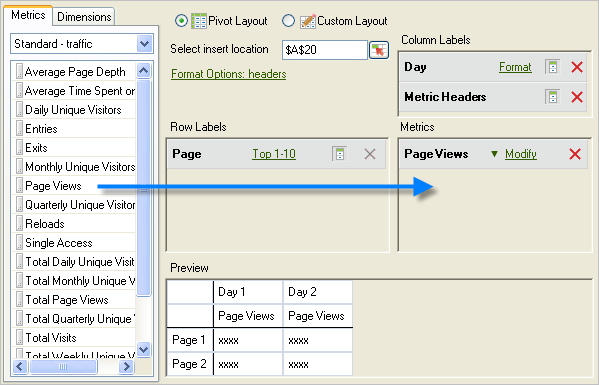

# Metriek en afmetingen toevoegen

Stappen om metriek en afmetingen aan een verzoek toe te voegen.

1. Gebruik de [!UICONTROL Request Wizard: Step 1] vorm aan [ creeer het gegevensverzoek ](/help/analyze/legacy-report-builder/data-requests/data-requests.md) dan klik **[!UICONTROL Next]**.
1. Dubbelklik in het [!UICONTROL Request Wizard: Step 2] -formulier op Metriek of sleep de metriek naar de gewenste positie.

   

   Wanneer u metriek toevoegt, worden deze niet verwijderd van het tabblad [!UICONTROL Metrics] , omdat u metriek meerdere keren kunt weergeven binnen een aanvraag. U kunt bijvoorbeeld naast elke waarde het metrische subtotaal weergeven. De lijst met beschikbare metriek verandert echter telkens wanneer u een dimensie toevoegt of verwijdert.

   U kunt alleen metriek toevoegen aan de lay-outsectie [!UICONTROL Metrics] . Metrische gegevens worden als [!UICONTROL Metric Header] toegevoegd aan de lay-out [!UICONTROL Column Label] . Als u een [!UICONTROL Metric Header] van [!UICONTROL Column Layout] naar [!UICONTROL Row Layout] verplaatst, wordt deze daar weergegeven en wordt deze als een metrische waarde gebruikt als een onderverdeling.

   Een zoekbalk wordt weergegeven op het tabblad Metrisch, net boven de lijst Metrisch.

   

## Richtsnoeren

Houd rekening met de volgende richtlijnen wanneer u metriek en afmetingen toevoegt.

* Wanneer u een zoekterm invoert, wordt de lijst automatisch bijgewerkt om metriek weer te geven die labels hebben die overeenkomen met de zoekterm.
* De gelijke is geval ongevoelig en gelijkwaardig aan a *bevat* onderzoek.
* Zoeken op volledige woorden en andere speciale zoekmarkeringen (begint met, eindigt met, AND, OR, enz.) worden niet ondersteund.

De zoekterm wordt gewist als u de wizard Verzoek afsluit wanneer u op [!UICONTROL Finish] of [!UICONTROL Cancel] klikt, of teruggaat naar Wizard Verzoek Stap 1 of de categorie Metrisch wijzigt.

De zoekterm wordt niet gewist:

* Wanneer u een metrisch item uit de lijst sleept en neerzet (of dubbelklikt), wordt dit item toegevoegd aan het deelvenster Metrische gegevens voor draaitalay-out/Aangepaste layout.
* Wanneer u een metrisch(e) item(s) verwijdert uit het deelvenster Metrisch van draaitout/aangepaste layout.
* Wanneer u op het tabblad Dimension klikt, gaat u terug naar het tabblad Metrisch.
* Wanneer u andere subformulieren (modaal of modeless) aanroept die bij uitgang aan Stap 2 van de Tovenaar van het Verzoek zal terugkeren. Voorbeelden van deze formulieren zijn

   * Dimension filter Forms
   * Opmaak datumbereik Forms
   * Formulier Indelingsopties
   * Tekstformulier voor voorvoegen en uitstellen
   * Locatieformulier uitvoerbereik

## Sorteer een verzoek door metrisch

U kunt een verzoek naar keuze sorteren door metrisch.

Om een verzoek door metrisch te sorteren

1. Klik op het metrische label.
1. Afmetingen toevoegen. Voeg afmetingen toe op dezelfde manier als waarop u metriek toevoegt. Zie de stappen 1 en 2 hierboven.

   Op het tabblad [!UICONTROL Dimensions] geeft het systeem afmetingen weer die zijn gesplitst of een classificatie zijn van elk basisrapport dat u selecteert op [!UICONTROL Request Wizard: Step 1] , en op de configuratie van de rapportsuite. Wanneer u een afmeting aan de lay-outrasters laat vallen, wordt het verwijderd uit de boomstructuurweergave en herberekent het overzicht van resterende beschikbare afmetingen.

   De [!UICONTROL Date] -dimensie wordt automatisch toegevoegd. De beschikbare datumafmetingen veranderen afhankelijk van de geselecteerde granulariteit in de [!UICONTROL Request Wizard: Step 1] . Geldige waarden zijn:

   * Uur
   * Dag
   * Week
   * Maand
   * Jaar
   * Datumbereik (wanneer geen granulariteit is opgegeven)

1. Wijzig metriek en afmetingen door [ formaatopties ](/help/analyze/legacy-report-builder/layout/t-format-display-headers.md) en filters te vormen.
1. Klik op **[!UICONTROL Finish]** .
In het volgende voorbeeld hebben de afmetingen betrekking op de [!UICONTROL Page] metrische waarde. Met de [!UICONTROL Referring Domain] -dimensie wordt een rapport gemaakt over de verdeling tussen [!UICONTROL Page] en [!UICONTROL Referring Domain] . Het tabblad [!UICONTROL Dimension] wordt alleen bijgewerkt met dimensies die u kunt toevoegen aan een uitsplitsingsrapport.

   
