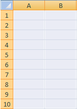

# Metriek en afmetingen toewijzen aan cellen

{{legacy-arb}}

Voordat u items aan het werkblad toewijst, moet u controleren of het werkblad niet is beveiligd. Als het beveiligingsschema voor uw werkblad gebruikersacties verhindert, kunt u geen cellen selecteren in het werkblad. Verwijder eerst de beveiliging van het vel en voeg vervolgens celtoewijzingen toe.

Het aantal gebieden en cellen dat moet worden toegewezen, is afhankelijk van de geselecteerde metrische waarde, de korreligheid, het datumbereik en de filters die u instelt. Als u bijvoorbeeld [!UICONTROL Site Metric] > [!UICONTROL Traffic Report] selecteert, [!UICONTROL Week] granulariteit instelt en het datumbereik voor [!UICONTROL Last 2 Weeks] instelt, wordt u gevraagd drie cellen (bij het gebruik van [!UICONTROL Custom Layout] ) toe te wijzen op de [!UICONTROL Request Wizard: Step 2] . Het verzoek haalt gegevens voor week één en gegevens voor week twee terug, waar elke waarde van het gegevenspunt de waarde van een paginamening evenaart. De derde cel fungeert als rijkop, die u kunt configureren met [!UICONTROL Format Options] .

Als u per ongeluk incompatibele locaties toewijst op het werkblad, geeft de Report Builder een fout weer.

Raadpleeg de volgende secties voor meer informatie:

* [&#x200B; selecteer een Waaier van Cellen &#x200B;](/help/analyze/legacy-report-builder/layout/map-metrics-and-dimensions-to-cells.md#section_1E37FB46DA194FB7A1050B8833A48AC6)
* [&#x200B; Technieken voor het Selecteren van Cellen &#x200B;](/help/analyze/legacy-report-builder/layout/map-metrics-and-dimensions-to-cells.md#section_760421C3D7F84D67A639174710C93B22)
* [Problemen bij toewijzing](/help/analyze/legacy-report-builder/layout/map-metrics-and-dimensions-to-cells.md#section_CC1BCF841291447EB3A994EB08F3A099)

## Een bereik met cellen selecteren {#section_1E37FB46DA194FB7A1050B8833A48AC6}

Wanneer u [!UICONTROL Custom Layout] inschakelt voor een trended-aanvraag in [!UICONTROL Request Wizard: Step 2] , kunt u de aanvraag toewijzen aan een reeks cellen.

Klik **[!UICONTROL Range Selector]**  naast het punt u in kaart wilt brengen.

* **Alle Cellen in Waaier:** vereist u om een groep cellen voor een [!UICONTROL Custom Layout] stijlverzoek te selecteren.
* **Eerste Cel van Waaier:** laat u de top-linkercel van de waaier selecteren, en toont de [!UICONTROL Range] richtlijn om de horizontale of verticale richtlijn van input en outputcellen (kolom of rij) te specificeren. Gebruik deze optie als u Report Builder cellen voor u wilt selecteren.
* **Oriëntatie van de Waaier:** laat u de celwaaiers als kolommen of rijen oriënteren.
* **Uitgezochte Bovenste Plaats van de Cel van Waaier:** toont de celverwijzingen.

## Technieken voor het selecteren van cellen {#section_760421C3D7F84D67A639174710C93B22}

U selecteert de gegevens door het **[!UICONTROL Range Selection]** pictogram 

en klik en sleep de muis over het gewenste bereik cellen in het werkblad. Een doorlopende selectie wordt omgeven door een zwarte rand.

De afzonderlijke geselecteerde rijen hebben een dunne witte rand rond elke rij.

Als u afzonderlijke rijen wilt toewijzen in één aanvraag, gebruikt u de toets [!UICONTROL Control] en klikt en sleept u de cursor over de gewenste cellen. U zou dit doen als uw verzoek vier gebieden met tien cellen elk, eerder dan één ononderbroken gebied met 40 cellen samen roept.

Nadat u cellen hebt geselecteerd, klikt u opnieuw op **[!UICONTROL Range Selector]** in het [!UICONTROL Range Selection] -formulier om terug te keren naar het [!UICONTROL Request Wizard: Step 2] -formulier.

## Problemen met de toewijzing oplossen{#section_CC1BCF841291447EB3A994EB08F3A099}

Als u per ongeluk toewijst aan een cel die al een actieve toewijzing heeft, wordt geen celverwijzing weergegeven in het tekstvak naast het pictogram voor de bereikkiezer. Wanneer u [!UICONTROL OK] klikt, toont de Report Builder de fout, *de geselecteerde waaier snijdt de waaier van een ander verzoek. Wijzig de selectie.*

* Als u de cel nog steeds moet gebruiken, klikt u met de rechtermuisknop op de gewenste cel of cellen en selecteert u **[!UICONTROL Delete Request]** .

Als u dit bericht wilt vermijden, kunt u op twee manieren te werk gaan:

* Plan het formaat van het rapport door het formatteren aan de cellen toe te voegen die verzoeken en afbeeldingen hebben
* Testen op delen van het werkblad die toewijzingen bevatten

Als u gebieden met ingesloten aanvragen wilt testen, kunt u:

* Start [!UICONTROL Request Manager] en klik op de afzonderlijke aanvragen in de tabel. Wanneer u op het verzoek klikt, worden de cellen in het werkblad gemarkeerd waar het verzoek is toegewezen.
* Selecteer cellen in het werkblad die u wilt gebruiken voor een nieuwe toewijzing en klik op [!UICONTROL From Sheet] . [!UICONTROL Request Manager] selecteert de aanvraag in de lijst met een uitvoeritem dat de geselecteerde cel doorsnijdt. Als er geen aanvraag is geselecteerd, is de cel beschikbaar.
* Selecteer cellen in het werkblad, klik met de rechtermuisknop in het contextmenu en controleer of [!UICONTROL Edit Request] beschikbaar is. Als dit het geval is, is er een verzoek verbonden aan deze cellen.
