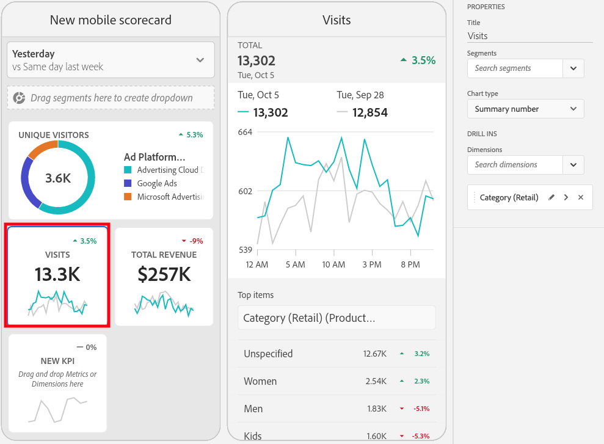
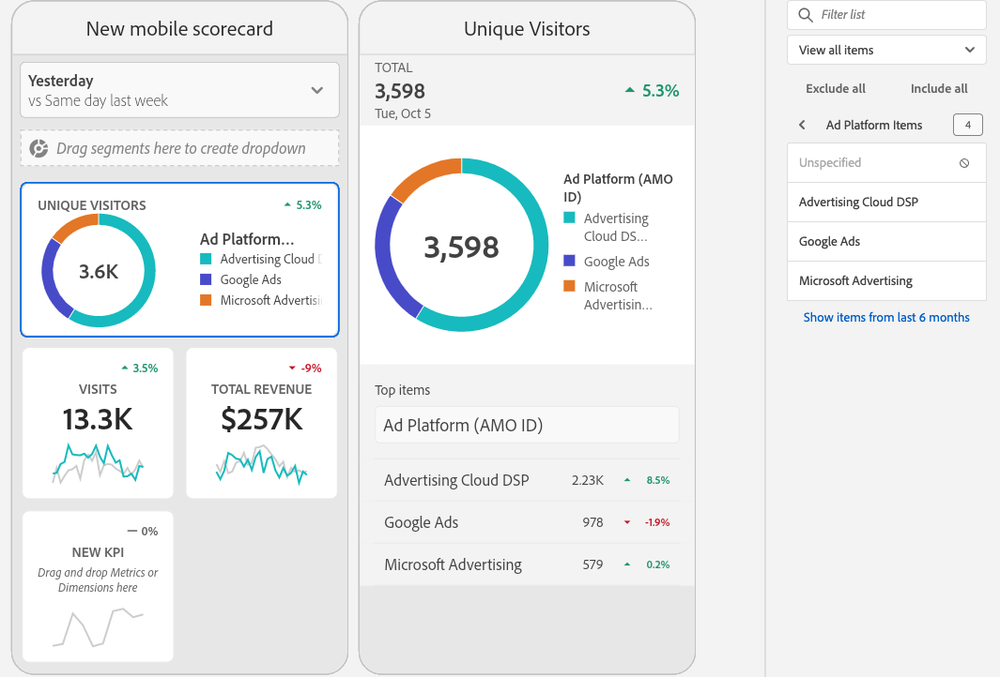

# Een mobiele scorecard maken

De volgende informatie instrueert curatoren van de gegevens van Adobe Analytics over om mobiele scorecards voor uitvoerende gebruikers te vormen en voor te stellen. Als u wilt beginnen met, kunt u de video van de Adobe Analytics-dashboards Scorecard Builder bekijken:

>[!VIDEO](https://video.tv.adobe.com/v/34544)

Een Adobe Analytics-scorecard toont belangrijke gegevensvisualisaties voor uitvoerende gebruikers in een getimede lay-out, zoals hieronder getoond:

Als curator van dit scorecard, kunt u de Scorecard Bouwer gebruiken om te vormen welke tegels op scorecard voor uw uitvoerende consument verschijnen. U configureert ook hoe de gedetailleerde weergaven, of de onderverdelingen, kunnen worden aangepast wanneer op de tegels wordt getikt. De interface van de Bouwer Scorecard wordt hieronder getoond:

U moet het volgende doen om het scorebord te maken:

1. Toegang krijgen tot [!UICONTROL Blank Mobile Scorecard] sjabloon.
2. Vorm scorecard met gegevens en bewaar het.

## Toegang krijgen tot [!UICONTROL Blank Mobile Scorecard] template {#template}

U hebt toegang tot de [!UICONTROL Blank Mobile Scorecard] malplaatje of door een nieuw project, of van het menu van Hulpmiddelen te creëren.

### Een nieuw project maken {#create}

1. Open Adobe Analytics en klik op de knop **[!UICONTROL Workspace]** tab.
1. Klikken **[!UICONTROL Create project]** en selecteert u de **[!UICONTROL Blank mobile scorecard]** projectsjabloon.
1. Klik op **[!UICONTROL Create]**.

### Menu Gereedschappen

1. Van de **[!UICONTROL Tools]** menu, selecteert u **[!UICONTROL Analytics dashboards (Mobile App)]**.
1. Klik in het volgende scherm op **[!UICONTROL Create new scorecard]**.

## Vorm scorecard met gegevens en bewaar het {#configure}

Het scorebordsjabloon implementeren:

1. Onder **[!UICONTROL Properties]** (in de rechtse spoorstaaf), **[!UICONTROL Project report suite]** waarvan u gegevens wilt gebruiken.

   

1. Als u een nieuwe tegel aan het scorebord wilt toevoegen, sleept u een metrische waarde uit het linkerdeelvenster en zet u deze neer in het deelvenster **[!UICONTROL Drag and Drop Metrics Here]** zone. U kunt ook een metrische waarde tussen twee tegels invoegen met behulp van een vergelijkbare workflow.

   

1. Van elke tegel, kunt u tot een gedetailleerde mening toegang hebben die extra informatie over metrisch, zoals hoogste punten voor een lijst van verwante afmetingen toont.

## Afmetingen of metingen toevoegen {#dimsmetrics}

Als u een gerelateerde afmeting aan een metrische waarde wilt toevoegen, sleept u een afmeting uit het linkerdeelvenster en zet u deze op een tegel neer.

U kunt bijvoorbeeld de juiste afmetingen toevoegen (zoals **[!DNL Marketing Channel]**, in dit voorbeeld) aan de **[!UICONTROL Unique Visitors]** metrisch door het te slepen en neer te zetten op de tegel. Uitsplitsingen naar Dimension worden weergegeven onder de [!UICONTROL Drill Ins] sectie van de details diaspecifiek **[!UICONTROL Properties]**. U kunt meerdere afmetingen aan elke tegel toevoegen.

## Segmenten toepassen {#segments}

Als u segmenten op afzonderlijke tegels wilt toepassen, sleept u een segment uit het linkerdeelvenster en zet u het segment direct boven op de tegel neer.

Als u het segment op alle tegels in Scorecard wilt toepassen, laat vallen de tegel bovenop scorecard. U kunt ook segmenten toepassen door segmenten te selecteren in het filtermenu onder de datumbereiken. U [configureren en toepassen van filters voor uw Scorecards](https://experienceleague.adobe.com/docs/analytics-learn/tutorials/analysis-workspace/using-panels/using-drop-down-filters.html) Hetzelfde als in Adobe Analytics Workspace.

## Datumbereiken toevoegen {#dates}

U kunt combinaties van datumbereiken toevoegen en verwijderen die u in uw scorecard kunt selecteren door de vervolgkeuzelijst met datumbereiken te selecteren.

Elke nieuwe scorecard begint met 6 datumwaaiercombinaties die zich op de gegevens van vandaag en gisteren concentreren. U kunt overbodige datumbereiken verwijderen door op de x te klikken of u kunt elke datumbereikcombinatie bewerken door op het potlood te klikken.

Als u een primaire datum wilt maken of wijzigen, gebruikt u de vervolgkeuzelijst om een van de beschikbare datumbereiken te selecteren of sleept u een datumcomponent van de rechterrail naar de neerzetzone.

Als u een vergelijkingsdatum wilt maken, kunt u een keuze maken uit handige voorinstellingen voor algemene tijdvergelijkingen in het keuzemenu. U kunt ook een datumcomponent slepen en neerzetten vanaf de rechterrail.

Als het gewenste datumbereik nog niet is gemaakt, kunt u een nieuw datumbereik maken door op het kalenderpictogram te klikken.

Hiermee gaat u naar de builder van het datumbereik waar u een nieuwe component voor het datumbereik kunt maken en opslaan.

## Visualisaties toepassen {#viz}

Bekijk een video over visualisaties voor mobiele scorecards:

>[!VIDEO](https://video.tv.adobe.com/v/337570/?quality=12&learn=on)

De dashboards van de Analyse bieden vier visualisaties die u groot inzicht in afmetingspunten en metriek geven. Schakel over naar een andere visualisatie door de optie [!UICONTROL chart type] van een tegel [!UICONTROL Properties]. Selecteer gewoon de rechtertegel en wijzig vervolgens het diagramtype.

Of klik op de knop [!UICONTROL Visualizations] pictogram in de linkerspoorstaaf en sleep en laat vallen de juiste visualisatie op de tegel:

### [!UICONTROL Summary Number]

Gebruik de Summiere visualisatie van het Aantal om een groot aantal te benadrukken dat in een project belangrijk is.

### [!UICONTROL Donut]

Net als bij een cirkeldiagram worden bij deze visualisatie gegevens weergegeven als delen of segmenten van een geheel. Gebruik een donutgrafiek wanneer het vergelijken van percentages van een totaal. Stel bijvoorbeeld dat u wilt zien welke advertentieplatform heeft bijgedragen aan het totale aantal unieke bezoekers:

### [!UICONTROL Line]

De visualisatie van de Lijn vertegenwoordigt metriek gebruikend een lijn om te tonen hoe de waarden over een periode veranderen. Een lijngrafiek toont afmetingen in tijd maar werkt met om het even welke visualisatie. U visualiseert de dimensie van de productcategorie in dit voorbeeld.

### [!UICONTROL Horizontal Bar]

Deze visualisatie toont horizontale balken die verschillende waarden over een of meer meeteenheden vertegenwoordigen. Als u bijvoorbeeld gemakkelijk wilt zien wat uw beste producten zijn, gebruikt u [!UICONTROL Horizontal Bar] voor uw voorkeursvisualisatie.

### Verwijderen [!UICONTROL Unspecified] dimensieitems

Als u wilt verwijderen [!UICONTROL Unspecified] dimensiepunten van uw gegevens, doe het volgende:

1. Selecteer de juiste tegel.
1. In de rechterspoorweg, onder **[!UICONTROL Drill ins]**, selecteert u de pijl-rechts naast het dimensie-item waarvan **[!UICONTROL Unspecified]** items die u wilt verwijderen.

   

1. Klik op het pictogram naast **[!UICONTROL Unspecified]** om niet-opgegeven gegevens uit de rapportage te verwijderen. (U kunt ook elk ander dimensie-item verwijderen.)

## Eigenschappen van tegels weergeven en configureren {#tiles}

Wanneer u op een tegel klikt in de Scorecard Builder, ziet u in de rechterrails de eigenschappen en kenmerken van die tegel en de bijbehorende dia met details. In deze trein kunt u een nieuwe **Titel** voor de tegel en vormt u de tegel ook door segmenten toe te passen.

## Gedetailleerde dia&#39;s weergeven {#view-detail-slides}

Wanneer u op tegels klikt, wordt in een dynamisch pop-upvenster weergegeven hoe de detaildia er uitziet voor de uitvoerende gebruiker in de app. U kunt dimensies toevoegen om uw gegevens naar behoefte op te splitsen. Indien geen dimensie is toegepast, wordt de uitsplitsingsdimensie **uur** of **dagen**, afhankelijk van het standaarddatumbereik.

De onderbrekingen verfijnen uw analyse door metriek door afmetriek door afmetingspunten letterlijk te breken.

* Unieke Visitors, metrisch uitgesplitst naar advertentie-Platform (AMO-id)
* Bezoeken uitgesplitst naar productcategorie (detailhandel)
* Totaal ontvangsten uitgesplitst naar productnaam

Elke dimensie die aan de detaildia wordt toegevoegd, wordt weergegeven in een vervolgkeuzelijst in de weergave van de detaildia in de app. De uitvoerende gebruiker kan dan uit de opties kiezen die in de drop-down lijst worden vermeld.

## Detaildia&#39;s aanpassen {#customize-detail-slide}

Met aangepaste dia&#39;s kunt u zich nog meer richten op de informatie die u deelt met uw publiek. U kunt de lay-out voor elke detaildia wijzigen en tekst toevoegen om beter te verklaren wat de eindgebruiker in de gegevens kan zien. U kunt het grafiektype ook veranderen gebruikend het drop-down menu.

### De dialay-out wijzigen

Wijzig de dialay-out om de nadruk op de belangrijkste informatie te leggen. U kunt bijvoorbeeld de lay-out zodanig wijzigen dat alleen een grafiek of alleen een tabel wordt weergegeven. Als u de dialay-out wilt wijzigen, selecteert u een van de vooraf ontworpen indelingen.

U kunt de dialay-out ook veranderen door visualiseringscomponenten van de linkerspoorstaaf op het canvas te slepen en te laten vallen. Elke detaildia kan slechts twee visualisaties tegelijk bevatten.

### Beschrijvende tekst toevoegen aan een dia

U kunt tekst toevoegen om betekenisvolle informatie te verstrekken over wat in de grafieken of nuances over de gegevens bevat.

Als u tekst wilt toevoegen aan een detaildia, selecteert u een lay-out waarin de `T` of sleep de tekstvisualisatiecomponent van de linkerspoorstaaf over. De teksteditor wordt automatisch geopend wanneer u een nieuwe tekstvisualisatie toevoegt of een dialay-out met tekst kiest. De teksteditor bevat alle standaardopties voor de opmaak van de tekst. U kunt tekststijlen toepassen, zoals alinea&#39;s, koppen en subkoppen, en vette en cursieve lettertypen toepassen. U kunt tekst uitvullen, lijsten met opsommingstekens en nummers toevoegen en koppelingen toevoegen. Wanneer u klaar bent met bewerken, selecteert u de knop Minimaliseren in de rechterbovenhoek van de teksteditor om deze te sluiten. Als u de tekst die u al hebt toegevoegd wilt bewerken, selecteert u het potloodpictogram om de teksteditor opnieuw te openen.

## Componenten verwijderen {#remove}

Op dezelfde manier om een component te verwijderen die op het volledige Scorecard wordt toegepast, klik overal op Scorecard buiten de tegels en verwijder het door het te klikken **x** dat wordt weergegeven wanneer u de muisaanwijzer op de component plaatst, zoals hieronder voor de component **Eerste bezoeken** segment:

## Voorvertoning scorecard {#preview}

U kunt voorvertonen hoe de scorecard eruitziet en functioneert zodra deze is gepubliceerd in de app Analytics-dashboards.

1. Klikken **[!UICONTROL Preview]** in de rechterbovenhoek van het scherm.

   

1. Als u wilt zien hoe de scorecard er op verschillende apparaten uitziet, selecteert u een apparaat in het menu [!UICONTROL Device preview] vervolgkeuzemenu.

   

1. Als u met de voorvertoning wilt werken, kunt u:

   * Klik met de linkermuisknop om tikken op het telefoonscherm te simuleren.

   * Gebruik de schuiffunctie van uw computer om het schuiven door het telefoonscherm met uw vinger te simuleren.

   * Klik en houd vast om het drukken en het houden van uw vinger op het telefoonscherm te simuleren. Dit is handig voor interactie met de visualisaties in de gedetailleerde weergave.

## Een scorecard een naam geven {#name}

Als u het scorebord een naam wilt geven, klikt u op de naamruimte linksboven in het scherm en typt u de nieuwe naam.

## Een scorecard delen {#share}

U kunt als volgt het scorebord delen met een Executive-gebruiker:

1. Klik op de knop **[!UICONTROL Share]** en selecteert u **[!UICONTROL Share scorecard]**.

1. In de **[!UICONTROL Share mobile scorecard]** de velden invullen met:

   * De naam van de scorecard opgeven
   * Een beschrijving van de scorecard
   * Relatieve tags toevoegen
   * Het specificeren van de ontvangers voor scorecard

1. Klik op **[!UICONTROL Share]**.

Nadat u een scorecard hebt gedeeld, kunnen uw ontvangers tot het op hun dashboards van Analytics toegang hebben. Als u verdere veranderingen in scorecard in de Scorecard Bouwer aanbrengt, zullen zij automatisch in gedeelde scorecard worden bijgewerkt. De uitvoerende gebruikers zullen dan de veranderingen zien nadat het Scorecard op hun app verfrist.

Als u scorecard door nieuwe componenten bij te voegen bijwerkt, kunt u de scorecard opnieuw willen delen (en controle **[!UICONTROL Share embedded components]** ) om ervoor te zorgen dat uw uitvoerende gebruikers toegang tot deze veranderingen hebben.
