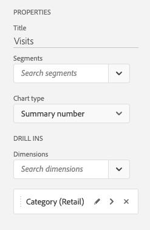
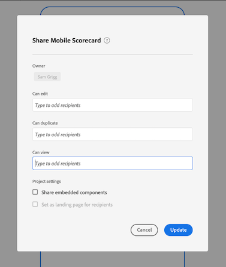

# Een scorecard maken

De volgende informatie instrueert curatoren van de gegevens van Adobe Analytics over hoe te om dashboards voor uitvoerende gebruikers te vormen en te presenteren. Als u wilt beginnen met, kunt u de video van de Adobe Analytics-dashboards Scorecard Builder bekijken:

>[!VIDEO](https://video.tv.adobe.com/v/34544)

Een Adobe Analytics-scorecard toont belangrijke gegevensvisualisaties voor uitvoerende gebruikers in een getimede lay-out, zoals hieronder getoond:

Als curator van dit scorecard, kunt u de Scorecard Bouwer gebruiken om te vormen welke tegels op scorecard voor uw uitvoerende consument verschijnen. U configureert ook hoe de gedetailleerde weergaven, of de onderverdelingen, kunnen worden aangepast wanneer op de tegels wordt getikt. De interface van de Bouwer Scorecard wordt hieronder getoond:

U moet het volgende doen om het scorebord te maken:

1. Open de sjabloon [!UICONTROL Blank Mobile Scorecard].
2. Vorm scorecard met gegevens en bewaar het.

## Toegang krijgen tot de sjabloon [!UICONTROL Blank Mobile Scorecard]

U kunt tot het [!UICONTROL Blank Mobile Scorecard] malplaatje of toegang hebben door een nieuw project, of van het menu van Hulpmiddelen te creëren.

### Een nieuw project maken

1. Open Adobe Analytics en klik op het tabblad **[!UICONTROL Workspace]**.
1. Klik **[!UICONTROL Create project]** en selecteer **[!UICONTROL Blank mobile scorecard]** projectmalplaatje.
1. Klik op **[!UICONTROL Create]**.

### Menu Gereedschappen

1. Selecteer **[!UICONTROL Analytics dashboards (Mobile App)]** in het menu **[!UICONTROL Tools]**.
1. Klik op **[!UICONTROL Create new scorecard]** in het volgende scherm.

## Vorm scorecard met gegevens en bewaar het

Het scorebordsjabloon implementeren:

1. Geef onder **[!UICONTROL Properties]** (in de rechterrail) een **[!UICONTROL Project report suite]** op waaruit u gegevens wilt gebruiken.

   

1. Als u een nieuwe tegel aan uw scorebord wilt toevoegen, sleept u een metrische waarde uit het linkerdeelvenster en zet u deze neer in de zone **[!UICONTROL Drag and Drop Metrics Here]**. U kunt ook een metrische waarde tussen twee tegels invoegen met behulp van een vergelijkbare workflow.

   

1. Van elke tegel, kunt u tot een gedetailleerde mening toegang hebben die extra informatie over metrisch, zoals hoogste punten voor een lijst van verwante afmetingen toont.

## Afmetingen of metingen toevoegen

Als u een gerelateerde afmeting aan een metrische waarde wilt toevoegen, sleept u een afmeting uit het linkerdeelvenster en zet u deze op een tegel neer.

U kunt bijvoorbeeld de juiste afmetingen (zoals **[!DNL Marketing Channel]** in dit voorbeeld) toevoegen aan de **[!UICONTROL Unique Visitors]**-meting door deze naar de tegel te slepen. Uitsplitsingen naar Dimension worden weergegeven onder de sectie [!UICONTROL Drill Ins] (uitsplitsing) van de tegelspecifieke sectie **[!UICONTROL Properties]**. U kunt meerdere afmetingen aan elke tegel toevoegen.

## Segmenten toepassen

Als u segmenten op afzonderlijke tegels wilt toepassen, sleept u een segment uit het linkerdeelvenster en zet u het segment direct boven op de tegel neer.

Als u het segment op alle tegels in Scorecard wilt toepassen, laat vallen de tegel bovenop scorecard. U kunt ook segmenten toepassen door segmenten te selecteren in het filtermenu onder de datumbereiken. U [configureert en past filters voor uw Scorecards](https://experienceleague.adobe.com/docs/analytics-learn/tutorials/analysis-workspace/using-panels/using-drop-down-filters.html) op dezelfde manier toe als in Adobe Analytics Workspace.

## Datumbereiken toevoegen

U kunt combinaties van datumbereiken toevoegen en verwijderen die u in uw scorecard kunt selecteren door de vervolgkeuzelijst met datumbereiken te selecteren.

Elke nieuwe scorecard begint met 6 datumwaaiercombinaties die zich op de gegevens van vandaag en gisteren concentreren. U kunt overbodige datumbereiken verwijderen door op de x te klikken of u kunt elke datumbereikcombinatie bewerken door op het potlood te klikken.

Als u een primaire datum wilt maken of wijzigen, gebruikt u de vervolgkeuzelijst om een van de beschikbare datumbereiken te selecteren of sleept u een datumcomponent van de rechterrail naar de neerzetzone.

Als u een vergelijkingsdatum wilt maken, kunt u een keuze maken uit handige voorinstellingen voor algemene tijdvergelijkingen in het keuzemenu. U kunt ook een datumcomponent slepen en neerzetten vanaf de rechterrail.

Als het gewenste datumbereik nog niet is gemaakt, kunt u een nieuw datumbereik maken door op het kalenderpictogram te klikken.

Hiermee gaat u naar de builder van het datumbereik waar u een nieuwe component voor het datumbereik kunt maken en opslaan.

## Visualisaties toepassen

De dashboards van de Analyse bieden vier visualisaties die u groot inzicht in afmetingspunten en metriek geven. Schakel over naar een andere visualisatie door de [!UICONTROL chart type] van een tegel [!UICONTROL Properties] te wijzigen. Selecteer gewoon de rechtertegel en wijzig vervolgens het diagramtype.

U kunt ook op het pictogram [!UICONTROL Visualizations] in de linkertrack klikken en de rechtervisualisatie naar de tegel slepen:

**[!UICONTROL Summary Number]**

Gebruik de Summiere visualisatie van het Aantal om een groot aantal te benadrukken dat in een project belangrijk is.

**[!UICONTROL Donut]visualisatie**

Net als bij een cirkeldiagram worden bij deze visualisatie gegevens weergegeven als delen of segmenten van een geheel. Gebruik een donutgrafiek wanneer het vergelijken van percentages van een totaal. Stel bijvoorbeeld dat u wilt zien welke advertentieplatform heeft bijgedragen aan het totale aantal unieke bezoekers:

**[!UICONTROL Line]visualisatie**

De visualisatie van de Lijn vertegenwoordigt metriek gebruikend een lijn om te tonen hoe de waarden over een periode veranderen. Een lijngrafiek toont afmetingen in tijd maar werkt met om het even welke visualisatie. U visualiseert de dimensie van de productcategorie in dit voorbeeld.

**[!UICONTROL Horizontal Bar]visualisatie**

Deze visualisatie toont horizontale balken die verschillende waarden over een of meer meeteenheden vertegenwoordigen. Als u bijvoorbeeld gemakkelijk wilt zien wat uw beste producten zijn, gebruikt u [!UICONTROL Horizontal Bar] voor uw voorkeursvisualisatie.

**Dimensie- [!UICONTROL Unspecified] items verwijderen**

Als u [!UICONTROL Unspecified] afmetingspunten uit uw gegevens wilt verwijderen, doe het volgende:

1. Selecteer de juiste tegel.
1. Selecteer in de rechtertrack onder **[!UICONTROL Drill ins]** de pijl naar rechts naast het dimensie-item waarvan **[!UICONTROL Unspecified]** items u wilt verwijderen.

   

1. Klik op het pictogram naast **[!UICONTROL Unspecified]** om niet-opgegeven gegevens uit de rapportage te verwijderen. (U kunt ook elk ander dimensie-item verwijderen.)

## Eigenschappen van tegels weergeven en configureren

Wanneer u in de Scorecard Builder op een tegel klikt, geeft de rechterrails de eigenschappen en kenmerken weer die aan die tegel zijn gekoppeld. In deze rail, kunt u nieuwe **[!UICONTROL Title]** voor de tegel verstrekken en anders de tegel vormen door componenten te specificeren in plaats van hen te slepen en te laten vallen van de linkerspoorstaaf.

Wanneer u op tegels klikt, wordt in een dynamische pop-up weergegeven hoe de weergave Bodeminks (Onderverdeling) wordt weergegeven voor de uitvoerende gebruiker in de app. Als er geen afmeting op de tegel is toegepast, is de afbraakdimensie **hour** of **days**, afhankelijk van het standaarddatumbereik.

De onderverdelingen verfijnen uw analyse door metriek en afmetingen door andere metriek en afmetingen, zoals in dit detailhandelsvoorbeeld letterlijk te breken:

* Unieke Visitors, metrisch uitgesplitst naar advertentie-Platform (AMO-id)
* Bezoeken uitgesplitst naar productcategorie (detailhandel)
* Totaal ontvangsten uitgesplitst naar productnaam

Elke dimensie die aan de tegel wordt toegevoegd, wordt weergegeven in een vervolgkeuzelijst in de gedetailleerde weergave van de app. De uitvoerende gebruiker kan dan uit de opties kiezen die in de drop-down lijst worden vermeld.

## Componenten verwijderen

Op dezelfde manier om een component te verwijderen die op het volledige Scorecard wordt toegepast, klik overal op Scorecard buiten de tegels en verwijder het door **x** te klikken die verschijnt wanneer u over de component, zoals hieronder voor **Eerste Bezoekingen** segment toont:

## Een scorecard een naam geven

Als u het scorebord een naam wilt geven, klikt u op de naamruimte linksboven in het scherm en typt u de nieuwe naam.

## Een scorecard delen

U kunt als volgt het scorebord delen met een Executive-gebruiker:

1. Klik op het menu **[!UICONTROL Share]** en selecteer **[!UICONTROL Share scorecard]**.

1. Vul in het **[!UICONTROL Share mobile scorecard]**-formulier de velden met:

   * De naam van de scorecard opgeven
   * Een beschrijving van de scorecard
   * Relatieve tags toevoegen
   * Het specificeren van de ontvangers voor scorecard

1. Klik op **[!UICONTROL Share]**.

Nadat u een scorecard hebt gedeeld, kunnen uw ontvangers tot het op hun dashboards van Analytics toegang hebben. Als u verdere veranderingen in scorecard in de Scorecard Bouwer aanbrengt, zullen zij automatisch in gedeelde scorecard worden bijgewerkt. De uitvoerende gebruikers zullen dan de veranderingen zien nadat het Scorecard op hun app verfrist.

Als u de scorecard door nieuwe componenten bij te voegen bijwerkt, kunt u de scorecard opnieuw willen delen (en **[!UICONTROL Share embedded components]** optie) controleren om ervoor te zorgen dat uw uitvoerende gebruikers toegang tot deze veranderingen hebben.