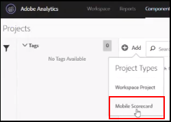
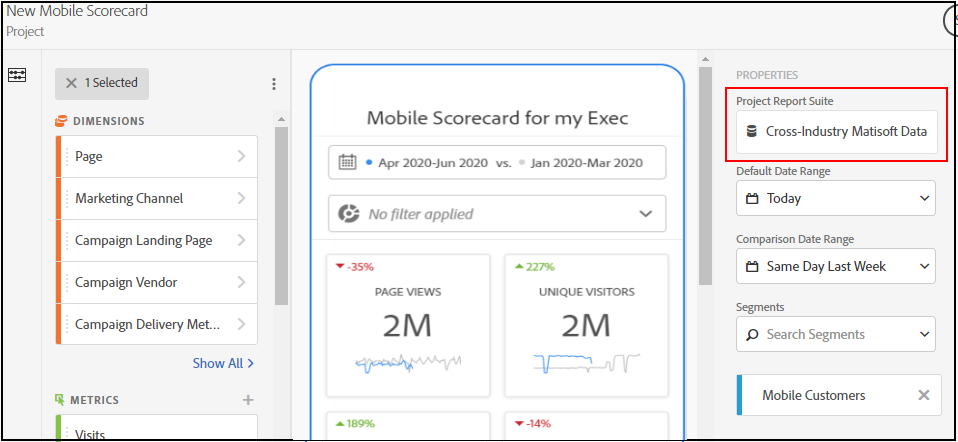
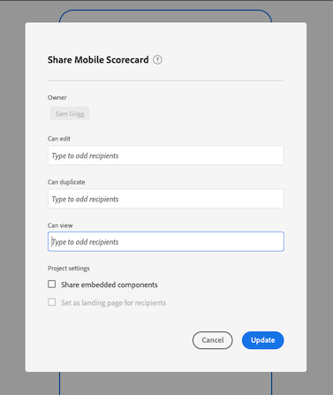
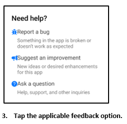

# BETA: Curatorhandleiding voor Adobe Analytics-dashboards

## Inleiding

Adobe Analytics-dashboards bieden altijd en overal inzichten van Adobe Analytics. Met de app kunnen gebruikers op mobiele apparaten toegang krijgen tot intuïtieve scorecards die u maakt en deelt via de gebruikersinterface van het bureaublad van Adobe Analytics. Scorecards zijn een inzameling van zeer belangrijke metriek en andere componenten die in een tegellay-out worden voorgesteld die u voor meer gedetailleerde onderverdelingen en trended rapporten kunt tikken. U kunt Scorecards op maat maken op basis van de gegevens die voor u het belangrijkst zijn. Analytische dashboards worden ondersteund op zowel iOS- als Android-besturingssystemen.

## Over deze handleiding

Deze handleiding is bedoeld om curatoren van Adobe Analytics-gegevens te helpen bij het configureren van Scorecards voor hun uitvoerende gebruikers op de dashboards van Analytics. Curatoren kunnen organisatiebeheerders of personen in andere functies zijn die verantwoordelijk zijn voor het instellen van toepassingsscoreborden, waarmee uitvoerende gebruikers een brede weergave van belangrijke samenvattingsgegevens snel en eenvoudig op hun eigen mobiele apparaten kunnen bekijken. Hoewel uitvoerende gebruikers de eindgebruiker voor de dashboards van Analytics zijn, zal deze gids gegevenscuratoren helpen om app voor die gebruikers effectief op te zetten.

## Verklarende woordenlijst

In de volgende tabel staan de voorwaarden voor het begrijpen van het publiek, de functies en de werking van de dashboards van Analytics.

| Term | Definitie |
|--- |--- |
| Consumenten | Executive-medewerkers bekijken belangrijke metriek en inzichten van Analytics op een mobiel apparaat |
| Curator | Personeel dat gegevens leest en inzichten van Analytics verspreidt en de Scorecards configureert die door de consument moeten worden bekeken |
| Kromming | Het maken of bewerken van een mobiel scorebord met relevante meetgegevens, afmetingen en andere componenten voor de consument |
| Scorecard | Een dashboardweergave met een of meer tegels |
| Tegel | Een rendering voor metrische gegevens in een scorebordweergave |
| Uitsplitsing | Een secundaire weergave die toegankelijk is door te tikken op een tegel in het scorebord. Deze mening breidt metrisch uit die op de tegel wordt getoond en naar keuze rapporten over extra verdelingsafmetingen. |
| Datumbereik | Het primaire datumbereik voor dashboardrapportage |
| Vergelijkingsdatumbereik | Het datumbereik dat wordt vergeleken met het primaire datumbereik |

 
## Een scorebord maken voor uitvoerende gebruikers

In een scorebord worden de belangrijkste gegevensvisualisaties voor uitvoerende gebruikers naast elkaar weergegeven, zoals hieronder wordt getoond:

Als curator van dit Scorecard, kunt u de Scorecard Bouwer gebruiken om te vormen welke tegels op Scorecard voor uw consument verschijnen. U configureert ook hoe de gedetailleerde weergaven, of de indelingen, kunnen worden aangepast wanneer op de tegels wordt getikt. De interface van de Bouwer Scorecard wordt hieronder getoond:

Als u het scorebord wilt maken, moet u het volgende doen:

1. Open de sjabloon Blanco mobiel scorebord.
2. Configureer het scorebord met gegevens en sla het op.

### Toegang tot de sjabloon Blanco mobiel scorebord

U kunt tot het Lege Mobiele malplaatje van het Scorecard op één van de volgende manieren toegang hebben:

**Een nieuw project maken**

1. Open Adobe Analytics en klik op het tabblad **Werkruimte** .
2. Klik de **Create Nieuwe knoop van het Project** en selecteer het **Lege Mobiele Scorecard** projectmalplaatje.
3. Klik op de knop **Maken** .

*Opmerking: Als u de Lege sjabloon voor het mobiele scorebord niet ziet, zoals hieronder wordt weergegeven, is uw bedrijf nog niet geactiveerd voor bèta. Neem contact op met uw Customer Service Manager.*

**Een project toevoegen**

Klik in het scherm **Projecten** onder het tabblad **Componenten** op de knop **Toevoegen** en selecteer **Mobiel scorebord**.

**Analyseprogramma&#39;s gebruiken**

Klik in Analytics op het menu **Tools** en selecteer **dashboards**. Klik in het volgende scherm op de knop **Scorecard** maken.

### Het scorebord configureren met gegevens en opslaan

Het scorebordsjabloon implementeren:

1. Geef onder **Eigenschappen** (in het rechterspoor) een **Projectrapportsuite** op waaruit u gegevens wilt gebruiken.

   

2. Als u een nieuwe tegel aan het scorebord wilt toevoegen, sleept u een metrische waarde uit het linkerdeelvenster en zet u de tegel neer in de **meetgegevens hier** slepen en neerzetten. U kunt ook een metrische waarde tussen twee tegels invoegen met behulp van een vergelijkbare workflow.

   

   *Van elke tegel, kunt u tot een gedetailleerde mening toegang hebben die extra informatie over metrisch, zoals hoogste punten voor een lijst van verwante afmetingen toont.*

3. Als u een gerelateerde afmeting aan een metrische waarde wilt toevoegen, sleept u een afmeting uit het linkerdeelvenster en zet u deze op een tegel neer. U kunt bijvoorbeeld de juiste afmetingen (zoals **DMA-regio** in dit voorbeeld) toevoegen aan de metrische waarde voor **Unieke bezoekers** door deze naar de tegel te slepen en neer te zetten. De dimensies die u toevoegt, worden weergegeven onder de sectie voor de verdeling van de tegelspecifieke **eigenschappen**. U kunt meerdere afmetingen aan elke tegel toevoegen.

   

   *Opmerking: U kunt ook een dimensie aan alle tegels toevoegen door deze op het Scorecard-canvas te neerzetten.*

   Wanneer u op een tegel in de Scorecard Builder klikt, toont het rechtse spoor de eigenschappen en de kenmerken verbonden aan die tegel. In dit spoor, kunt u een nieuwe **Titel** voor de tegel verstrekken en anders de tegel vormen door componenten te specificeren in plaats van hen te slepen en te laten vallen van de linkerspoorstaaf.

   Als u op tegels klikt, wordt bovendien een dynamische pop-up weergegeven waarin wordt aangegeven hoe de uitsplitsingsweergave wordt weergegeven voor de uitvoerende gebruiker in de app. Als er geen dimensie is toegepast op de tegel, is de afbraakdimensie **uur** of **dagen**, afhankelijk van het standaarddatumbereik.

   

   *Let erop dat elke dimensie die aan de tegel wordt toegevoegd, wordt weergegeven in een vervolgkeuzelijst in de gedetailleerde weergave van de app. De uitvoerende gebruiker kan dan uit de opties kiezen die in de drop-down lijst worden vermeld.*

4. Als u segmenten op afzonderlijke tegels wilt toepassen, sleept u een segment uit het linkerdeelvenster en zet u het segment direct boven op de tegel neer. Als u het segment op alle tegels in Scorecard wilt toepassen, laat vallen de tegel bovenop scorecard.

5. Op dezelfde manier om een component te verwijderen die op het volledige Scorecard wordt toegepast, klik overal op Scorecard buiten de tegels en verwijder het door **x** te klikken die verschijnt wanneer u over de component, zoals hieronder voor het **Mobiele segment van Klanten** getoond:

   

6. Onder **Eigenschappen** van het Scorecard, kunt u naar keuze het volgende ook specificeren:

   * Een **standaarddatumbereik**. De hier opgegeven bereiken zijn dezelfde als die welke worden toegepast op de eerste toegang van de gebruiker tot het scorebord in zijn app.

   * Een **vergelijkingsdatumbereik**

   * Alle **segmenten** die op het hele scorebord moeten worden toegepast

7. Als u het scorebord een naam wilt geven, klikt u op de naamruimte linksboven in het scherm en typt u de nieuwe naam.

   

## Scorecard delen

U kunt als volgt het scorebord delen met een Executive-gebruiker:

1. Klik op het menu **Delen** en selecteer Scorecard **delen**.

2. Vul de velden in het formulier **Delen** in door:

   * De naam van het scorebord opgeven
   * Beschrijving van het scorebord
   * Relatieve tags toevoegen
   * De ontvangers voor het scorebord opgeven
   * Selecteer de optie voor het **delen van ingesloten componenten met ontvangers** om ervoor te zorgen dat de uitvoerende gebruiker toegang heeft tot alle componenten in het scorebord.

3. Klik op **Delen**.

Nadat u een scorebord hebt gedeeld, kunnen uw ontvangers tot het op hun dashboards van Analytics toegang hebben. Als u daarna veranderingen in het Scorecard in de Scorecard Bouwer aanbrengt, zullen zij automatisch in het gedeelde Scorecard worden bijgewerkt. De uitvoerende gebruikers zullen dan de veranderingen zien nadat het Scorecard op hun app verfrist.

*Opmerking: Als u het Scorecard door nieuwe componenten bij te voegen bijwerkt, kunt u de scorecard opnieuw willen delen (en de optie **Automatisch ingebedde componenten met ontvangers**delen) om ervoor te zorgen dat uw uitvoerende gebruikers toegang tot deze veranderingen hebben.*

## Uitvoerende gebruikers instellen met de app

In sommige gevallen hebben uitvoerende gebruikers wellicht extra hulp nodig om de app te openen en te gebruiken. Deze sectie verstrekt informatie om u te helpen die hulp verlenen.

### Help uitvoerende gebruikers toegang te krijgen

Om uitvoerende gebruikers te helpen tot uw Scorecards op app toegang hebben, zorg ervoor dat:

* De minimale vereisten voor mobiele besturingssystemen op hun apparaten zijn iOS versie 10 of hoger, of Android versie 4.4 (KitKat) of hoger
* Ze hebben een geldige aanmelding bij Adobe Analytics
* U hebt op de juiste wijze mobiele scoreborden voor deze scoreborden gemaakt en deze met hen gedeeld.
* Zij hebben toegang tot de Werkruimte van de Analyse en de rapportreeks die Scorecard gebaseerd is op
* Zij hebben toegang tot de Componenten die het Scorecard omvat. Opmerking: U kunt een optie selecteren wanneer het delen van uw Scorecards om ingebedde componenten met ontvangers **** automatisch te delen.

### Help-gebruikers de app te gebruiken

Tijdens de bètafase en voordat de app openbaar wordt gemaakt, kunt u bepalen wie toegang heeft tot de app.

1. Help uitvoerende gebruikers de app te downloaden en installeren. Hiervoor voert u de volgende stappen uit om de toegang uit te breiden tot uw gebruikers, afhankelijk van het feit of ze een iOS- of Android-apparaat gebruiken.

   **Voor uitvoerende gebruikers op iOS:**

   1. Klik op de volgende openbare koppeling (deze is ook beschikbaar in Analytics onder **Gereedschappen** > **dashboards**):

      [iOS-koppeling](https://testflight.apple.com/join/WtXMQxlI): `https://testflight.apple.com/join/WtXMQxlI`

      Nadat u op de koppeling hebt geklikt, wordt het volgende scherm Testflight weergegeven:

      

   2. Tik op de koppeling **Weergeven in App Store** op het scherm om de testflight-app te downloaden.

   3. Nadat u de testflight-app hebt geïnstalleerd, zoekt en installeert u de Adobe Analytics-dashboards vanuit Testflight, zoals hieronder wordt weergegeven:

      

   **Voor uitvoerende gebruikers op Android:**

   1. Tik op de koppeling Play Store op het apparaat van de gebruiker (Deze is ook beschikbaar in Analytics onder **Extra** > **dashboards**):
      [Android](https://play.google.com/apps/testing/com.adobe.analyticsmobileapp): `https://play.google.com/apps/testing/com.adobe.analyticsmobileapp`

      Tik op de koppeling om een ester te worden op het volgende scherm nadat u op deze koppeling hebt getikt:

      

   2. Tik op de link Google Play **om deze te** downloaden op het volgende scherm:

      

   3. Download en installeer de app.
Zodra ze zijn gedownload en geïnstalleerd, kunnen uitvoerende gebruikers zich aanmelden bij de app met hun bestaande Adobe Analytics-gegevens. Wij ondersteunen zowel Adobe als Enterprise-/federatieve id&#39;s.

   

2. Help hen tot uw Scorecard toegang te hebben. Nadat uitvoerende gebruikers zich in app ondertekenen, verschijnt het **Choose een bedrijfscherm** . Dit scherm maakt een lijst van de login bedrijven waartot de uitvoerende gebruiker behoort. Om hen te helpen bij de Scorecard:

   * Tik op de naam van het aanmeldingsbedrijf of de Experience Cloud Org die van toepassing is op het scorebord dat u hebt gedeeld. De Scorecard lijst toont dan alle Scorecards die met het uitvoerend onder dat login bedrijf zijn gedeeld.
   * Help ze deze lijst te sorteren op **Laatst gewijzigd**, indien van toepassing.
   * Tik op de naam van het scorebord om het weer te geven.

   

   Opmerking: Als de uitvoerende gebruiker zich aanmeldt en een bericht ziet waarin wordt gemeld dat er niets is gedeeld:

   * De uitvoerende gebruiker heeft mogelijk de verkeerde instantie Analytics geselecteerd
   * Het scorebord is mogelijk niet gedeeld met de uitvoerende gebruiker

      

   Verifieer dat de uitvoerende gebruiker zich in de juiste instantie van Analytics kan aanmelden en dat Scorecard is gedeeld.

3. Leg aan de uitvoerende gebruiker uit hoe de tegels in de Scorecards verschijnen u deelt.

   

   Aanvullende informatie over tegels:

   * De korreligheid van de sparklines is afhankelijk van de lengte van het datumbereik:
      * Op een dag is er een uurtrend
      * Meer dan een dag en minder dan een jaar laat een dagelijkse trend zien
      * Een jaar of langer toont een wekelijkse trend
   * De formule van de percentagewaardeverandering is metrisch totaal (huidige datumwaaier) - metrisch totaal (de waaier van de vergelijkingsdatum) / metrisch totaal (de waaier van de vergelijkingsdatum).
   * U kunt het scherm omlaag trekken om het Scorecard te vernieuwen.

4. Tik op een tegel om te tonen hoe een gedetailleerde uitsplitsing voor de tegel werkt.

   

5. U wijzigt de datumbereiken voor uw scorebord als volgt:

   

   *Opmerking: U kunt de datumbereiken ook op dezelfde manier wijzigen in de bovenstaande uitsplitsingsweergave.*

   Afhankelijk van het interval dat u tikt (**Dag**, **Week**, **Maand**, of **Jaar**), ziet u twee opties voor datumwaaier-of de huidige tijdsspanne of onmiddellijk voorafgaand aan het. Tik op een van deze twee opties om het eerste bereik te selecteren. Tik in de lijst **VERGELIJKEN MET** op een van de voorgestelde opties om de gegevens van deze tijdsperiode te vergelijken met de eerste datumreeks die u hebt geselecteerd. Tik op **Gereed** in de rechterbovenhoek van het scherm. Het veld **Datumbereik** en de scorebordtegels worden bijgewerkt met de nieuwe vergelijkingsgegevens van de nieuwe bereiken die u hebt geselecteerd.

6. Feedback geven op deze app:

   1. Tik op het gebruikerspictogram rechtsboven in het toepassingsscherm.
   2. Tik in het scherm **Mijn account** op de optie **Feedback** .
   3. Tik om de opties voor het geven van feedback weer te geven.
   
   

**Een fout** rapporteren:

Tik op de optie en kies een subcategorie van de bug. Geef in het formulier voor het melden van een fout uw e-mailadres op in het bovenste veld en uw beschrijving van de fout op in het veld eronder. Er wordt automatisch een schermafbeelding van uw accountgegevens aan het bericht gekoppeld, maar u kunt dit desgewenst verwijderen door op de **X** in de bijlage te tikken. U hebt ook opties voor het opnemen van een scherm, het toevoegen van meer schermafbeeldingen of het bijvoegen van bestanden. Tik op het pictogram van het papieren vlak rechtsboven in het formulier om het rapport te verzenden.

**Een verbetering** voorstellen:

Tik op de optie en kies een subcategorie voor de suggestie. Geef in het aanvraagformulier uw e-mailadres op in het bovenste veld en uw beschrijving van de fout op in het veld eronder. Er wordt automatisch een schermafbeelding van uw accountgegevens aan het bericht gekoppeld, maar u kunt dit desgewenst verwijderen door op de **X** in de bijlage te tikken. U hebt ook opties voor het opnemen van een scherm, het toevoegen van meer schermafbeeldingen of het bijvoegen van bestanden. Tik op het pictogram van het papieren vlak rechtsboven in het formulier om de suggestie te verzenden.

**Een vraag** stellen:

Tik op de optie en geef uw e-mailadres op in het bovenste veld en uw vraag in het veld eronder. Er wordt automatisch een schermafbeelding aan het bericht gekoppeld, maar u kunt dit desgewenst verwijderen door op de **X** in de bijlage te tikken. U hebt ook opties voor het opnemen van een scherm, het toevoegen van meer schermafbeeldingen of het bijvoegen van bestanden. Tik op het pictogram van het papieren vlak rechtsboven in het formulier om de vraag te verzenden.
