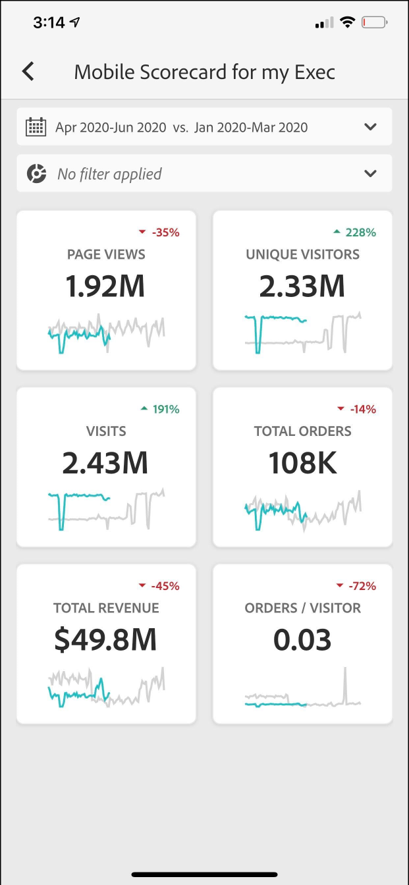
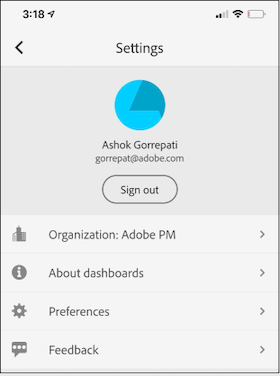
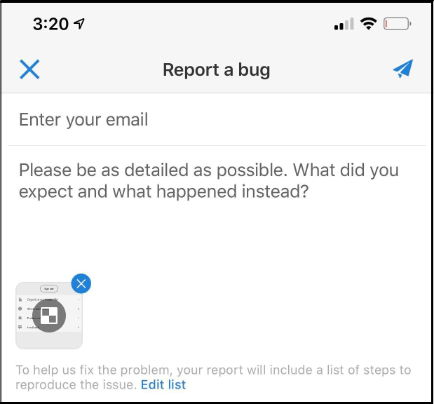

# Adobe Analytics-dashboards: Handleiding voor snel starten van gebruikers

De volgende informatie biedt handige gebruikers informatie over aanbevolen procedures voor het gebruik en weergeven van Adobe Analytics-dashboards. Zie [Adobe Analytics dashboards In-App Experience](https://youtu.be/QXqQ_PkArbA) voor een video waarin deze informatie wordt getoond.

## Inleiding

Adobe Analytics-dashboards bieden altijd en overal inzicht vanuit Adobe Analytics.  Met de app hebben gebruikers mobiele toegang tot intuïtieve scorecards. Scorecards zijn een inzameling van zeer belangrijke metriek en andere componenten die in een tegellay-out worden voorgesteld die u voor meer gedetailleerde onderverdelingen en trended rapporten kunt tikken. Dashboards worden ondersteund op zowel iOS- als Android-besturingssystemen.

Deze gids is bedoeld om uitvoerende gebruikers te helpen scorecards op de dashboards van Analytics lezen en interpreteren. Met de app kunnen uitvoerende gebruikers snel en gemakkelijk een brede weergave van belangrijke samenvattingsgegevens op hun eigen mobiele apparaten bekijken.

## Verklarende woordenlijst

| Term | Definitie |
|--- |--- |
| Consumenten | Executive-medewerkers bekijken belangrijke metriek en inzichten van Analytics op een mobiel apparaat |
| Curator | Personeel dat gegevens leest en inzichten van Analytics verspreidt en de Scorecards configureert die door de consument moeten worden bekeken |
| Curation | Het creëren of bewerken van een mobiele scorecard met relevante meetgegevens, afmetingen en andere componenten voor de consument |
| Scorecard | Een dashboardweergave met een of meer tegels |
| Tegel | Een rendering voor metrische gegevens in een scorebordweergave |
| Uitsplitsing | Een secundaire weergave die toegankelijk is door te tikken op een tegel in het scorebord. Deze mening breidt metrisch uit die op de tegel wordt getoond en naar keuze rapporten over extra verdelingsafmetingen. |
| Datumbereik | Het primaire datumbereik voor dashboardrapportage |
| Vergelijkingsdatumbereik | Het datumbereik dat wordt vergeleken met het primaire datumbereik |

## Stel dashboards in op uw apparaat

Om de dashboards effectief te gebruiken, zult u uw hulp van de Curator van het Scorecard moeten hebben u opstelling het. In dit gedeelte vindt u informatie die u helpt bij het instellen van de curator.

### Toegang verkrijgen

Als u toegang wilt tot scoreborden op dashboards, moet u ervoor zorgen dat:

* U hebt een geldige aanmelding bij Adobe Analytics
* Uw curator heeft op de juiste wijze mobiele scoreborden gemaakt en deze met u gedeeld

### Dashboards downloaden en installeren

Voer de stappen uit volgens het besturingssysteem op uw apparaat om de app te downloaden en installeren.

**Voor uitvoerende gebruikers op iOS:**

Klik op de volgende koppeling (deze is ook beschikbaar in Analytics onder **[!UICONTROL Tools]** > **[!UICONTROL Analytics dashboards (Mobile App)]**) en volg de aanwijzingen om de app te downloaden, installeren en openen:

[iOS-koppeling](https://apple.co/2zXq0aN)

**Voor uitvoerende gebruikers op Android:**

Klik op de volgende koppeling (deze is ook beschikbaar in Analytics onder **[!UICONTROL Tools]** > **[!UICONTROL Analytics dashboards (Mobile App)]**) en volg de aanwijzingen om de app te downloaden, installeren en openen:

[Android-koppeling](https://bit.ly/2LM38Oo)

Zodra ze zijn gedownload en geïnstalleerd, kunnen gebruikers zich aanmelden bij de app met hun bestaande Adobe Analytics-referenties.

## Dashboards gebruiken

Dashboards gebruiken:

1. Meld u aan bij de app. Het aanmeldingsscherm wordt weergegeven wanneer u dashboards start. Volg de aanwijzingen op basis van uw bestaande Adobe Analytics-gebruikersgegevens. Wij ondersteunen zowel Adobe- als Enterprise-/federatieve id&#39;s.

   

2. Kies een bedrijf. Nadat u zich hebt aangemeld bij dashboards, wordt het **[!UICONTROL Choose a company]** scherm weergegeven. Dit scherm maakt een lijst van de login bedrijven waartot u behoort. Tik op de bedrijfsnaam die is gekoppeld aan het scorebord dat met u wordt gedeeld.

3. In de lijst met scoreborden worden dan alle scoreborden weergegeven die met u zijn gedeeld. Tik op het scorebord dat u wilt weergeven.

   

   Als u zich aanmeldt en een bericht ziet waarin wordt gemeld dat er niets is gedeeld, controleert u het volgende met uw curator:

   * U kunt zich aanmelden bij de juiste instantie Analytics
   * Het scorebord is met u gedeeld

   

4. Onderzoek hoe de tegels in Scorecard verschijnen (het eerste Scorecard wordt getoond in donkere wijze); zie **[!UICONTROL Preferences]** hieronder voor meer informatie).

   

   Aanvullende informatie over tegels:

   * De korreligheid van de sparklines is afhankelijk van de lengte van het datumbereik:

      * Op een dag is er een uurtrend
      * Meer dan een dag en minder dan een jaar laten een dagelijkse trend zien
      * Een jaar of langer toont een wekelijkse trend
   * De formule van de percentagewaardeverandering is metrisch totaal (huidige datumwaaier) - metrisch totaal (de waaier van de vergelijkingsdatum) / metrisch totaal (de waaier van de vergelijkingsdatum).

   * U kunt het scherm omlaag trekken om het Scorecard te vernieuwen.

   Het volgende voorbeeldscorebord wordt getoond in normale wijze:

   

5. Tik op een tegel om te zien hoe een gedetailleerde uitsplitsing van de tegel werkt.

   

6. U wijzigt de datumbereiken voor uw scorebord als volgt:

   

   * U kunt de datumbereiken ook op dezelfde manier wijzigen in de bovenstaande uitsplitsingsweergave.

   * Afhankelijk van het interval dat u tikt (**Day**, **Week**, **Month**, of **Year**), zult u twee opties voor datumwaaier-of de huidige tijdspanwijdte of onmiddellijk voorafgaand aan het zien. Tik op een van deze twee opties om het eerste bereik te selecteren. Tik in de lijst **[!UICONTROL COMPARE TO]** op een van de voorgestelde opties om de gegevens van deze tijdsperiode te vergelijken met de eerste datumreeks die u hebt geselecteerd. Tik **[!UICONTROL Done]** rechtsboven op het scherm. De **[!UICONTROL Date Ranges]**- gebieden en de Scorecard tegels worden bijgewerkt met de nieuwe vergelijkingsgegevens van de nieuwe waaiers u selecteerde.

7. Tik op de vervolgkeuzelijst met filters en selecteer een segment dat door de curator is geconfigureerd om een segmentfilter op uw scorebord toe te passen. [De ](https://experienceleague.adobe.com/docs/analytics-learn/tutorials/analysis-workspace/using-panels/using-drop-down-filters.html) filters in de app werken op dezelfde manier als in de Analytics Workspace.

   

8. Download de Scorecard-updates. Als een Scorecard niet alle metrisch of onderbrekingen omvat die u in kunt geinteresseerd zijn, gelieve uw team van Analytics te contacteren om Scorecard te hebben bijgewerkt. Na de update kunt u de kaart op het scherm terugtrekken om deze te vernieuwen en de onlangs toegevoegde gegevens te laden.

9. Feedback geven op deze app:

   1. Tik op het instellingenpictogram rechtsboven in het toepassingsscherm.
   2. Tik op **[!UICONTROL Settings]** op het scherm **[!UICONTROL Feedback]**.
   3. Tik om de opties voor het geven van feedback weer te geven.

      

10. Tik op de bovenstaande optie **[!UICONTROL Preferences]** om de voorkeuren te wijzigen. Bij de voorkeuren kunt u de biometrische aanmelding inschakelen of de app voor de donkere modus instellen, zoals hieronder wordt weergegeven:

   

**Een fout** rapporteren:

Tik op de optie en kies een subcategorie van de bug. Geef in het formulier voor het melden van een fout uw e-mailadres op in het bovenste veld en uw beschrijving van de fout op in het veld eronder. Er wordt automatisch een schermopname van uw accountgegevens aan het bericht gekoppeld, maar u kunt dit desgewenst verwijderen door op de **X** in de bijlage te tikken. U hebt ook opties voor het opnemen van een scherm, het toevoegen van meer schermafbeeldingen of het bijvoegen van bestanden. Tik op het pictogram van het papieren vlak rechtsboven in het formulier om het rapport te verzenden.

**Een verbetering** voorstellen:

Tik op de optie en kies een subcategorie voor de suggestie. Geef in het aanvraagformulier uw e-mailadres op in het bovenste veld en uw beschrijving van de fout op in het veld eronder. Er wordt automatisch een schermopname van uw accountgegevens aan het bericht gekoppeld, maar u kunt dit desgewenst verwijderen door op de **X** in de bijlage te tikken. U hebt ook opties voor het opnemen van een scherm, het toevoegen van meer schermafbeeldingen of het bijvoegen van bestanden. Tik op het pictogram van het papieren vlak rechtsboven in het formulier om de suggestie te verzenden.

**Een vraag** stellen:

Tik op de optie en geef uw e-mailadres op in het bovenste veld en uw vraag in het veld eronder. Een het schermschot wordt automatisch in bijlage aan het bericht, maar u kunt dit schrappen als u wilt door **X** in het gehechtheidsbeeld te tikken. U hebt ook opties voor het opnemen van een scherm, het toevoegen van meer schermafbeeldingen of het bijvoegen van bestanden. Tik op het pictogram van het papieren vlak rechtsboven in het formulier om de vraag te verzenden.
