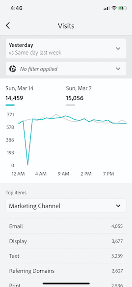
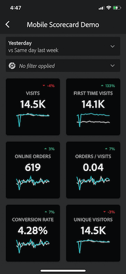

# Uitvoerende gebruikers instellen met de app

In sommige gevallen hebben uitvoerende gebruikers wellicht extra hulp nodig om de app te openen en te gebruiken. Deze sectie verstrekt informatie om u te helpen die hulp verlenen.

## Zorg ervoor dat gebruikers van apps toegang hebben tot Adobe Analytics

1. Stel nieuwe gebruikers in de [Experience Cloud Admin Console](/help/admin/admin-console/permissions/product-profile.md) in.

1. Om scorecards te kunnen delen, moet u app gebruikers toestemmingen verlenen om tot scorecard componenten zoals Analysis Workspace, de rapportsuites toegang te hebben die scorecards op, evenals segmenten, metriek en dimensies gebaseerd zijn.

## Systeemvereisten voor gebruikers van de app

Om ervoor te zorgen dat de uitvoerende gebruikers toegang tot uw scorecards op app hebben, zorg ervoor dat:

* De minimale vereisten voor mobiele besturingssystemen op hun apparaten zijn iOS versie 10 of hoger, of Android versie 4.4 (KitKat) of hoger
* Ze hebben een geldige aanmelding bij Adobe Analytics.
* U hebt op de juiste wijze mobiele scorecards voor hen gemaakt en deze scorecards met hen gedeeld.
* Zij hebben toegang tot de Componenten die scorecard omvat. Merk op dat u een optie kunt selecteren wanneer het delen van uw scorecards aan **[!UICONTROL Share embedded components]**.

## Help-managers om app te downloaden en installeren

**Voor uitvoerende gebruikers op iOS:**

Klik op de volgende koppeling (deze is ook beschikbaar in Analytics onder **[!UICONTROL Tools]** > **[!UICONTROL Analytics dashboards (Mobile App)]**) en volg de aanwijzingen om de app te downloaden, installeren en openen:

`[iOS link](https://apple.co/2zXq0aN)`

**Voor uitvoerende gebruikers op Android:**

Klik op de volgende koppeling (deze is ook beschikbaar in Analytics onder **[!UICONTROL Tools]** > **[!UICONTROL Analytics dashboards (Mobile App)]**) en volg de aanwijzingen om de app te downloaden, installeren en openen:

`[Android link](https://bit.ly/2LM38Oo)`

Zodra gedownload en geïnstalleerd, kunnen de uitvoerende gebruikers zich in app aanmelden gebruikend hun bestaande geloofsbrieven van Adobe Analytics; wij ondersteunen zowel Adobe- als Enterprise/Federated-id&#39;s.

## Help managers toegang te krijgen tot uw scorecard

1. Gebruikers met een zelfstudie moeten zich aanmelden bij de app.

   Het **[!UICONTROL Choose a company]** scherm verschijnt. Dit scherm maakt een lijst van de login bedrijven waartot de uitvoerende gebruiker behoort.

1. Heb hen tikken de naam van het login bedrijf of Experience Cloud Org die op scorecard van toepassing is u deelde.

   De Scorecard lijst toont dan alle scorecards die met het uitvoerend onder dat login bedrijf zijn gedeeld.

1. Laat ze deze lijst sorteren op **[!UICONTROL Most recently modified]**, indien van toepassing.

1. Laat ze op de naam van het scorebord tikken om het weer te geven.

   

### Verklaar scorecard UI

Verklaar aan de uitvoerende gebruiker hoe de tegels in de scorecards verschijnen u deelt.

Aanvullende informatie over tegels:

* De korreligheid van de sparklines is afhankelijk van de lengte van het datumbereik:
* Op een dag is er een uurtrend
   * Meer dan een dag en minder dan een jaar laten een dagelijkse trend zien
   * Een jaar of langer toont een wekelijkse trend
   * De formule van de percentagewaardeverandering is metrisch totaal (huidige datumwaaier) - metrisch totaal (de waaier van de vergelijkingsdatum) / metrisch totaal (de waaier van de vergelijkingsdatum).
   * U kunt het scherm omlaag trekken om het Scorecard te vernieuwen.

1. Tik op een tegel om te tonen hoe een gedetailleerde uitsplitsing voor de tegel werkt.

   

   * Tik op een willekeurig punt op een dunne lijn om de gegevens weer te geven die aan dat punt op de lijn zijn gekoppeld.

   * Er wordt een tabel opgenomen waarin de aan de tegel toegevoegde afmetingen worden weergegeven. Tik op de pijl omlaag om de afmetingen te selecteren. Als er geen dimensie aan de tegel is toegevoegd, worden de diagramgegevens weergegeven in de tabel.

1. Als u datumbereiken voor uw scorebord wilt wijzigen, tikt u op de Datumkop en selecteert u de combinatie van het primaire bereik en het vergelijkingsdatumbereik dat u wilt weergeven.

   

## Toepassingsvoorkeuren wijzigen

Tik op de bovenstaande optie **[!UICONTROL Preferences]** om de voorkeuren te wijzigen. Bij de voorkeuren kunt u de biometrische aanmelding inschakelen of de app voor de donkere modus instellen, zoals hieronder wordt weergegeven:

## Problemen oplossen

Als de uitvoerende gebruiker zich aanmeldt en een bericht ziet waarin wordt gemeld dat er niets is gedeeld:

* De uitvoerende gebruiker kan de verkeerde instantie van Analytics hebben geselecteerd, of
* De scorecard is mogelijk niet gedeeld met de uitvoerende gebruiker.

Verifieer dat de uitvoerende gebruiker in de juiste instantie van Adobe Analytics kan registreren en dat de scorecard is gedeeld.

### Een fout rapporteren

Tik op de optie en kies een subcategorie van de bug. Geef in het formulier voor het melden van een fout uw e-mailadres op in het bovenste veld en uw beschrijving van de fout op in het veld eronder. Er wordt automatisch een schermopname van uw accountgegevens aan het bericht gekoppeld, maar u kunt dit desgewenst verwijderen door op de **X** in de bijlage te tikken. U hebt ook opties voor het opnemen van een scherm, het toevoegen van meer schermafbeeldingen of het bijvoegen van bestanden. Tik op het pictogram van het papieren vlak rechtsboven in het formulier om het rapport te verzenden.

### Feedback geven

1. Tik op het instellingenpictogram rechtsboven in het toepassingsscherm.
1. Tik op **[!UICONTROL Settings]** op het scherm **[!UICONTROL Feedback]**.
1. Tik om de opties voor het geven van feedback weer te geven.

   

### Een verbetering voorstellen

Tik op de optie en kies een subcategorie voor de suggestie. Geef in het aanvraagformulier uw e-mailadres op in het bovenste veld en uw beschrijving van de fout op in het veld eronder. Er wordt automatisch een schermopname van uw accountgegevens aan het bericht gekoppeld, maar u kunt dit desgewenst verwijderen door op de **X** in de bijlage te tikken. U hebt ook opties voor het opnemen van een scherm, het toevoegen van meer schermafbeeldingen of het bijvoegen van bestanden. Tik op het pictogram van het papieren vlak rechtsboven in het formulier om de suggestie te verzenden.

### Een vraag stellen

Tik op de optie en geef uw e-mailadres op in het bovenste veld en uw vraag in het veld eronder. Een het schermschot wordt automatisch in bijlage aan het bericht, maar u kunt dit schrappen als u wilt door **X** in het gehechtheidsbeeld te tikken. U hebt ook opties voor het opnemen van een scherm, het toevoegen van meer schermafbeeldingen of het bijvoegen van bestanden. Tik op het pictogram van het papieren vlak rechtsboven in het formulier om de vraag te verzenden.

>[!IMPORTANT]
>
>Vanaf oktober 2020 implementeert Adobe geleidelijk een reeks verbeteringen om de prestaties van de app Adobe Analytics-dashboards te optimaliseren. Deze verbeteringen richten zich op caching historische gegevens van Analytics die worden gebruikt om scorecards met data (exclusief de huidige dag) te bevolken. Deze gegevens worden maximaal 24 uur in cache geplaatst in een beveiligde Microsoft Azure Public Cloud Storage-account. Neem contact op met uw CSM als u zich wilt afmelden voor deze functies voor prestatieverbetering.
