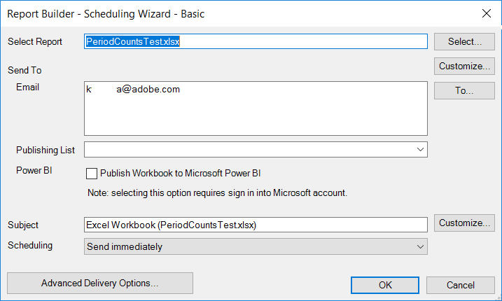
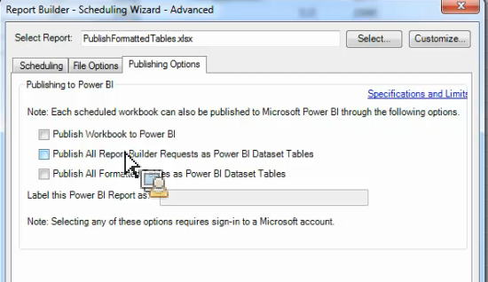

# Publiceren naar Power BI - Overzicht

Microsoft Power BI is een suite van bedrijfsanalytische dashboards om gegevens te analyseren en inzichten te delen. Dankzij de integratie van Adobe Analytics met Power BI kunt u de gegevens van Report Builder-analyse visualiseren in Microsoft Power BI en deze eenvoudig delen in uw organisatie.

Eerder zou u als analist de werkboeken van de Bouwer van het Rapport plannen om via e-mail (of FTP) worden verspreid. U kunt nu belanghebbenden uit uw bedrijf toegang geven (van binnen hun Power BI-accounts) tot nauwkeurige en actuele gegevens in een webomgeving die toegankelijk is voor verschillende platforms en apparaten.

Het combineren van het rapport-generatie vermogen van de Bouwer van het Rapport met de visualisatiefuncties van Power BI maakt informatie toegankelijker voor iedereen in uw organisatie. Met Power BI kunt u Adobe Analytics ook integreren met andere gegevensbronnen (bijvoorbeeld verkooppunt, CRM) om unieke klantinzichten, -verenigingen en -mogelijkheden te ontdekken.

Dankzij de integratie met Adobe Report Builder kunt u

* [Geplande werkboeken van de Bouwer van het Rapport aan Power BI publiceren](/help/analyze/report-builder/whats-new-arb.md#rb-5-5-section)
* [Alle opgemaakte tabellen in het werkboek publiceren als Power BI-datasetabellen](/help/analyze/report-builder/whats-new-arb.md#rb-5-5-section)
* [Alle verzoeken van de Bouwer van het Rapport als de Lijsten van de Dataset van Power BI publiceren](/help/analyze/report-builder/whats-new-arb.md#rb-5-5-section)

## Systeemvereisten {#section_0B71092D853446F38FA36447DAC0D32B}

* Adobe Report Builder 5.5 [geïnstalleerd](/help/analyze/report-builder/setup/t-install-arb.md)
* Active Microsoft-account waarmee u zich kunt aanmelden bij Power BI

## Werkmap publiceren naar Power BI {#section_21CA66229EC240D49594A9A7D3FBA687}

Geplande werkboeken zijn opgemaakte Excel-werkbladen die zijn gevuld met gegevens van Adobe Analytics en die regelmatig worden verzonden.

**Publish werkboek in de Bouwer van het Rapport**

1. In de Bouwer van het Rapport, produceer en bewaar een werkboek.
1. Voor de Toolbar van de Bouwer van het Rapport, klik **[!UICONTROL Schedule]** > **[!UICONTROL New]**.

1. In de Basis plannende Tovenaar, controleer het vakje naast **[!UICONTROL Publish Workbook to Microsoft Power BI]**.

   

1. Geef uw e-mail op en verzend deze direct of geef de planningsfrequentie op (per uur, per dag, enz.).
1. Klik **[!UICONTROL OK]** om te publiceren.
1. U wordt nu gevraagd u aan te melden bij uw Microsoft-account. Geef uw gegevens op.
1. Het werkboek van de Bouwer van het Rapport wordt gepland en gepubliceerd aan Power BI.

   Met elke geplande instantie, en nadat het het plannen proces van de Bouwer van het Rapport het werkboek met bijgewerkte gegevens van Analytics heeft verfrist, zal het werkboek aan Microsoft Power BI worden gepubliceerd.

**De werkboekgegevens van de Bouwer van het Rapport van de Mening in Power BI**

1. Dubbelklik in Power BI op het werkboek onder het [!UICONTROL Workbooks] menu.

   

1. U kunt de werkboekdashboardgegevens nu bekijken.  

1. U kunt dan een gebied van dit werkboek vastzetten om het in om het even welk van uw dashboards van Power BI te omvatten.

## Publiceer alle geformatteerde lijsten in het werkboek als de datasetlijsten van Power BI {#section_7C54A54E75184DD6BAEF4ACCE241239A}

> [!NOTE] Als het werkboek een macro bevat, zal &quot;publiceren Alle Formatted Lijsten in het Werkboek als de Lijsten van de Dataset van de Macht BI&quot;worden onbruikbaar gemaakt.

In plaats van het invoeren van het volledige werkboek, kunt u slechts de inhoud van alle geformatteerde lijsten binnen het werkboek invoeren.

**Hoofdlettergebruik**: U hebt een werkboek van Excel dat gegevens van de veelvoudige verzoeken van de Bouwer van het Rapport trekt en tot een summiere lijst met vele formules leidt. U kunt alleen de overzichtstabel importeren in Power BI en er een visualisatie voor maken.

**Een opgemaakte tabel publiceren in Report Builder**

1. In de Bouwer van het Rapport, produceer een lijst van gegevens die een kopbalrij omvat, die door een rij van gegevens wordt gevolgd.
1. Selecteer de tabel en selecteer **[!UICONTROL Format as Table]** deze in het [!UICONTROL Home] menu. De tabel krijgt standaard een naam (Tabel 1, Tabel 2, enzovoort), maar u kunt de naam in het [!UICONTROL Design]menu wijzigen.

1. Voor de Toolbar van de Bouwer van het Rapport, klik **[!UICONTROL Schedule]** > **[!UICONTROL New]**.

1. Klik in de wizard Standaard plannen op **[!UICONTROL Advanced Scheduling Options]**.
1. Schakel in het [!UICONTROL Scheduling Wizard - Advanced]tabblad het vakje naast **[!UICONTROL Publishing Options]** **[!UICONTROL Publish all Formatted Tables as Power BI dataset tables]**.

   

1. (Optioneel) U kunt de naam van het gepubliceerde element aanpassen in Power BI. Dit kan nuttig zijn als u versioning als deel van de werkboeknaam (b.v., mijnwerkboek_v1.1.xlsx) gebruikt en u niet het versieaantal in de naam van de gepubliceerde activa van Power BI wilt tonen. Het heeft het toegevoegde voordeel dat het gepubliceerde element niet verandert als het versienummer verandert. (Bekijk [hier de specificaties](/help/analyze/report-builder/c-publish-power-bi/specifications-limits.md) .)

**Tabelgegevens weergeven in Power BI**

1. Ga in Power BI naar het menu **[!UICONTROL Workspaces]** > **[!UICONTROL Datasets]** .

   

1. Selecteer de dataset die u publiceerde en klik het [!UICONTROL Create report] pictogram naast het. De tabellen worden weergegeven als velden.

   

1. Selecteer een tabel en de bijbehorende kolommen.

   

1. In het [!UICONTROL Visualizations] menu kunt u opgeven hoe u een tabel visualiseert in Power BI. U kunt er bijvoorbeeld voor kiezen uw gegevens als een lijngrafiek weer te geven:

   

1. Van hier, kunt u visualisaties van deze datasetlijst tot stand brengen.

## Alle verzoeken van de Bouwer van het Rapport als de Lijsten van de Dataset van Power BI publiceren {#section_0C26057C7DBB4068A643FDD688F6E463}

U kunt al uw verzoeken in datasetlijsten veranderen en visualisaties bovenop hen bouwen.

>[!IMPORTANT]
>
>Als het werkboek meer dan 100 verzoeken bevat, slechts zullen de eerste 100 verzoeken aan Power BI worden gepubliceerd. Plus, voor elke verzoeken die aan Power BI worden gepubliceerd, slechts zullen de eerste 10.000 rijen van gegevens worden gepubliceerd. Hoewel deze verzoeken met succes zullen worden geleverd via een planning, is het bereik van publicatie naar Power BI beperkt.

1. In de Bouwer van het Rapport, open of creeer een werkboek met de verzoeken van de Bouwer van het Rapport.
1. Voor de Toolbar van de Bouwer van het Rapport, klik **[!UICONTROL Schedule]** > **[!UICONTROL New]**.

1. Klik in de wizard Standaard plannen op **[!UICONTROL Advanced Scheduling Options]**.
1. Schakel op het [!UICONTROL Scheduling Wizard - Advanced]tabblad het vakje naast **[!UICONTROL Publishing Options]** **[!UICONTROL Publish all Report Builder Requests as Power BI Dataset Tables]**

1. Klik op **[!UICONTROL OK]**.

**De aanvraaggegevens weergeven in Power BI**

Elk gepland verzoek van de Bouwer van het Rapport zal als lijst in de dataset worden gepubliceerd. Elke verzoeklijst wordt genoemd na de primaire dimensie in het verzoek en het heeft een [!UICONTROL Report Suite] en een [!UICONTROL Segments] kolom.

1. Ga in Power BI naar het menu **[!UICONTROL Workspaces]** > **[!UICONTROL Datasets]** .

1. Selecteer de aanvraag die u hebt gepubliceerd en klik op het [!UICONTROL Create report] pictogram ernaast.

   De aanvragen worden als tabellen in het [!UICONTROL Fields] menu weergegeven.

   

   >[!NOTE]
   >
   >Geen kwestie hoe u uw verzoek van de Bouwer van het Rapport om op het aantekenvel (draaiende lay-out, douanelay-out, sommige onzichtbare kolommen) vormde, zal de Bouwer van het Rapport altijd uw verzoek in het zelfde tweedimensionale, enige formaat van de koptekstrij publiceren: Datum, Afmetingen, Metriek, Rapporten, Segmenten.

1. U ziet ook dat er een extra tabel met de naam **[!UICONTROL Legend]**. Als u een verzoek uit de context van de Bouwer van het Rapport neemt, kan het moeilijk zijn om te herinneren wat elk verzoek voor staat. Het doel van de Legende lijst is, bijvoorbeeld, om u de naam van elk verzoek onder Lijst ID te tonen. U kunt ook de andere Legend-kolommen toevoegen voor een volledige weergave van het verzoek.

   

