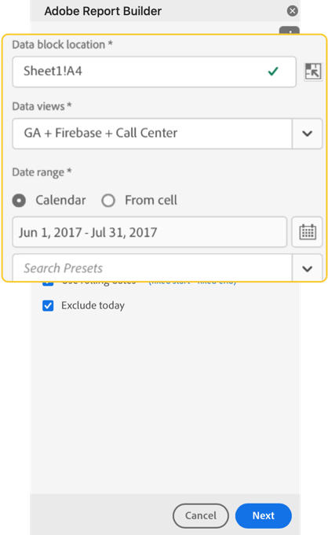

# Een gegevensblok maken

A *gegevensblok* is de lijst van gegevens die door één enkel gegevensverzoek worden gecreeerd. Een werkboek van Report Builder kan veelvoudige gegevensblokken bevatten. Wanneer u een gegevensblok creeert, vorm eerst het gegevensblok en bouwt dan het gegevensblok.

## Het gegevensblok configureren

Vorm de aanvankelijke parameters van het gegevensblok voor de het blokplaats van Gegevens, de Reeks van het Rapport, en een waaier van de Datum.

1. Selecteer  **[!UICONTROL Create]**.

   {zoomable="yes"}

1. Stel de **[!UICONTROL Data block location]** in.

   Met de optie voor gegevensbloklocatie definieert u de werkbladlocatie waar Report Builder de gegevens aan het werkblad toevoegt.

   Als u de locatie van het gegevensblok wilt opgeven, selecteert u één cel in het werkblad of voert u een celadres in, bijvoorbeeld `a3` , `\\\$a3` , `a\\\$3` of `sheet1!a2` . De opgegeven cel wordt de linkerbovenhoek van het gegevensblok wanneer de gegevens worden opgehaald.

   Het gebruik  om een plaats van het gegevensblok van de huidige geselecteerde cel in het blad te kiezen.

1. Kies de **[!UICONTROL Report suites]** .

   Met de optie Rapportsuites kunt u een rapportsuite kiezen in een keuzelijst of verwijzen naar een rapportsuite vanuit een cellocatie.

   Selecteer  om een rapportreeks van een cel tot stand te brengen.

1. Stel de **[!UICONTROL Date range]** in.

   Met de optie **[!UICONTROL Date range]** kunt u een datumbereik kiezen. Datumbereiken kunnen vast zijn of doorlopen.

   Selecteer **[!UICONTROL Calendar]** om een gegevenswaaier te plukken gebruikend  of een datumwaaier manueel in te gaan. Naar keuze, kunt u vooraf ingesteld van het **[!UICONTROL _Onderzoek kiezen stelt_]** drop-down menu vooraf in.

   Selecteer **[!UICONTROL From cell]** om een begin- en eindgegevens te definiëren op basis van een cel in het huidige blad.

   Voor informatie over de opties van de datumwaaier, zie [ Selecteer een datumwaaier ](select-date-range.md).

1. Selecteer **[!UICONTROL Next]**.

   

   Nadat u het gegevensblok vormt, kunt u afmetingen, metriek, en segmenten selecteren om uw gegevensblok te bouwen. De tabbladen **[!UICONTROL Dimensions]** , **[!UICONTROL Metrics]** en **[!UICONTROL Segments]** worden boven het deelvenster **[!UICONTROL Table]** weergegeven.

## Het gegevensblok samenstellen

Om het gegevensblok te bouwen, selecteer rapportcomponenten, en pas dan de lay-out aan.

1. Voeg **[!UICONTROL Dimensions]** -, **[!UICONTROL Metrics]** - en **[!UICONTROL Segments]** -componenten toe.

   Schuif de componentenlijsten of gebruik het  gebied van het Onderzoek van componenten **[!UICONTROL _om van componenten de plaats te bepalen._]** Sleep componenten naar het deelvenster [!UICONTROL Table] of selecteer een componentnaam in de lijst om de component aan het deelvenster [!UICONTROL Table] toe te voegen.

   Selecteer een component tweemaal om de component aan een standaardsectie van de lijst toe te voegen.

   - De componenten van Dimension worden toegevoegd aan  **[!UICONTROL Row]** sectie of aan  **[!UICONTROL Column]** sectie als u een afmeting reeds in de kolommen hebt.
   - De componenten van de datum worden toegevoegd aan de  **[!UICONTROL Column]** sectie TableSelectColumn.
   - De componenten van het segment worden toegevoegd aan de  **[!UICONTROL Segments]**.
   - De componenten van metriek worden toegevoegd aan de  **[!UICONTROL Values]**.

1. Rangschik de punten in de ruit van de Lijst om de lay-out van uw gegevensblok aan te passen.

   De belemmering en dalingscomponenten binnen elke lijst in de ruit van de Lijst om componenten opnieuw te ordenen of  te selecteren en  Beweging omhoog,  Beweging neer, en meer om componenten binnen een lijst te bewegen.

   Wanneer u componenten aan de lijst toevoegt, wordt een voorproef van het gegevensblok getoond bij de het blokplaats van Gegevens in het aantekenvel. De lay-out van de voorvertoning van gegevensblokken wordt automatisch bijgewerkt wanneer u items in de tabel toevoegt, verplaatst of verwijdert.

   

1. Stel desgewenst de **[!UICONTROL Start date]** in als een dimensie om de begindatum van uw gegevensblok te identificeren. Het toevoegen van de begingegevens als dimensie is nuttig als u een regelmatig gepland rapport hebt dat een het rollen datumwaaier heeft. Of als u een onconventioneel datumbereik hebt en u moet expliciet zijn over de begindatum.

   

1. U kunt ook rij- en kolomkoppen weergeven of verbergen. Daartoe:

   1. Selecteer het **[!UICONTROL Table]**  montagespictogram.

      

   1. Schakel de optie voor **[!UICONTROL Display row and column headers]** in of uit. De kopteksten worden standaard weergegeven.

1. U kunt desgewenst ook dimensielabels en metrische koppen verbergen of weergeven. Daartoe:

   1. Selecteer  op het afmetingsetiket of de kolomkopbal om het contextmenu te tonen.

      

   1. Selecteer  **[!UICONTROL Hide]** of  **[!UICONTROL Show]** om de afmetingsetiket of kolomkopbal van een knevel te voorzien. Alle labels worden standaard weergegeven.

1. Selecteer **[!UICONTROL Finish]** om de configuratie van uw gegevensblok te voltooien.

1. Er wordt een verwerkingsbericht **[!UICONTROL #BUSY]** weergegeven terwijl de analysegegevens worden opgehaald.

   

1. Report Builder haalt de gegevens op en geeft het voltooide gegevensblok weer in het werkblad.

   

>[!MORELIKETHIS]
>
>[Een rapportsuite selecteren](select-report-suite.md)
>[Selecteer een datumbereik ](select-date-range.md)
>[Filterafmetingen ](filter-dimensions.md)
>[Werken met segmenten ](work-with-segments.md)
>

<!--

A *data block* is the table of data created by a single data request. A Report Builder workbook can contain multiple data blocks. When you create a data block, first configure the data block and then build the data block.

## Configure the data block

Configure the initial data block parameters for the data block location, report suite, and a date range.

1. Click **[!UICONTROL Create]**.

    

1. Set the **[!UICONTROL Data block location]**.

    The data block location option defines the worksheet location where report builder adds the data to your worksheet.

    To specify the data block location, select a single cell in the worksheet and click the icon next to **[!UICONTROL Data block location]**: 
    
    You can also enter a cell address such as a3, \\\$a3, a\\\$3 or sheet1!a2. The cell specified marks the upper-left corner of the data block when the data is retrieved.

1. Choose a **Report Suite**.

    The report suites option allows you to choose a report suite from a drop-down menu or to reference a report suite from a cell location.

1. Set the **[!UICONTROL Date range]**.

    The Date range option allows you to choose a date range. Date ranges may be fixed or rolling. For information about data range options, see [Select a Date Range](select-date-range.md).

1. Click **[!UICONTROL Next]**.

    

    After you configure the data block, you can select dimensions, metrics, and segments to build your data block. The Dimensions, Metrics, and Filters tabs are displayed above the Table builder pane.

## Build the data block

To build the data block, select report components, and then customize the layout.

1. Add Dimensions, Metrics, and Segments.

    Scroll the component lists or use the **[!UICONTROL Search]** field to locate components. Drag and drop components to the Table pane or double-click a component name in the list to automatically add the component to the Table pane.

    Double-click a component to add it to a default section of the table.

    - Dimension components are added to the Row section or to the Column section if you have a dimension already in the columns.
    - Date components are added to the Column section.
    - Segment components are added to the Segments section.

    **Start date as a Dimension**

    Set the **[!UICONTROL Start date]** as a dimension to clearly identify the start date of your data block. This is helpful if you have a regularly scheduled report that has a rolling date range or if you have an unconventional date range and you need to be clear on the start date.

    {width="30%"}

1. Arrange the items in the Table pane to customize the layout of your data block.

    Drag and drop components in the Table pane to reorder components or right-click a component name and select from the options menu.

    When you add components to the table, a preview of the data block is displayed at the Data block location in the worksheet. The layout of the data block preview automatically updates as you add, move, or remove items in the table.

    

    **Display or hide row and column headers**

1. Click the **[!UICONTROL Table settings]** icon.

    {width="35%"}

1. Check or uncheck the option to Display row and column headers. The headers are displayed by default.

    **Hide or show dimension labels and metric headers**

1. Click the ellipsis icon on either the dimensions or the column headers to display the settings.

    {width="35%"}

1. Click Hide or Show to toggle the dimension labels or column headers. All labels are displayed by default.

1. Click **[!UICONTROL Finish]**.

    A processing message is displayed while the analytics data is retrieved.

    Report Builder retrieves the data and displays the completed data block in the worksheet.

    

-->