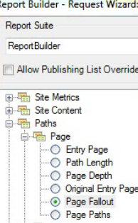

# Een uitvalrapport filteren met de wizard Aanvragen

Beschrijft de stappen betrokken bij het toepassen van filters op een reserverapport.

In dit voorbeeld wordt het rapport Pagina-uitval weergegeven.

1. Klik in Adobe Report Builder op **[!UICONTROL Create]** om de wizard Verzoek te openen.
1. Selecteer de juiste rapportsuite.
1. Selecteer in de structuurweergave aan de linkerkant de optie **[!UICONTROL Paths]** > **[!UICONTROL Page]** > **[!UICONTROL Page Fallout]**.

   

1. Configureer de juiste [datumbereiken](/help/analyze/report-builder/data-requests/configuring-report-dates/custom-calendar.md).
1. Klik op **[!UICONTROL Next]**.
1. In Stap 2 van de Tovenaar, onder **[!UICONTROL Row Labels]** klikt u op de knop **[!UICONTROL Define Checkpoints]** koppeling. (In een uitvalrapport moet u altijd padelementen definiëren, in tegenstelling tot in een padrapport, waarin een patroon vooraf wordt toegepast.)

   

1. Selecteer de **[!UICONTROL Filter]** -optie.

1. In de **[!UICONTROL Define Site Section Fallout Checkpoints]** , definieert u controlepunten vanuit een celbereik of vanuit een lijst. Klik vervolgens op **[!UICONTROL OK]**.
1. Bepaal of u een keuze wilt maken uit een reeks cellen of uit een lijst.
1. Als u in een lijst selecteert, klikt u op **[!UICONTROL Add]** om controlepunten te selecteren om aan de reserveweg toe te voegen. U kunt tussen 3 en 8 controlepunten definiëren. (Zoek naar beschikbare elementen door op **[!UICONTROL More]**.)

   Zie voor meer informatie over het verfijnen van het filter [Dimension filteren](/help/analyze/report-builder/layout/c-filter-dimensions/filter-dimensions.md). 1. Verplaatsen **[!UICONTROL Available Elements]** van de linkerkolom aan het recht door hen te selecteren en de oranje pijl te klikken.
1. Klikken **[!UICONTROL OK]** drie keer, dan klik **[!UICONTROL Finish]**.

   Het rapport moet nu worden vernieuwd.
