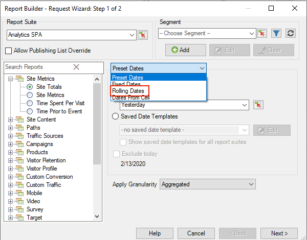
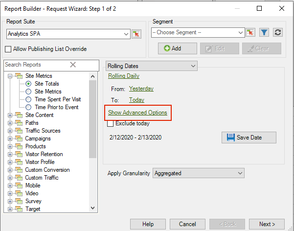

# Aangepaste datumexpressies

U kunt een complex datumbereik opgeven door een aangepaste expressie op te bouwen.

Wanneer u expressies maakt, raadpleegt u een kalender om het aantal weken en dagen correct op te geven. Excel beschikt over verschillende ingebouwde functies waarmee u het aantal dagen, werkdagen, maanden en jaren tussen datums kunt berekenen. U kunt deze functies in formules gebruiken om andere intervallen, zoals weken en kwarten te berekenen.

**Aangepaste expressies inschakelen**

In het volgende voorbeeld wordt getoond hoe u een aangepaste expressie kunt inschakelen voor **[!UICONTROL Rolling Dates]**.

1. Op de [!UICONTROL Request Wizard: Step 1]in plaats van **[!UICONTROL Preset Dates]**, selecteert u **[!UICONTROL Rolling Dates]**.

   

1. Schakel over naar wekelijks, maandelijks, driemaandelijks of jaarlijks rolbaar. U ziet hoe de opties hieronder veranderen.
1. Klik voor meer aanpassingsopties op **[!UICONTROL Show Advanced Options]**.

   

1. Als u bijvoorbeeld de bovenstaande datums wijzigt in het verschuiven van de eerste dag drie maanden geleden naar de eerste dag van deze maand, worden de datums in het gedeelte met vooruitgangsopties automatisch bijgewerkt om aan te geven dat:

   

1. Inschakelen **[!UICONTROL Customize Expression]**. Door opties onder te selecteren **[!UICONTROL Rolling Dates]** kunt u de syntaxis voor aangepaste datumexpressies gemakkelijk zien.

   

   U kunt Geavanceerde opties gebruiken om aangepaste datumexpressies te combineren en aan te passen. Als u bijvoorbeeld gegevens wilt zien van het eerste van het jaar tot het einde van de laatste volledige maand, kunt u het volgende invoeren: `From: cy` `To: cm-1d`. In de wizard worden deze datums weergegeven als 1/1/2020-1/31/2020.
