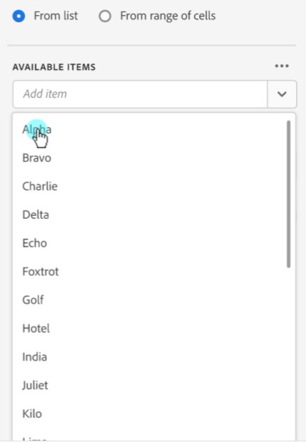
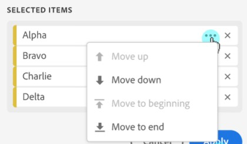

# Dimensionen filteren

Door gebrek, keert elk afmetingspunt in de lijst top 10 punten voor die afmeting terug.

Om de afmetingspunten te veranderen die voor elke afmeting worden teruggekeerd

1. Klik op **[!UICONTROL Manage]** en selecteer een gegevensblok in de lijst.

    uit

1. Klik op **[!UICONTROL Edit data block]** in het deelvenster OPDRACHTEN.

1. Klik op **[!UICONTROL Next]** om het tabblad Dimensionen weer te geven.

1. Klik op het pictogram **...** naast de naam van een component in de tabel.

   

1. Selecteer **[!UICONTROL Filter dimension]** in het pop-upmenu om het deelvenster **[!UICONTROL Filter dimension]** weer te geven.

1. Selecteer **[!UICONTROL Most popular]** of **[!UICONTROL Specific]** .

   

1. Selecteer de gewenste opties op basis van het gekozen filtertype.

1. Klik op **[!UICONTROL Apply]** om het filter toe te voegen.

   Report Builder geeft een melding weer ter bevestiging van het toegevoegde filter.

Houd de muisaanwijzer boven een dimensie om toegepaste filters weer te geven. Dimensionen met toegepaste filters geven een filterpictogram rechts van de naam van het Dimension weer.

## Filtertype

Er zijn twee manieren om dimensiepunten te filteren: het populairste en Specifieke.

## Meest populair

Met de optie [!UICONTROL Most popular] kunt u dimensie-items dynamisch filteren op basis van metrische waarden. [!UICONTROL Most popular] het filtreren keert de hoogste gerangschikte afmetingspunten terug die op metrische waarden worden gebaseerd. Standaard worden de eerste 10 dimensies weergegeven, gesorteerd op de eerste metrische waarde die aan het gegevensblok is toegevoegd.

### Opties voor Pagina en Rijen

Gebruik de **Pagina** en **Rijen** gebieden om gegevens in opeenvolgende groepen of pagina&#39;s te verdelen. Dit staat u toe om gerangschikte rijwaarden buiten de hoogste waarden in uw rapport te trekken. Deze functie is vooral handig voor het ophalen van gegevens boven de limiet van 50.000 rijen.

#### Standaardwaarden voor pagina en rijen

- Pagina = 1
- Rijen = 10

Met de standaardinstellingen Pagina en Rijen geeft u aan dat elke pagina tien rijen gegevens bevat. Pagina 1 retourneert de bovenste 10 items, pagina 2 retourneert de volgende 10 items, enzovoort.

In de onderstaande tabel staan voorbeelden van pagina- en rijwaarden en de resulterende uitvoer.

| Pagina | Rij | Uitvoer |
|------|--------|----------------------|
| 1 | 10 | Meest 10 items |
| 2 | 10 | Punten 11-20 |
| 1 | 100 | Top 100 van items |
| 2 | 100 | Items 101-200 |
| 2 | 50.000 | Items 50.001-100.000 |

#### Minimum- en maximumwaarden

- Beginpagina: Min = 1, Max: 50 miljoen
- Aantal rijen: Min = 1, Max: 50.000

### Inclusief &quot;Geen waarde&quot;

In Adobe Analytics verzamelen sommige dimensies een item zonder waarde. Met dit filter kunt u deze waarden uitsluiten van rapporten. U kunt bijvoorbeeld een classificatie maken, zoals de classificatie Productnaam op basis van de sleutel Product SKU. Als een specifiek product-SKU niet is ingesteld met de specifieke productnaamclassificatie, wordt de productnaam ingesteld op &quot;geen waarde&quot;.

Omvat &quot;**Geen waarde**&quot;wordt geselecteerd door gebrek. Schakel deze optie uit als u items zonder waarde wilt uitsluiten.

### Filteren op criteria

U kunt dimensie-items filteren op basis van de vraag of aan alle criteria is voldaan of aan alle criteria is voldaan.

Filtercriteria instellen

1. Selecteer een operator in de vervolgkeuzelijst.

   

1. Voer een waarde in het zoekveld in.

1. Klik op **[!UICONTROL Add row]** om de selectie te bevestigen en nog een item voor de criteria toe te voegen.

1. Klik op het pictogram Verwijderen om een item met criteria te verwijderen.

   U kunt maximaal 10 criteria toevoegen.

### Het filter en de sorteervolgorde wijzigen

Er wordt een pijl weergegeven naast de metrische waarde die wordt gebruikt om het gegevensblok te filteren en te sorteren. De richting van de pijl geeft aan of de meting het grootst tot het minst of het minst tot het grootst is gesorteerd.

Klik op de pijl naast de metrische waarde om de sorteerrichting te wijzigen.

Om metrisch te veranderen die wordt gebruikt om het gegevensblok te filtreren en te sorteren,

1. Houd de muisaanwijzer boven de gewenste metrische component in de Tabelbouwer om aanvullende opties weer te geven.

2. Klik op de pijl op de gewenste metrische waarde.

   

## Specifieke filtering

Met de optie Specifiek kunt u een vaste lijst met dimensie-items maken voor elke dimensie. Gebruik het filtertype **[!UICONTROL Specific]** om de exacte afmetingen op te geven die u in het filter wilt opnemen. U kunt items in een lijst of uit een reeks cellen selecteren.

### Van lijst

1. Selecteer de optie **[!UICONTROL From list]** om te zoeken naar dimensie-items en deze te selecteren.

   Wanneer u de optie **[!UICONTROL From list]** selecteert, wordt de lijst eerst gevuld met dimensie-items met de meeste gebeurtenissen.

   

   De lijst **[!UICONTROL Available items]** wordt geordend van dimensie-items met de meeste gebeurtenissen naar die met de minste waarde.

1. Typ een zoekterm in het veld **[!UICONTROL Add item]** om de lijst te doorzoeken.

1. Als u wilt zoeken naar een item dat niet in de laatste 90 dagen van de gegevens is opgenomen, klikt u op **[!UICONTROL Show items for the last 6 months]** om de zoekopdracht uit te breiden.

   

   Nadat gegevens van de afgelopen 6 maanden zijn geladen, wordt de koppeling naar **[!UICONTROL Show items for last 18 months]** door de Report Builder bijgewerkt.

1. Selecteer een dimensie-item.

   Geselecteerde dimensie-items worden automatisch toegevoegd aan de lijst **[!UICONTROL Selected items]** .

   

   Als u een item uit de lijst wilt verwijderen, klikt u op het pictogram Verwijderen om het item uit de lijst te verwijderen.

   Als u een item in de lijst wilt verplaatsen, sleept u het item en zet u het neer of klikt u ... om het verplaatsingsmenu weer te geven.

   

1. Klikken **[!UICONTROL Apply]**

   De Report Builder werkt de lijst bij om het specifieke filtreren te tonen u toepaste.

### Uit celbereik

Selecteer de optie **[!UICONTROL From range of cells]** om een celbereik te kiezen dat de lijst met de dimensies bevat die moeten overeenkomen.

Houd rekening met de volgende beperkingen wanneer u een bereik cellen selecteert:

- Het bereik moet ten minste één cel bevatten.
- Het bereik kan niet meer dan 50.000 cellen bevatten.
- Het bereik moet in één ononderbroken rij of kolom staan.

Uw selectie kan lege cellen of cellen met waarden bevatten die niet met een specifiek afmetingspunt aanpassen.

### Van het lusje van Dimensionen in de Bouwer van de Lijst

Klik op het tabblad **[!UICONTROL Dimensions]** op het pictogram naast de naam van een dimensie om de lijst met dimensie-items weer te geven.

U kunt items naar de **[!UICONTROL Table]** slepen of dubbelklikken op de naam van een item om deze toe te voegen aan de **[!UICONTROL Table]** -builder.
