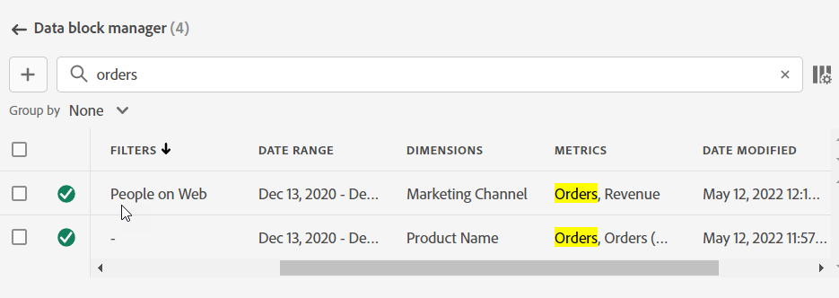
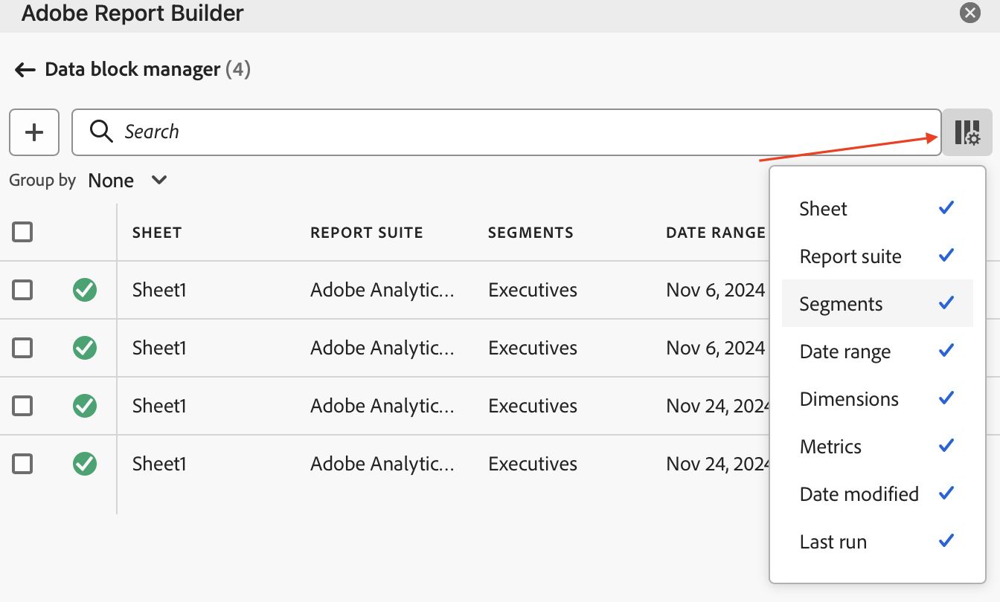

# Gegevensblokken beheren in Report Builder

U kunt alle gegevensblokken in een werkboek bekijken en beheren gebruikend de Manager van het Blok van Gegevens. De Manager van het Blok van Gegevens verstrekt onderzoek, filter, en soortmogelijkheden die u toestaan om van specifieke gegevensblokken snel de plaats te bepalen. Nadat u een of meer gegevensblokken hebt geselecteerd, kunt u de geselecteerde gegevensblokken bewerken, verwijderen of vernieuwen.

## Gegevensblokken weergeven

Klik **leiden** om een lijst van alle gegevensblokken in een werkboek te bekijken.

De Manager van het Blok van Gegevens maakt een lijst van alle gegevensblokken aanwezig in een werkboek. 

## De lijst Gegevensblokken sorteren

U kunt de lijst van gewezen personen van gegevens sorteren op een weergegeven kolom. Bijvoorbeeld, kunt u de lijst van gewezen personen van gegevens door rapportreeksen, segmenten, datumwaaier, en andere variabelen sorteren.

Klik op een kolomkop om de lijst van gewezen personen van de gegevens te sorteren.

## De Lijst van gewezen personen Gegevens doorzoeken

Gebruik het veld Zoeken om iets te zoeken in de tabel met gegevensblokken. U kunt bijvoorbeeld zoeken naar metriek in de gegevensblokken of de rapportsuite. U kunt ook zoeken naar datums die worden weergegeven in het datumbereik, de datumwijziging of de kolommen met de laatste uitvoerdatum.

## Gegevensblokken bewerken

U kunt de rapportreeks, datumwaaier, of de segmenten uitgeven die op één of meerdere gegevensblokken worden toegepast.

U kunt bijvoorbeeld een bestaand segment vervangen door een nieuw segment in een of meer gegevensblokken.

1. Selecteer de gegevensblokken die u wilt bijwerken. U kunt het selectievakje op het hoogste niveau inschakelen om alle gegevensblokken te selecteren of u kunt afzonderlijke gegevensblokken selecteren.

   

1. Klik op het pictogram Bewerken om het venster Snel bewerken weer te geven.

   

1. Selecteer een segmentverbinding om rapportreeksen, datumwaaiers, of segmenten bij te werken.

   

## Gegevensblokken vernieuwen

Klik op het pictogram Vernieuwen om de gegevensblokken in de lijst te vernieuwen.

Als u wilt controleren of een gegevensblok is vernieuwd, bekijkt u het pictogram Status vernieuwen.

Een met succes verfrist gegevensblok toont een controleteken in een groene cirkel: .

Een gegevensblok dat niet is vernieuwd, geeft een waarschuwingspictogram weer: .Hierdoor is het gemakkelijk om vast te stellen of gegevensblokken fouten bevatten.

## Een gegevensblok verwijderen

1. Selecteer een gegevensblok in de Manager van het Blok van Gegevens.
1. Klik op het prullenbakpictogram om het geselecteerde gegevensblok te verwijderen.

## Gegevensblokken groeperen

U kunt gegevensblokken groeperen gebruikend de **Groep door** drop-down menu of u kunt een kolomtitel klikken. Als u gegevensblokken op kolom wilt sorteren, klikt u op de kolomtitel. Om gegevensblokken door groepen te groeperen, selecteer een groepsnaam van de **Groep door** drop-down menu. In de onderstaande schermafbeelding ziet u bijvoorbeeld gegevensblokken gegroepeerd op Werkblad. Het toont gegevensblokken die door Blad1 en Blad2 worden gegroepeerd.  Dit is bijvoorbeeld handig in het gebruikscase voor segmentvervanging. Als er meerdere segmenten zijn toegepast op elk gegevensblok, is het handig om een groep te maken die alle gegevensblokken bevat die u wilt vervangen. Vervolgens kunt u ze allemaal tegelijk selecteren en bewerken.

## De weergave Data Block Manager wijzigen

U kunt wijzigen welke kolommen in het venster van de Manager van het Blok van Gegevens zichtbaar zijn.

Klik op de kolomlijst  om te selecteren welke kolommen worden vermeld in de Manager van het Blok van Gegevens. Selecteer een kolomnaam om de kolom weer te geven. Schakel de kolomnaam uit als u de kolom uit de weergave wilt verwijderen.

 tonen
