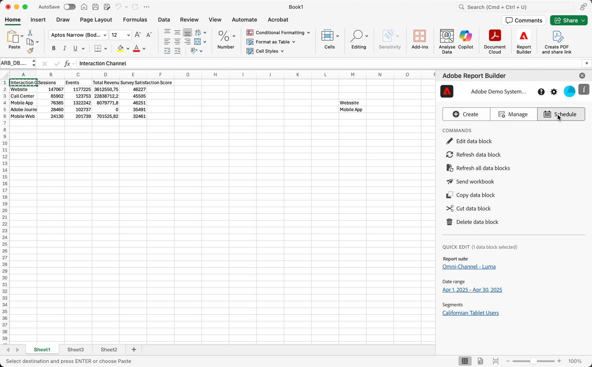
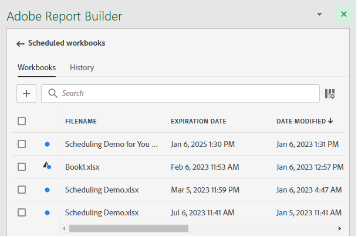

# Workbooks plannen door ze via e-mail te delen

>[!NOTE]
>
>In addition to scheduling workbooks for sharing through email, as described in this section, you can schedule workbooks to be exported to cloud destinations, as described in [Schedule workbooks for export to cloud destinations](/help/analyze/report-builder/report-builder-export.md).

Nadat u uw werkboek en voltooide uw analyse bewaarde, kunt u uw werkboek met anderen op uw team gemakkelijk delen gebruikend de het plannen eigenschap. De eigenschap van het Programma staat u toe om een programma te creëren dat automatisch de gegevens in het werkboek vernieuwt en het dossier van het werkboek van Excel .xlsx als gehechtheid aan uw gespecificeerde publiek in een specifieke datum en een tijd e-mailt. Door een planning in te stellen, krijgen ontvangers automatisch regelmatige updates. U kunt de planningseigenschap ook gebruiken om het werkboek eens te verzenden zonder automatische updates te plannen.

U kunt veelvoudige programma&#39;s voor één enkel werkboek tot stand brengen. Bijvoorbeeld, kunt u een werkboek naar uw team op een dagelijkse basis verzenden en u kunt het werkboek naar uw manager eens per week verzenden door twee verschillende programma&#39;s te creëren.

De eigenschap van het Programma staat u ook aan de bescherming van het opstellingswachtwoord voor een werkboek toe en geeft eerder geplande werkboeken uit.

>[!BEGINSHADEBOX]

Zie  [&#x200B; werkboeken van het Plan &#x200B;](https://video.tv.adobe.com/v/3413079?quality=12&learn=on){target="_blank"} voor een demovideo.

>[!ENDSHADEBOX]

## Een werkboek plannen

Een werkboek plannen:

1. Select **[!UICONTROL Schedule]** in the Report Builder hub to create a schedule so that you can automatically distribute a workbook Excel file (.xlsx) to an individual or a group.

   {zoomable="yes"}

1. Selecteer **[!UICONTROL Schedule Workbook]** of  toe om een nieuw gepland werkboek tot stand te brengen.

   {zoomable="yes"}

   De het plannen ruit toont sommige vooraf bepaalde informatie over het werkboek zoals de werkboeknaam en de laatste datum dat het werkboek werd gewijzigd.

### Bestand

In de sectie **[!UICONTROL File]** geeft u details over het bestandstype, de naam en een wachtwoord op om het bestand te beveiligen.

{zoomable="yes"}

1. Gebruik  om het huidige werkboek te selecteren, als niet reeds geselecteerd.

1. (Optioneel) Voer een **[!UICONTROL File name]** in.

   De werkboekbestandsnaam is standaard de naam van het werkboek, maar u kunt de bestandsnaam desgewenst wijzigen.

1. Selecteer een **[!UICONTROL File type]** .

   * **[!UICONTROL Excel]**
   * **[!UICONTROL PDF]**
   * **[!UICONTROL CSV]**

   Wanneer u **[!UICONTROL CSV]** selecteert, houd er rekening mee dat het geplande werkboek als postgehechtheid wordt verzonden. Some corporate email administrations may block email with zip attachments. U ziet een waarschuwing op basis hiervan.

1. (Optioneel) Selecteer **[!UICONTROL Append time-stamp to file name]** .

   U kunt een timestamp aan het dossier toevoegen - naam om de datum te identificeren het werkboek werd bijgewerkt. Een timestamp is nuttig om te zien welke versie van een werkboek op een specifieke datum werd verzonden. Als deze optie is geselecteerd, kunt u kiezen tussen:

   * **[!UICONTROL ISO Date format]** , wat resulteert in `YYYY-MM-DD` dat aan de bestandsnaam wordt toegevoegd.
   * **[!UICONTROL ISO Date format + time stamp]** , wat resulteert in `YYYY-MM-DD_HH-MM-SS` dat aan de bestandsnaam wordt toegevoegd.

<!--
Does no longer seem to be an option? 
1. (Optional) Select **.zip compression** to compress the file and set up password protection on the file.

    When you make this selection, you're prompted to enter a password to open the file. This is helpful if you have concerns about data security and you want to password protect the workbook. Protecting the file with a password requires you to select **.zip compression**. The password must be at least 8 characters and contain a number and a special character.

    {zoomable="yes"}{width="55%"}
-->

1. Voer een wachtwoord in in **[!UICONTROL Password protect the workbook]** . Een geldig wachtwoord moet ten minste 8 tekens hebben, een getal en een speciaal teken. Selecteer  om het wachtwoord en  te tonen om het wachtwoord (gebrek) te verbergen.

### E-mail

In de sectie **[!UICONTROL Email]** geeft u de ontvangers, het onderwerp en de beschrijving van de e-mail op.

{zoomable="yes"}

1. Ga **Ontvangers** in. U kunt de naam invoeren van een persoon die in uw organisatie wordt herkend. U kunt ook een e-mailadres invoeren van een persoon die buiten uw organisatie valt.

1. Ga het **Onderwerp** van e-mail en een beschrijving voor uw ontvangers in. Het onderwerp blijft aan de naam van het werkboekdossier in gebreke maar u kunt het onderwerp wijzigen indien nodig. U kunt details in de beschrijvingssectie toevoegen.

1. U kunt desgewenst een beschrijving invoeren in het tekstgebied **[!UICONTROL Description]** .

### Schema

In de **[!UICONTROL Schedule]** sectie, kunt u het programma bepalen om de e-mails met het werkboek naar uw ontvangers te verzenden.

{zoomable="yes"}

1. Selecteer **[!UICONTROL Show scheduling options]** om een schema te definiëren.

1. Voer een begindatum in in **[!UICONTROL Starting on]** . Alternatief, selecteer  om een begindatum van de kalender te kiezen.

1. Voer een einddatum in in **[!UICONTROL Ending on]** . Alternatief, selecteer  om een einddatum van de kalender te kiezen.

1. Selecteer een **[!UICONTROL Frequency]** . Afhankelijk van de geselecteerde frequentie, hebt u extra opties. Zie onderstaande tabel.

   | Frequentie | Opties |
   |---|---|
   | **[!UICONTROL Send hourly]** | Voer een waarde in voor **[!UICONTROL Send every number of hours]** . |
   | **[!UICONTROL Send daily]** | Selecteer een **[!UICONTROL Daily frequency]**: **[!UICONTROL Send every day]**, **[!UICONTROL Send every weekday]** of **[!UICONTROL Custom frequency]** .  Als u **[!UICONTROL Custom frequency]** selecteert, ga een waarde voor **[!UICONTROL Send every number of days]** in. |
   | **[!UICONTROL Send weekly]** | Voer een waarde in voor **[!UICONTROL Send every number of weeks]** . Selecteer een **[!UICONTROL Day of week]** . |
   | **[!UICONTROL Send monthly by day of the week]** | Selecteer een **[!UICONTROL Day of week]** en een **[!UICONTROL Week of month]** . |
   | **[!UICONTROL Send monthly by day of the month]** | Selecteer een waarde in **[!UICONTROL Send on this day of the month]** . |
   | **[!UICONTROL Send yearly by day of the month]** | Selecteer een **[!UICONTROL Day of week]** , selecteer een **[!UICONTROL Week of month]** en selecteer een **[!UICONTROL Monthly of year]** . |
   | **[!UICONTROL Send yearly by specific date]** | Selecteer een **[!UICONTROL Month of year]** en selecteer een waarde in **[!UICONTROL Send on this day of the month]** . |

### Verzenden

Het werkboek verzenden:

* Als u met **[!UICONTROL Show scheduling options]** geen schema hebt gedefinieerd, selecteert u **[!UICONTROL Send now]** om het werkboek direct per e-mail te verzenden.
* Als u een programma gebruikend **[!UICONTROL Show scheduling options]** hebt bepaald, uitgezocht **[!UICONTROL Send on schedule]** om het werkboek door e-mail te verzenden gebruikend het programma u bepaalde.

In beide gevallen ziet u een bevestigingstoets onder aan de Report Builder-hub.

Als u het verzenden van het werkboek wilt annuleren, selecteert u **[!UICONTROL Cancel]** .

## Oude, geplande werkboeken beheren

Voor informatie over het beheren van erfeniswerkboeken die reeds gepland zijn, zie [&#x200B; Bekeerling geplande werkboeken &#x200B;](/help/analyze/report-builder/convert-workbooks.md#schedule-a-converted-legacy-workbook).

