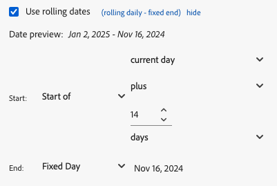

# Een datumbereik selecteren

Het datumbereik van een bestaand gegevensblok wijzigen:

- Selecteer **[!UICONTROL Edit a data block]** of
- Selecteer de koppeling **[!UICONTROL Date range]** in **[!UICONTROL Quick edit]** .

Gebruik de volgende opties om een datumbereik voor een gegevensblok te wijzigen.

## Kalender

Met de optie **[!UICONTROL Calendar]** kunt u statische of verschuivende datums maken met behulp van de volgende opties:

### Datumbereik

In het veld Datumbereik wordt het huidige datumbereik voor de gegevensblokaanvraag weergegeven. U kunt data direct ingaan of  gebruiken om een datumwaaier te specificeren.

{zoomable="yes"}

### Voorinstellingen

Selecteer een voorinstelling in het keuzemenu met voorinstellingen. U kunt ook tekst invoeren om naar voorinstellingen te zoeken.

{zoomable="yes"}

Het keuzemenu met voorinstellingen bevat een standaardset met vooraf ingestelde datumbereiken en componenten voor het datumbereik voor een rapportsuite die u hebt opgeslagen of een rapportsuite die met u is gedeeld.

### Roldatums

Roldatums definiëren:

{zoomable="yes"}

1. Selecteer **[!UICONTROL Use rolling dates]** om de logica voor een roldatumdefinitie te bepalen. U kunt de tekst tussen haakjes selecteren (bijvoorbeeld **[!UICONTROL fixed start - rolling daily]** ) om het deelvenster uit te breiden en details voor **[!UICONTROL Start]** en **[!UICONTROL End]** op te geven.

1. Selecteer **[!UICONTROL Start of]**, **[!UICONTROL End of]** of **[!UICONTROL Fixed day]** .

   - Wanneer u **[!UICONTROL Start of]** of **[!UICONTROL End of]** hebt geselecteerd, kunt u een volledige expressie maken. Bijvoorbeeld: **[!UICONTROL End of]** **[!UICONTROL current year]** **[!UICONTROL plus]** `1` **[!UICONTROL day]** . Kies de juiste waarde voor elk afzonderlijk deel van de expressie.

      - Selecteer een waarde voor de huidige. Bijvoorbeeld **[!UICONTROL current year]** .
      - Selecteer een waarde voor een optionele extra berekening. Bijvoorbeeld **[!UICONTROL plus]** .
      - Geef een waarde op wanneer u een extra berekening hebt opgegeven. Bijvoorbeeld `1` .
      - Wanneer u een extra berekening hebt opgegeven, selecteert u de periode die u voor de berekening wilt gebruiken. Bijvoorbeeld **[!UICONTROL day]** .

   - Wanneer u **[!UICONTROL Fixed Day]** hebt geselecteerd, geeft u een vaste dag op of gebruikt u de kiezer om een dag te selecteren.

1. Selecteer **[!UICONTROL hide]** om de details voor het rollen datumberekening te verbergen.


### Aangepaste expressies

Met de optie voor aangepaste expressies kunt u het datumbereik wijzigen door een aangepaste expressie te maken of een rekenkundige formule in te voeren.

{zoomable="yes"}

1. Selecteer **[!UICONTROL Use rolling dates]**.

1. Selecteer **[!UICONTROL Use custom expression]**.

   Wanneer u **[!UICONTROL Use custom expression]** selecteert, worden de standaardbesturingselementen voor het schuifdatumbereik uitgeschakeld.

1. Ga a [&#x200B; douaneuitdrukking &#x200B;](#create-a-custom-expression) in.

1. Gebruik **[!UICONTROL Date preview]** om het resulterende datumbereik te verifiëren.

#### Een aangepaste expressie maken

1. Ga a [&#x200B; datumverwijzing &#x200B;](#date-references) in.

1. Voeg een facultatieve [&#x200B; datumexploitant &#x200B;](#date-operators) toe om de datum naar het verleden of de toekomst te bewegen.

U kunt een aangepaste expressie invoeren die meerdere operatoren bevat, zoals `tm-11m-1d` .

#### Datumverwijzingen

In de volgende tabel staan voorbeelden van datumverwijzingen.

| Datumverwijzing | Type | Beschrijving |
|----------------|--------------|----------------------------|
| `1/1/10` | Statische datum | Ingevoerd in ISO-datumnotatie |
| `td` | Roldatum | Begin van huidige dag |
| `tw` | Roldatum | Begin van huidige week |
| `tm` | Roldatum | Begin van huidige maand |
| `tq` | Roldatum | Begin van het lopende kwartaal |
| `ty` | Roldatum | Begin van het lopende jaar |

#### Datumoperatoren

In de volgende tabel worden voorbeelden van datumoperatoren weergegeven.

| Datumoperator | Eenheid | Beschrijving |
|----------------|---------|--------------------|
| `+6d` | Dag | 6 dagen toevoegen aan de datumreferentie |
| `+1w` | Week | Eén volledige week toevoegen aan de Date Reference |
| `-2m` | Maand | 2 volledige maanden aftrekken van de datumreferentie |
| `-4q` | Kwart | Vier kwartalen aftrekken van de datumreferentie |
| -`1y` | Jaar | Eén jaar aftrekken van de datumreferentie |

#### Datumexpressies

In de volgende tabel staan voorbeelden van datumexpressies.

| Datumuitdrukking | Betekenis |
|-----------------|--------------------------------------|
| `td` | Vandaag |
| `td-1w` | Eerste dag van vorige week |
| `tm-1d` | Laatste dag van vorige maand |
| `td-52w` | Dezelfde dag, 52 weken geleden |
| `tm-11m-1d` | Laatste dag van dezelfde maand vorig jaar |
| `"2020-09-06"` | Specifieke datum, 9 september 2020 |


## Datumbereik van cel

Het datumbereik kan worden opgegeven in werkbladcellen. Kies met de optie **[!UICONTROL Date range from cell]** de begin- en einddatum van het gegevensblok in de geselecteerde cellen. Wanneer u de **[!UICONTROL From cell]** optie selecteert, toont het paneel **[!UICONTROL From]** en **[!UICONTROL To]** gebieden waar u een celplaats kunt ingaan of  gebruiken om de huidige geselecteerde cel te kiezen.

{zoomable="yes"}


## Vandaag uitsluiten

Selecteer **[!UICONTROL Exclude today]** om vandaag uit te sluiten van een geselecteerd datumbereik. De huidige dag is uitgesloten van alle modi die worden gebruikt om een datumbereik te definiëren: kalender, roldatums of aangepaste expressies.


## Geldige datumbereiken

In de volgende lijst worden geldige datumbereikindelingen beschreven.

- De begin- en einddatum moeten de volgende notatie hebben: JJJJ-MM-DD

- De begindatum moet eerder zijn dan de einddatum. Beide datums kunnen op de toekomst worden ingesteld.

- Wanneer u roldatums gebruikt, moet de begindatum vandaag of in het verleden zijn. Als **[!UICONTROL Exclude today]** is geselecteerd, moet de begindag zich in het verleden bevinden.

- U kunt een statisch datumbereik maken dat is ingesteld voor de toekomst. Het kan bijvoorbeeld nodig zijn een datum in te stellen voor een marketingcampagne die volgende week wordt gestart. Deze optie leidt tot een werkboek controle voor een campagne vooruit.

## Het datumbereik wijzigen

U kunt het datumbereik van een bestaand gegevensblok bewerken.

1. Selecteer een cel in het gegevensblok.

- Selecteer **[!UICONTROL Edit data block]** in het deelvenster **[!UICONTROL Commands]** , of
- Selecteer de koppeling **[!UICONTROL Date range]** in het deelvenster **[!UICONTROL Quick edit]** .

1. Wijzig het datumbereik met een van de beschikbare opties voor datumselectie.

1. Selecteer **[!UICONTROL Apply]**.

Report Builder past het nieuwe datumbereik toe op alle gegevensblokken in de selectie.

<!--
To change the date range of an existing data block, select Edit a data block or use the QUICK EDIT panel.

Use the following options to change a date range for a data block.

**Calendar**

 The Calendar allows you to create static or rolling dates using the following options:

- Date range field
- Calendar
- Preset drop-down menu
- Rolling date mode
- Customize expressions


**From cell**

The **[!UICONTROL From cell]** option allows you to reference dates entered in worksheet cells.

You have the option to exclude today on any selected date range.

 

## Use the Calendar

When you use the **Calendar**, the date range field displays the current date range for the data block request. You can enter dates directly into the date range field or use a data range selection option.

### Date range field

To enter dates directly into the date range field

1. Click the date range field next to the calendar icon.

1. Enter start and end dates for your date range.

### Calendar

To select dates using the calendar

1. Click the calendar icon to display a monthly calendar.

1. Click a start date.

1. Click an end date.

To set a date range in reverse, click the end date first and then click the start date.


### Preset drop down menu

The preset drop-down menu includes a standard set of preset date ranges and date range components for a report suite that you saved or a report suite that was shared with you.

### Rolling dates

The rolling dates option allows you to select a date range using rolling dates.

1. Select **Use rolling dates**.

1. Select a rolling expression for your start and or end date.

    

    **Start of** — Allows you to select the beginning of a day, week, month, quarter, or year.

    **End of** — Allows you to select the end of a day, week, month, quarter, or year.

    **Fixed day** — Allows you to fix a start or end date while the other date is rolling.

1. Choose day, week, month, quarter, or year as the rolling period.

    

1. Add or subtract days, weeks, months, quarters, or years from your rolling date.

    

1. Click Next to define the data range.

    Use the date preview to confirm the resulting date range is the desired range.

### Custom expressions

The custom expression option allows you to change the date range by building a custom expression or you can enter an arithmetic formula.

1. Select **Use rolling dates**.

1. Select **Use custom expression**.

    When you select the **Use custom expression** option, the standard rolling date range controls are disabled.

    

1. Enter a custom expression.

    For a sample list of custom expressions, see **Date expressions**.

1. Use the date preview to verify the resulting date range is the desired range.

#### Create a custom expression

1. Enter a **Date reference**.

1. Add **Date operators** to move the date to the past or future.

You can enter a custom date expression that includes multiple operators, such as ```tm-11m-1d```.

#### Date references

The following table lists date reference examples.

| Date Reference | Type         | Description                |
|----------------|--------------|----------------------------|
| 1/1/10         | Static Date  | Entered in ISO Date format |
| td             | Rolling Date | Start of current day       |
| tw             | Rolling Date | Start of current week      |
| tm             | Rolling Date | Start of current month     |
| tq             | Rolling Date | Start of current quarter   |
| ty             | Rolling Date | Start of current year      |

#### Date operators

The following table lists date operator examples.

| Date Operators | Unit    | Description   |
|----------------|---------|--------------------|
| +6d            | Day     | Add 6 days to the Date Reference |
| +1w            | Week    | Add one full week to the Date Reference |
| -2m            | Month   | Subtract 2 full months to the Date Reference |
| -4q            | Quarter | Subtract 4 quarters to the Date Reference |
| -1y            | Year    | Subtract one year to the Date Reference |

#### Date expressions

The following table lists date expression examples.

| Date Expression | Meaning                              |
|-----------------|--------------------------------------|
| td-1w           | First day of last week               |
| tm-1d           | Last day of previous month           |
| td-52w          | Same day, 52 weeks ago               |
| tm-11m-1d       | Last day of the same month last year |
| "2020-09-06"    | Sept 9th, 2020                       |

## Date range from cell

The date range can be specified in worksheet cells. Use the **Date range from cell** option to choose the data block start and end date from selected cells. When you select the **From cell** option, the panel displays **From** and **To** fields where you can enter a cell location.


## Exclude today

Choose the **Exclude today** option to exclude today from a selected date range. Choosing to include today may pull incomplete data for today.

When selected, the **Exclude today** option excludes the current day from all date range modes including calendar, rolling dates, or custom expressions.

## Valid date ranges

The following list describe valid date range formats.

- The start and end dates must be in the following format: YYYY-MM-DD

- The start date must be earlier to or equal to the end date. Both dates can be set to the future.

- When using rolling dates, the start date must be today or in the past. It must be in the past if **Exclude today** is checked.

- You can create a static date range set for the future. For example, you may need to set a future date for a marketing campaign launch next week. This option creates a workbook monitoring for a campaign ahead of time.

## Change the date range

You can edit the date range of an existing data block by selecting Edit data block in the COMMANDS panel or by selecting the date range link in the QUICK EDIT panel.

**Edit data block** — Allows you to edit multiple data block parameters, including date range, for a single data block.

**Quick Edit: Date range** — Allows you to edit the date range of one or more data blocks.

To edit the date range from the QUICK EDIT panel

1. Select cells within one or more data blocks in a worksheet.

1. Click the **Date range** link in the QUICK EDIT panel.

1. Select the date range using any of the date selection options.

1. Click **Apply**.


Report Builder applies the new date range to all data blocks in the selection.
-->